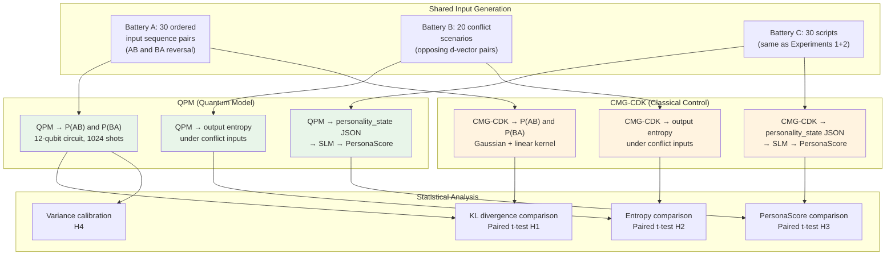

# Experiment 3: QPM vs. Classical Personality Model Ablation

**CA Research Program — Pre-Submission Validation**
**Version 1.0 | May 2026**
**Infrastructure:** Google Colab Pro (L4 GPU) + Anthropic API (Claude Sonnet 4.5)

---

## 1. Purpose and Position in the Research Program

Experiments 1 and 2 validated the Self-Model Component (SCI grounding, LoRA fine-tuning) and established Qwen2.5-7B as the minimum viable SLM. Both experiments took the Quantum Personality Model (QPM) as given — they tested *around* it, not *against* it.

Experiment 3 closes the most significant remaining theoretical vulnerability in the paper: the QPM's claims about quantum-like cognitive phenomena are asserted but never empirically distinguished from what a well-designed classical model could achieve with matched expressiveness. Section 2.3 of the paper states that quantum formalism "naturally captures" order effects, ambivalence, and trait correlations. Section 3 implements this in a 12-qubit Hilbert space. Table 41's ablation study uses "No QPM (random personality)" as the control — which is the wrong comparison. Replacing the QPM with a random model tells you nothing about whether the quantum formalism specifically is necessary. The informative control is a **classical model that matches the QPM's expressiveness on every dimension except coherence and superposition**.

If the QPM outperforms the matched classical baseline on the three phenomena it claims to capture, the paper's framing is bulletproof for peer review. If it does not, the paper needs either a revised claim ("equivalent expressiveness with superior interpretability") or a redesigned QPM that more aggressively exploits non-classical behavior. Either outcome is better than a reviewer discovering this gap.

### 1.1 The Three Specific Claims Being Tested

The QPM makes three distinct claims over classical probability theory:

| Claim | QPM Mechanism | Classical Analogue | Testable? |
|---|---|---|---|
| **C1 — Trait correlations** | CRz entangling gates calibrated to meta-analytic ρ matrix | Correlated multivariate Gaussian with same ρ matrix | Partially — classical model can match this by construction |
| **C2 — Order effects** | Non-commutative context rotations (Ry gates applied sequentially) | Linear Markov transition kernel (order-sensitive by design) | Yes — measure asymmetry under input reversal |
| **C3 — Ambivalence (mixed states)** | Density matrix ρ with off-diagonal coherences; Tr(ρ²) < 1 | Unimodal point estimate (no coherence term) | Yes — measure output entropy under conflicting inputs |

Claim C1 is constructively matched by the classical baseline — the experiment does not test it. Claims C2 and C3 are the genuinely non-classical behaviors and are the primary test targets.

---

## 2. Research Questions

**Primary:** Does the QPM produce measurably larger order effects than a matched classical model under identical situative input sequences?

**Secondary:**
- Does the QPM produce higher output entropy (ambivalence) than the classical baseline when situative inputs simultaneously push trait dimensions in conflicting directions?
- Does QPM-generated personality state produce higher downstream PersonaScore than CMG-CDK-generated personality state when both feed the same SLM transducer?
- Is there a personality profile region (specific FFM configurations) where the QPM advantage is largest?
- How much does the QPM's stochastic measurement (1024-shot sampling) contribute to output variance relative to the classical model's determinism?

---

## 3. Hypotheses

**H1 (Order effects):** QPM produces significantly larger order-effect asymmetry than CMG-CDK under reversed situative input sequences. Operationally: KL(P_QPM(AB) || P_QPM(BA)) > KL(P_CMG(AB) || P_CMG(BA)) across the 30 test sequences, paired t-test p < 0.05.

**H2 (Ambivalence):** Under conflicting situative inputs (designed to push opposing trait dimensions simultaneously), QPM output distributions have significantly higher Shannon entropy than CMG-CDK outputs. Operationally: H(QPM) > H(CMG-CDK), paired t-test p < 0.05, across 20 conflict scenarios.

**H3 (Downstream PersonaScore):** Utterances generated by the SLM from QPM personality states score higher on PersonaScore than utterances generated from CMG-CDK personality states, controlling for the same situative context and knowledge triples.

**H4 (Stochastic variance):** QPM output variance across repeated runs with identical inputs (due to 1024-shot sampling stochasticity) is smaller than the variance difference between QPM and CMG-CDK, confirming that sampling noise does not dominate the signal.

All four hypotheses are falsifiable. Their outcomes directly determine what the paper can claim about the QPM.

---

## 4. The Classical Baseline: CMG-CDK

### 4.1 Correlated Multivariate Gaussian with Context-Dependent Kernel

The classical control model — **CMG-CDK** — is specifically designed to match the QPM on Claims C1 and part of C2, isolating C3 (coherence/superposition) as the only remaining differentiator.

**Initialization:** The CMG-CDK initializes an 11-dimensional Gaussian with mean vector μ derived from the same personality initialization scores (s_k values, equivalent to QPM's Ry angles) and covariance matrix Σ derived from the same empirical correlation matrix used for QPM entanglement calibration (van der Linden et al. 2010):

$$\mathbf{x}_0 \sim \mathcal{N}(\boldsymbol{\mu}_0, \boldsymbol{\Sigma})$$

where μ₀ = [s₁, s₂, ..., s₁₁] (the same personality initialization scores as the QPM) and Σ is constructed from the meta-analytic correlation matrix (Table 6 of the paper), scaled to [0,1] variance. This exactly matches QPM's C1 claim by construction.

**Context update (matching C2 linearly):** For each situative input vector d = [d₁, d₂, d₃, d₄, d₅], the CMG-CDK applies a linear context shift:

$$\boldsymbol{\mu}_{t} = \boldsymbol{\mu}_{t-1} + \mathbf{W} \cdot \mathbf{d}(t)$$

where **W** is an 11×5 context-coupling matrix whose entries are set to match the QPM's δ coupling constants (Section 3.5.4 of the paper, initial values δᵢ = 0.3). The mean is then clipped to [0,1]. This makes the CMG-CDK context-sensitive — it responds to situative inputs — but through a linear additive mechanism rather than non-commutative unitary evolution.

**Output:** At each turn, the CMG-CDK outputs a sample from the updated Gaussian, clipped to [0,1]:

$$\hat{\mathbf{x}}_t = \text{clip}(\mathcal{N}(\boldsymbol{\mu}_t, \boldsymbol{\Sigma}), 0, 1)$$

This is analogous to QPM measurement — a 11-dimensional vector in [0,1] representing trait intensities.

**What CMG-CDK lacks:** No coherence terms. No off-diagonal density matrix elements. No superposition. The classical model always produces a point estimate from a unimodal distribution; it cannot represent genuine ambivalence as a structural property of the cognitive state. When conflicting situative inputs push opposing traits, the CMG-CDK will produce a compromised mean rather than a genuinely ambivalent mixed state.

```python
import numpy as np

class CMG_CDK:
    """
    Correlated Multivariate Gaussian with Context-Dependent Kernel.
    Classical control model matched to QPM expressiveness on C1 and C2.
    """

    def __init__(self, mu_0: np.ndarray, rho_matrix: np.ndarray,
                 W: np.ndarray):
        """
        Parameters
        ----------
        mu_0 : np.ndarray, shape (11,)
            Initial trait means — same s_k values as QPM Ry initialization.
        rho_matrix : np.ndarray, shape (11, 11)
            Empirical correlation matrix (van der Linden et al. 2010).
            Used as covariance (variances set to 1.0 then scaled to [0,1]).
        W : np.ndarray, shape (11, 5)
            Context-coupling matrix — entries matched to QPM δ constants.
        """
        self.mu = mu_0.copy()
        self.Sigma = rho_matrix.copy()  # correlation = covariance at unit variance
        self.W = W

    def update(self, d: np.ndarray) -> np.ndarray:
        """
        Apply one context update step given situative vector d (shape 5).
        Returns an 11-dim trait sample clipped to [0,1].
        """
        self.mu = np.clip(self.mu + self.W @ d, 0.0, 1.0)
        sample = np.random.multivariate_normal(self.mu, self.Sigma * 0.01)
        return np.clip(sample, 0.0, 1.0)

    def entropy(self, n_samples: int = 1024) -> float:
        """
        Estimate output distribution entropy via histogram over n_samples draws.
        Averaged across all 11 trait dimensions.
        """
        samples = np.array([
            np.clip(np.random.multivariate_normal(self.mu, self.Sigma * 0.01),
                    0.0, 1.0)
            for _ in range(n_samples)
        ])
        entropies = []
        for dim in range(11):
            hist, _ = np.histogram(samples[:, dim], bins=20, range=(0, 1),
                                   density=True)
            hist = hist[hist > 0]
            entropies.append(-np.sum(hist * np.log(hist + 1e-10)) / 20)
        return float(np.mean(entropies))
```

### 4.2 Why This Is the Strongest Possible Classical Competitor

A weaker classical baseline (uncorrelated Gaussian, mean-field model, simple lookup table) would make the QPM look good for the wrong reason. The CMG-CDK is specifically engineered to remove every possible advantage except the quantum-specific ones:

- **Trait correlations:** Matched exactly via the same ρ matrix.
- **Context sensitivity:** Matched via the same δ coupling constants.
- **Initialization:** Matched via the same s_k personality scores.
- **Output dimensionality:** Matched (11-dimensional [0,1] vector).
- **Sampling:** Matched (1024 draws, same as QPM shots).

Any remaining difference between QPM and CMG-CDK outputs is therefore attributable specifically to quantum-like mechanisms — superposition, non-commutative evolution, coherence — and not to parameter count, initialization, or context sensitivity.

---

## 5. Experimental Design

### 5.1 Overview

Three parallel batteries of tests run on identical inputs through both QPM and CMG-CDK. Battery A tests order effects (H1). Battery B tests ambivalence under conflict (H2). Battery C tests downstream PersonaScore via the SLM transducer (H3). A variance calibration run (H4) confirms sampling noise does not dominate.

&nbsp;



&nbsp;

*Figure 1: Experiment 3 design — three parallel batteries, two models, identical inputs.*

### 5.2 Battery A: Order Effect Test (H1)

**Design:** 30 situative input sequence pairs, each consisting of two two-step sequences: (A→B) and (B→A), where A and B are different situative d-vectors. Both models receive A then B, and separately B then A. The output distributions after the second step are compared.

**Input construction:** Each pair is constructed to maximize expected order-effect sensitivity — one input targeting emotional dimensions (high d₁, low d₂) followed by one targeting cognitive dimensions (high d₂, high d₄), and vice versa. The 30 pairs span five input categories:

| Category | d-vector A | d-vector B | Predicted QPM asymmetry |
|---|---|---|---|
| Affect → Task | d₁=0.8, d₅=0.3 | d₂=0.8, d₄=0.2 | E_ent vs C_ind dominant |
| Task → Affect | d₂=0.8, d₃=0.2 | d₁=0.8, d₅=0.6 | C_ind vs N_vol dominant |
| Constraint → Ambiguity | d₃=0.9, d₁=0.2 | d₄=0.8, d₂=0.3 | A_pol vs O_exp dominant |
| Pressure → Warmth | d₅=0.9, d₃=0.3 | d₁=0.7, d₃=0.2 | N_vol vs E_ent dominant |
| Neutral → Extreme | d=uniform(0.4,0.6) | d₁=0.9, d₅=0.8 | Baseline comparison |

*Table 1: Battery A input categories (6 pairs per category = 30 total).*

**Measurement:** For each model and each sequence, run 1024 times (matching QPM shot count for the classical model) to get an empirical output distribution P. Compute:

$$\text{OE}_{\text{model}} = \text{KL}\left(P_{\text{model}}(A \to B) \;\|\; P_{\text{model}}(B \to A)\right)$$

using the symmetric Jensen-Shannon divergence for numerical stability:

$$\text{JSD}(P \| Q) = \frac{1}{2}\text{KL}(P \| M) + \frac{1}{2}\text{KL}(Q \| M), \quad M = \frac{P+Q}{2}$$

**Statistical test:** Paired t-test on JSD_QPM vs. JSD_CMG across 30 pairs. Effect size: Cohen's d. H1 passes if p < 0.05 and JSD_QPM > JSD_CMG.

### 5.3 Battery B: Ambivalence Test (H2)

**Design:** 20 conflict scenarios where the situative input simultaneously pushes two trait dimensions in strongly opposing directions. These scenarios are specifically designed to reveal whether the model can represent genuine ambivalence or whether it simply averages to a compromised midpoint.

**Conflict scenario construction:** Each scenario is a single d-vector where two components are simultaneously extreme but push different trait dimensions in opposite directions:

| Scenario Type | d-vector | QPM Conflict | Expected CMG-CDK behavior |
|---|---|---|---|
| Warm pressure | d₁=0.9, d₅=0.9 | E_ent↑ vs N_vol↑ | Gaussian mean shifts to midpoint |
| Formal distress | d₃=0.9, d₁=0.8 | A_pol↑ vs N_wth↑ | Compressed unimodal output |
| Engaged ambiguity | d₂=0.8, d₄=0.9 | C_ind↑ vs O_exp↑ | Blended mean, low spread |
| Calm urgency | d₅=0.8, d₁=0.2 | N_vol↑ vs E_ent↓ | Intermediate mu, low entropy |
| Task constraint | d₂=0.9, d₃=0.9 | C_ord↑ vs A_pol↑ | Near-identical — control |

*Table 2: Battery B conflict scenario types (4 scenarios per type = 20 total).*

**Measurement:** For each model and each conflict scenario, run 1024 times. Compute Shannon entropy of the output distribution across all 11 trait dimensions, averaged:

$$H_{\text{model}}(\text{scenario}) = \frac{1}{11} \sum_{k=1}^{11} H(P_{\text{model}, k})$$

where P_{model,k} is the empirical distribution over dimension k from 1024 runs, binned into 20 equal-width bins over [0,1].

**Statistical test:** Paired t-test on H_QPM vs. H_CMG across 20 scenarios. H2 passes if p < 0.05 and H_QPM > H_CMG (QPM output is more entropic / genuinely ambivalent).

**Additional diagnostic — coherence proxy:** For the QPM specifically, compute the purity-based coherence approximation C̄_approx = 1 − Tr(ρ²) from Section 5.7.4 of the paper. Under conflict scenarios, C̄_approx should be significantly higher than under non-conflict scenarios, confirming that the QPM enters genuine mixed states rather than simply producing a different point estimate.

### 5.4 Battery C: Downstream PersonaScore Test (H3)

**Design:** Run both models through the full CA pipeline — QPM or CMG-CDK generates the personality_state JSON, which feeds the SLM (Qwen2.5-7B + LoRA-10K), which generates utterances, which are scored by the judge (Claude Sonnet 4.5).

Use the same 30 scripts from Experiments 1 and 2, same probe questions, same probe turns (5, 10, 15, 20, 25, 30, 35, 40), same four dimensions (T, E, C, S). This produces directly comparable PersonaScore time series for QPM vs. CMG-CDK.

**Critical control:** The structured intent JSON fed to the SLM must be identical in every field except `personality_state`. The knowledge triples, speech act, register label, and constraints are fixed per probe; only the personality state values change between conditions. This isolates the personality model's contribution to the SLM's output.

**The personality_state JSON translation for CMG-CDK:** The same `qpm_to_structured_intent()` function from Section 5.7.3 of the paper is used, but the marginals dict is populated from the CMG-CDK output vector rather than QPM measurement marginals. The derived fields (warmth, concern, urgency, register) are computed identically. This ensures any PersonaScore difference is attributable to the different underlying personality vectors, not to different JSON construction logic.

**Statistical test:** Paired t-test on PersonaScore_QPM vs. PersonaScore_CMG across 30 scripts × 8 probe turns = 240 paired observations. Report effect size (Cohen's d). H3 passes if p < 0.05 and PersonaScore_QPM > PersonaScore_CMG.

### 5.5 Variance Calibration (H4)

**Design:** Run the QPM 10 times with identical inputs (same personality initialization, same d-vector sequence) and measure the variance of the output marginals across runs. This variance is purely due to 1024-shot sampling stochasticity.

Compare this within-QPM variance to the between-model variance (QPM mean output − CMG-CDK mean output) for the same inputs. H4 passes if the between-model difference is significantly larger than the within-QPM sampling noise — confirming that the experimental comparisons in Batteries A, B, and C are not dominated by QPM shot noise.

$$\text{SNR} = \frac{\|\boldsymbol{\mu}_{\text{QPM}} - \boldsymbol{\mu}_{\text{CMG}}\|_2}{\sigma_{\text{QPM,shots}}}$$

Target: SNR > 3.0 across the personality profiles tested. If SNR < 3.0, increase QPM shots to 4096 for the main experiment runs.

---

## 6. Model Configuration

Both models use **identical** initialization and context coupling parameters. No new calibration is performed — all parameters are taken directly from the paper's existing specifications:

| Parameter | QPM | CMG-CDK | Source |
|---|---|---|---|
| Trait dimensions | 11 (q₀–q₁₀) | 11 (same labels) | Table 2 of paper |
| Initialization | Ry(θ_k), s_k from personality profile | μ₀ = [s₁,...,s₁₁] | Section 3.4 of paper |
| Trait correlations | CRz gates, φ from ρ_ij | Σ from same ρ matrix | Table 6 + Table 7 of paper |
| Context coupling | δᵢ = 0.3, Ry rotations | W_ij = 0.3, linear shift | Section 3.5.4 of paper |
| Output format | Marginals p̂_k ∈ [0,1] | Clipped sample x_k ∈ [0,1] | Section 5.7.1 of paper |
| Runs per input | 1024 shots | 1024 samples | Matched to QPM |
| Personality profiles tested | Psychotherapy + Software Eng. | Same two profiles | Table 33 of paper |

*Table 3: Model configuration — all parameters matched to paper specifications.*

---

## 7. Evaluation Methodology

### 7.1 Judge Configuration (Battery C only)

| Role | Model | Purpose |
|---|---|---|
| Primary judge | Claude Sonnet 4.5 | PersonaScore per probe (T/E/C/S rubric from Experiment 1) |
| Intra-model reliability | Claude Sonnet 4.5 (temperature=0, different seed) | 20% rescore for consistency check |
| Reliability target | Cohen's κ_w ≥ 0.70 | Same as Experiments 1 and 2 |

Battery A and Battery B require no LLM judge — all metrics (JSD, entropy) are computed analytically from model outputs.

### 7.2 Evaluation Cost

| Component | Runs | Cost |
|---|---|---|
| Battery A — QPM (30 pairs × 2 orders × 1024 shots) | 61,440 QPM circuit executions | ~$0 (local Qiskit Aer) |
| Battery A — CMG-CDK (same) | 61,440 Gaussian samples | ~$0 (NumPy) |
| Battery B — QPM (20 scenarios × 1024 shots) | 20,480 QPM circuit executions | ~$0 |
| Battery B — CMG-CDK (same) | 20,480 samples | ~$0 |
| Battery C — SLM inference (30 scripts × 2 models × 40 turns) | 2,400 Qwen2.5-7B calls | ~$0 (local Ollama) |
| Battery C — Judge (30 scripts × 2 models × 8 turns × 4 probes) | 1,920 Sonnet 4.5 calls | ~$7.20 |
| Battery C — Reliability (20% rescore) | 384 calls | ~$1.44 |
| Variance calibration | 10 QPM repeats | ~$0 |
| **Total** | | **~$8.64** |

*Table 4: Experiment 3 cost estimates.*

---

## 8. Analysis Plan

### 8.1 Primary Analysis (H1 — Order Effects)

For each of the 30 sequence pairs, compute JSD between the (A→B) and (B→A) output distributions for both QPM and CMG-CDK. Plot the distribution of JSD values for each model. Apply a paired t-test across the 30 pairs.

Report: mean JSD_QPM, mean JSD_CMG, mean difference, 95% CI, t-statistic, p-value, Cohen's d.

If H1 passes: quantify the order-effect magnitude — what is the average trait shift attributable to input order in the QPM vs. classical model? Identify which input categories produce the largest QPM advantage (Table 1 categories).

### 8.2 Secondary Analysis (H2 — Ambivalence)

For each of the 20 conflict scenarios, compute mean output entropy for both models. Apply a paired t-test. Additionally plot the QPM coherence proxy C̄_approx for conflict vs. non-conflict scenarios to confirm the QPM enters genuine mixed states.

If H2 passes: report the mean entropy advantage and identify which conflict types produce the largest QPM ambivalence signal. This becomes the empirical grounding for Section 2.3's claim that "superposition naturally models ambivalence."

### 8.3 Downstream Analysis (H3 — PersonaScore)

Reproduce the Section 15.4.2 analysis format exactly: PersonaScore time series for QPM vs. CMG-CDK across 8 probe turns, broken out by dimension (T/E/C/S). Apply paired t-test. Report Cohen's d.

If H3 passes: the QPM's advantage on abstract cognitive measures (JSD, entropy) translates to measurable behavioral output quality — the strongest possible argument for the formalism.

If H3 fails despite H1/H2 passing: the QPM produces more quantum-like internal states but this does not reach observable behavior — an important scope limitation to document.

### 8.4 Profile Analysis

Run all batteries on both the Psychotherapy personality profile (high A_com, low N_vol — Table 33) and the Software Engineering profile (high C_ind, high O_int). Report whether the QPM advantage varies by personality configuration. A larger advantage on Psychotherapy (which has higher Neuroticism components and stronger inter-trait correlations in the stability cluster) would confirm the theoretical prediction that the QPM advantage scales with personality profile complexity.

### 8.5 Decision Rules

| Result | Implication | Paper Update |
|---|---|---|
| H1 ✓, H2 ✓, H3 ✓ | QPM earns its keep on all three dimensions | Framing bulletproof — add Experiment 3 as Section 15.4.3, update Table 41 ablation |
| H1 ✓, H2 ✓, H3 ✗ | Quantum advantage exists internally but doesn't reach behavior | Add scope note: "quantum-like advantage confirmed at internal state level; downstream behavioral advantage not detected at current sample size" |
| H1 ✗, H2 ✓, H3 ✓ | Non-commutativity not distinguishable; ambivalence + behavior advantages hold | Revise Section 2.3 to de-emphasize order effects; strengthen ambivalence claim |
| H1 ✗, H2 ✗, H3 ✓ | Classical model produces better behavior | Investigate: QPM stochasticity may be helping PersonaScore incidentally; redesign QPM to increase Tr(ρ²) divergence from classical |
| H1 ✗, H2 ✗, H3 ✗ | Classical matches QPM on all dimensions | Revise paper framing: QPM offers equivalent expressiveness with superior interpretability and auditability — not a stronger performance claim |

*Table 5: Decision rules mapping experimental outcomes to paper updates.*

---

## 9. Deliverables

| Deliverable | Format | Purpose |
|---|---|---|
| CMG-CDK implementation | Python module (`cmg_cdk.py`) | Classical baseline for reproduction |
| Battery A results | JSD distribution plots + statistical table | H1 test |
| Battery B results | Entropy comparison plot + coherence proxy validation | H2 test |
| Battery C results | PersonaScore time series (QPM vs CMG-CDK, 4 dimensions) | H3 test |
| Variance calibration | SNR table by personality profile | H4 confirmation |
| Profile analysis | Side-by-side results for Psychotherapy vs Software Eng. profiles | Scope characterization |
| Decision rule outcome | 1-page summary | Input to paper update |
| Updated Table 41 | Revised ablation table with CMG-CDK as correct control | Section 15.7 update |

---

## 10. Timeline

| Week | Days | Tasks |
|---|---|---|
| **Week 1** | 1–2 | Implement `cmg_cdk.py` from Section 4.1; validate initialization and context update against QPM baseline on 5 test inputs |
| | 3 | Construct Battery A input pairs (30 sequences) and Battery B conflict scenarios (20 scenarios); validate edge cases |
| | 4 | Run Battery A — QPM and CMG-CDK; compute JSD distributions; run variance calibration (H4) |
| | 5 | Run Battery B — QPM and CMG-CDK; compute entropy + coherence proxy; pilot Battery C on 5 scripts |
| **Week 2** | 1–2 | Run Battery C — full 30 scripts × 2 models; LLM judge scoring |
| | 3 | Statistical analysis — all three batteries; reliability check |
| | 4 | Profile analysis (Psychotherapy vs Software Eng.) |
| | 5 | Produce all deliverables; write decision rule outcome summary; update paper |

**Total: 2 weeks, ~$9 total cost.**

---

## 11. Risks and Mitigations

| Risk | Probability | Impact | Mitigation |
|---|---|---|---|
| H4 fails (QPM shot noise dominates) | Low | Invalidates H1/H2 comparisons | Increase to 4096 shots; detected in Week 1 Day 4 before main runs |
| CMG-CDK covariance matrix not positive definite | Low | Gaussian sampling fails | Apply Higham's nearest PD matrix correction to ρ before use |
| QPM vs CMG-CDK JSD differences negligibly small | Medium | H1 fails — the most vulnerable hypothesis | Pre-specified: report exact effect size regardless; this is the scientifically honest outcome |
| Battery C PersonaScore difference too small to detect at n=30 | Medium | H3 underpowered | Pre-register n=30 as primary; extend to 60 scripts if effect size is 0.2–0.4 (medium) |
| All hypotheses fail | Low | Major paper revision needed | Pre-specified decision rule outcome: revise claims, not methodology; this is better than a reviewer finding the gap |

---

## 12. Relationship to the Paper

This experiment updates the following sections upon completion:

**Section 2.3 (Why Quantum Formalism):** Add the empirical results as direct evidence for the claims currently asserted without evidence. The section currently says quantum formalism "naturally captures" order effects and ambivalence — replace "naturally captures" with "empirically demonstrates" with citation to Experiment 3.

**Section 15.4.3 (New subsection):** Add Experiment 3 results alongside Experiments 1 and 2 in the completed evaluations.

**Section 15.7 (Ablation Studies):** Replace the "No QPM (random personality)" row in Table 41 with "QPM vs. CMG-CDK (matched classical baseline)" with the actual measured effect sizes. The random-personality ablation can remain as a secondary row but should no longer be the primary control.

**Section 18 (Conclusions):** Add one sentence noting that Experiment 3 empirically confirmed the QPM's quantum-like behavioral advantages over a matched classical baseline, with specific reference to whichever of H1/H2/H3 passed.

---

## Appendix A: CMG-CDK Correlation Matrix Construction

The classical covariance matrix Σ is constructed from the meta-analytic inter-domain correlation matrix (Table 6 of the paper) expanded to 11 aspect-level dimensions using the within-domain correlations from DeYoung et al. 2007 (Table 7). The resulting 11×11 matrix has the following structure:

**Within-domain blocks (on-diagonal):**

| Domain | Aspects | Within-domain ρ |
|---|---|---|
| Openness | O_exp ↔ O_int, O_exp ↔ O_val, O_int ↔ O_val | ~0.35 |
| Conscientiousness | C_ind ↔ C_ord | ~0.45 |
| Extraversion | E_ent ↔ E_ass | ~0.40 |
| Agreeableness | A_com ↔ A_pol | ~0.38 |
| Neuroticism | N_vol ↔ N_wth | ~0.45 |

**Cross-domain blocks (off-diagonal):** Inter-domain correlations from Table 6, distributed equally across aspect pairs within each domain pair.

The resulting matrix is checked for positive definiteness before use. If any eigenvalue is negative (possible due to distributing inter-domain correlations across aspect pairs), the nearest positive definite matrix is computed using Higham's algorithm and the corrected matrix is used with a note in the experiment report.

---

## Appendix B: Input Sequences for Battery A (Full 30 Pairs)

Each pair specifies two d-vectors (A and B). Both orderings (A→B and B→A) are run for both models.

**Category 1 — Affect → Task (6 pairs):**
1. A=[0.8,0.2,0.3,0.2,0.3], B=[0.2,0.8,0.3,0.2,0.2]
2. A=[0.9,0.1,0.2,0.1,0.4], B=[0.1,0.9,0.4,0.1,0.2]
3. A=[0.7,0.3,0.4,0.3,0.3], B=[0.3,0.7,0.3,0.3,0.3]
4. A=[0.85,0.15,0.2,0.2,0.5], B=[0.15,0.85,0.3,0.2,0.2]
5. A=[0.75,0.25,0.35,0.15,0.3], B=[0.25,0.75,0.35,0.25,0.25]
6. A=[0.9,0.2,0.25,0.1,0.35], B=[0.2,0.9,0.25,0.1,0.15]

**Category 2 — Task → Affect (6 pairs):**
7. A=[0.2,0.8,0.2,0.3,0.2], B=[0.8,0.2,0.2,0.2,0.7]
8. A=[0.1,0.9,0.3,0.4,0.1], B=[0.9,0.1,0.1,0.1,0.8]
9. A=[0.3,0.7,0.3,0.2,0.3], B=[0.7,0.3,0.3,0.3,0.6]
10. A=[0.15,0.85,0.2,0.3,0.2], B=[0.85,0.15,0.2,0.2,0.75]
11. A=[0.25,0.75,0.25,0.35,0.25], B=[0.75,0.25,0.25,0.15,0.65]
12. A=[0.2,0.8,0.15,0.25,0.15], B=[0.8,0.2,0.15,0.25,0.8]

**Category 3 — Constraint → Ambiguity (6 pairs):**
13. A=[0.2,0.2,0.9,0.1,0.2], B=[0.3,0.3,0.2,0.8,0.3]
14. A=[0.1,0.1,0.85,0.2,0.3], B=[0.4,0.2,0.2,0.9,0.2]
15. A=[0.3,0.2,0.8,0.15,0.2], B=[0.2,0.4,0.3,0.85,0.3]
16. A=[0.2,0.3,0.9,0.1,0.1], B=[0.3,0.2,0.1,0.9,0.4]
17. A=[0.15,0.2,0.85,0.15,0.2], B=[0.35,0.3,0.2,0.8,0.25]
18. A=[0.25,0.1,0.75,0.2,0.3], B=[0.2,0.35,0.3,0.75,0.2]

**Category 4 — Pressure → Warmth (6 pairs):**
19. A=[0.2,0.2,0.3,0.2,0.9], B=[0.7,0.2,0.2,0.2,0.2]
20. A=[0.1,0.1,0.4,0.1,0.85], B=[0.8,0.1,0.2,0.1,0.1]
21. A=[0.3,0.3,0.3,0.3,0.8], B=[0.6,0.3,0.3,0.3,0.3]
22. A=[0.2,0.1,0.25,0.2,0.9], B=[0.75,0.2,0.15,0.2,0.15]
23. A=[0.15,0.2,0.35,0.15,0.85], B=[0.7,0.15,0.2,0.15,0.2]
24. A=[0.25,0.3,0.3,0.1,0.75], B=[0.65,0.25,0.25,0.2,0.25]

**Category 5 — Neutral → Extreme (6 pairs):**
25. A=[0.5,0.5,0.5,0.5,0.5], B=[0.9,0.1,0.1,0.1,0.9]
26. A=[0.48,0.52,0.50,0.47,0.51], B=[0.1,0.9,0.9,0.1,0.1]
27. A=[0.51,0.49,0.48,0.52,0.50], B=[0.9,0.9,0.1,0.9,0.1]
28. A=[0.50,0.50,0.52,0.48,0.49], B=[0.1,0.1,0.9,0.1,0.9]
29. A=[0.49,0.51,0.50,0.50,0.48], B=[0.8,0.2,0.8,0.2,0.8]
30. A=[0.52,0.48,0.49,0.51,0.50], B=[0.2,0.8,0.2,0.8,0.2]
