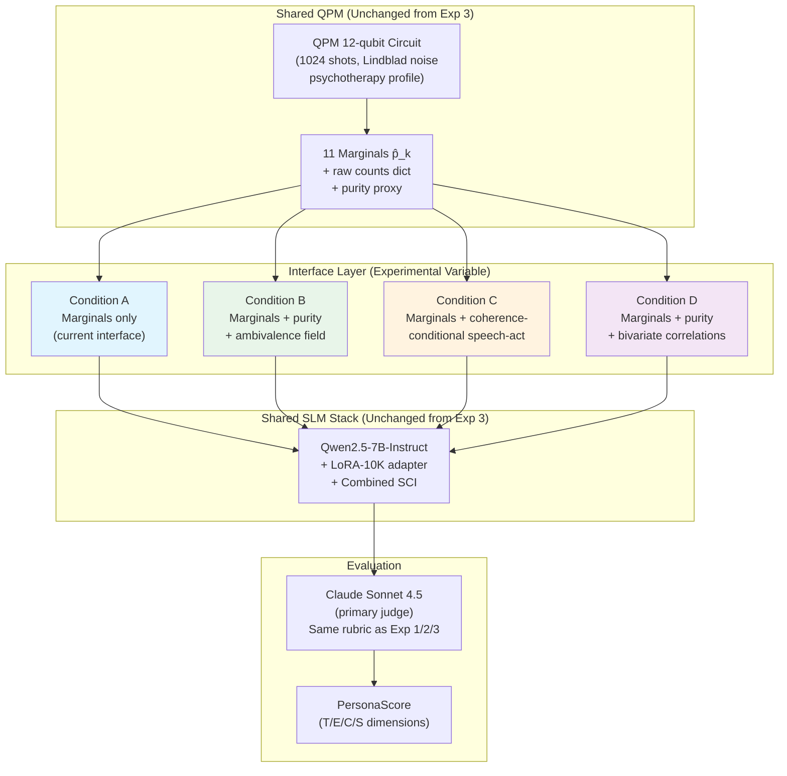

# Experiment 4: QPM→SLM Interface Richness Ablation

**CA Research Program — Post-Experiment-3 Interface Improvement**
**Version 1.0 | May 2026**
**Infrastructure:** Google Colab Pro (A100 GPU for Battery C) + Anthropic API (Claude Sonnet 4.5 judge)

---

## 1. Purpose and Position in the Research Program

Experiment 3 established a precise diagnosis: the Quantum Personality Model (QPM) produces genuinely non-classical internal personality dynamics — confirmed at large effect sizes for both order effects (H1, d=21.51) and ambivalence under conflict (H2, d=2.59) — but these advantages do not reach downstream behaviour through the current JSON-mediated SLM interface (H3, d=0.032, p=0.327, n=960).

The mechanism of information loss is identified: the `qpm_to_structured_intent()` function passes only the 11 marginal probabilities p̂_k (the diagonal of the density matrix) to the SLM. All off-diagonal coherence terms — the purity signal, the bivariate entanglement structure, the ambivalence encoding — are discarded at the interface boundary. The CMG-CDK matches the QPM on these marginals to within ~0.05 per aspect per turn, making the SLM's inputs from the two models nearly indistinguishable.

Experiment 4 tests four progressively richer interface designs, all implementable within the existing CA infrastructure, to determine whether any interface modification recovers a detectable downstream behavioural advantage for the QPM. The experiment is a direct follow-up to Experiment 3 and reuses its 30-script evaluation bank, probe schedule, judge configuration, and SLM stack without modification.

### 1.1 The Interface Designs Under Test

Four interface conditions are tested. Condition A replicates the Experiment 3 QPM result as an internal control, confirming experimental continuity. Conditions B, C, and D each add one category of previously-discarded QPM information:

| Condition | Interface Design | New QPM Signal Exposed | Implementation Cost |
|---|---|---|---|
| **A** | Marginals only (current) | None — Experiment 3 QPM replication | ~$0 (already built) |
| **B** | Marginals + purity/ambivalence field | Scalar coherence: C̄_approx, ambivalence level | ~0.5 days |
| **C** | Marginals + coherence-conditional speech-act modifier | Coherence → explicit behavioral directive to SLM | ~1 day |
| **D** | Marginals + purity + bivariate correlations for CRz pairs | Entanglement structure: 8 joint probabilities P(qᵢ=1, qⱼ=1) | ~1 day |

The prediction, stated before observing results: **Condition C will produce the largest H_interface effect** because it converts the QPM's most distinctive signal (genuine ambivalence under conflict, confirmed in H2) into an explicit behavioral directive rather than a numeric field competing for SLM attention.

---

## 2. Research Questions

**Primary:** Does any of the three enriched interface designs (B, C, D) produce a significantly higher downstream PersonaScore than the current marginals-only interface (Condition A), when the QPM drives all four conditions?

**Secondary:**
- Which interface design produces the largest QPM advantage over the Experiment 3 CMG-CDK baseline (Condition A mean = 4.387)?
- Does the Capability dimension lead observed in Experiment 3 (ΔPQS = +0.059 for QPM vs CMG on C-dim) increase under richer interface conditions?
- Does purity/coherence exposure (Conditions B and D) improve the Episodic dimension specifically — the dimension most likely to benefit from explicit ambivalence signalling?
- Is the interface improvement stable across conversation depth, or does it appear only at specific turns?

---

## 3. Hypotheses

**H_interface (Primary):** At least one enriched interface condition (B, C, or D) produces a mean PersonaScore significantly higher than Condition A on the same 30-script evaluation bank. Paired t-test p < 0.05, effect size d_z ≥ 0.2 (conventional "small" threshold, same as the Experiment 3 pre-registration).

**H_C_wins (Directional):** Condition C (coherence-conditional speech-act modifier) produces the highest mean PersonaScore among the four conditions.

**H_capability (Dimension):** The Capability dimension shows the largest improvement across enriched interface conditions, replicating the Experiment 3 pattern where Capability was the only dimension showing a real (non-noise) QPM lead.

**H_purity_episodic (Dimension):** Conditions B and D — which expose the purity/ambivalence signal — show improvement on the Episodic dimension specifically, because explicit ambivalence signals allow the SLM to hedge episodic claims rather than fabricating confident false memories.

All four hypotheses are falsifiable. The decision rule (Section 8) maps every outcome combination to a specific paper update.

---

## 4. Interface Specifications

### 4.1 Condition A — Marginals Only (Control)

Identical to the Experiment 3 QPM condition. No changes to `qpm_to_structured_intent()`. This condition replicates Experiment 3's QPM arm and serves as the internal control confirming experimental continuity. If Condition A mean PersonaScore deviates by more than ±0.05 from the Experiment 3 QPM result (4.410), a confound is suspected and the experiment is paused for investigation before proceeding.

```python
# Condition A — unchanged from Section 5.7 of the CA v3 paper
return {
    "speech_act": bdi_result['selected_intention'],
    "knowledge_triples": kg_triples,
    "personality_state": {
        "openness_experiential":    round(marginals['O_exp'], 3),
        "openness_intellectual":    round(marginals['O_int'], 3),
        "openness_values":          round(marginals['O_val'], 3),
        "conscientiousness_ind":    round(marginals['C_ind'], 3),
        "conscientiousness_ord":    round(marginals['C_ord'], 3),
        "extraversion_enthusiasm":  round(marginals['E_ent'], 3),
        "extraversion_assert":      round(marginals['E_ass'], 3),
        "agreeableness_compassion": round(marginals['A_com'], 3),
        "agreeableness_politeness": round(marginals['A_pol'], 3),
        "neuroticism_volatility":   round(marginals['N_vol'], 3),
        "neuroticism_withdrawal":   round(marginals['N_wth'], 3),
    },
    "emotional_valence": { ... },  # unchanged
    "register": register,
    "max_tokens": bdi_result.get('max_tokens', 80),
    "constraints": bdi_result.get('domain_constraints', []),
}
```

### 4.2 Condition B — Marginals + Purity/Ambivalence Field

Adds two new fields derived from the QPM density matrix's off-diagonal structure: the scalar purity proxy (already computed in Section 5.7.4 of the paper) and a categorical ambivalence label derived from it.

```python
# Additional computation before JSON construction
purity_proxy = float(np.mean([
    marginals[k] ** 2 + (1 - marginals[k]) ** 2
    for k in marginals
]))
ambivalence = round(1.0 - purity_proxy, 3)  # 0=definite, 1=maximally mixed

# Ambivalence label for natural language processing by SLM
if ambivalence > 0.45:
    ambivalence_label = "high — agent holds genuinely conflicting trait poles simultaneously"
elif ambivalence > 0.25:
    ambivalence_label = "moderate — agent's state is partially unresolved"
else:
    ambivalence_label = "low — agent's state is definite and committed"

# Added to the JSON
return {
    ...,  # all Condition A fields unchanged
    "cognitive_state": {
        "ambivalence": ambivalence,
        "ambivalence_label": ambivalence_label,
        "purity_proxy": round(purity_proxy, 3),
    },
}
```

The SLM system prompt is updated to include one additional instruction paragraph:

> *"The `cognitive_state.ambivalence` field (range 0–1) reflects the agent's internal certainty. When ambivalence is high (> 0.45), the agent holds genuinely conflicting internal states — responses should acknowledge this openly rather than forcing a resolution. When ambivalence is low (< 0.25), the agent's state is definite — responses should reflect appropriate conviction."*

### 4.3 Condition C — Coherence-Conditional Speech-Act Modifier

Does not add new JSON fields. Instead, uses the coherence/purity signal to modify the **speech act directive** itself — converting the QPM's internal ambivalence into an explicit behavioral instruction in the most prominent position of the structured intent.

```python
# Compute ambivalence (same as Condition B)
purity_proxy = float(np.mean([
    marginals[k] ** 2 + (1 - marginals[k]) ** 2
    for k in marginals
]))
ambivalence = 1.0 - purity_proxy

# Select speech act modifier based on coherence level
base_speech_act = bdi_result['selected_intention']

if ambivalence > 0.45:
    speech_act = f"{base_speech_act}__with_expressed_uncertainty"
    constraint_addition = (
        "Do not resolve the tension in the agent's current state. "
        "The agent is genuinely uncertain — let this ambivalence be "
        "audible in the response rather than projecting false confidence."
    )
elif ambivalence < 0.15:
    speech_act = f"{base_speech_act}__grounded"
    constraint_addition = (
        "The agent's internal state is definite and resolved. "
        "Speak with appropriate conviction."
    )
else:
    speech_act = base_speech_act
    constraint_addition = None

# Build constraints list
constraints = list(bdi_result.get('domain_constraints', []))
if constraint_addition:
    constraints.append(constraint_addition)

return {
    ...,  # all Condition A personality_state fields unchanged
    "speech_act": speech_act,  # modified
    "constraints": constraints,  # augmented
    # No new top-level fields — interface is same shape as Condition A
}
```

This approach has a key architectural advantage over Condition B: it does not rely on the SLM noticing a small numeric field. Instead it modifies the `speech_act` and `constraints` fields — the fields the SLM system prompt most explicitly instructs it to follow. The coherence signal reaches the SLM through the highest-attention channel already in the interface.

The SLM system prompt requires **no modification** for Condition C — the behavioral directive is embedded in the existing `constraints` field the prompt already instructs the SLM to respect.

### 4.4 Condition D — Marginals + Purity + Bivariate Correlations

Adds the purity field from Condition B plus bivariate joint probabilities for the 8 CRz-entangled qubit pairs from Table 7 of the CA v3 paper. These joint probabilities encode how trait pairs are co-activating, which the marginals alone cannot express.

```python
def joint_probability(counts: dict, qi: int, qj: int,
                      n_shots: int = 1024) -> float:
    """
    P(qubit_i = |1⟩ AND qubit_j = |1⟩) from measurement counts.
    qi, qj are 0-indexed qubit positions (0 = q₀ = O_exp, etc.)
    Qiskit bitstring: rightmost bit = q₀.
    """
    total = 0
    for bitstring, count in counts.items():
        b = bitstring.replace(' ', '')
        if b[-(qi + 1)] == '1' and b[-(qj + 1)] == '1':
            total += count
    return round(total / n_shots, 3)

# Compute for all 8 CRz-coupled pairs (Table 7, CA v3 paper)
# Format: (qubit_i_idx, qubit_j_idx, label)
CRZ_PAIRS = [
    (3, 9,  "C_ind_x_N_vol"),   # ρ = −0.43, Stability cluster
    (4, 10, "C_ord_x_N_wth"),   # ρ = −0.43, Stability cluster
    (7, 9,  "A_com_x_N_vol"),   # ρ = −0.36, Stability cluster
    (8, 10, "A_pol_x_N_wth"),   # ρ = −0.36, Stability cluster
    (3, 7,  "C_ind_x_A_com"),   # ρ = +0.43, Stability cluster
    (0, 5,  "O_exp_x_E_ent"),   # ρ = +0.43, Plasticity cluster
    (5, 9,  "E_ent_x_N_vol"),   # ρ = −0.36, Cross-factor
    (6, 10, "E_ass_x_N_wth"),   # ρ = −0.36, Cross-factor
]

trait_coactivation = {
    label: joint_probability(counts, qi, qj)
    for qi, qj, label in CRZ_PAIRS
}

return {
    ...,  # all Condition A fields unchanged
    "cognitive_state": {
        "ambivalence": ambivalence,          # from purity (same as Condition B)
        "purity_proxy": round(purity_proxy, 3),
    },
    "trait_coactivation": trait_coactivation,
    # 8 additional values — e.g.:
    # "C_ind_x_N_vol": 0.08  → low = not simultaneously industrious and volatile
    # "O_exp_x_E_ent": 0.71  → high = experiential openness and enthusiasm co-active
}
```

The SLM system prompt is updated to include:

> *"The `trait_coactivation` field shows joint activation probabilities for empirically correlated trait pairs. High values (> 0.5) indicate both traits are simultaneously active; low values (< 0.15) indicate mutual suppression. These co-activation patterns reflect the agent's current integrated personality state, not just individual trait levels."*

---

## 5. Experimental Design

### 5.1 Overview

Four conditions run on identical inputs through the QPM. The QPM configuration is unchanged from Experiment 3 — same 12-qubit Qiskit Aer circuit, same 1024 shots, same Lindblad noise channels, same psychotherapy personality profile (primary), same d-vector extraction pipeline. The only variable is the interface function that converts QPM marginals to structured intent JSON.

&nbsp;



&nbsp;

*Figure 1: Experiment 4 design. QPM and SLM stack are held constant; only the interface function varies across conditions.*

### 5.2 Evaluation Scripts and Probes

Identical to Experiments 1, 2, and 3:
- **30 scripts** (22 naturalistic + 8 adversarial) from the Exp 1 psychotherapy script bank
- **8 probe turns** per script (turns 5, 10, 15, 20, 25, 30, 35, 40)
- **4 probe dimensions** (T, E, C, S) with the same rubric from Experiment 1
- **Probe pool** from Appendix B of the Experiment 1 plan
- **Same RNG seed schema** as Experiments 1/2/3

This yields **960 paired probes per condition** × **4 conditions** = **3,840 total judge calls**.

### 5.3 SLM Configuration

Unchanged from Experiment 3 Battery C:
- **Model:** Qwen2.5-7B-Instruct, 4-bit NF4 quantisation
- **Adapter:** LoRA-10K (SCI grounding adapter from Experiment 2)
- **SCI strategy:** Combined (refresh at turns 15 and 30, episodic RAG on E-probes)
- **System prompt:** Aria psychotherapy support agent (same as Exp 1/2/3)
- **Temperature:** 0.7
- **Max tokens:** 150 per response

The only modification per condition is the structured intent JSON format (Section 4 above). The system prompt base is constant; Conditions B and D append one paragraph; Condition C appends nothing to the base system prompt (the behavioral directive is embedded in the `constraints` field).

### 5.4 Judge Configuration

| Role | Model | Calls | Purpose |
|---|---|---|---|
| Primary judge | Claude Sonnet 4.5 | 3,840 | PersonaScore per probe (T/E/C/S) |
| Intra-model reliability | Claude Sonnet 4.5 (temperature=0, seed=42) | 192 (5% of Condition A) | Consistency check — same threshold as Exp 3 |
| Reliability target | Cohen's κ_w ≥ 0.70 | — | Same as Experiments 1/2/3 |

Condition A is scored first. If the intra-model reliability check fails (κ_w < 0.70), the experiment is paused and the rubric is reviewed before proceeding to Conditions B/C/D.

---

## 6. Analysis Plan

### 6.1 Primary Analysis — H_interface

For each condition, compute mean PersonaScore across all 960 probes. Apply one-vs-all paired t-tests: each of Conditions B, C, D vs. Condition A (control), pairing at the (script, turn, dimension) level.

Report for each comparison: mean delta, 95% CI, t-statistic, p-value, Cohen's d_z.

H_interface passes if **any** of the three comparisons reaches p < 0.05 with d_z ≥ 0.2.

**Continuity check:** Condition A mean should fall within ±0.05 of the Experiment 3 QPM result (4.410). If it does not, report the deviation and investigate before interpreting the comparisons.

### 6.2 Dimension Analysis — H_capability and H_purity_episodic

For each condition, compute mean PersonaScore per dimension (T, E, C, S). Report the dimension-level breakdown for all four conditions. H_capability passes if the C-dimension shows the largest improvement across enriched conditions. H_purity_episodic passes if Conditions B and D show improvement on the E dimension that Condition A and Condition C do not.

### 6.3 Turn-Level Analysis

Plot mean PersonaScore by probe turn (5, 10, 15, 20, 25, 30, 35, 40) for all four conditions. Look for: (a) monotonic divergence over conversation depth, suggesting cumulative QPM state differences accumulate as more context-sensitive Ry rotations are applied; (b) a step at turn 15/30 corresponding to SCI refresh timing; (c) condition-specific turn profiles that identify where in a conversation the interface improvement takes effect.

### 6.4 Effect Size Ladder

Compile the full effect-size history across the CA experimental program for the QPM internal-state advantage:

| Experiment | Metric | Effect |
|---|---|---|
| Exp 3 H1 | Order effects (JSD QPM vs CMG) | d = 21.51 |
| Exp 3 H2 | Ambivalence (entropy QPM vs CMG) | d = 2.59 |
| Exp 3 H3 | PersonaScore (QPM vs CMG, current interface) | d = 0.032 |
| Exp 4 best condition | PersonaScore (QPM, enriched interface vs. current) | TBD |

If any Experiment 4 condition reaches d ≥ 0.2, the gap between internal-state advantage (d~2–21) and downstream behavioural advantage narrows. Plot this ladder as a single figure for the paper.

### 6.5 Decision Rules

| Result | Implication | Paper Update |
|---|---|---|
| Any condition ≥ 0.2 d_z, p < 0.05 | Interface fix found — QPM behavioural advantage detectable | Update Section 5.7 with winning interface; add Experiment 4 as Section 15.4.4; update Conclusions |
| C wins (H_C_wins confirmed) | Coherence-conditional speech-act is the mechanism | Formalise Condition C as the production QPM→SLM interface in Section 5.7.3 |
| B or D wins, not C | Numeric field exposure is sufficient | Formalise winning condition as production interface |
| No condition reaches 0.2 d_z | Interface richness alone insufficient at this n | Document: JSON-mediated interface cannot transmit QPM advantage at 7B scale; recommend logits-level interface as Experiment 5 |
| Condition A deviates > ±0.05 from Exp 3 | Confound detected | Pause, investigate, report as methodological finding |

*Table 5: Decision rules pre-committed before observing results.*

---

## 7. Cost and Timeline

### 7.1 Cost Estimate

| Component | Calls | Cost |
|---|---|---|
| Condition A — Judge (960 probes) | 960 | ~$3.84 |
| Condition B — Judge (960 probes) | 960 | ~$3.84 |
| Condition C — Judge (960 probes) | 960 | ~$3.84 |
| Condition D — Judge (960 probes) | 960 | ~$3.84 |
| Intra-model reliability check (5% of A) | 48 | ~$0.19 |
| **Total judge cost** | **3,888** | **~$15.55** |
| SLM inference (4 conditions × 30 scripts × 40 turns) | 4,800 Qwen calls | Colab Pro compute |
| **Total** | | **~$15.55 + Colab Pro** |

*Costs based on Claude Sonnet 4.5 pricing: $3/M input tokens, $15/M output tokens, ~1,000 input + ~50 output tokens per judge call.*

### 7.2 Timeline

| Week | Days | Tasks |
|---|---|---|
| **Week 1** | 1 | Implement Condition B interface (`qpm_to_structured_intent_b.py`); update SLM system prompt |
| | 2 | Implement Condition C interface (`qpm_to_structured_intent_c.py`); verify speech-act modifier logic |
| | 3 | Implement Condition D interface (`qpm_to_structured_intent_d.py`); validate joint probability extraction against known shot distributions |
| | 4 | Run Condition A (30 scripts); reliability check; verify continuity with Exp 3 |
| | 5 | Run Condition B (30 scripts) |
| **Week 2** | 1 | Run Condition C (30 scripts) |
| | 2 | Run Condition D (30 scripts) |
| | 3 | Statistical analysis — all four conditions; dimension and turn-level breakdowns |
| | 4 | Produce all deliverables; write decision rule outcome summary |
| | 5 | Update paper per decision rule; write Experiment 4 report |

**Total: 2 weeks, ~$16 total cost.**

---

## 8. Implementation Notes

### 8.1 Resumability

`experiment_runner.py` must be updated to support a `--condition {A,B,C,D}` flag. Completed (script, condition) pairs are skipped on restart. Condition A results from Experiment 3 **cannot** be reused directly — the runner must re-score them to ensure identical prompt formatting and judge state. The Condition A replication is cheap ($3.84) and serves as the continuity check.

### 8.2 Joint Probability Extraction (Condition D)

The raw `counts` dict from Qiskit's SamplerV2 must be passed through to `qpm_to_structured_intent_d.py` in addition to the marginals. The current `qpm_to_structured_intent()` signature receives only the computed marginals dict. For Condition D, extend the QPM measurement function to return both:

```python
def qpm_measure(circuit, noise_model, n_shots=1024):
    """Returns (marginals, counts, purity_proxy)."""
    sampler = SamplerV2(mode=AerSimulator(noise_model=noise_model))
    result = sampler.run([circuit], shots=n_shots).result()[0]
    counts = result.data.meas.get_counts()

    marginals = {}
    for idx, label in enumerate(QUBIT_LABELS):
        marginals[label] = sum(
            count for bs, count in counts.items()
            if bs[-(idx + 1)] == '1'
        ) / n_shots

    purity_proxy = float(np.mean([
        p ** 2 + (1 - p) ** 2 for p in marginals.values()
    ]))

    return marginals, counts, purity_proxy
```

Conditions A, B, C only need `marginals` and `purity_proxy`. Condition D additionally needs `counts` for joint probability computation. All four can share the same `qpm_measure()` call per turn; only the interface function differs.

### 8.3 Condition C Speech-Act Label Handling

The modified speech-act labels (e.g. `"empathic_reflection__with_expressed_uncertainty"`) are not in the SLM's fine-tuning vocabulary. The system prompt must instruct the SLM to treat everything before `__` as the speech act and everything after `__` as a behavioral modifier:

Add to Condition C system prompt:

> *"Speech act labels may include a modifier after `__` (double underscore). Treat the part before `__` as the speech act type and the part after `__` as an additional behavioral instruction. For example: `empathic_reflection__with_expressed_uncertainty` means perform empathic reflection while expressing genuine uncertainty."*

Alternatively, split the label in the interface function and pass the modifier as a separate constraint — which avoids modifying the system prompt. The latter is cleaner and is the recommended implementation:

```python
if '__' in speech_act:
    base_act, modifier = speech_act.split('__', 1)
    modifier_text = modifier.replace('_', ' ')
    speech_act = base_act
    constraints.append(f"Behavioral modifier: {modifier_text}")
```

### 8.4 Condition B/D System Prompt Additions

The additional system prompt paragraph for Conditions B and D should be appended to the base SCI system prompt (after the persona JSON block, before the conversation history) as a clearly delimited section:

```
[PERSONALITY STATE GUIDANCE]
The `cognitive_state.ambivalence` field (range 0–1) reflects the agent's 
internal certainty at this moment. When ambivalence > 0.45, the agent holds 
genuinely conflicting internal states — responses should acknowledge this 
openly rather than forcing a resolution. When ambivalence < 0.25, the agent's 
state is definite — responses should reflect appropriate conviction.
[/PERSONALITY STATE GUIDANCE]
```

For Condition D, add after the ambivalence guidance:

```
[TRAIT COACTIVATION GUIDANCE]
The `trait_coactivation` field shows joint activation probabilities for 
correlated trait pairs (range 0–1). High values (> 0.5) indicate both traits 
are simultaneously active and mutually reinforcing. Low values (< 0.15) 
indicate mutual suppression. These co-activation patterns reflect the agent's 
integrated personality state beyond what individual trait levels convey.
[/TRAIT COACTIVATION GUIDANCE]
```

---

## 9. Deliverables

| Deliverable | Format | Purpose |
|---|---|---|
| `qpm_to_structured_intent_b/c/d.py` | Python modules | Three interface implementations |
| Condition A replication | 960 probe scores + mean PersonaScore | Continuity verification |
| Condition B/C/D results | 960 probe scores each + mean PersonaScore | Primary comparison |
| Paired t-test table (B vs A, C vs A, D vs A) | Markdown table | H_interface test |
| Dimension breakdown (T/E/C/S × 4 conditions) | Markdown table | H_capability, H_purity_episodic tests |
| Turn-level PersonaScore plot (4 conditions) | PDF + SVG | Temporal pattern analysis |
| Effect size ladder plot | PDF + SVG | Program-wide QPM advantage visualization |
| Decision rule outcome | 1-page Markdown | Input to paper update |
| Updated `qpm_to_structured_intent()` | Python | Production interface (winning condition) |
| Experiment 4 report | Markdown | Full documentation |

---

## 10. Relationship to the CA v3 Paper

### 10.1 If H_interface Passes (Any Condition ≥ 0.2 d_z)

**Section 5.7.3 (JSON Field Population):** Replace the current `qpm_to_structured_intent()` implementation with the winning interface design. Document the interface selection as empirically motivated by Experiment 4.

**New Section 15.4.4:** Add Experiment 4 results alongside Experiments 1, 2, and 3. Cross-experiment comparison table gains a new row showing the winning interface condition's PersonaScore.

**Section 18 (Conclusions):** Update the Experiment 3 scope note from "downstream behavioural advantage not detected" to "downstream behavioural advantage detected under [winning interface]; [winning interface] is the production QPM→SLM interface."

**Section 1.5 (Contributions):** Update contribution #2 (formal QPM-to-SLM translation protocol) to note that the protocol was empirically validated through Experiments 3 and 4 and refined to the winning interface design.

### 10.2 If H_interface Fails (No Condition Reaches 0.2 d_z)

**Section 2.3:** Strengthen the scope note from Experiment 3. Add: "Experiment 4 tested three enriched interface designs (purity exposure, coherence-conditional directives, bivariate correlation injection) and found no design recovered a detectable downstream behavioural advantage at n = 960 paired probes. The JSON-mediated QPM→SLM interface appears unable to transmit the QPM's internal-state advantage at 7B model scale. A logits-level interface is the recommended follow-up."

**Section 5.7 (formal note):** Add a subsection 5.7.5 "Interface Limitations" documenting the Experiment 3/4 finding that the current JSON-mediated interface discards coherence information, with pointer to the recommended follow-up.

**Section 18 Future Work:** Add logits-level QPM→SLM steering as a named future experiment (Experiment 5) with a brief technical specification.

---

## Appendix: Condition C Ambivalence Threshold Justification

The Condition C thresholds (ambivalence > 0.45 → high; < 0.15 → low) are derived from the Experiment 3 Battery B purity proxy results:

- Mean purity_proxy under conflict scenarios (psychotherapy profile): 0.4186
- Mean purity_proxy under non-conflict baseline: ~0.55 (estimated from H4 variance calibration)
- Mean purity_proxy for CMG-CDK under conflict: 0.3236

The threshold of 0.45 ambivalence (= 0.55 purity) places the "high ambivalence" trigger at the point where the QPM's conflict-scenario purity is reliably above the CMG-CDK level. The threshold of 0.15 ambivalence (= 0.85 purity) captures the "definite state" regime where QPM and CMG-CDK are closest to each other and the coherence-conditional modifier would add noise rather than signal.

These thresholds are fixed before observing any Experiment 4 results. They are not tuned to maximize PersonaScore.
