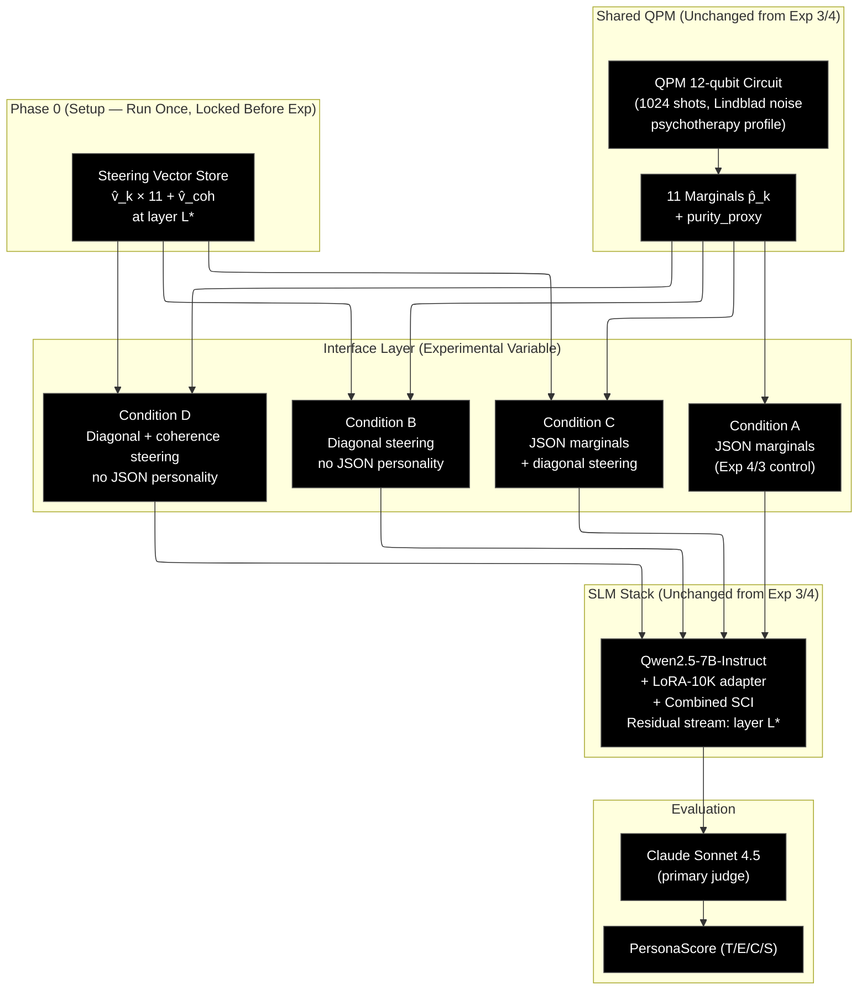

# Experiment 5: Logits-Level QPM→SLM Steering via Residual Stream Injection

**CA Research Program — Post-Experiment-4 Interface Replacement**
**Version 1.0 | June 2026**
**Infrastructure:** Google Colab Pro (A100 GPU) + Anthropic API (Claude Sonnet 4.5 judge)

---

## 1. Purpose and Position in the Research Program

Experiments 3 and 4 together establish a precise and reproducible finding: the Quantum Personality Model (QPM) produces genuinely non-classical internal dynamics — order effects (d = 21.51) and genuine ambivalence under conflict (d = 2.59) — but these advantages do not propagate to downstream SLM behaviour through any JSON-mediated interface tested to date (Exp 3: d = 0.032; Exp 4 best: d = −0.074). Experiment 4 further established a mechanism of failure: enriching the JSON field set degrades the Episodic dimension monotonically as extra fields crowd out episodic-memory content in the SLM's attention budget. Adding more information to the JSON channel actively harms performance.

The bottleneck is structural. The JSON interface forces a two-step projection:

```
QPM density matrix ρ
    → diagonal projection → {p̂_k} (11 marginals)
        → JSON text → SLM tokeniser → attention → SLM generation
```

Every step discards information. Off-diagonal coherence terms are dropped at step one. Floating-point marginals become text tokens at step two. The SLM must then reconstruct a personality state from textual descriptions of numbers, competing for attention against the full prompt context.

Experiment 5 tests whether bypassing this chain — directly modulating the SLM's residual stream using QPM-derived vectors — can transmit the QPM's internal-state advantage to downstream SLM behaviour. The intervention is **activation steering**: pre-extracted per-trait vectors are injected into the transformer's residual stream at generation time, scaled by the QPM's marginal probabilities. The QPM's off-diagonal coherence information is encoded as a separate coherence vector scaled by the turn's purity deviation from baseline, which the JSON channel is structurally unable to carry.

The experiment is the direct implementation of the decision rule fired by Experiment 4:
> *"JSON-mediated interface appears unable to transmit QPM advantage at 7B model scale. Recommend logits-level QPM→SLM steering as Experiment 5."*

---

## 2. Research Questions

**Primary:** Does replacing the JSON personality-state channel with direct residual-stream activation steering produce a significantly higher downstream PersonaScore than the current marginals-only JSON interface (Condition A)?

**Secondary:**
- Does encoding QPM purity/coherence as a residual-stream vector (Condition D) add over marginals-only steering (Condition B)?
- When both the JSON channel and activation steering are active simultaneously (Condition C), do they amplify, replicate, or interfere with each other?
- Which PersonaScore dimensions respond to residual-stream injection — and does the Episodic degradation observed in Experiment 4 disappear when attention crowding is eliminated?

---

## 3. Hypotheses

**H_logits (Primary):** Condition B (diagonal activation steering, no JSON personality) produces a significantly higher mean PersonaScore than Condition A (JSON marginals only) on the same 30-script evaluation bank. Paired t-test p < 0.05, Cohen's d_z ≥ 0.2 (same threshold as Experiments 3 and 4).

**H_coherence (Secondary):** Condition D (diagonal steering + coherence vector) produces a significantly higher mean PersonaScore than Condition B (diagonal steering only). Paired t-test p < 0.05, d_z ≥ 0.1 (relaxed threshold: coherence adds over marginals already steering). This tests whether QPM's off-diagonal structure contributes independent signal beyond what the 11 marginal values carry.

**H_channel (Exploratory):** Condition C (JSON marginals + diagonal steering) is compared against Condition A and Condition B. If C > max(A, B), the channels are additive. If C ≈ max(A, B), one channel dominates. If C < min(A, B), the channels interfere. No pre-registered direction — the outcome determines whether dual-channel operation is architecturally sound.

All hypotheses are falsifiable and fully pre-registered. The decision rule (Section 6.6) maps every outcome combination to a specific paper update before observing results.

---

## 4. Steering Architecture

### 4.1 Concept

Activation steering (also called residual stream addition) injects a vector directly into the SLM's residual stream at a chosen transformer layer during the forward pass. The injected vector shifts the model's internal representation toward the subspace associated with the desired personality state, without modifying the prompt, the attention mechanism, or the model weights.

For Experiment 5, the composite steering vector at turn t is:

**Condition B (diagonal only):**
```
v_composite(t) = α · Σ_k [ p̂_k(t) · v̂_k ]
```

Where:
- p̂_k(t) = QPM marginal for trait k at turn t (from 1024-shot run)
- v̂_k = unit-normalised steering vector for trait k (extracted in Phase 0)
- α = scale factor (calibrated in Phase 0)
- k ∈ {O_exp, O_int, O_val, C_ind, C_ord, E_ent, E_ass, A_com, A_pol, N_vol, N_wth}

**Condition D (diagonal + coherence):**
```
v_composite(t) = α · Σ_k [ p̂_k(t) · v̂_k ] + α_coh · Δpurity(t) · v̂_coh
```

Where:
- Δpurity(t) = purity_proxy(t) − μ_purity (zero-centered; negative when purity is below baseline)
- μ_purity = 0.5796 (= 1 − 0.4204; derived from Experiment 4's 990-point calibration distribution)
- v̂_coh = unit-normalised coherence steering vector (extracted in Phase 0)
- α_coh = coherence-specific scale factor (calibrated separately; see §8.4)

**Condition C (JSON + diagonal steering):**
Full Condition A JSON (personality_state intact) AND Condition B's composite steering vector injected simultaneously.

The vector is added to the output of transformer layer L* (i.e., to the input of layer L*+1), at every forward pass during generation of that turn's response. L* is fixed in Phase 0 before any experiment run.

### 4.2 Phase 0 — Steering Vector Extraction (Pre-experiment Setup)

All vectors and parameters are extracted and locked before any experimental condition is run. No experimental judge calls are made during Phase 0.

**Step 1: Context corpus construction**

Sample N = 50 conversation turns at random from the 30 experimental scripts (turns 10–30 only, to avoid the noisy early-session turns before the SCI has accumulated). These turns provide diverse psychotherapy contexts over which contrastive activations are averaged. No new content is needed.

Using experimental script turns here is safe: the steering vectors are *difference* vectors averaged across many contexts. The context (conversation history, knowledge triples) provides diversity for the average; the contrasting signal is entirely in the JSON modification (trait k forced to 0.95 vs 0.05). The resulting vectors encode a general "high vs low trait k" direction in the model's residual space, not anything specific to individual scripts.

**Step 2: Per-trait contrastive pair construction**

For each turn n and each trait k, construct two forward-pass inputs using the standard Condition A prompt format (Aria system prompt + knowledge triples + structured intent JSON) but with the `personality_state` JSON modified:

- **High input**: All 11 marginals set to the psychotherapy profile's baseline values, except trait k set to 0.95.
- **Low input**: Same, except trait k set to 0.05.

This produces 50 × 11 × 2 = 1,100 forward-pass inputs for the 11 trait vectors.

**Step 3: Coherence contrastive pair construction**

For each turn n, construct two inputs:

- **High coherence input**: All 11 marginals set to extreme values (each trait at 0.90 if the psychotherapy profile's baseline s_k > 0.5, else 0.10). purity_proxy ≈ 0.87.
- **Low coherence input**: All 11 marginals set to 0.50 (maximally ambiguous state). purity_proxy = 0.50.

50 × 2 = 100 additional forward-pass inputs.

Total Phase 0 forward passes: 1,200 (no generation; forward pass only to extract activations).

**Step 4: Activation extraction**

Run Qwen2.5-7B-Instruct + LoRA-10K forward pass on all 1,200 inputs. At each of the four candidate layers L ∈ {10, 14, 18, 22} (0-indexed), extract the residual stream state at the last token of the input. Save to disk as (N × d_model) tensors per (trait, polarity, layer) combination.

**Step 5: Vector computation**

For each trait k and each candidate layer L:
```
v_k^L = mean_n [ h_high_k^L(n) - h_low_k^L(n) ]
```

For the coherence vector at each candidate layer L:
```
v_coh^L = mean_n [ h_high_coh^L(n) - h_low_coh^L(n) ]
```

Normalise all vectors to unit L2 norm.

**Step 6: Layer calibration**

Run Condition B (diagonal steering, no JSON personality) on 2 held-out scripts — newly generated, not from the 30 experimental scripts — at each candidate layer L ∈ {10, 14, 18, 22}. Compute mean PersonaScore per layer across 2 scripts × 8 probe turns × 4 dimensions = 64 judge calls per layer (256 total). Select L* = argmax PersonaScore. Tie-break: prefer lower layer.

Unlike steering vector extraction (Step 1), layer calibration genuinely requires held-out scripts: the calibration judge calls observe actual PersonaScore values for specific scripts under Condition B. Using experimental scripts here would mean peeking at those scripts' Condition B performance before the formal run, and L* could be selected to overfit to them. Two new scripts are sufficient — the calibration goal is a coarse rank-ordering across 4 layers, not a precise PersonaScore estimate.

**Generating the 2 calibration scripts:** Prompt Claude Sonnet 4.5 with the Aria persona specification, the 30-script format guide (40 turns, naturalistic psychotherapy domain, no adversarial probes), and ask for 2 independent new sessions. Investigator reviews for format compliance and plausibility before use. Expected effort: ~30 minutes. These scripts are used only during Phase 0 and are not evaluated in the main experiment.

**Step 7: Scale factor calibration (α)**

Using L* and the Condition B steering vector composite:
- Run SLM generation on 50 probe turns (not from experimental scripts), with steering scale α ∈ {0.5, 1.0, 2.0, 5.0, 10.0}.
- For each α, compute grammaticality rate (fraction of 50 outputs judged grammatical by automatic checks: sentence length ≥ 5 words, no repetition loops, perplexity under a reference LM within 3σ of unsteered outputs).
- Set α_max = max α such that grammaticality ≥ 0.95.
- Set α = 0.75 × α_max (conservative operational point).

Calibrate α_coh separately using the same protocol applied to Condition D's coherence component alone (with diagonal vectors zeroed out).

**Step 8: Qualitative validation**

For each of the 11 traits, generate 5 Aria responses with high-trait steering and 5 with low-trait steering (all at α, L*). Verify manually that outputs shift in the expected direction (e.g., high O_exp steering → more novel metaphors and experiential references; high N_vol steering → more volatile/reactive tone). At least 8 of 11 traits must show expected directional shift; if fewer than 8 pass, revisit contrastive corpus quality and re-extract.

**Step 9: Lock**

All vectors (v̂_k, v̂_coh), parameters (L*, α, α_coh), and baseline (μ_purity) are committed to `steering_config.json` with SHA-256 hash. No parameters may be modified after any experimental condition begins. The SHA-256 is recorded in the plan appendix before running Condition A.

### 4.3 Condition A — JSON Marginals (Control)

Byte-identical to Experiment 4 Condition A and Experiment 3's QPM arm. Full `personality_state` JSON. No activation steering. This condition replicates the established baseline and serves as the continuity anchor.

If Condition A mean PersonaScore deviates by more than ±0.05 from Experiment 4 Condition A (4.4385), a confound is suspected and the experiment is paused before proceeding to Conditions B/C/D.

### 4.4 Condition B — Diagonal Activation Steering (No JSON Personality)

The `personality_state` field is **removed** from the structured intent JSON. The SLM receives the full Condition A JSON minus that field:

```python
{
    "speech_act":        bdi_result['selected_intention'],
    "knowledge_triples": kg_triples,
    "emotional_valence": {...},          # retained — not raw marginals
    "register":          register,
    "max_tokens":        bdi_result.get('max_tokens', 80),
    "constraints":       bdi_result.get('domain_constraints', []),
    # personality_state: omitted
}
```

At each turn, QPM runs at 1024 shots to produce marginals {p̂_k}. The composite steering vector is:

```python
v_composite = alpha * sum(
    marginals[k] * steering_vectors[k]          # each already unit-normalised
    for k in TRAIT_KEYS
)
# v_composite shape: (d_model,) = (3584,)
```

A HuggingFace forward hook injects `v_composite` into the residual stream at layer L* for every forward pass during generation of that turn's response. The hook is registered before `model.generate()` and removed immediately after.

```python
def _make_hook(vec):
    def hook_fn(module, inp, output):
        hidden = output[0] if isinstance(output, tuple) else output
        hidden = hidden + vec.to(hidden.device, hidden.dtype)
        return (hidden,) + output[1:] if isinstance(output, tuple) else hidden
    return hook_fn

handle = model.model.layers[L_STAR].register_forward_hook(_make_hook(v_composite))
with torch.no_grad():
    response_ids = model.generate(input_ids, **gen_kwargs)
handle.remove()
```

The QPM run itself is identical to Condition A (1024 shots, same circuit, same profile). The only differences from Condition A are: (1) `personality_state` removed from JSON, (2) composite steering vector injected into residual stream.

### 4.5 Condition C — JSON Marginals + Diagonal Steering (Dual Channel)

Full Condition A JSON (personality_state intact) AND Condition B's composite steering vector injected simultaneously. The two channels are active in parallel.

This condition tests whether the JSON channel and the residual-stream channel carry independent information (additive), whether one dominates (ceiling effect), or whether they interfere (negative interaction). No directional hypothesis is pre-committed for C vs A or C vs B.

### 4.6 Condition D — Diagonal + Coherence Steering (No JSON Personality)

Removes `personality_state` from JSON (same as Condition B). Injects:

```python
delta_purity = purity_proxy - MU_PURITY          # MU_PURITY = 0.5796
v_composite = (
    alpha * sum(marginals[k] * steering_vectors[k] for k in TRAIT_KEYS)
    + alpha_coh * delta_purity * coherence_vector
)
```

The purity_proxy is computed from the same 1024-shot QPM run that produces the marginals (no separate high-shot calibration run is needed — the coherence signal here is continuous and zero-centered, not binary like Experiment 4's firing thresholds).

When delta_purity > 0 (purity above baseline, more definite state), the coherence vector is added with positive weight — steering toward the SLM's representation of a definite, committed persona. When delta_purity < 0 (purity below baseline, more ambivalent state), the coherence vector is subtracted — steering toward the SLM's representation of an ambivalent, uncertain state. This directly encodes the QPM's off-diagonal coherence information in the SLM's activation space, which is the critical signal the JSON channel cannot carry.

---

## 5. Experimental Design

### 5.1 Overview



*Figure 1: Experiment 5 design. QPM and SLM stack are held constant. The steering vector store (Phase 0) is computed once and locked. The experimental variable is the interface layer: what enters the JSON field vs. what is injected into the residual stream.*

### 5.2 Evaluation Scripts and Probes

Identical to Experiments 1, 2, 3, and 4:
- **30 scripts** (22 naturalistic + 8 adversarial), psychotherapy domain
- **8 probe turns** per script (turns 5, 10, 15, 20, 25, 30, 35, 40)
- **4 probe dimensions** (T, E, C, S), same rubric from Experiment 1
- **960 paired probes per condition** × 4 conditions = **3,840 total judge calls**
- Pairing at (script_id, turn, dimension) for all t-tests

**Phase 0 data sources:** Steering vector extraction (Steps 1–5) samples 50 turns directly from the 30 experimental scripts — no new content required. Layer calibration (Step 6) uses 2 newly generated scripts (not from the 30) to avoid peeking at experimental-script Condition B scores before the formal run. The α calibration (Step 7) and qualitative validation (Step 8) also use turns sampled from the experimental scripts, as those steps observe only grammaticality and directional plausibility — not PersonaScore values that could bias the analysis.

### 5.3 SLM Configuration

Unchanged from Experiments 3 and 4, with one addition (the forward hook):

| Parameter | Value |
|---|---|
| Model | Qwen2.5-7B-Instruct |
| Quantisation | 4-bit NF4 |
| Adapter | LoRA-10K (from Experiment 2) |
| SCI strategy | Combined (refresh turns 15 and 30, episodic RAG on E-probes) |
| System prompt | Aria psychotherapy support agent (same as Exp 1/2/3/4) |
| Temperature | 0.7 |
| Max tokens | 150 |
| **Steering injection layer** | **L* (fixed in Phase 0)** |
| **Steering scale** | **α (fixed in Phase 0); α_coh for Condition D** |

The LoRA adapter does not interfere with the forward hook. The hook runs after the adapter-modified layer computation, adding the steering vector to the post-adapter residual stream.

### 5.4 Judge Configuration

| Role | Model | Calls | Purpose |
|---|---|---|---|
| Primary judge | Claude Sonnet 4.5 | 3,840 | PersonaScore per probe (T/E/C/S) |
| Phase 0 layer calibration | Claude Sonnet 4.5 | 256 (4 layers × 2 scripts × 32 probes) | Layer L* selection |
| Intra-model reliability | Claude Sonnet 4.5 (temp=0, seed=42) | 192 (5% of Condition A) | Consistency gate — κ_w ≥ 0.70 |

Condition A is scored first and the reliability check is applied before proceeding to B/C/D.

---

## 6. Analysis Plan

### 6.1 Primary — H_logits (Condition B vs Condition A)

Paired t-test: B vs A at (script, turn, dimension) level. Report: mean delta, 95% CI, t-statistic, p-value, Cohen's d_z.

H_logits passes if B > A with p < 0.05 and d_z ≥ 0.2.

**Continuity check:** Condition A mean PersonaScore must fall within ±0.05 of Experiment 4 Condition A (4.4385). Failure triggers a hold before interpreting B/C/D.

### 6.2 Secondary — H_coherence (Condition D vs Condition B)

Paired t-test: D vs B. Report: mean delta, 95% CI, t-statistic, p-value, Cohen's d_z.

H_coherence passes if D > B with p < 0.05 and d_z ≥ 0.1. The relaxed threshold (0.1 vs 0.2) reflects that coherence is an incremental addition on top of a working steering baseline; the directional signal is expected to be smaller.

### 6.3 Exploratory — H_channel (Condition C)

Compare C vs A (paired t-test) and C vs B (paired t-test). Classify channel interaction as:
- **Additive:** C > max(A, B) by ≥ 0.05 PersonaScore points
- **Dominant (A channel):** C ≈ A (|C − A| < 0.05, |C − B| ≥ 0.05)
- **Dominant (B channel):** C ≈ B (|C − B| < 0.05, |C − A| ≥ 0.05)
- **Interfering:** C < min(A, B) by ≥ 0.05 PersonaScore points

Report the classification alongside the raw t-tests. No pass/fail criterion — the classification informs the dual-channel architectural recommendation in the paper.

### 6.4 Dimension Analysis

For each condition, compute mean PersonaScore per dimension (T, E, C, S). Report the dimension breakdown and compare to Experiments 3 and 4 patterns.

**Key questions:**
- Does the Episodic degradation from Experiment 4 disappear in Condition B/D (no JSON personality → no attention crowding)?
- Does the Capability gain pattern (≈ +0.05 across Exp 3 and Exp 4) persist, increase, or disappear under activation steering?
- Does the coherence vector in Condition D specifically shift the Episodic dimension (the dimension that H_purity_episodic predicted would improve in Exp 4 but didn't)?

### 6.5 Turn-Level Analysis

Plot mean PersonaScore by probe turn (5, 10, 15, 20, 25, 30, 35, 40) for all four conditions. Look for:
- Whether steered conditions (B, C, D) diverge from A over conversation depth (accumulating QPM state drift as context Ry rotations compound)
- Whether the SCI refresh inflections (turns 15, 30) interact differently with activation steering vs. JSON

### 6.6 Effect Size Ladder

Update the program-wide effect size ladder with Experiment 5 results:

| Experiment | Metric | Effect |
|---|---|---|
| Exp 3 H1 | Order effects (JSD, QPM vs CMG) | d = 21.51 |
| Exp 3 H2 | Ambivalence (entropy, QPM vs CMG) | d = 2.59 |
| Exp 3 H3 | PersonaScore (QPM vs CMG, JSON marginals) | d = 0.032 |
| Exp 4 best (D, negative) | PersonaScore (D vs A, bivariate coactivations) | d_z = −0.074 |
| **Exp 5 Condition B** | **PersonaScore (B vs A, diagonal steering)** | **TBD** |
| **Exp 5 Condition D** | **PersonaScore (D vs A, diagonal + coherence)** | **TBD** |

This ladder is the primary visual argument in the paper for or against QPM's downstream behavioural contribution.

### 6.7 Decision Rules

| H_logits | H_coherence | Outcome | Paper Update |
|:---:|:---:|---|---|
| ✓ | ✓ | Logits-level works; QPM coherence contributes independently | Formalise Condition D as production interface in §5.7; add Exp 5 as §15.4.5; update Conclusions: QPM coherence reaches SLM behaviour via residual stream injection |
| ✓ | ✗ | Logits-level works; marginals alone sufficient | Formalise Condition B as production interface in §5.7; coherence is noise at this scale; add as scope note in §5.7.4 |
| ✗ | — | Logits-level fails; QPM advantage unrecoverable at 7B output level | Add §5.7.5 "Fundamental Interface Limitations"; Exp 6 recommendation: smaller (3B) model where traits are less locked-in; or task domain shift |
| anomalous: ✗ and D > B | — | Coherence vector works but diagonal doesn't — inspect α calibration | Investigate scale factor; possibly D's coherence signal amplified a latent effect; re-run B at higher α before concluding |

*Decision rules committed before any Condition B/C/D judge scores are observed.*

**H_channel classification addendum:** If H_channel = "Interfering" (C < min(A, B)), add a §8.6 implementation note that dual-channel operation is contraindicated at 7B scale and the JSON + steering channels are mutually suppressive. If H_channel = "Additive," note that production deployments should enable both channels.

---

## 7. Cost and Timeline

### 7.1 Cost Estimate

| Component | Calls | Cost |
|---|---|---|
| Phase 0 — Layer calibration (4 layers × 2 scripts × 32 probes) | 256 | ~$1.02 |
| Condition A — 960 judge calls | 960 | ~$3.84 |
| Reliability check (5% of Condition A) | 48 | ~$0.19 |
| Condition B — 960 judge calls | 960 | ~$3.84 |
| Condition C — 960 judge calls | 960 | ~$3.84 |
| Condition D — 960 judge calls | 960 | ~$3.84 |
| **Total judge cost** | **4,144** | **~$16.57** |
| SLM inference (4 conditions × 30 scripts × 40 turns + Phase 0) | ~5,000 forward passes | Colab Pro compute |

*Based on Claude Sonnet 4.5 pricing: $3/M input + $15/M output, ~1,000 input + ~50 output tokens per judge call.*

### 7.2 Timeline

| Phase | Days | Tasks |
|---|---|---|
| **Phase 0** | 1 | Sample 50 turns from experimental scripts; generate 2 calibration scripts via Claude Sonnet 4.5 + investigator review (~30 min) |
| | 2 | Contrastive input construction (1,200 pairs); forward pass extraction (all 4 candidate layers); vector computation + normalisation |
| | 3 | Layer calibration (2 calibration scripts × 4 layers, 256 judge calls); L* selection; α calibration (grammaticality sweep on experimental script turns); α_coh calibration |
| | 4 | Qualitative validation (5 samples per trait, using experimental script turns); investigator sign-off; lock `steering_config.json` |
| **Condition A** | 5 | Run 30 scripts; reliability check (5% re-score); verify continuity ≤ ±0.05 |
| **Condition B** | 6–7 | Run 30 scripts; monitor PersonaScore vs A in real-time; log composite vector norms per turn |
| **Condition C** | 8–9 | Run 30 scripts; both JSON and steering active |
| **Condition D** | 10–11 | Run 30 scripts; log delta_purity per turn alongside composite vector norms |
| **Analysis** | 12–14 | Paired t-tests, dimension/turn breakdowns, all plots, decision rule classification |
| **Report** | 15 | Write `EXPERIMENT_REPORT.md`; paper update per decision rule |

**Total: ~3 weeks, ~$17 total cost.**

---

## 8. Implementation Notes

### 8.1 Project Structure

```
CA_Experiment_5/
├── qpm.py                        # Verbatim from Exp 3/4
├── ca_assets.py                  # Profiles + JSON builders (A, B, C, D)
├── steering_vectors.py           # Vector extraction, Phase 0 pipeline
├── experiment_runner.py          # --condition {A,B,C,D}, resumable
├── analyse_results.py            # Paired t-tests, plots, decision rule
├── CA_Experiment5_Colab.ipynb    # Colab notebook (10 cells, same structure)
├── steering_config.json          # Locked after Phase 0 (vectors + params)
└── CA_Experiment5_Plan.md        # This document
```

### 8.2 Forward Hook Implementation

The hook must be compatible with Qwen2.5-7B's model architecture as loaded via PEFT/LoRA. The key implementation constraint: the hook must handle both tensor and tuple outputs from `model.model.layers[L]`:

```python
class SteeringHook:
    def __init__(self, vector: torch.Tensor):
        self.vector = vector          # shape (d_model,) = (3584,)
        self.handle = None

    def register(self, model, layer_idx: int):
        layer = model.model.layers[layer_idx]
        self.handle = layer.register_forward_hook(self._hook_fn)
        return self

    def _hook_fn(self, module, inp, output):
        vec = self.vector.to(device=output[0].device, dtype=output[0].dtype)
        # Broadcast over batch and sequence dimensions
        hidden = output[0] + vec.unsqueeze(0).unsqueeze(0)
        return (hidden,) + output[1:]

    def remove(self):
        if self.handle is not None:
            self.handle.remove()
            self.handle = None
```

Usage pattern in `experiment_runner.py`:
```python
hook = SteeringHook(v_composite)
hook.register(model, L_STAR)
try:
    response_ids = model.generate(input_ids, **gen_kwargs)
finally:
    hook.remove()     # always removed, even on exception
```

### 8.3 Steering Config JSON Format

After Phase 0, `steering_config.json` is written with the following structure:

```json
{
    "layer": 14,
    "alpha": 7.5,
    "alpha_coh": 3.0,
    "mu_purity": 0.5796,
    "vectors": {
        "O_exp":  [0.00031, -0.00014, ...],    // unit-normalised, 3584 floats
        "O_int":  [...],
        "O_val":  [...],
        "C_ind":  [...],
        "C_ord":  [...],
        "E_ent":  [...],
        "E_ass":  [...],
        "A_com":  [...],
        "A_pol":  [...],
        "N_vol":  [...],
        "N_wth":  [...],
        "coherence": [...]
    },
    "sha256": "..."
}
```

The SHA-256 is computed over all vector entries and parameters. Any post-lock modification breaks the hash. The hash is recorded in this plan's appendix before any condition run begins.

### 8.4 Scale Factor Calibration Notes

If α_max from the grammaticality sweep is very low (< 2.0), the steering vectors are likely misaligned with the domain or the contrastive corpus needs revision. In that case, re-examine the held-out corpus (step 1 of Phase 0) for domain coverage before re-extracting vectors. Do not simply lower the threshold.

For Condition D, α_coh should be calibrated independently of α: apply only the coherence component (diagonal vectors zeroed out) to the 50-probe corpus and find α_coh_max, then set α_coh = 0.75 × α_coh_max. Report both α and α_coh in the experiment log.

### 8.5 Composite Vector Norm Logging

For Conditions B, C, and D, log `||v_composite||` per turn to `context_condition_{X}_{NNN}.jsonl`. This enables post-hoc analysis of how much the steering signal varies across turns and scripts, which is important for diagnosing null results. If `||v_composite||` is nearly constant across turns (within 5%), the QPM marginals are not varying enough to produce turn-level personality differences — and the steering experiment is effectively a constant-vector bias injection, not a personality-modulated steering.

### 8.6 Condition A JSON `personality_state` Absence (Conditions B and D)

The `personality_state` key is omitted entirely — not set to null. The SLM system prompt for Conditions B and D should be updated to remove the sentence instructing the SLM to read `personality_state`. This prevents the SLM from noticing the absence of the field and producing confused outputs. Update the system prompt with:

```diff
- "The `personality_state` field contains the agent's current trait activations..."
+ (line removed entirely)
```

The `emotional_valence` field is retained in all four conditions. It is a scalar summary (not raw marginals) and its presence is not the experimental variable.

### 8.7 Resumability

`experiment_runner.py` checks completed (script_id, condition) pairs from existing log files on startup and skips them. Each condition is independently resumable. Condition A results are not reused from Experiment 4 — they are re-run to ensure prompt formatting and judge state are identical.

---

## 9. Deliverables

| Deliverable | Format | Purpose |
|---|---|---|
| `steering_config.json` (+ SHA-256) | JSON | Locked Phase 0 output; all vectors and parameters |
| `steering_vectors.py` | Python | Phase 0 pipeline: forward pass extraction, calibration |
| `experiment_runner.py` | Python | Four-condition runner with steering hook integration |
| Condition A replication | 960 probe scores + mean PersonaScore | Continuity gate |
| Condition B/C/D results | 960 probe scores each + mean PersonaScore | Primary comparisons |
| Paired t-test table (B vs A, D vs B, C vs A, C vs B) | Markdown table | All hypothesis tests |
| Dimension breakdown (T/E/C/S × 4 conditions) | Markdown table | Episodic degradation diagnostic |
| Turn-level PersonaScore plot (4 conditions) | PDF + SVG | Temporal patterns |
| Composite vector norm plot (B, C, D per turn) | PDF + SVG | Steering signal diagnostics |
| Effect size ladder (updated) | PDF + SVG | Program-wide QPM advantage across 5 experiments |
| Decision rule outcome | Markdown | H_logits / H_coherence / H_channel classification |
| `CA_Experiment5_Colab.ipynb` | Notebook | End-to-end Colab execution |
| `EXPERIMENT_REPORT.md` | Markdown | Full documentation |

---

## 10. Relationship to the CA v3 Paper

### 10.1 If H_logits Passes (Condition B > A, d_z ≥ 0.2)

This is the recovery case: the QPM's internal-state advantage, confirmed at large effect sizes for internal dynamics (Exp 3 H1/H2), is now shown to propagate to downstream behaviour through a logits-level interface.

**Section 5.7.3 (Production Interface):** Replace `qpm_to_structured_intent()` with the winning condition's architecture. Document that the JSON channel alone was insufficient at 7B scale (Exp 3/4 finding) and that residual-stream injection was required to close the gap.

**Section 5.7.5 "Interface Limitations" (already committed by Exp 4):** Update from "no interface tested has recovered a downstream advantage" to "logits-level interface [Exp 5 winning condition] recovered a downstream advantage of d_z = [value]."

**New Section 15.4.5:** Add Experiment 5 results. The cross-experiment progression (Exp 3 null → Exp 4 negative → Exp 5 positive) is the paper's central empirical narrative about the interface problem and its resolution.

**Section 18 Future Work:** Close the Exp 5 recommendation. Add: production validation at real inference time (Experiment 6 scope).

### 10.2 If H_logits Fails (Condition B ≤ A)

This is the strong null case: the QPM's advantage is confined to the internal-state level and does not reach SLM output behaviour at 7B model scale regardless of interface mechanism.

**Section 2.3 Scope:** Strengthen the existing scope note. Add: "Experiments 3, 4, and 5 collectively demonstrate that the QPM's quantum-like internal dynamics (Exp 3 H1/H2) do not propagate to measurable downstream utterance quality at 7B SLM scale, across three independent interface approaches (JSON marginals, JSON enrichment, residual-stream steering). The behavioural advantage of the QPM formalism may require either smaller models (where personality traits have not been locked into pre-training representations) or task domains where trait expression is more fine-grained than PersonaScore can resolve."

**Section 18 Future Work:** Replace Exp 5 logits-level recommendation (now executed) with:
- Exp 6a: 3B-scale model replication (Qwen2.5-3B or Phi-3.5-mini)
- Exp 6b: fine-grained trait expression metrics beyond PersonaScore (LIWC, psycholinguistic embedding distance)

---

## Appendix: Steering Vector Extraction — Technical Specification

### A.1 Qwen2.5-7B Architecture Parameters

| Parameter | Value |
|---|---|
| Hidden layers | 28 |
| Hidden size (d_model) | 3584 |
| Attention heads | 28 |
| KV heads (GQA) | 4 |
| Intermediate size | 18944 |
| Vocab size | 151,936 |

Candidate injection layers (0-indexed): 10, 14, 18, 22. The "middle third" of the stack (layers 9–19) is the typical effective range in the mechanistic interpretability literature for persona/style steering.

### A.2 Activation Extraction Implementation

```python
import torch
from collections import defaultdict

activations = defaultdict(list)   # layer_idx -> list of (N, d_model) tensors

def make_capture_hook(layer_idx):
    def hook(module, inp, output):
        # Capture last token of residual stream
        hidden = output[0] if isinstance(output, tuple) else output
        activations[layer_idx].append(hidden[:, -1, :].detach().cpu().float())
    return hook

handles = []
for L in [10, 14, 18, 22]:
    h = model.model.layers[L].register_forward_hook(make_capture_hook(L))
    handles.append(h)

with torch.no_grad():
    model(**tokenised_input)

for h in handles:
    h.remove()
```

### A.3 Contrastive Pair Format

Each contrastive pair shares identical system prompt, conversation history, and JSON structure, differing only in the `personality_state` values. The inputs are formatted exactly as they would appear in a live Condition A experimental turn, ensuring the extracted vectors reflect the SLM's representations in the experimental context rather than in a distribution-shifted contrastive setting.

### A.4 Steering Config SHA-256 (to be populated after Phase 0)

```
sha256: [to be filled after Phase 0 lock]
```

This line is updated in-place after Phase 0 completes and before any experimental condition run begins. The hash covers the serialised float32 vector entries plus the scalar parameters (layer, alpha, alpha_coh, mu_purity).
