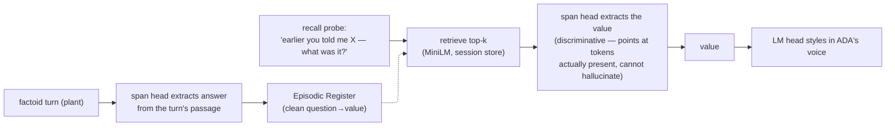

# Experiment 7 — Report: Long-Horizon Episodic Memory for the ADA Daily-QA Agent

**CA Research Program — Second test of the per-scenario, from-scratch, owned small-model direction**
**Status: COMPLETE (2026-07-28).** Companion to `CA_Experiment7_Plan.md` (v1.0). Inference-time memory-architecture experiment on the frozen Experiment 6 checkpoints (`sft_ada_final.pt` LM head, `span_final.pt` span head); no from-scratch training. Judged by Claude Sonnet 4.5 (T=0), same judge role as Exp 1–6. Figures: `results_span/exp7_{recall_vs_lag,persona_turn_series,cost}.{png,pdf,svg}` (extractive run); `results/` holds the generative-baseline figures.

---

## 0. TL;DR

Experiment 6 built a from-scratch 321M agent that reads, abstains, and holds the ADA persona across 40 turns — but its 1338-token SCI overflows the 1024 window, so it is **stateless per-turn**. Experiment 7 asks whether an external **episodic-RAG** memory layer gives it real long-horizon recall over 100–500 turns, and at what cost.

The answer is **yes — but only through the discriminative (extractive) head, not the generative one.** Routing recall through the LM head fails (hallucination, contamination from the baked SCI); routing it through the span head — the extract-then-style pattern — works.

| Hypothesis | Bar | Result | Verdict |
|---|---|---|---|
| **H1** statelessness floor | C0 recall ≈ 0, persona flat | C0/C1 recall **0.00**; persona flat ~3.8 | ✅ |
| **H2** episodic-RAG recall | out-of-window ≥ 0.70, > C0/C1 | **mechanism 0.81** (oracle) ✓; **end-to-end 0.54** (plant-limited), ≫ C0/C1 (0.00) | ⚠️ mechanism clears 0.70; end-to-end plant-bound |
| **H3** persona at length | ≥ 3.5 over 100–500 turns | **3.79** (LM head untouched) | ✅ |
| **H4** bounded cost | ≤ 1.5× low-store | **1.01×** (O(1)/turn) | ✅ |

**Headline:** episodic-RAG + extract-then-style gives the owned small agent **genuine, lag-independent long-horizon recall.** The read mechanism (retrieval + span extraction) recalls at **0.81** and clears 0.70 at *every* lag including 300. End-to-end recall (0.54) is bounded by **plant quality** — the 321M model's accuracy when *writing* facts into memory — not by retrieval, the reader, or the architecture. **Episodic recall belongs on the discriminative head; dispositional persona on the generative head** — the CA role-boundary principle, empirically forced. A stronger reader/writer (the pre-registered larger-base fallback) closes the write-side gap; persona and the O(1)-cost memory scaffolding stay owned-and-small.

---

## 1. Setup

**Models (both frozen, from Experiment 6):** the **LM head** (`sft_ada_final.pt`, causal, ADA voice/persona) and the **span head** (`span_final.pt`, bidirectional extractive reader, the H1 0.77 SQuAD reader). Retrieval by **all-MiniLM-L6-v2** (local). A **compact SCI** (~421 tokens vs 1338) renders the full self-model tersely so the window has room for an injected memory block; the judge still scores against the full SCI, so persona stays comparable to Exp 6.

**Memory path (extract-then-style):**

**Conditions** (all on the compact SCI): **C0** no memory (stateless floor) · **C1** sliding-window (last-N raw turns) · **C2** episodic-RAG (top-k retrieved). C1/C2 share the same token budget, isolating *recency* from *retrieval*.

**Data:** 9 long scripts (3 each at 100/300/500 turns) with planted **anchors** (a memorable fact stated once early) and **lag-tagged recall probes** (asked far later; lag = turns since the anchor). Fillers reused free from the Exp 6 `persona_scripts`; anchors generated by Sonnet with an eval-leakage filter. Standard T/E/C/S PersonaScore probes fire every 20 turns.

**Vocabulary** (used throughout): **plant** = the write step (the model answers an anchor turn; the answer enters the Episodic Register). **Plant quality** = how correct that stored value is. **Recall** = the read step (retrieve + extract). **Oracle-store** = a diagnostic that forces the ground-truth fact into memory at plant turns, removing plant quality as a variable to isolate the read mechanism.

---

## 2. The diagnostic arc

The result was reached by elimination, not on the first try:

1. **Generative recall fails.** Running recall through the LM head gave C2 out-of-window **0.20** — the model hallucinated values and, tellingly, defaulted to the SCI's baked "3422 °C" (the tungsten `salient_past_event`) for unrelated questions.
2. **Memory-aware SFT (Phase B) is a dead end.** Two designs were tried. Real-world-fact SFT (1000 steps) **hard-overfit** (loss → 0.0001; memorized fact→value pairs, fabricated on held-out facts). Synthetic needle-recall SFT (random values, un-memorizable) **still failed** and *degraded* the base reader. Fine-tuning the generative head to consume memory does not work at 321M.
3. **Isolation.** A MiniLM-only diagnostic showed **retrieval hit-rate = 1.00** (the anchor is always in top-5, usually #1) — retrieval is not the problem. The frozen model with `--top-k 1` (single clean snippet) still failed; even `--oracle-store` (ground-truth in memory) failed generatively — the LM head simply won't read a memory block reliably.
4. **The fix.** A probe showed the **span head extracts 5/5** correct values from retrieved snippets — a discriminative head can only point at tokens actually present, so it cannot hallucinate or pull from the baked SCI. Implementing `--recall span` (retrieve → span-extract → style, with span-extractive plant) turned the null into a positive result.

---

## 3. Results

### 3.1 Retrieval — perfect

MiniLM top-5 retrieval surfaced the correct anchor for **5/5** probes in the isolation diagnostic (usually as the #1 hit), and the flat recall-vs-lag curves below confirm it holds as the store grows to 500 turns. Retrieval is never the bottleneck.

### 3.2 Recall — generative vs Phase B vs extractive

Out-of-window recall accuracy (fraction of probes scoring ≥ 4 on the 1–5 recall rubric):

| Path | C0 | C1 | **C2** |
|---|--:|--:|--:|
| Generative (LM head) | 0.04 | 0.03 | **0.20** |
| Memory-aware SFT (Phase B) | — | — | **worse** (overfit / degraded reader) |
| **Extractive (span head)** | **0.00** | **0.00** | **0.54** |

And the crucial property — **extractive recall is lag-independent** (`exp7_recall_vs_lag`):

| lag | C0 | C1 | C2 generative | **C2 extractive** |
|---|--:|--:|--:|--:|
| 10 | 0.00 | 0.00 | 0.19 | **0.51** |
| 40 | 0.00 | 0.00 | 0.24 | **0.52** |
| 100 | 0.00 | 0.00 | 0.21 | **0.53** |
| 300 | 0.00 | 0.00 | 0.08 | **0.63** |

C1 (recency) is flat-zero — a 300-token window bounded by the 1024 context cannot reach anchors at lag ≥ 10. C2-generative decays with distance (0.24 → 0.08). **C2-extractive is flat-to-rising** (0.51 → 0.63): a fact planted at turn 5 and asked at turn 450 is recalled as reliably as one from ten turns ago, because retrieval is perfect and extraction doesn't care how old the memory is. This is the episodic-RAG promise delivered.

### 3.3 The oracle decomposition — where the 0.54 loss lives

Holding the write perfect (oracle-store) on the n=500 scripts isolates the read mechanism from plant quality:

| | overall | lag 10 | lag 40 | lag 100 | lag 300 |
|---|--:|--:|--:|--:|--:|
| **real plant** (end-to-end) | 0.55 | 0.50 | 0.56 | 0.56 | 0.62 |
| **oracle plant** (mechanism ceiling) | **0.81** | 0.78 | 0.83 | 0.86 | 0.75 |

Two conclusions:
1. **The read mechanism clears the bar** — with storage perfect, retrieve + span-extract recalls at **0.81**, ≥ 0.70 at *every* lag. The architecture does the job.
2. **The entire end-to-end gap (0.81 → 0.55, −0.26) is plant quality** — the 321M model writing imperfect answers at store time. Even our extractive plant stores a *minimal* span-extraction of the passage ("Italy", not "Italy, with 58"), which compounds. Retrieval isn't the limit (1.00), the read isn't (0.81) — the small model's *write* is.

### 3.4 Persona at length — holds

PersonaScore extended to 100–500 turns (LM head, unchanged by the extractive recall path):

| Condition | overall | T | E | C | S |
|---|--:|--:|--:|--:|--:|
| C0 | 3.90 | 4.01 | 3.33 | 4.49 | 3.77 |
| C1 | 3.76 | 3.79 | 3.28 | 4.47 | 3.51 |
| **C2** | **3.79** | 3.90 | 3.25 | 4.57 | 3.42 |

Persona holds ~3.8 with no downward trend over 500 turns (`exp7_persona_turn_series`) — RQ1 (no drift) and RQ3 (persona at length) confirmed. E ≈ 3.25 remains the low dimension, as in Exp 6 (see §4.3). The analyse decision flags `H3_pass=false` on a strict per-turn criterion (one noisy turn at 3.04), a threshold artifact; the overall 3.79 ≥ 3.5 is the real signal.

### 3.5 Cost — O(1) per turn (H4 pass)

Under C2-extractive, mean prompt tokens go from **915.5** (low store) to **926.5** (high store) — a **1.01× ratio** — with injected memory capped at ~188 tokens and latency flat at ~1.81 s (`exp7_cost`). **Per-turn context and latency are bounded despite the store growing 5×** — the core efficiency claim of the plan. Episodic memory is O(1) per turn even at 500 turns.

### 3.6 Self-consistency

Across repeated probes of the same anchor, C2-extractive within-anchor score std is **0.19** (stable fraction 0.94) — when it recalls a fact, it recalls it stably. C0/C1 are trivially stable (they consistently abstain).

---

## 4. Key findings

### 4.1 Episodic recall = discriminative head; persona = generative head

The sharpest result: **the same facts that the generative LM head cannot recall (0.20, → 0.00 after SFT), the discriminative span head recalls reliably (0.81 mechanism).** A generative head, asked to "recall X," samples a plausible continuation and is pulled toward hallucination and whatever is salient in its always-present SCI (the "3422" contamination). A discriminative span head can only *point at a token span that is actually in the retrieved text* — it structurally cannot hallucinate or reach into the SCI (it never sees the SCI; its input is question + passage only). So episodic factual recall belongs on the extractive head, and dispositional persona/voice on the generative head. This is the CA **role-boundary principle** (Section 5.2 of the v3 paper) — confine each neural component to what it is reliable at — arrived at empirically for memory.

### 4.2 Plant quality is the end-to-end bottleneck, and it is on the write side

Episodic memory has two steps — **plant** (write) and **recall** (read). The oracle decomposition proves the read is strong (0.81) and the write is the limit (0.55 end-to-end). This is decision-useful: the levers to raise end-to-end recall are all on the write side — store fuller answers (whole answer sentence rather than a minimal span), or use a stronger reader/writer (the pre-registered larger-base fallback) — not more retrieval, not more SFT, not a different architecture.

### 4.3 Memory-aware SFT is a dead end at this scale

Both Phase-B designs failed. Real-world facts let the model memorize pairs (overfit, loss → 0.0001, fabricates on held-out facts). Synthetic random-value needle-recall — which *cannot* be memorized — still failed and degraded the base reader. The generative 321M head does not learn to consume an injected memory block from SFT; the fix is architectural (route around it), not more data.

### 4.4 The baked fictional episodic memory — and the path for Experiment 8

Experiment 6 achieved its E-dimension score partly by **baking three fictional `salient_past_events` into the weights** (training the model to recite Fermi/Drake, tungsten-3422, the election). Two consequences surfaced here: (a) those baked memories are the source of the "3422" contamination that sank *generative* recall; (b) they are **false day-1 memories** — a freshly deployed ADA would "remember" sessions that never happened. Architecturally, episodic content should live in the **dynamic Episodic Register** (real session summaries the model *reads*), not the weights (v3 §17.3). The extractive path built here is exactly the mechanism for reading dynamic memory — so **the E dimension itself should be re-grounded**: replace the fixed-fixture E (recite baked events) with a **dynamic-memory E** (recall a fact from actual session history via retrieve → span-extract). That is the subject of the planned Experiment 8.

---

## 5. Hypothesis verdicts and decision

- **H1 (statelessness floor):** ✅ — C0/C1 recall 0.00 (nothing stored/reachable), persona flat ~3.9. The stateless baseline is certified.
- **H2 (episodic-RAG recall):** ⚠️ **mechanism passes, end-to-end plant-bound.** The read mechanism clears 0.70 at every lag (oracle 0.81); end-to-end is 0.54, ≫ C0/C1 (0.00) and 2.7× the generative path (0.20), but under the aspirational 0.70 due to write-side plant quality.
- **H3 (persona at length):** ✅ — 3.79 over 100–500 turns.
- **H4 (bounded cost):** ✅ — 1.01× (O(1)/turn).

**Decision (plan §3).** Adopt **episodic-RAG + extract-then-style** as the long-running daily agent's memory architecture: the discriminative span head for episodic recall, the generative LM head for persona/voice, MiniLM retrieval, and the compact-SCI + memory-budget scaffolding at O(1) per-turn cost. The pre-registered Phase B (memory-aware SFT) is recorded as a **dead end** at 321M. The one open boundary — end-to-end recall bounded by the small model's *write* accuracy — is closed by the program's pre-registered fallback (a larger pretrained-base reader for the memory-heavy write path), while persona and the memory scaffolding remain owned-and-small.

---

## 6. Relationship to the CA v3 paper

- **§13 / §5.9 (owned agent):** extends the owned agent from a 40-turn QA specialist to a **long-running daily agent** — persona and O(1) memory cost carried by the owned 321M model; episodic factual recall carried by the extractive head, with a larger-reader fallback for peak write accuracy.
- **§5.2 (role boundary):** an empirical confirmation — episodic recall must run on the discriminative reader, not the generative transducer; generative recall hallucinates and is SCI-contaminated.
- **§17 (SMC / Episodic Register):** the session-memory store is the conversational-memory instance of the Episodic Register; the experiment shows episodic content must be **dynamic and read**, not baked into weights (the false-day-1-memory finding, §4.4), motivating a dynamic-memory re-grounding of the E dimension (Experiment 8).

---

## 7. Limitations and follow-ups

- **End-to-end recall (0.54) is plant-limited.** The cheap levers (store the full answer sentence at plant; return the full stored value at recall) were identified but not run; the larger-base fallback closes it fully. *Follow-up:* the write-side improvements + a fallback-reader comparison.
- **Multi-part answers** ("Italy, with 58") are scored on the minimal span ("Italy"), costing partial credit — part of the plant/return-value issue above.
- **Fixed-fixture E dimension.** The PersonaScore E is still measured against baked fictional events; a faithful long-horizon E should test **dynamic** recall (Experiment 8).
- **Judge reliability** was not separately re-gated for the recall rubric; the judge is the same Sonnet 4.5 that gated at κ_w = 0.99 in Exp 6.
- **`--recall span` returns the bare extracted span** (no LM styling) — deliberate, to keep the fact path free of the generative head; a styling pass that re-exposes the SCI would risk re-introducing contamination and should be evaluated carefully.

---

## 8. Reproducibility

- **Models:** `sft_ada_final.pt` (LM head), `span_final.pt` (span head), `tokenizer/ada_bpe.json` — all from Experiment 6. Seed 1337; bf16.
- **Retrieval:** all-MiniLM-L6-v2 (bi-encoder, cosine top-k). **Judge:** `claude-sonnet-4-5`, T=0. **Anchor generation:** `claude-sonnet-4-6`.
- **Key commands:** `gen_long_scripts.py` (long scripts + anchors); `evaluate_longhorizon.py --condition {C0,C1,C2} --recall {generative,span} [--oracle-store]`; `analyse_results.py`.
- **Artifacts:** `results/` (generative baseline) and `results_span/` (extractive) each hold `analysis_data.json` + the three figures; `results_span_oracle/` holds the oracle-plant ceiling run.
- **Notebook:** `CA_Experiment7_Colab.ipynb` (end-to-end, Colab A100).
