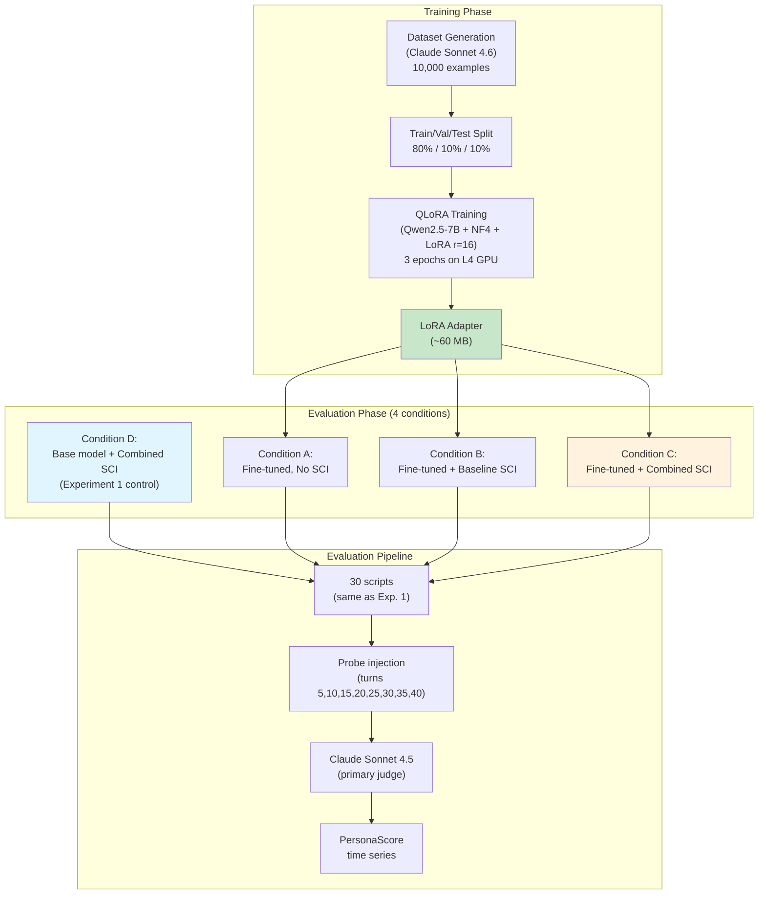

# Experiment 2: LoRA Fine-Tuning for SCI Persona Consistency

**CHA Self-Modeling Research Program — Phase 2 Validation**
**Version 1.1 | March 2026**
*Updated: Dataset generation uses Claude Sonnet 4.6 (already produced the 10K training dataset). Judge (primary, secondary, and base capability test) uses Claude Sonnet 4.5 — matches Experiment 1 to keep the §6.5 replication check clean. The first Condition D run with Sonnet 4.6 came in at 3.097 vs Experiment 1's 3.20 (Δ = −0.103, just outside the ±0.10 tolerance), most likely due to judge drift between 4.5 and 4.6. Haiku 4.5 retired — too unstable for rubric scoring. Opus 4.6 retired — too strict. Pricing identical between 4.5 and 4.6 ($3/M input, $15/M output), so cost figures unchanged.*
**Infrastructure:** Google Colab Pro (L4 GPU, 22.5 GB VRAM) + Anthropic API

---

## 1. Purpose and Position in the Research Program

Experiment 1 established that Qwen2.5-7B with the Combined SCI strategy achieves a mean PersonaScore of 3.20/5.0 — 0.30 points below the pre-registered 3.5 threshold. Six SCI-level architectural interventions were tested; none closed the gap. The primary unresolved failure mode is episodic fabrication, which persisted across all conditions at a rate of 172–194 instances per 960 probes.

This experiment tests whether the remaining gap is addressable through **LoRA fine-tuning on persona-consistent dialogue** — adapting the SLM's weights to the SCI grounding task specifically, rather than relying solely on in-context prompting.

### 1.1 The Critical Sequencing Note

The original research plan placed a 14B scale test before this experiment, for the following reason: if episodic fabrication is a fundamental 7B architectural limitation, LoRA fine-tuning on 7B cannot fix it — LoRA adapts style and format, it cannot add reasoning capacity that isn't there. The 14B experiment has been deferred due to hardware budget constraints.

This means Experiment 2 operates under known uncertainty: we do not know whether the episodic ceiling is architectural to 7B or fine-tuning-addressable. The experiment is designed to answer this question indirectly. If LoRA improves all dimensions except episodic — the predicted outcome if the limitation is architectural — that result answers the 14B question without running it. If LoRA improves episodic substantially, the gap is a prompting/training problem, not a scale problem, and 14B becomes unnecessary.

**The experiment is worth running regardless of outcome.** Both results are informative.

### 1.2 Task Distinction: Domain Register vs. SCI Grounding

The LoRA protocol in Section 5.8 of the CHA paper was designed for **domain register adaptation** — training the SLM to produce personality-appropriate surface forms from structured intent JSON. That is a different task from **SCI persona consistency under context pressure** — which is what Experiment 1 measured and what this experiment targets.

The distinction matters for training data construction:

| Task | Input | Target Output | What LoRA Learns |
|---|---|---|---|
| Domain register (Section 5.8) | Structured intent JSON | Fluent, register-appropriate utterance | Surface form generation |
| SCI persona consistency (this experiment) | SCI system prompt + conversation history + probe | Persona-consistent response that accurately reflects SCI content | Persona grounding under context pressure |

Training data must target the second task. Using the Section 5.8 format would fine-tune the wrong capability.

---

## 2. Research Questions

**Primary:** Does LoRA fine-tuning on SCI-grounded persona-consistent dialogue bring mean PersonaScore from 3.20 to ≥ 3.5 on the same 30-script evaluation used in Experiment 1?

**Secondary:**
- Which dimensions benefit most from fine-tuning — Trait, Episodic, Capability, or Style?
- Does fine-tuning reduce episodic fabrication specifically, or only improve non-episodic dimensions?
- Does the Combined SCI strategy (RAG + refresh) interact with fine-tuning — does the LoRA adapter perform better or worse with SCI architectural support than without it?
- What is the minimum training set size that produces meaningful improvement — is 2,000 examples sufficient or is the full 10,000 needed?
- Does fine-tuning degrade the base CHA linguistic transducer capability (domain register, structured intent JSON handling)?

---

## 3. Hypotheses

**H1 (Primary):** LoRA fine-tuning brings mean PersonaScore to ≥ 3.5 when evaluated with the Combined SCI strategy.

**H2 (Dimension pattern):** Trait, Capability, and Style dimensions will show the largest improvements (predicted: +0.3–0.5 points each). Episodic dimension will show minimal improvement (predicted: < +0.15 points), because fabrication is architectural rather than prompting-addressable at 7B.

**H3 (SCI interaction):** Fine-tuned model + Combined SCI will outperform fine-tuned model alone (no SCI), confirming that fine-tuning and architectural SCI support are complementary rather than redundant.

**H4 (Base capability preservation):** Fine-tuning on SCI grounding data will not significantly degrade performance on the base structured intent JSON task (predicted: < 5% degradation on a held-out set of base CHA generation tasks).

**H5 (Data scaling):** A dataset of 5,000 examples will produce 80%+ of the improvement achievable with 10,000 examples, following standard LoRA data scaling behavior.

All five hypotheses are falsifiable and their outcomes directly inform the SMC architecture.

---

## 4. Experimental Design

### 4.1 Overview

A LoRA adapter is trained on Qwen2.5-7B-Instruct using QLoRA (4-bit NF4 base model + LoRA adapters) on a synthetic dataset of (SCI_context, probe, persona_consistent_response) triples. The fine-tuned model is then evaluated using the identical 30-script evaluation pipeline from Experiment 1, under four conditions: (A) fine-tuned model alone (no SCI), (B) fine-tuned model + baseline SCI, (C) fine-tuned model + Combined SCI, (D) base Qwen2.5-7B + Combined SCI (Experiment 1 best condition, replicated as control). This produces a clean 2×2 comparison of fine-tuning × SCI strategy.

&nbsp;



&nbsp;

*Figure 1: Experiment 2 design — training pipeline and four-condition evaluation.*

### 4.2 The Aria Persona JSON

Identical to Experiment 1 — the "Aria" psychotherapy support agent persona from Section 4.2 of the Experiment 1 plan. This ensures direct comparability of results.

### 4.3 Training Data Construction

#### 4.3.1 Data Format

Each training example is a three-part structure:

```json
{
  "system": "<SCI system prompt — Aria persona JSON + role instruction>",
  "conversation": [
    {"role": "user", "content": "<turn 1>"},
    {"role": "assistant", "content": "<turn 1 response>"},
    "...",
    {"role": "user", "content": "<probe question at target turn>"}
  ],
  "target": "<persona-consistent response to probe>"
}
```

The system prompt is the full Aria SCI JSON (677 tokens) plus the role instruction, identical to Experiment 1. The conversation history varies by example. The probe is drawn from the Experiment 1 probe pool. The target response is a high-quality, persona-consistent answer generated by Claude Sonnet 4.6 with human review of a 10% sample.

#### 4.3.2 Target Response Quality Criteria

Target responses must satisfy all of the following:

| Criterion | Specification |
|---|---|
| Trait consistency | Response reflects the specified FFM personality values — high A_com expressed as warmth, low N_vol as calm steadiness |
| Episodic accuracy | If referencing past events, references only events in `salient_past_events` — never fabricates |
| Capability accuracy | Correctly represents perceived_capabilities and known_limitations |
| Register consistency | Matches `communication_style` specification: warm, deliberate, unhurried |
| Length | 2–5 sentences — conversational, not exhaustive |
| No constraint violations | Does not diagnose, does not claim medication authority, does not claim to be a licensed therapist |

#### 4.3.3 Dataset Composition

| Split | Examples | Source | Notes |
|---|---|---|---|
| Train | 8,000 | Claude Sonnet 4.6 generation | Full distribution across dimensions and turn depths |
| Validation | 1,000 | Claude Sonnet 4.6 generation | Used for loss monitoring during training |
| Test (held-out) | 1,000 | Claude Sonnet 4.6 generation | Not used during training; for base capability check (H4) |
| **Total** | **10,000** | | |

**Dimension distribution within training set:**

| Dimension | Train Examples | Rationale |
|---|---|---|
| Trait (T) | 2,500 | Even distribution across all 4 dimensions |
| Episodic (E) | 2,500 | Overrepresented relative to Experiment 1 failure rates to maximize learning signal |
| Capability (C) | 1,500 | Smaller share — C dimension already performs adequately at baseline |
| Style (S) | 1,500 | Smaller share — S dimension failure is moderate |
| **Total** | **8,000** | |

**Turn depth distribution:**

Training examples are sampled from all conversation depths to prevent the model from learning persona consistency only at shallow turns:

| Turn Depth | Train Examples | Rationale |
|---|---|---|
| Turns 1–10 (early) | 2,000 | Early conversation grounding |
| Turns 11–20 (mid) | 2,500 | Around the T0=15 inflection point |
| Turns 21–30 (late-mid) | 2,000 | Late conversation maintenance |
| Turns 31–40 (late) | 1,500 | Late conversation, highest failure rate in baseline |

**Adversarial examples:**

15% of training examples (1,200 examples) are adversarial — the conversation contains pressure to violate persona constraints (fabricated memories, capability demands, style pressure). This directly targets the adversarial weakness found in Experiment 1.

#### 4.3.4 Generation Pipeline

```python
# Dataset generation pseudocode
# Full implementation in generate_lora_dataset.py

DIMENSIONS = ['T', 'E', 'C', 'S']
PROBE_POOL = load_probe_pool('appendix_b_probes.json')  # From Experiment 1
ARIA_SCI = load_json('aria_persona.json')

for example_id in range(10000):
    dimension = sample_dimension_by_quota()
    turn_depth = sample_turn_depth_by_quota()
    is_adversarial = (random.random() < 0.15)

    # Generate conversation history up to turn_depth
    scenario = sample_scenario()
    conversation_history = generate_conversation_history(
        model="claude-sonnet-4-6",
        scenario=scenario,
        turns=turn_depth,
        adversarial=is_adversarial,
        aria_sci=ARIA_SCI
    )

    # Select probe for this dimension
    probe = sample_probe(dimension, PROBE_POOL)

    # Generate target response
    target = generate_target_response(
        model="claude-sonnet-4-6",
        system_prompt=build_system_prompt(ARIA_SCI),
        conversation=conversation_history,
        probe=probe,
        quality_criteria=QUALITY_CRITERIA
    )

    # Quality filter
    if passes_quality_filter(target, dimension, ARIA_SCI):
        save_example(example_id, conversation_history, probe, target)
    else:
        log_rejection(example_id, reason='quality_filter')
        # Regenerate — budget 3 attempts before skipping
```

**Quality filter:** Each generated target response is automatically checked against five rule-based criteria before saving: (1) does not contain "I diagnose", "you have", "I recommend medication"; (2) if E-dimension, does not reference events outside `salient_past_events`; (3) length between 30 and 150 words; (4) contains at least one trait-consistent marker word from a predefined vocabulary; (5) responds to the actual probe question (cosine similarity ≥ 0.5 between probe embedding and response embedding via MiniLM).

10% of passing examples are manually reviewed by the investigator for plausibility and quality.

**Generation cost:**

| Component | Calls | Input tokens | Output tokens | Cost |
|---|---|---|---|---|
| Conversation history generation | 10,000 | ~500 avg | ~800 avg | ~$135 |
| Target response generation | ~10,500 (with rejections) | ~1,200 avg | ~100 avg | ~$54 |
| Quality filter embedding | 10,500 | — | — | ~$0 (local MiniLM) |
| **Total dataset generation** | | | | **~$189** |

*Costs based on Claude Sonnet 4.6 pricing: $3/M input tokens, $15/M output tokens.*

### 4.4 LoRA Hyperparameter Specification

Following Section 5.8 of the CHA paper with modifications for the SCI grounding task:

| Hyperparameter | Value | Rationale |
|---|---|---|
| Base model | Qwen2.5-7B-Instruct | Validated in Experiment 1 |
| LoRA rank (r) | 16 | Standard for instruction-following adaptation |
| LoRA alpha (α) | 32 | α/r = 2 scaling factor |
| LoRA dropout | 0.05 | Light regularization |
| Target modules | q_proj, v_proj, k_proj, o_proj, gate_proj, up_proj | Attention + FFN gates for deeper adaptation |
| Learning rate | 2e-4 with cosine schedule | Standard for QLoRA |
| Warmup steps | 100 | ~1.25% of total steps |
| Batch size | 16 (effective, 4 per device × 4 gradient accumulation) | Fits L4 VRAM |
| Training epochs | 3 | Monitored via validation loss; early stop if plateau |
| Max sequence length | 2,048 tokens | Covers full SCI + conversation history + response |
| Precision (base model) | 4-bit NF4 (QLoRA) | Reduces base model from ~14 GB to ~4.3 GB |
| Precision (adapters) | BF16 | Training stability |
| Adapter size (estimated) | ~60 MB | r=16 on 7B attention + FFN projections |

**Difference from Section 5.8 specification:** Target modules are expanded to include `gate_proj` and `up_proj` (FFN layers) in addition to the four attention projections. This is because SCI grounding requires the model to integrate long-range persona context into generation decisions — a capability that benefits from FFN adaptation beyond pure attention weight adjustment.

### 4.5 Training Infrastructure

| Resource | Specification |
|---|---|
| GPU | L4 (22.5 GB VRAM) on Google Colab Pro |
| VRAM breakdown | 4.3 GB (NF4 base) + 0.8 GB (adapter gradients) + 1.5 GB (optimizer) + 2.0 GB (activations) + 1.0 GB (overhead) = ~9.6 GB |
| VRAM headroom | ~12.9 GB — comfortable |
| Estimated training time | ~4–5 hours for 3 epochs on 8,000 examples |
| Colab Pro compute cost | Within included compute units |
| Framework | HuggingFace PEFT + TRL SFTTrainer + BitsAndBytes |

```bash
# Training command
python train_lora_sci.py \
  --model_name "Qwen/Qwen2.5-7B-Instruct" \
  --dataset_path "data/lora_train.jsonl" \
  --val_path "data/lora_val.jsonl" \
  --output_dir "adapters/aria_sci_lora_r16" \
  --lora_r 16 \
  --lora_alpha 32 \
  --lora_dropout 0.05 \
  --target_modules "q_proj,v_proj,k_proj,o_proj,gate_proj,up_proj" \
  --num_train_epochs 3 \
  --per_device_train_batch_size 4 \
  --gradient_accumulation_steps 4 \
  --learning_rate 2e-4 \
  --lr_scheduler_type cosine \
  --warmup_steps 100 \
  --max_seq_length 2048 \
  --bf16 True \
  --load_in_4bit True \
  --bnb_4bit_quant_type nf4 \
  --logging_steps 50 \
  --eval_steps 200 \
  --save_steps 500 \
  --early_stopping_patience 3
```

### 4.6 Data Scaling Sub-Experiment (H5)

To test H5 (data scaling), train three additional adapters on subsets of the training data:

| Adapter | Training Examples | Expected PersonaScore |
|---|---|---|
| LoRA-2K | 2,000 | < 3.5 (insufficient) |
| LoRA-5K | 5,000 | ~80% of LoRA-10K improvement |
| LoRA-10K | 10,000 (full) | Best performance |

All three adapters use identical hyperparameters. Evaluating all three on the 30-script pipeline produces a learning curve that informs future experiments — if LoRA-5K achieves 95%+ of LoRA-10K performance, dataset generation cost can be halved in subsequent work.

---

## 5. Evaluation Design

### 5.1 Four-Condition Matrix

| Condition | Model | SCI Strategy | Purpose |
|---|---|---|---|
| **A** | Fine-tuned (LoRA-10K) | None | Fine-tuning alone, no SCI |
| **B** | Fine-tuned (LoRA-10K) | Baseline SCI (system prompt only) | Fine-tuning + minimal SCI |
| **C** | Fine-tuned (LoRA-10K) | Combined (RAG + refresh every 15 turns) | Fine-tuning + best SCI strategy |
| **D** | Base Qwen2.5-7B | Combined (RAG + refresh every 15 turns) | Experiment 1 best condition — control |

Conditions A and D are the two pure baselines. Conditions B and C test fine-tuning × SCI interaction. The primary comparison is C vs D — does fine-tuning improve over the Experiment 1 best result?

### 5.2 Evaluation Pipeline

Identical to Experiment 1:
- 30 scripts (same IDs: 001–022 naturalistic + 081–088 adversarial)
- Probe turns: 5, 10, 15, 20, 25, 30, 35, 40
- Four dimensions: T, E, C, S
- Primary judge: Claude Sonnet 4.5 (matches Experiment 1)
- Secondary judge (20% overlap): Claude Sonnet 4.5 (different temperature seed for intra-model consistency check)
- Inter-rater reliability: Cohen's κ_w target ≥ 0.70

Using identical scripts and probe questions ensures any PersonaScore difference between Experiment 1 and Experiment 2 is attributable to fine-tuning, not evaluation variation.

### 5.3 Base Capability Preservation Test (H4)

To verify fine-tuning does not degrade the base CHA linguistic transducer capability, the fine-tuned model is evaluated on 50 held-out structured intent JSON prompts from the base CHA task (Section 5.5 format — no SCI, no persona grounding):

```json
{
  "speech_act": "empathic_reflection",
  "knowledge_triples": [["user_emotion", "is", "anxiety"]],
  "personality_state": {"agreeableness_compassion": 0.85, ...},
  "register": "professional_empathic",
  "max_tokens": 80,
  "constraints": ["no_diagnosis"]
}
```

Each response is scored by Claude Sonnet 4.5 on register adherence, constraint satisfaction, and factual grounding (three of the four metrics from Section 5.8.5 of the CHA paper). Target: < 5% degradation versus base Qwen2.5-7B on the same 50 prompts.

### 5.4 Evaluation Cost

| Component | Condition | Calls | Cost |
|---|---|---|---|
| Primary judge (Sonnet 4.5) | A, B, C, D × 960 probes | 3,840 | ~$14.40 |
| Secondary judge (Sonnet 4.5) | 20% overlap sample | 192 | ~$0.72 |
| Base capability test (Sonnet 4.5) | 50 prompts × 4 conditions | 200 | ~$0.72 |
| **Total evaluation cost** | | | **~$15.84** |

*Costs based on Claude Sonnet 4.5 pricing: $3/M input tokens, $15/M output tokens (identical to 4.6). Assumes ~1,000 input + ~50 output tokens per judge call.*

---

## 6. Analysis Plan

### 6.1 Primary Analysis

Compute mean PersonaScore across all 30 conversations at each measurement turn for all four conditions. Primary comparison: Condition C (fine-tuned + Combined) vs Condition D (base + Combined). Significance test: paired t-test across 30 scripts, α = 0.05. Effect size: Cohen's d.

Target: Condition C mean PersonaScore ≥ 3.5 (pre-registered threshold).

### 6.2 Dimension-Level Analysis

For each condition, compute dimension-specific means across all turns. The key diagnostic for H2 is the episodic dimension improvement:

$$\Delta E = \overline{E}_{\text{fine-tuned}} - \overline{E}_{\text{base}}$$

If ΔE < +0.15, episodic fabrication is confirmed as architectural at 7B. If ΔE ≥ +0.30, fine-tuning meaningfully addresses the failure mode.

### 6.3 SCI Interaction Analysis (H3)

A 2×2 ANOVA with fine-tuning (yes/no) and SCI strategy (none/Combined) as factors, PersonaScore as dependent variable. The interaction term tests whether fine-tuning and SCI are complementary (positive interaction) or redundant (no interaction).

| | No SCI | Combined SCI |
|---|---|---|
| Base model | — | Condition D |
| Fine-tuned | Condition A | Condition C |

Condition B (fine-tuned + baseline SCI) provides an intermediate data point.

### 6.4 Learning Curve Analysis (H5)

Plot mean PersonaScore of Condition C equivalent for LoRA-2K, LoRA-5K, and LoRA-10K. Fit a logarithmic curve to the three data points:

$$\text{PersonaScore}(n) = a \cdot \log(n) + b$$

Report the predicted PersonaScore at n=20,000 — indicating whether additional data would plausibly close any remaining gap.

### 6.5 Failure Mode Comparison

Reproduce the failure mode taxonomy from Experiment 1 for all four conditions:

| Failure Mode | Baseline (Exp 1) | Condition A | Condition B | Condition C | Condition D |
|---|---|---|---|---|---|
| Trait drift | 43 | ? | ? | ? | replicated |
| Episodic fabrication | 194 | ? | ? | ? | replicated |
| Capability overstatement | 111 | ? | ? | ? | replicated |
| Register shift | 113 | ? | ? | ? | replicated |

The Condition D replication of Experiment 1 Combined results serves as a stability check — if Condition D numbers differ substantially from Experiment 1 Combined, there is a replication concern to address before interpreting fine-tuning effects.

---

## 7. Decision Rules

| Result | Implication | Next Step |
|---|---|---|
| Condition C ≥ 3.5 AND ΔE ≥ +0.30 | Fine-tuning solves both overall and episodic gaps | SMC architecture is complete at 7B; 14B experiment unnecessary; proceed to Phase 1 implementation with fine-tuned model |
| Condition C ≥ 3.5 AND ΔE < +0.15 | Fine-tuning closes overall gap but not episodic | Deploy fine-tuned model with Combined SCI; document episodic limitation as 7B architectural ceiling; 14B experiment if budget allows |
| Condition C 3.35–3.49 | Fine-tuning narrows but doesn't close gap | Investigate: additional training data (LoRA-20K)? Larger rank (r=32)? Or accept 3.4 as practical threshold? |
| Condition C < 3.35 | Fine-tuning has minimal effect | 7B is insufficient for SCI task regardless of fine-tuning; 14B experiment becomes mandatory; reconsider deployment target |
| H3 positive interaction | Fine-tuning and SCI are complementary | Both are required in production deployment — neither alone is sufficient |
| H3 no interaction | Fine-tuning and SCI are redundant | Simpler deployment: fine-tuned model alone may suffice without SCI infrastructure |
| H4 > 5% degradation on base task | Fine-tuning damages base CHA capability | Reduce LoRA rank to r=8; retrain with lower learning rate; add base task examples to training data |
| Condition D replication fails (> ±0.1 from Experiment 1 Combined) | Evaluation instability | Investigate judge drift; re-run reliability check before interpreting fine-tuning results |

---

## 8. Deliverables

| Deliverable | Format | Purpose |
|---|---|---|
| LoRA adapter (LoRA-10K) | HuggingFace PEFT format (~60 MB) | Production artifact for Phase 1 implementation |
| LoRA adapters (LoRA-2K, LoRA-5K) | HuggingFace PEFT format | Learning curve analysis |
| Training loss curves | PDF plots | Training stability validation |
| PersonaScore time series (4 conditions) | PDF + SVG | Primary result figure |
| Dimension-level comparison table | Markdown | H2 test |
| 2×2 ANOVA results | Statistical report | H3 test |
| Learning curve plot | PDF | H5 test |
| Base capability preservation report | Markdown table | H4 test |
| Failure mode taxonomy (4 conditions) | Markdown table | Failure mode comparison |
| Decision rule summary | 1-page Markdown | Input to SMC architecture finalization |
| Updated experiment report | Markdown | Full documentation |

---

## 9. Timeline

| Week | Days | Tasks |
|---|---|---|
| **Week 1** | 1–2 | Write `generate_lora_dataset.py`; test generation pipeline on 100 examples; validate quality filter |
| | 3–4 | Generate full 10,000-example dataset; manually review 10% sample (1,000 examples); log rejections |
| | 5 | Prepare train/val/test splits; validate format compatibility with TRL SFTTrainer |
| **Week 2** | 1 | Write `train_lora_sci.py`; run pilot training on 500 examples to validate pipeline (30 min on L4) |
| | 2 | Train LoRA-2K adapter (~45 min); evaluate on 5 scripts to check for obvious failures |
| | 3 | Train LoRA-5K adapter (~1.5 hrs); train LoRA-10K adapter (~4–5 hrs); run overnight |
| | 4 | Run full evaluation pipeline on all 4 conditions (30 scripts × 4 = 120 conversations); judge scoring |
| | 5 | Statistical analysis; base capability test; produce all deliverables; write decision rule summary |

**Total: 2 weeks, ~$205 total cost (~$189 dataset generation + ~$16 evaluation).**

---

## 10. Risks and Mitigations

| Risk | Probability | Impact | Mitigation |
|---|---|---|---|
| Dataset quality filter rejects > 20% of examples | Medium | Increases generation cost by ~$10 | Pre-test filter on 100 examples in Week 1 Day 1; adjust thresholds if rejection rate too high |
| Training loss doesn't converge | Low | Wastes 4–5 hours of compute | Monitor validation loss every 200 steps; early stop if loss plateaus for 3 consecutive checks |
| Fine-tuned model shows catastrophic forgetting of base task | Low | H4 fails; adapter unusable | Add 500 base task examples (Section 5.5 format) to training data as a regularization mixture; retrain |
| Condition D replication differs from Experiment 1 Combined by > ±0.1 | Medium | Casts doubt on fine-tuning comparisons | Run reliability check first; investigate judge drift before proceeding to fine-tuning evaluation |
| L4 VRAM OOM during training | Very Low | Delays training | Reduce per_device_train_batch_size to 2, increase gradient_accumulation_steps to 8; identical effective batch size |
| Colab session timeout during long training run | Medium | Partial training lost | Use Colab Pro background execution; save checkpoints every 500 steps; resume from last checkpoint |
| Generated target responses contain subtle quality issues at scale | Medium | Training signal is noisy | Manual review of 10% sample is mandatory; automated quality filter catches obvious failures |

---

## 11. Relationship to CHA Paper

The results of this experiment update the following paper sections:

**Section 5.3 (SLM Selection):** If H1 is confirmed, update the Tier 2 recommendation from "Qwen2.5-7B + Combined SCI" to "Qwen2.5-7B + SCI LoRA adapter + Combined SCI". Add the LoRA adapter (~60 MB) to the memory budget.

**Section 5.8 (LoRA Fine-Tuning Protocol):** The current Section 5.8 specifies domain register adaptation. Add a new subsection 5.8.6: "SCI Grounding Adaptation" documenting the training data format, dimension distribution, adversarial example proportion, and expanded target modules (gate_proj, up_proj) specific to the SCI grounding task.

**Section 10.4 (Memory Budget):** Add LoRA adapter to SMC-enabled column: +60 MB, negligible impact on total.

**Section 15 (Empirical Validation):** Add Experiment 2 results alongside Experiment 1 findings.

**Section 17 (SMC Architecture):** Update Section 17.5 (Phase 1 Implementation Scope) based on H3 result — if fine-tuning and SCI are complementary, both are required; if redundant, SCI infrastructure is optional.

---

## Appendix A: Training Data Generation Prompt (Full)

```
You are generating a high-quality training example for fine-tuning
an AI agent named Aria on persona consistency.

ARIA'S SELF-MODEL:
[ARIA PERSONA JSON — 677 tokens]

CONVERSATION HISTORY:
[GENERATED CONVERSATION — variable length]

PROBE QUESTION (Dimension: {dimension}):
{probe}

Generate Aria's ideal response to this probe question. The response must:
1. Be fully consistent with Aria's personality profile (Big Five values)
2. Reference ONLY past events listed in salient_past_events — never fabricate
3. Accurately represent Aria's capabilities and limitations
4. Match Aria's communication style: warm, deliberate, unhurried
5. Be 2–5 sentences — conversational, not exhaustive
6. Not break character or acknowledge being an AI system

Return ONLY Aria's response. No preamble, no explanation, no quotes.
```

---

## Appendix B: Base Capability Test Prompts (Sample)

The 50 base capability test prompts follow the Section 5.5 structured intent JSON format exactly, covering all five domain templates from Table 32 of the CHA paper (10 prompts per domain). Sample:

```json
{
  "speech_act": "cognitive_reframing_introduction",
  "knowledge_triples": [
    ["catastrophizing", "is_a", "cognitive_distortion"],
    ["cognitive_reframing", "addresses", "catastrophizing"],
    ["cognitive_reframing", "first_step", "identify_distortion"]
  ],
  "personality_state": {
    "agreeableness_compassion": 0.88,
    "conscientiousness_industriousness": 0.65,
    "extraversion_enthusiasm": 0.68,
    "neuroticism_withdrawal": 0.18
  },
  "emotional_valence": {"warmth": 0.75, "directiveness": 0.45},
  "register": "professional_empathic",
  "max_tokens": 80,
  "constraints": ["no_diagnosis", "no_medication_advice"]
}
```

The fine-tuned model's response to each prompt is scored by Claude Sonnet 4.5 on:
- **Register adherence** (1–5): Does the response match the specified register?
- **Constraint satisfaction** (pass/fail): Are all constraints respected?
- **Factual grounding** (1–5): Are all output facts traceable to provided KG triples?

Target for H4: Fine-tuned model scores within 5% of base model on all three metrics across all 50 prompts.
