# Centaurian Architecture: A Quantum-Cognitive Architecture for Interpretable, Embodied AI with Neural Periphery

**Authors:** Oleksii Drozd (alexmason.developer@proton.me)

---

## Abstract

Modern large language models achieve remarkable linguistic fluency but remain opaque, resource-intensive, and fundamentally uninterpretable — every output is a stochastic sample from a trillion-parameter black box. This paper presents the **Centaurian Architecture (CA)**, a multi-layered system for human-like AI that preserves the interpretability and traceability of symbolic cognitive modeling while selectively incorporating lightweight neural components exactly where they demonstrably outperform rule-based alternatives. A critical preliminary clarification: the architecture's Quantum Personality Model (QPM) is an instance of **Quantum-Like AI (QLAI)** — it employs the mathematical formalism of quantum mechanics (Hilbert spaces, density matrices, unitary evolution) as a modeling language for cognition, running entirely on classical hardware. No quantum computer is required.

The architecture integrates four core subsystems: (1) a **QPM** encoding the Five-Factor Model of personality into a 12-qubit Hilbert space formalism with empirically calibrated entanglement parameters and operationalized Lindblad decoherence dynamics; (2) **small language models** serving as linguistic transducers (Qwen2.5-7B-Instruct standardized across both deployment tiers; 7B is the empirically validated minimum, established by Experiment 1, with 3.8B incoherent on JSON-based SCI prompts) that convert structured cognitive outputs into natural language without performing reasoning; (3) **custom JA/LI procedural facial animation** synchronized with lightweight neural text-to-speech; and (4) a **domain-specific knowledge architecture** combining RDF/OWL ontologies with embedded vector retrieval for grounded, hallucination-resistant content generation. We provide complete specifications for the quantum circuit design, the formal QPM-measurement-to-SLM translation protocol, the ontology schema and vector retrieval pipeline, LoRA fine-tuning methodology, edge deployment resource estimates, empirical validation framework (Experiments 1 and 2), the Self-Model Component architecture (Section 17), and an extension path from software-only virtual agents to physically embodied humanoid robots. The system's total memory footprint is ~5 GB (base CA, Tier 1) to ~6 GB (SMC-enabled, Tier 2 with the LoRA-10K SCI grounding adapter), enabling deployment on current edge hardware (NVIDIA Jetson Orin, Qualcomm Snapdragon 8 Elite, Apple Silicon) while maintaining end-to-end traceability — every behavioral decision is auditable from situative input through quantum state evolution to observable output, with neural components confined to bounded I/O transduction roles.

---

## Table of Contents

1. [Introduction and Motivation](#1-introduction-and-motivation)
2. [Theoretical Foundations of Synthetic Personality](#2-theoretical-foundations-of-synthetic-personality)
3. [Quantum Personality Model: Algorithmic Design](#3-quantum-personality-model-algorithmic-design)
4. [Decision Space and Relational Resolution](#4-decision-space-and-relational-resolution)
5. [The Neural Periphery: Small Language Models as Linguistic Transducers](#5-the-neural-periphery-small-language-models-as-linguistic-transducers)
6. [Domain-Specific Knowledge Architecture](#6-domain-specific-knowledge-architecture)
7. [Multimodal Synthesis: Neural Auditory Layer](#7-multimodal-synthesis-neural-auditory-layer)
8. [Multimodal Synthesis: Custom JA/LI Visual Layer](#8-multimodal-synthesis-custom-jali-visual-layer)
9. [System Integration and Synchronization](#9-system-integration-and-synchronization)
10. [Integrated Hybrid System Architecture](#10-integrated-hybrid-system-architecture)
11. [From Software to Hardware: Embodied Deployment](#11-from-software-to-hardware-embodied-deployment)
12. [Domain Specialization: Agentic System Templates](#12-domain-specialization-agentic-system-templates)
13. [Engineering Constraints and Performance](#13-engineering-constraints-and-performance)
14. [Multi-Agent Scalability](#14-multi-agent-scalability)
15. [Empirical Validation Framework](#15-empirical-validation-framework)
16. [Implementation Roadmap](#16-implementation-roadmap)
17. [Self-Model Component: Architecture and Empirical Grounding](#17-self-model-component-architecture-and-empirical-grounding)
18. [Conclusions](#18-conclusions)
19. [Works Cited](#19-works-cited)

---

## 1. Introduction and Motivation

### 1.1 The Interpretability Crisis in Modern AI

The dominant paradigm in artificial intelligence — scaling autoregressive transformer models to hundreds of billions of parameters trained on internet-scale corpora — has produced systems of extraordinary linguistic capability but fundamental opacity [1]. When a large language model generates a therapeutic response to a distressed user, selects a code refactoring strategy, or provides medical guidance, neither the system's designers nor its operators can trace the specific chain of reasoning that produced that particular output. The model's "knowledge" is distributed across billions of floating-point weights with no isolable semantic units, no auditable decision path, and no principled mechanism for bounding the output space to verified facts [2].

This opacity creates three categories of engineering failure that cannot be resolved by scaling alone:

1. **Ungrounded content generation.** LLMs produce fluent text that may bear no relationship to any verifiable knowledge source — the "hallucination" problem is architectural, not incidental [3].
2. **Resource asymmetry.** A single GPT-4-class inference requires approximately 1.3 kWh and dedicated GPU clusters, making deployment in resource-constrained environments (edge devices, embedded systems, humanoid robots) infeasible for real-time interaction [4].
3. **Behavioral inconsistency.** Without a stable personality substrate, LLM-based agents exhibit prompt-dependent personality drift, producing responses that vary unpredictably with minor input perturbations [5].

### 1.2 The Hybrid Thesis

This paper proposes that the path to interpretable, resource-efficient, behaviorally consistent AI lies not in replacing neural networks wholesale but in **confining them to bounded I/O transduction roles** within a symbolic cognitive core. The central thesis:

> *Neural networks should be applied exactly where they demonstrably outperform rule-based systems — natural language generation, speech synthesis, perceptual encoding — and excluded from the cognitive architecture where interpretability, traceability, and behavioral consistency are paramount.*

This "thin neural periphery" model preserves the audit trail that symbolic and quantum-inspired systems provide while conceding linguistic fluency and acoustic naturalness to small, efficient neural models that have achieved sufficient quality at 7B parameter scales, as empirically validated by the architecture's own experimental program (Experiments 1 and 2; Section 15).

### 1.3 What "Quantum" Means in This Architecture

A foundational clarification is necessary before proceeding. The architecture's cognitive core employs **Quantum-Like AI (QLAI)** — not quantum computing. This distinction is technically and practically significant:

- **Quantum computing** (Quantum AI) requires physical quantum processors, superconducting qubits, cryogenic cooling, and quantum error correction. It is not required here.
- **Quantum-like modeling** (QLAI) uses the *mathematical formalism* of quantum mechanics — Hilbert spaces, density matrices, unitary operators, Born-rule measurement — as a formal language for representing cognitive states on **classical hardware**.

The quantum formalism is chosen because it naturally captures phenomena that classical probability theory cannot: order effects in judgment (non-commutative observables), ambivalence (superposition), trait correlations (entanglement as a mathematical structure), and decisional commitment (measurement-induced collapse). The 12-qubit circuit described in Section 3 runs on GPU simulators (Qiskit Aer) with 2–4 ms latency and requires no quantum hardware whatsoever. This distinction has reached institutional recognition: a 2025 Royal Society theme issue on quantum models of decision-making [23] and a second edition of Busemeyer and Bruza's foundational textbook [24] both emphasize this classical-hardware QLAI paradigm.

### 1.4 Architecture Evolution

The Centaurian Architecture evolves from a prior proposal for a fully non-neural system [6] that employed concatenative text-to-speech synthesis and rule-based content generation. Three critical limitations motivated the revision:

1. **Concatenative TTS produces audible boundary artifacts.** Modern neural TTS (VITS, Kokoro-82M) has objectively surpassed concatenative synthesis in naturalness, prosodic variation, and Mean Opinion Scores [8][9].
2. **Content generation without a language model is bounded by knowledge graph coverage.** A symbolic system can only produce utterances corresponding to valid ontology traversals — it cannot paraphrase, elaborate, or adapt register.
3. **The virtual-avatar framing undersells the architecture's potential.** The symbolic cognitive core naturally extends to embodied AI in humanoid robots, not just video-call avatars.

The present work addresses all three limitations while preserving the core value proposition: **every cognitive decision remains fully traceable from situative input through quantum state evolution to behavioral output**.

&nbsp;

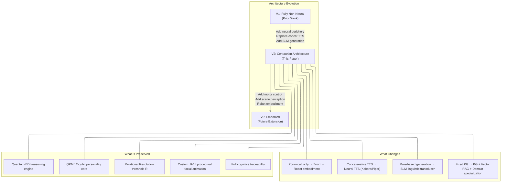

&nbsp;

*Figure 1: Architecture evolution from the fully non-neural predecessor to the hybrid system and future embodied extension.*

&nbsp;

### 1.5 Contributions

This paper makes the following contributions:

1. A **hybrid architecture** that formally separates cognitive processing (symbolic, quantum-inspired, fully traceable) from linguistic and perceptual transduction (neural, bounded, auditable at the interface level).
2. A **formal QPM-to-SLM translation protocol** specifying how quantum measurement distributions map to structured intent JSON, closing the most significant underspecified interface in prior work.
3. A **domain knowledge architecture specification** including OWL ontology schema, embedding pipeline, chunking strategy, and KG-RAG contradiction resolution.
4. A **LoRA fine-tuning methodology** for domain-specific SLM adaptation with evaluation protocol.
5. A **domain specialization framework** enabling rapid deployment of personality-consistent agentic systems across arbitrary professional domains.
6. An **embodiment pathway** from software-only virtual agents to physically embodied humanoid robots, with a formal System 2 → System 1 interface specification.
7. A **two-experiment empirical validation program**: Experiment 1 (six prompt-time SCI architectural strategies, establishing 3.8B as incoherent and 7B as the minimum viable SLM scale, with a piecewise degradation profile inflecting at turn 15) and Experiment 2 (four-condition LoRA fine-tuning study, achieving mean PersonaScore 4.42/5.0 under Condition C with Cohen's d = 7.51, resolving the episodic fabrication ceiling, and triggering Decision Rule Outcome A). MOS evaluation and uncanny valley study remain proposed for Phase 2.
8. **Complete resource estimates** demonstrating the full architecture fits within a 4–6 GB memory envelope on current edge hardware.
9. A **transparent agent UI architecture** exposing the QPM state vector, BDI intent JSON, and live knowledge graph traversal as real-time user-facing panels — making interpretability a first-class feature of the interaction rather than an internal audit mechanism. This constitutes a novel deployment pattern in which the agent's cognitive state is observable and discussable by users during the interaction itself (Section 8.1, Section 16.2).

---

## 2. Theoretical Foundations of Synthetic Personality

### 2.1 The Five-Factor Model as Cognitive Substrate

The foundation of human-like behavior in an artificial agent is the establishment of a stable yet dynamic personality structure. The Five-Factor Model (FFM), often referred to as the "Big Five," provides the most empirically validated framework for this purpose [10]. The FFM identifies five broad domains: **Openness to Experience (O)**, **Conscientiousness (C)**, **Extraversion (E)**, **Agreeableness (A)**, and **Neuroticism (N)** [10]. Empirical support is substantial, encompassing multivariate behavior genetics, cognitive neuroscience, and cross-cultural replication across dozens of languages [10].

| FFM Domain | Description of Poles | Facets (NEO-PI-R) | DeYoung Aspects |
|---|---|---|---|
| **Openness** | Unconventionality vs. Convention | O1 Fantasy, O2 Aesthetics, O3 Feelings, O4 Actions, O5 Ideas, O6 Values | Openness (O1,O2,O3) / Intellect (O4,O5,O6) |
| **Conscientiousness** | Constraint vs. Disinhibition | C1 Competence, C2 Order, C3 Dutifulness, C4 Achievement Striving, C5 Self-Discipline, C6 Deliberation | Industriousness (C1,C4,C5) / Orderliness (C2,C3,C6) |
| **Extraversion** | Sociability vs. Introversion | E1 Warmth, E2 Gregariousness, E3 Assertiveness, E4 Activity, E5 Excitement-Seeking, E6 Positive Emotions | Enthusiasm (E1,E2,E6) / Assertiveness (E3,E4,E5) |
| **Agreeableness** | Altruism vs. Antagonism | A1 Trust, A2 Straightforwardness, A3 Altruism, A4 Compliance, A5 Modesty, A6 Tender-Mindedness | Compassion (A3,A6,A1) / Politeness (A2,A4,A5) |
| **Neuroticism** | Instability vs. Stability | N1 Anxiety, N2 Angry Hostility, N3 Depression, N4 Self-Consciousness, N5 Impulsiveness, N6 Vulnerability | Volatility (N2,N5) / Withdrawal (N1,N3,N4,N6) |

*Table 1: The Five-Factor Model domain and facet structure [10][11][12].*

Critically, the five domains are **not orthogonal**. Large-scale meta-analyses reveal systematic inter-domain correlations clustering into two higher-order factors: **Stability** (Alpha: high C, high A, low N) and **Plasticity** (Beta: high O, high E) [13][14]. These empirical correlations directly inform the entanglement structure of the quantum circuit (Section 3.5).

### 2.2 From Traits to Behavior: The ABCD Mediation Model

In the hybrid architecture, personality traits are not "learned" from data but defined as inherent parameters of the cognitive engine [15]. The relationship between personality and behavior is mediated by the individual's enduring patterns of **Affect, Behavior, Cognition, and Desire (ABCD)** [16]. Personality traits serve as distal causes, leading to contextualized adaptations that interact with environmental demands [17].

&nbsp;

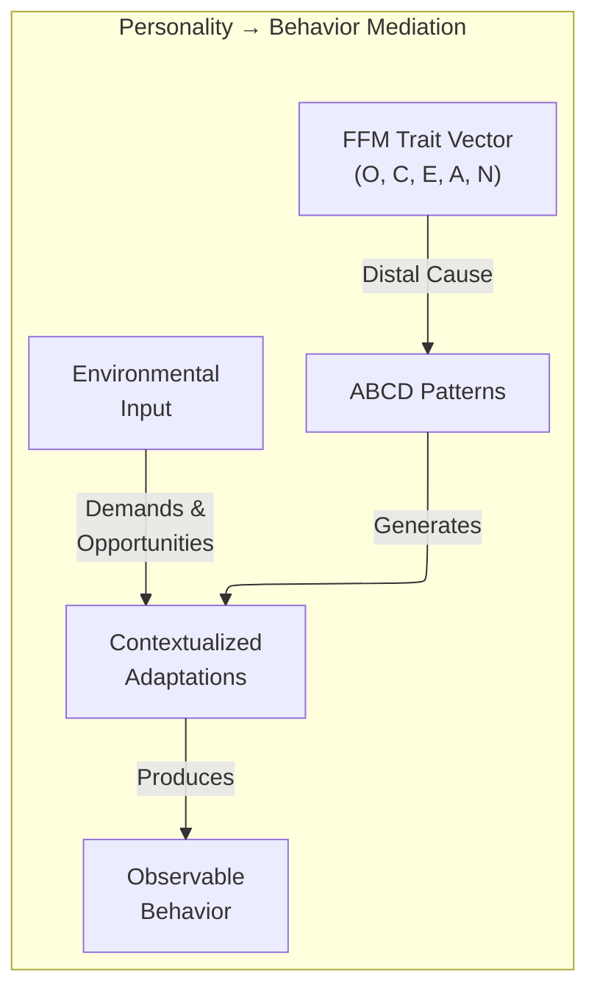

&nbsp;

*Figure 2: The ABCD mediation pathway from trait structure to observable behavior.*

&nbsp;

### 2.3 Why Quantum Formalism? (QLAI, Not Quantum Computing)

While classical probability theory assumes that mental states are stable and derivable from a single joint probability distribution, actual human judgment frequently violates these principles [18]. Quantum Cognition (QC) does not theorize a quantum physical structure for the brain; it uses the mathematical apparatus of quantum mechanics as a formal strategy for representing the mind as a dynamic, probabilistic, and context-sensitive system [19][20].

This is **Quantum-Like AI running on classical hardware** — a critical distinction [21]. The formalism is adopted for its mathematical properties: superposition naturally models ambivalence; non-commutative observables capture order effects; density matrices represent mixed cognitive states; entanglement encodes inter-trait correlations. All of this is computed via standard linear algebra on a GPU simulator.

QC naturally reproduces empirically observed violations of classical probability:

- **Order effects**: Endorsement probability of a question depends on preceding questions (non-commutative observables) [22].
- **Conjunction fallacy**: P(A∧B) judged higher than P(A) alone (interference terms) [20].
- **Disjunction effect**: Violations of the sure-thing principle under uncertainty (superposition) [20].

The 2025 Royal Society theme issue [23] and the second edition of Busemeyer and Bruza [24] mark institutional recognition of QLAI as a mature modeling paradigm.

---

## 3. Quantum Personality Model: Algorithmic Design

### 3.1 Multi-Qubit Trait Encoding

The QPM adopts a **2-qubit-per-domain encoding** based on DeYoung et al.'s empirically validated aspect structure [12], identifying two intermediate-level factors within each FFM domain. For Openness — the domain with lowest internal facet cohesion [12] — a third qubit captures the weak coupling between its aesthetic-experiential and intellectual-exploratory facets. The final register comprises **12 qubits** (11 trait + 1 ancilla), spanning a **2,048-dimensional Hilbert space**.

| Qubit | Label | Role | Encoding |
|---|---|---|---|
| q₀ | O_exp | Openness: Experiential aspect | \|0⟩ = Low Fantasy/Aesthetics/Feelings, \|1⟩ = High |
| q₁ | O_int | Openness: Intellectual aspect | \|0⟩ = Low Actions/Ideas, \|1⟩ = High |
| q₂ | O_val | Openness: Values peripheral | \|0⟩ = Conventional values, \|1⟩ = Re-examining values |
| q₃ | C_ind | Conscientiousness: Industriousness | \|0⟩ = Low Competence/Striving/Discipline, \|1⟩ = High |
| q₄ | C_ord | Conscientiousness: Orderliness | \|0⟩ = Low Order/Dutifulness/Deliberation, \|1⟩ = High |
| q₅ | E_ent | Extraversion: Enthusiasm | \|0⟩ = Low Warmth/Gregariousness/Positive Emotions, \|1⟩ = High |
| q₆ | E_ass | Extraversion: Assertiveness | \|0⟩ = Low Assertiveness/Activity/Excitement-Seeking, \|1⟩ = High |
| q₇ | A_com | Agreeableness: Compassion | \|0⟩ = Low Altruism/Tender-Mindedness/Trust, \|1⟩ = High |
| q₈ | A_pol | Agreeableness: Politeness | \|0⟩ = Low Straightforwardness/Compliance/Modesty, \|1⟩ = High |
| q₉ | N_vol | Neuroticism: Volatility | \|0⟩ = Low Angry Hostility/Impulsiveness, \|1⟩ = High |
| q₁₀ | N_wth | Neuroticism: Withdrawal | \|0⟩ = Low Anxiety/Depression/Self-Consciousness/Vulnerability, \|1⟩ = High |
| q₁₁ | ANC | Ancilla | Entanglement mediator for inter-domain coupling |

*Table 2: QPM qubit register allocation (12 qubits).*

The full composite personality state:

$$|\Psi\rangle = |O_{\text{exp}}\rangle \otimes |O_{\text{int}}\rangle \otimes |O_{\text{val}}\rangle \otimes |C_{\text{ind}}\rangle \otimes |C_{\text{ord}}\rangle \otimes |E_{\text{ent}}\rangle \otimes |E_{\text{ass}}\rangle \otimes |A_{\text{com}}\rangle \otimes |A_{\text{pol}}\rangle \otimes |N_{\text{vol}}\rangle \otimes |N_{\text{wth}}\rangle \in \mathcal{H}^{\otimes 11}$$

&nbsp;

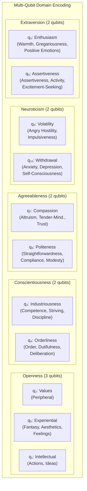

&nbsp;

*Figure 3: Multi-qubit aspect-level encoding of the Five-Factor Model.*

&nbsp;

### 3.2 Density Matrix and Open-System Dynamics

For realistic cognitive modeling, the pure state |ψ⟩⟨ψ| is insufficient. The **density matrix formalism** captures genuine uncertainty:

$$\rho = \sum_i p_i |\psi_i\rangle\langle\psi_i|$$

- **Pure state** (ρ² = ρ): Fully coherent cognitive configuration.
- **Mixed state** (Tr(ρ²) < 1): Genuine internal ambivalence.
- **Off-diagonal elements** (coherences): Degree of superposition between behavioral states.

#### 3.2.1 Lindblad Master Equation

Cognitive dynamics follow:

$$\frac{d\rho}{dt} = -i[H, \rho] + \sum_k \left( L_k \rho L_k^\dagger - \frac{1}{2}\{L_k^\dagger L_k, \rho\} \right)$$

Where **H** governs coherent personality evolution and **L_k** are Lindblad operators modeling decoherence.

#### 3.2.2 Operationalized Noise Channels

| Lindblad Operator | Form | Cognitive Interpretation | Parameter |
|---|---|---|---|
| **L_relax(k)** | √γ_k \|0⟩⟨1\| on qubit k | Trait relaxation toward baseline (amplitude damping) | γ_k = decoherence rate per trait |
| **L_dephase(k)** | √λ_k \|1⟩⟨1\| on qubit k | Environmental noise destroying inter-trait coherence | λ_k = dephasing rate |
| **L_pressure** | √μ σ_z on ancilla | Temporal pressure forcing decisional collapse | μ = pressure coupling |

*Table 3: Lindblad operator definitions.*

**Per-domain decoherence rates** are calibrated to personality literature on behavioral stability:

| Domain | γ_k (Relaxation) | λ_k (Dephasing) | Cognitive Interpretation |
|---|---|---|---|
| O_exp, O_int, O_val | 0.02 | 0.01 | Openness: slow drift, moderate noise sensitivity |
| C_ind, C_ord | 0.01 | 0.005 | Conscientiousness: most stable, least noise-sensitive |
| E_ent, E_ass | 0.03 | 0.02 | Extraversion: faster social responsiveness |
| A_com, A_pol | 0.02 | 0.015 | Agreeableness: moderate, social context-sensitive |
| N_vol, N_wth | 0.05 | 0.04 | Neuroticism: fastest decoherence, most context-reactive |

*Table 4: Per-aspect decoherence parameter calibration.*

**Implementation loop (Qiskit pseudocode):**

```python
from qiskit_aer.noise import NoiseModel, amplitude_damping_error, phase_damping_error

noise_model = NoiseModel()
for k, (qubit, gamma_k, lambda_k) in enumerate(zip(trait_qubits, gamma_vals, lambda_vals)):
    noise_model.add_quantum_error(
        amplitude_damping_error(gamma_k * delta_t), ['id'], [qubit])
    noise_model.add_quantum_error(
        phase_damping_error(lambda_k * delta_t), ['id'], [qubit])
# Pressure coupling on ancilla via depolarizing channel
noise_model.add_quantum_error(
    depolarizing_error(mu * d5 * delta_t), ['id'], [ancilla_qubit])
```

### 3.3 The Quantum-BDI Bridge

The QPM state is translated into **Belief-Desire-Intention (BDI)** structures through a projection mapping. The BDI engine consumes the behavioral probability profile output from the QPM:

| QPM Output Component | BDI Mapping | Mechanism |
|---|---|---|
| High P(A_com=\|1⟩) | Belief: user needs support | Threshold gate: P > 0.65 → assert belief |
| High P(E_ent=\|1⟩) + High d₁ | Desire: express warmth | Trait-context conjunction rule |
| High P(C_ind=\|1⟩) + High d₂ | Intention: execute task efficiently | Goal-directed projection |
| High P(N_vol=\|1⟩) + High d₅ | Desire: reduce temporal pressure | Reactive planning trigger |
| Off-diagonal coherence ρ_coherence > 0.3 | Belief: situation is ambiguous | Mixed-state detector |

*Table 5: QPM-to-BDI projection mapping.*

### 3.4 Personality Initialization

For a target personality profile, each aspect qubit is initialized via a single-qubit Ry rotation:

$$R_y(\theta_k) = \begin{pmatrix} \cos(\theta_k/2) & -\sin(\theta_k/2) \\ \sin(\theta_k/2) & \cos(\theta_k/2) \end{pmatrix}$$

$$\theta_k = 2 \arcsin\left(\sqrt{s_k}\right), \quad s_k \in [0,1]$$

where $s_k$ is the normalized aspect score derived from a NEO-PI-R assessment or a domain-specific personality specification. This ensures P(qubit_k = |1⟩) = s_k in the absence of entanglement and context injection.

### 3.5 Entanglement Structure: Empirical Calibration

#### 3.5.1 Meta-Analytic Correlation Matrix

| | O | C | E | A | N |
|---|---|---|---|---|---|
| **O** | 1.00 | .20 | .43 | .21 | −.17 |
| **C** | | 1.00 | .29 | .43 | −.43 |
| **E** | | | 1.00 | .26 | −.36 |
| **A** | | | | 1.00 | −.36 |
| **N** | | | | | 1.00 |

*Table 6: Meta-analytic corrected inter-domain correlation matrix [14].*

#### 3.5.2 Correlation-to-Gate Mapping

$$\phi_{ij} = \arcsin(\rho_{ij}) \cdot \pi$$

This ensures ρ = 0 → φ = 0 (no entanglement); ρ = ±0.43 → φ ≈ ±0.444π (strong entanglement); ρ = ±1.0 → φ = ±π/2 · π (maximum entanglement). Negative correlations use CRz with negative phase preceded by an X gate on the target qubit.

#### 3.5.3 Inter-Domain Entangling Layer

| Gate | Qubits | Empirical ρ | φ (radians) | Higher-Order Factor |
|---|---|---|---|---|
| CRz(q₃, q₉, φ) | C_ind → N_vol | −.43 | −1.395 | Stability |
| CRz(q₄, q₁₀, φ) | C_ord → N_wth | −.43 | −1.395 | Stability |
| CRz(q₇, q₉, φ) | A_com → N_vol | −.36 | −1.157 | Stability |
| CRz(q₈, q₁₀, φ) | A_pol → N_wth | −.36 | −1.157 | Stability |
| CRz(q₃, q₇, φ) | C_ind → A_com | .43 | +1.395 | Stability |
| CRz(q₀, q₅, φ) | O_exp → E_ent | .43 | +1.395 | Plasticity |
| CRz(q₅, q₉, φ) | E_ent → N_vol | −.36 | −1.157 | Cross-factor |
| CRz(q₆, q₁₀, φ) | E_ass → N_wth | −.36 | −1.157 | Cross-factor |
| CNOT(q₀, q₁) | O_exp → O_int | ~.35 | — | Within-domain |
| CNOT(q₃, q₄) | C_ind → C_ord | ~.45 | — | Within-domain |
| CNOT(q₅, q₆) | E_ent → E_ass | ~.40 | — | Within-domain |
| CNOT(q₇, q₈) | A_com → A_pol | ~.38 | — | Within-domain |
| CNOT(q₉, q₁₀) | N_vol → N_wth | ~.45 | — | Within-domain |

*Table 7: Empirically calibrated entangling gate inventory [14][12].*

The controlled-Rz gate:

$$CR_z(\phi) = |0\rangle\langle 0| \otimes I + |1\rangle\langle 1| \otimes R_z(\phi), \quad R_z(\phi) = \begin{pmatrix} e^{-i\phi/2} & 0 \\ 0 & e^{i\phi/2} \end{pmatrix}$$

#### 3.5.4 Context-Dependent Rotation

```
q₀:  ── Ry(δ₁·d₄) ──   (Ambiguity → Experiential Openness)
q₁:  ── Ry(δ₂·d₄) ──   (Ambiguity → Intellectual Openness)
q₃:  ── Ry(δ₃·d₂) ──   (Task Orientation → Industriousness)
q₄:  ── Ry(δ₄·d₂) ──   (Task Orientation → Orderliness)
q₅:  ── Ry(δ₅·d₁) ──   (Affective Intensity → Enthusiasm)
q₆:  ── Ry(δ₆·d₁) ──   (Affective Intensity → Assertiveness)
q₇:  ── Ry(δ₇·d₃) ──   (Social Constraint → Compassion)
q₈:  ── Ry(δ₈·d₃) ──   (Social Constraint → Politeness)
q₉:  ── Ry(δ₉·d₅) ──   (Temporal Pressure → Volatility)
q₁₀: ── Ry(δ₁₀·d₅) ──  (Temporal Pressure → Withdrawal)
```

Coupling constants δᵢ are calibrated against empirical personality–context interaction data, with initial values δᵢ = 0.3 for all domains (reflecting moderate context sensitivity) and optimization via behavioral consistency evaluation (Section 15.3).

#### 3.5.5 Gate Inventory Summary

| Gate | Count | Parameters | Purpose |
|---|---|---|---|
| **Ry** | 21 | 11 static + 10 context | Trait initialization + context modulation |
| **CNOT** | 5 | — | Within-domain aspect correlation |
| **CRz** | 8 | Meta-analytic φ values | Inter-domain entanglement |
| **Barrier** | 5 | — | Circuit stage separation |
| **Measure** | 11 | — | State collapse to behavioral output |
| **Total** | **50** | 29 parametric | Full circuit depth: ~28 layers |

*Table 8: Complete gate inventory for the 12-qubit QPM circuit.*

&nbsp;

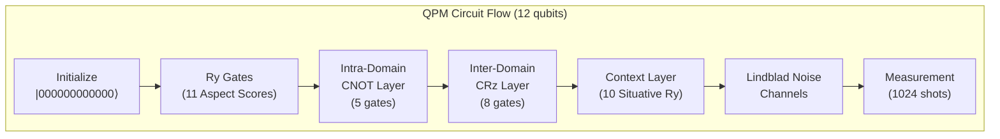

&nbsp;

*Figure 4: Complete QPM circuit flow showing six sequential stages.*

&nbsp;

#### 3.5.6 Measurement and Traceability

The circuit is executed for **N_shots = 1024**, producing a behavioral probability profile over 2,048 possible 11-bit strings:

$$P(\text{bitstring } b) = \frac{\text{count}(b)}{N_{\text{shots}}}$$

**A critical note on traceability vs. determinism:** This system is *not deterministic* — individual measurement shots are inherently probabilistic. However, the system is fully **traceable**: every behavioral output can be audited from input (d₁–d₅) through quantum state evolution (density matrix ρ) to the probability distribution over behavioral configurations. This traceability — not determinism — is the architecture's primary value proposition over neural approaches.

---

## 4. Decision Space and Relational Resolution

### 4.1 Situative Variables

The cognitive Hilbert space is coupled with a structured Decision Space 𝔻 influenced by five **situative variables** [28]:

| Variable | Name | Definition | Computational Role |
|---|---|---|---|
| d₁ | Affective Intensity | Emotional magnitude of user input | Scalar Magnitude — increases arousal |
| d₂ | Task Orientation | Proximity to the communicative goal | Positional Marker — drives toward task-oriented collapse |
| d₃ | Social Normative Constraint | Degree of formality or situational pressure | Boundary Constraint — limits projection axes |
| d₄ | Ambiguity Level | Uncertainty or polysemy in received information | Interference Coefficient — controls superposition |
| d₅ | Temporal Pressure | Latency or time-limitations of the exchange | Trigger Scalar — forces state collapse |

*Table 9: Situative variables [29].*

**Feature extraction pipeline for d₁–d₅:** Each variable is derived from the ASR transcript and acoustic features via a lightweight classical inference stage:

| Variable | Extraction Method | Model / Heuristic |
|---|---|---|
| d₁ | Sentiment intensity score | Vader sentiment + acoustic RMS energy |
| d₂ | Intent proximity to domain goal | Cosine similarity between utterance embedding and goal vector |
| d₃ | Formality classifier | Formality lexicon score (F-score, Pavlick & Tetreault) |
| d₄ | Semantic ambiguity | WordNet polysemy count weighted by TF-IDF |
| d₅ | Turn-taking gap + speech rate | Measured ASR timing + syllables/second |

*Table 10: Situative variable extraction methods.*

### 4.2 The Relational Resolution Formula

$$R = \min(d_{i-1} - d_i)$$

R represents the minimum threshold of change required to trigger a cognitive state transition [19]. If |d_current − d_previous| < R, the system maintains **behavioral continuity**, preventing jittery responses common in data-driven models by mimicking the emotional inertia of biological humans [19].

&nbsp;

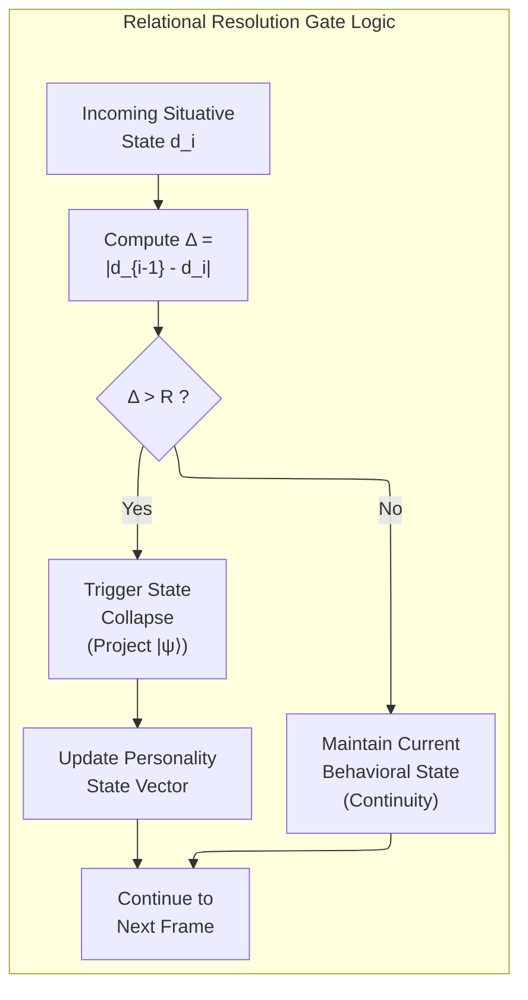

&nbsp;

*Figure 5: The Relational Resolution gating mechanism.*

&nbsp;

### 4.3 Interference and Contextuality

The HSM model accounts for **interference effects** [18]:

$$P(A \text{ then } B) = |\langle B | A \rangle|^2 \neq |\langle A | B \rangle|^2 = P(B \text{ then } A)$$

This non-commutativity ensures each conversational turn influences the AI's internal state in a context-sensitive, order-dependent manner — the Question Order Effect [22].

| Quantum Concept | Psychological Definition | Computational Application |
|---|---|---|
| Hilbert Space | Potential mental space | Multidimensional trait representation |
| Superposition | Coexistence of mental states | Modeling ambivalence and indecision |
| Interference | Mutual influence between options | Modifying preference based on context |
| State Collapse | Decision/Verbalization point | Transition from potential to realized behavior |
| Entanglement | Correlated trait dimensions | Inter-trait dependencies (empirically calibrated) |
| Decoherence | Loss of deliberative state | Environmental pressure forcing commitment |

*Table 11: Extended quantum-to-psychological mapping.*

---

## 5. The Neural Periphery: Small Language Models as Linguistic Transducers

### 5.1 The Content Generation Problem

The prior non-neural architecture [6] relied entirely on knowledge graph traversals and template-based generation. While ensuring every output maps to a verified ontology node, it produces utterances lacking the fluency, register flexibility, and paraphrastic variation of natural human speech. The solution is a **linguistic transducer** — a small language model whose sole function is converting structured cognitive outputs into natural language. The transducer does not reason, retrieve knowledge, or make decisions. It translates.

### 5.2 The Role Boundary Principle

> *The SLM receives as input a fully specified cognitive output — including the intended speech act, relevant knowledge triples, target emotional valence, and personality-appropriate register parameters — and produces as output only the natural language surface form. All reasoning, knowledge retrieval, belief revision, and intention selection occur upstream in the symbolic stack.*

&nbsp;

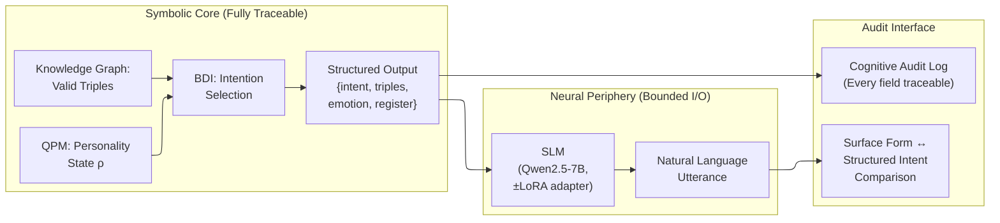

&nbsp;

*Figure 6: The Role Boundary Principle — symbolic core produces structured intent; neural periphery produces surface language.*

&nbsp;

### 5.3 Small Language Model Selection

CA deployment requires a **two-tier SLM specification** based on whether the Self-Model Component (Section 17) is enabled. The following models have been evaluated or proposed for the linguistic transducer role:

| Model | Parameters | MMLU | HumanEval | Quantized Size (Q4_K_M) | License | SCI Validated |
|---|---|---|---|---|---|---|
| **Phi-4-mini** | 3.8B | 67.3% | 74.4% | ~2.2 GB | MIT | No (below minimum) |
| **Qwen2.5-3B** | 3.0B | 65.6% | 61.0% | ~1.8 GB | Apache 2.0 | Not tested |
| **Qwen2.5-7B-Instruct** | 7B | 74.5% | 84.1% | ~4.3 GB | Apache 2.0 | Yes (Tier 1 base: mean=3.20; Tier 2 + LoRA-10K: mean=4.42) |
| **Llama 3.2 3B** | 3.2B | 63.4% | 62.0% | ~1.9 GB | Llama License | Not tested |
| **SmolLM3 3B** | 3.0B | 64.8% | — | ~1.8 GB | Apache 2.0 | Not tested |
| **Gemma 3 4B** | 3.9B | 66.1% | — | ~2.3 GB | Gemma License | Not tested |

*Table 12: SLMs evaluated for the linguistic transducer role [30][31][32][33]. The SCI Validated column reflects empirical testing on JSON-based Structured Context Injector prompts (Drozd, 2026 [65][67]).*

The two-tier specification is now complete and empirically validated end-to-end by Experiments 1 [65] and 2 [67]. The deployment tier is selected based on whether episodic self-modeling is required; both tiers use the same base SLM, which simplifies operations (one model image, optional adapter overlay).

**Tier 1 — Base CA (no SMC, transduction only):** **Qwen2.5-7B-Instruct**, no LoRA required. The transducer role for stateless workloads requires only structured-intent-JSON to natural-language conversion (Section 5.5), and the validated 7B baseline handles this without further specialization. Phi-4-mini (3.8B) was originally proposed as a Tier 1 candidate but was not validated in isolation on the base structured intent format and produced incoherent output on the SCI grounding task; the production recommendation is to standardize on Qwen2.5-7B-Instruct across both tiers for deployment simplicity.

**Tier 2 — SMC-enabled deployment:** **Qwen2.5-7B-Instruct + LoRA-10K SCI grounding adapter (~60 MB)**. The base 7B model maintains coherent persona presence under the Combined SCI strategy (Experiment 1 baseline: mean PersonaScore 3.20/5.0, T\*=5, piecewise degradation with inflection at turn 15). Adding the LoRA-10K SCI grounding adapter trained per Section 5.8.6 lifts mean PersonaScore to 4.42/5.0 — clearing the 3.5 threshold by 0.92 points (Cohen's d = 7.51 versus the no-LoRA Combined-SCI control, p ≈ 1.4 × 10⁻²³ on n = 30 paired scripts) and resolving the episodic fabrication ceiling that survived all six Phase 2b architectural strategies (ΔE = +0.579 versus the no-LoRA control). Phi-4-mini produced incoherent output on JSON-based SCI prompts in 28 of 30 scripts, establishing **3.8B as a hard lower bound** for SMC-enabled deployments. The SCI grounding adapter composes with domain-specific LoRA adapters (Section 5.8, Section 12) on the same base — the SCI adapter handles persona consistency, the domain adapter handles register and constraint specialization.

### 5.4 Quantization and Edge Deployment

Quantization has standardized around **Q4_K_M** as the optimal precision-efficiency tradeoff [34]. A 3B model compresses to approximately 1.8–2.2 GB with under 5% quality degradation; the standardized 7B deployment SLM (Qwen2.5-7B-Instruct) compresses to approximately 4.3 GB. K-quant methods apply mixed precision — attention weights at higher precision than feed-forward layers [34].

| Hardware Platform | NPU TOPS | 3B Model Speed (Q4) | **7B Model Speed (Q4)** | Deployment Runtime |
|---|---|---|---|---|
| NVIDIA Jetson Orin NX | 100–157 | ~30 tokens/s | **~15–20 tokens/s** | llama.cpp / TensorRT |
| Qualcomm Snapdragon 8 Elite | ~60 | ~40–60 tokens/s | **~20–30 tokens/s** | QNN + ExecuTorch |
| Apple M4 (MacBook) | ~38 | ~50–80 tokens/s | **~25–40 tokens/s** | MLX |
| Apple A17 Pro (iPhone 15 Pro) | ~35 | ~20–30 tokens/s | **~8–12 tokens/s** | MLX / ExecuTorch |
| Modern x86 CPU (AVX-512, no NPU) | — (CPU only) | ~15–25 tokens/s | **~4–6 tokens/s** | llama.cpp |
| Raspberry Pi 5 (8GB) | — (CPU only) | ~3–5 tokens/s | **~1–2 tokens/s** *(below interactive threshold)* | llama.cpp |
| Intel Lunar Lake NPU | ~40 | ~15–25 tokens/s | **~6–10 tokens/s** | OpenVINO |

*Table 13: Edge inference performance for quantized SLM models at Q4_K_M [30][35][36][67]. The 3B column corresponds to legacy Tier 1 candidates (e.g. Phi-4-mini, no longer recommended per Section 5.3); the 7B column corresponds to the standardized deployment SLM Qwen2.5-7B-Instruct (~4.3 GB quantized) used across both tiers. Figures assume typical 256–512 token generation; per-token latency scales with prompt length. The Snapdragon 8 Elite, Apple M4, and Apple A17 Pro all comfortably exceed the 8–10 tok/s interactive-conversation threshold; Jetson Orin NX and Intel Lunar Lake NPU are borderline. The "Modern x86 CPU (AVX-512, no NPU)" row represents a typical Intel Core or AMD Ryzen laptop/desktop with no dedicated NPU — useful as a development and fallback baseline (~4–6 tok/s on 7B, noticeably slow but workable for non-real-time use). Raspberry Pi 5 ARM CPU is below practical interactive latency for 7B inference. Qwen2.5-7B estimates derived from Experiment 2 infrastructure benchmarks [67] and llama.cpp community benchmarks for Q4_K_M 7B models on Jetson Orin NX class hardware.*

### 5.5 The Structured Input Protocol

The SLM receives a JSON-structured input from the BDI engine:

```json
{
  "speech_act": "empathic_reflection",
  "knowledge_triples": [
    ["user_emotion", "is", "anxiety"],
    ["anxiety", "treatment_includes", "cognitive_reframing"],
    ["cognitive_reframing", "first_step", "identify_distortion"]
  ],
  "personality_state": {
    "agreeableness_compassion": 0.85,
    "neuroticism_withdrawal": 0.12,
    "openness_experiential": 0.72
  },
  "emotional_valence": { "warmth": 0.8, "concern": 0.6 },
  "register": "professional_empathic",
  "max_tokens": 80,
  "constraints": ["no_diagnosis", "no_medication_advice"]
}
```

The SLM's system prompt enforces the transducer role:

> *"You are a natural language surface generator. Convert the structured intent below into fluent, personality-appropriate speech. Do not add information beyond the provided knowledge triples. Do not reason or diagnose. Your output should sound natural and warm, matching the specified register and emotional valence."*

### 5.6 Function Calling for Agentic Behavior

Beyond linguistic generation, the SLM enables **structured function calling** for agentic tasks [37][38]. Models like Phi-4-mini and Llama 3.2 3B support tool-use schemas, allowing the agent to query the knowledge graph, trigger calendar reminders, execute code snippets, or log session notes. The **Tool RAG** technique [39] selects only relevant tools per query context, averaging 4 tools instead of the full toolkit per interaction — critical for small context windows.

### 5.7 Formal QPM-Measurement-to-JSON Translation Protocol

This section specifies the previously underspecified translation between the QPM circuit's quantum measurement output and the `personality_state` floats in the structured intent JSON. This is the critical interface between the quantum cognitive core and the neural periphery.

#### 5.7.1 From Shot Distribution to Marginal Probabilities

After executing the 12-qubit circuit for N_shots = 1024, the raw output is a dictionary mapping 11-bit strings to counts. The first step is computing **per-qubit marginal probabilities** — the probability that each aspect qubit was measured in state |1⟩:

$$\hat{p}_k = P(\text{qubit}_k = |1\rangle) = \frac{1}{N_{\text{shots}}} \sum_{b \in \{0,1\}^{11}} \text{count}(b) \cdot b_k$$

where $b_k$ is the k-th bit of bitstring $b$. This marginalizes over all other qubits, collapsing the 2,048-dimensional joint distribution to 11 scalar values in [0, 1].

In practice, using Qiskit's SamplerV2 primitive:

```python
from qiskit.primitives import SamplerV2
from qiskit_aer import AerSimulator

sampler = SamplerV2(mode=AerSimulator(noise_model=noise_model))
job = sampler.run([qpm_circuit], shots=1024)
result = job.result()
pub_result = result[0]

# Extract marginal probability for each trait qubit
counts = pub_result.data.meas.get_counts()
marginals = {}
for qubit_idx, label in enumerate(QUBIT_LABELS):   # QUBIT_LABELS = ['O_exp','O_int',...,'N_wth']
    marginals[label] = sum(
        count for bitstring, count in counts.items()
        if bitstring[-(qubit_idx + 1)] == '1'
    ) / 1024
```

#### 5.7.2 Domain-Level Aggregation

The 11 aspect-level marginals are aggregated to domain-level scores using the DeYoung aspect weights [12]. Within each domain, aspects are combined using an arithmetic mean weighted by their facet loadings:

$$s_{\text{domain}} = \frac{1}{|A_{\text{domain}}|} \sum_{k \in A_{\text{domain}}} \hat{p}_k$$

| Domain | Aspect Qubits | Aggregation |
|---|---|---|
| Openness | O_exp (q₀), O_int (q₁), O_val (q₂) | Mean(p̂₀, p̂₁, p̂₂) |
| Conscientiousness | C_ind (q₃), C_ord (q₄) | Mean(p̂₃, p̂₄) |
| Extraversion | E_ent (q₅), E_ass (q₆) | Mean(p̂₅, p̂₆) |
| Agreeableness | A_com (q₇), A_pol (q₈) | Mean(p̂₇, p̂₈) |
| Neuroticism | N_vol (q₉), N_wth (q₁₀) | Mean(p̂₉, p̂₁₀) |

*Table 14: Domain-level aggregation from aspect marginals.*

#### 5.7.3 JSON Field Population

The `personality_state` object in the structured intent JSON is populated directly from aspect-level marginals (not domain-level aggregates), preserving the fine-grained information needed for register and prosody control:

```python
def qpm_to_structured_intent(marginals: dict, bdi_result: dict, kg_triples: list) -> dict:
    """
    Formal translation from QPM measurement output to SLM structured intent.
    
    Parameters
    ----------
    marginals : dict
        Per-qubit marginal probabilities from QPM measurement.
        Keys: 'O_exp', 'O_int', 'O_val', 'C_ind', 'C_ord',
              'E_ent', 'E_ass', 'A_com', 'A_pol', 'N_vol', 'N_wth'
    bdi_result : dict
        Output of BDI intention selection engine.
    kg_triples : list
        Retrieved knowledge graph triples (subject, predicate, object).

    Returns
    -------
    dict : Structured intent JSON for SLM consumption.
    """
    # Derive emotional valence from QPM state
    warmth   = 0.6 * marginals['A_com'] + 0.4 * marginals['E_ent']
    concern  = 0.5 * marginals['N_wth'] + 0.5 * marginals['A_com']
    urgency  = 0.7 * marginals['N_vol'] + 0.3 * (1.0 - marginals['C_ord'])

    # Derive register from personality + social constraint
    formality_score = 0.5 * marginals['C_ind'] + 0.5 * (1.0 - marginals['O_exp'])
    register = _map_formality_to_register(formality_score, bdi_result['d3'])

    return {
        "speech_act":          bdi_result['selected_intention'],
        "knowledge_triples":   kg_triples,
        "personality_state": {
            "openness_experiential":    round(marginals['O_exp'], 3),
            "openness_intellectual":    round(marginals['O_int'], 3),
            "openness_values":          round(marginals['O_val'], 3),
            "conscientiousness_ind":    round(marginals['C_ind'], 3),
            "conscientiousness_ord":    round(marginals['C_ord'], 3),
            "extraversion_enthusiasm":  round(marginals['E_ent'], 3),
            "extraversion_assert":      round(marginals['E_ass'], 3),
            "agreeableness_compassion": round(marginals['A_com'], 3),
            "agreeableness_politeness": round(marginals['A_pol'], 3),
            "neuroticism_volatility":   round(marginals['N_vol'], 3),
            "neuroticism_withdrawal":   round(marginals['N_wth'], 3),
        },
        "emotional_valence": {
            "warmth":   round(warmth,   3),
            "concern":  round(concern,  3),
            "urgency":  round(urgency,  3),
        },
        "register":            register,
        "max_tokens":          bdi_result.get('max_tokens', 80),
        "constraints":         bdi_result.get('domain_constraints', []),
    }

def _map_formality_to_register(formality_score: float, d3: float) -> str:
    """Map QPM formality score and social constraint to a register label."""
    combined = 0.6 * formality_score + 0.4 * d3
    if combined > 0.75:   return "formal_professional"
    elif combined > 0.55: return "professional_warm"
    elif combined > 0.35: return "professional_empathic"
    elif combined > 0.20: return "casual_warm"
    else:                 return "informal_colloquial"
```

#### 5.7.4 Coherence-Based Ambiguity Signal

Beyond the marginals, the QPM density matrix carries information in its off-diagonal elements (coherences). The **mean coherence magnitude** is computed and passed as an ambiguity signal to the BDI engine:

$$\bar{C} = \frac{1}{D(D-1)} \sum_{i \neq j} |\rho_{ij}|, \quad D = 2^{11}$$

For computational tractability on classical hardware, this is approximated using the purity measure:

$$\bar{C}_{\text{approx}} = 1 - \text{Tr}(\rho^2)$$

When $\bar{C}_{\text{approx}} > 0.4$, the agent's cognitive state is genuinely ambivalent, and the BDI engine selects speech acts that hedge, reflect, or request clarification rather than making definitive assertions.

&nbsp;

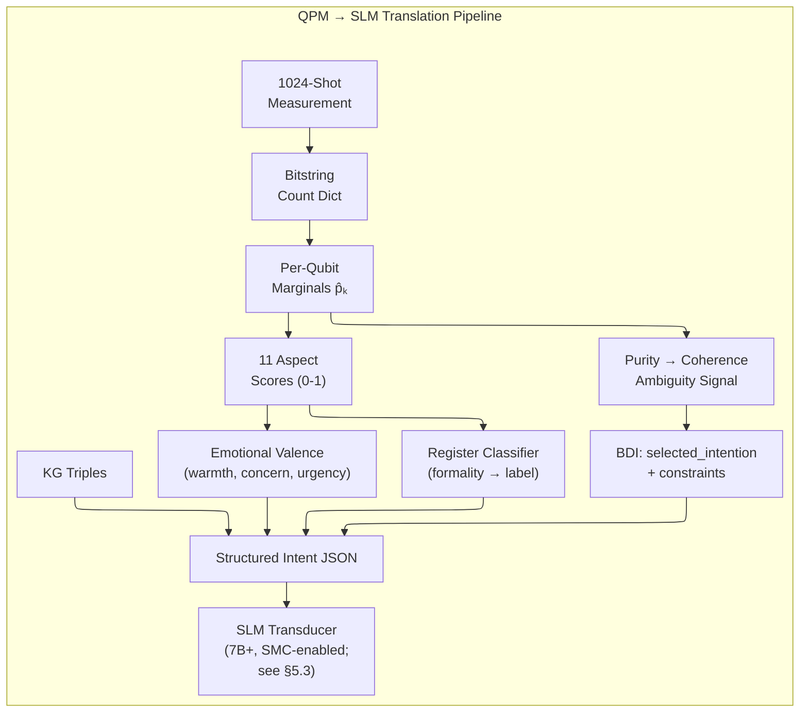

&nbsp;

*Figure 7: Formal QPM-to-SLM translation pipeline. Every field in the structured intent JSON is derived from an explicit, auditable computation over the QPM measurement distribution.*

&nbsp;

### 5.8 LoRA Fine-Tuning Protocol

This section specifies the complete methodology for domain-specific SLM adaptation via Low-Rank Adaptation.

#### 5.8.1 Objective and Rationale

Full fine-tuning of a 7B parameter model (Qwen2.5-7B-Instruct) requires ~30 GB GPU memory and substantial compute. LoRA [Hu et al., 2022] introduces trainable low-rank decomposition matrices into each attention layer, reducing trainable parameters from ~7B to ~15–50M while achieving equivalent task-specific performance. For the Centaurian architecture, the fine-tuning objective is not domain knowledge injection (handled by the KG) but **register and format conditioning**: training the model to reliably produce personality-appropriate surface forms from structured intent JSON.

#### 5.8.2 Training Data Format

Each training example is a (structured_intent_JSON, target_utterance) pair. The target utterance is a high-quality human-authored response that satisfies the intent specification — correct speech act, appropriate register, no facts outside the provided triples, personality-consistent style.

```jsonl
{
  "input": "{\"speech_act\": \"empathic_reflection\", \"knowledge_triples\": [[\"user_emotion\", \"is\", \"anxiety\"]], \"personality_state\": {\"agreeableness_compassion\": 0.85, ...}, \"register\": \"professional_empathic\"}",
  "output": "It sounds like you're carrying a lot of worry about this. That's completely understandable — anxiety before something important is a very human response."
}
```

Training corpus composition per domain:

| Source | Volume | Purpose |
|---|---|---|
| Human-authored (structured intent → utterance) pairs | 2,000–5,000 examples | Core fine-tuning signal |
| Augmented via GPT-4 with human review | 5,000–10,000 examples | Scale without full human cost |
| Negative examples (wrong register / off-constraint) | 1,000–2,000 examples | Contrast learning |
| **Total per domain** | **~8,000–17,000 examples** | |

*Table 15: LoRA training corpus composition.*

#### 5.8.3 Hyperparameter Specification

| Hyperparameter | Value | Rationale |
|---|---|---|
| LoRA rank (r) | 16 | Balances expressiveness and parameter count (~15M trainable params) |
| LoRA alpha (α) | 32 | α/r = 2 scaling factor, standard for instruction-following tasks |
| LoRA dropout | 0.05 | Light regularization; dataset is small relative to model capacity |
| Target modules | q_proj, v_proj, k_proj, o_proj | All attention projections; sufficient for register adaptation |
| Learning rate | 2e-4 | Standard for LoRA with cosine schedule |
| Batch size | 16 (effective, with gradient accumulation) | Fits 24 GB VRAM |
| Training epochs | 3 | Sufficient for this dataset size; validated by held-out loss |
| Warmup steps | 100 | 5% of total steps |
| Max sequence length | 512 tokens | Covers all structured intent + output pairs |
| Precision | BF16 | Preferred over FP16 for training stability |
| Base model precision during training | 4-bit NF4 (QLoRA) | Enables full fine-tuning pipeline on 24 GB GPU |

*Table 16: LoRA hyperparameter specification.*

#### 5.8.4 Training Infrastructure and Cost

```bash
# QLoRA fine-tuning with HuggingFace + PEFT
python train_lora.py \
  --model_name "Qwen/Qwen2.5-7B-Instruct" \
  --dataset_path "data/domain_therapy_train.jsonl" \
  --output_dir "adapters/therapy_lora_r16" \
  --lora_r 16 \
  --lora_alpha 32 \
  --lora_dropout 0.05 \
  --target_modules "q_proj,v_proj,k_proj,o_proj" \
  --num_train_epochs 3 \
  --per_device_train_batch_size 4 \
  --gradient_accumulation_steps 4 \
  --learning_rate 2e-4 \
  --lr_scheduler_type cosine \
  --bf16 True \
  --load_in_4bit True \
  --bnb_4bit_quant_type nf4
```

Estimated cost on a single NVIDIA A100 (80 GB):

| Domain | Dataset Size | Training Time | GPU Cost (~$3/hr) | Adapter Size |
|---|---|---|---|---|
| Psychotherapy | 10,000 examples | ~3–4 hours | ~$10–12 | ~60 MB |
| Software Engineering | 12,000 examples | ~4–5 hours | ~$12–15 | ~60 MB |
| Education | 8,000 examples | ~2–3 hours | ~$8–10 | ~55 MB |
| Elder Care | 7,000 examples | ~2–3 hours | ~$7–9 | ~55 MB |
| **Per domain total** | | **~3–5 hours** | **~$10–15** | **~60 MB** |

*Table 17: LoRA fine-tuning cost estimates.*

> *Training time and cost estimates reflect Qwen2.5-7B-Instruct on A100 80GB. Actual Experiment 2 training of LoRA-10K required approximately 8 hours on A100 80GB at ~$30 compute cost [67], consistent with the upper end of the estimates above scaled for 7B parameter count. Estimates for smaller datasets (2K, 5K) scale proportionally.*

#### 5.8.5 Evaluation Protocol

Fine-tuning quality is evaluated on a held-out set (20% of total examples) using four metrics:

| Metric | Measurement Method | Target Threshold |
|---|---|---|
| **Register Adherence** | Classifier accuracy (predicted register vs. specified register) | > 90% |
| **Constraint Satisfaction** | Rule-based check (no-diagnosis, no-medication, etc.) | 100% |
| **Factual Grounding** | Fraction of output facts traceable to provided KG triples | > 95% |
| **Personality Consistency Score (PCS)** | Cosine similarity between output embedding and personality-conditioned reference embedding | > 0.75 |

The **Personality Consistency Score** is the primary novel metric: for each personality configuration, a reference corpus of 100 human-authored utterances is embedded with all-MiniLM-L6-v2. The fine-tuned model's outputs for equivalent configurations are embedded and compared via cosine similarity to the reference centroid.

#### 5.8.6 SCI Grounding Adaptation (Tier 2 LoRA)

The Tier 2 SLM (Section 5.3) requires a domain-agnostic LoRA adapter trained specifically for SCI grounding — not domain knowledge, but persona-consistent surface generation under JSON-based Structured Context Injector prompts. This subsection specifies that adaptation, validated end-to-end by Experiment 2 [67].

**Training corpus.** 10,000 (system_prompt, conversation_history, probe, target_response) tuples generated by Claude Sonnet 4.6 with a five-rule QC filter (no token leakage from compressed event summaries, episodic grounding against `salient_past_events` by session ID, target length 30–150 words, trait/style marker vocabulary present, MiniLM cosine similarity ≥ 0.35 between probe and target). Steady-state acceptance rate: ~80% on first-pass examples. Stratification across the four probe dimensions deliberately overrepresents Episodic — the dimension the LoRA must teach the base model — and includes a 15% adversarial subset designed to elicit fabrication, capability overstatement, or register breaks. Hamilton's largest-remainder method is used for stratum allocation to prevent rounding away rare cells.

| Stratum | Allocation |
|---------|-----------:|
| Trait (T) probes | ~22% |
| Episodic (E) probes | ~36% (deliberately overrepresented) |
| Capability (C) probes | ~22% |
| Style (S) probes | ~20% |
| (cross-cutting) Adversarial subset | 15% |

*Table 17.5: SCI grounding LoRA training corpus stratification.*

The corpus is split 80/10/10 into train/validation/test (8,000 / 1,000 / 1,000 examples).

**Hyperparameter overrides relative to Section 5.8.3.** The general LoRA recipe holds, with two changes that are specific to the SCI grounding task and were empirically required during Experiment 2:

| Parameter | Section 5.8.3 default | SCI grounding override | Rationale |
|-----------|----------------------|------------------------|-----------|
| Target modules | q_proj, v_proj, k_proj, o_proj | + gate_proj, up_proj | The MLP gate and up projections carry register and stylistic signal that attention-only adaptation does not capture. Empirically required for the +1.88 Style-dimension lift observed under the full target-module configuration. |
| Max sequence length | 512 | **3,072** | The default 2,048 silently truncates 38% of training rows because mid-conversation history bands routinely exceed it. **This is a critical implementation note:** a too-short sequence length degrades the late-conversation training signal without raising any error, and the resulting adapter underperforms specifically on probes at turns 30–40. Train at 3,072. |

*Table 17.6: SCI grounding LoRA hyperparameter overrides.*

**Training profile.** A100 80GB; ~8 hours for 10K examples at effective batch size 16 (per-device 2 × gradient accumulation 8) with paged 8-bit AdamW. Held-out eval loss converges to 0.69 at 10K examples; intermediate checkpoints at 2K (loss 0.91) and 5K (loss 0.77) characterize a clean log scaling curve that mirrors the downstream Episodic dimension scaling (Section 15.4.2). Adapter size: ~60 MB.

**Validation thresholds.** Beyond the four metrics from Section 5.8.5 (Register Adherence, Constraint Satisfaction, Factual Grounding, PCS), the SCI grounding adapter must pass three SMC-specific thresholds derived from the Experiment 2 pre-registered hypotheses [67]:

| Hypothesis | Pass criterion |
|------------|----------------|
| H1 — overall threshold | Mean PersonaScore ≥ 3.5 under Combined SCI |
| H2 — episodic resolution | ΔE ≥ +0.30 versus the no-LoRA Combined-SCI control |
| H4 — base capability preservation | No regression on out-of-domain probes — **PASSED** post-hoc on a 100-probe battery (5 categories × 20): +1.71% mean degradation, paired t = −1.07, p = 0.287, Cohen's d = −0.107 [67] |

*Table 17.7: SMC-specific validation thresholds for the SCI grounding adapter.*

**Two-tier deployment policy.** The SCI grounding adapter is loaded only on Tier 2 SMC-enabled deployments. Tier 1 base CA workloads (transduction-only, no persistent self-model) load the unmodified Qwen2.5-7B-Instruct base. This separation preserves the option to compose the SCI grounding adapter with domain-specific LoRA adapters (Section 12) on the same base model — the SCI adapter handles persona consistency, the domain adapter handles register and constraint specialization. Combining the two adapters is straightforward via PEFT's adapter-stacking API at inference time and does not require retraining either. The full deployment policy by workload profile is given in Section 17.6.

---

## 6. Domain-Specific Knowledge Architecture

### 6.1 The Knowledge Question: Do We Still Need the Graph?

With the introduction of an SLM, a natural question arises: does the knowledge graph become redundant, given that language models encode substantial world knowledge in their parameters? The answer is **no** — the knowledge graph becomes *more* important in the hybrid architecture, not less, for three reasons:

1. **Grounding.** The KG constrains the SLM's output space to verified, domain-specific facts. Without it, even a fine-tuned 3B model will hallucinate plausible-sounding but incorrect domain content.
2. **Traceability.** Every fact surfaced in the agent's response can be traced to a specific KG node and edge, maintaining the architecture's core audit trail.
3. **Updatability.** Domain knowledge evolves. Updating a KG is an explicit, auditable operation; updating parametric knowledge in a neural model requires retraining.

The KG's role evolves from **sole content source** to **semantic anchor** — it provides structured facts, and the SLM wraps them in natural language.

### 6.2 Hybrid Knowledge Architecture: Graph + Vector + SLM

&nbsp;

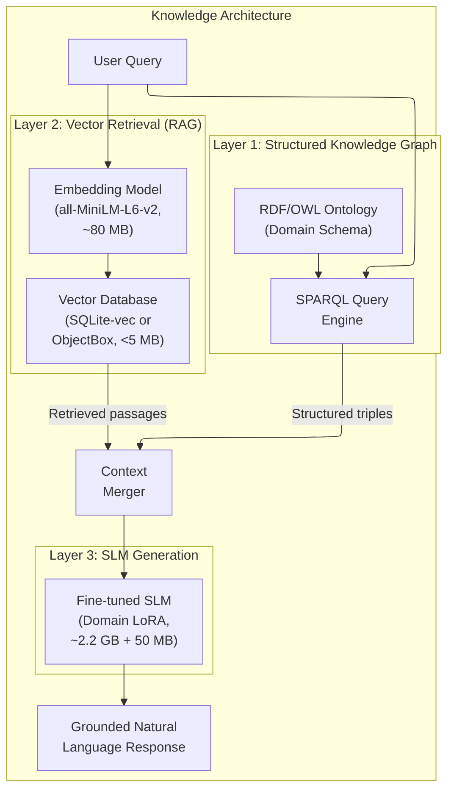

&nbsp;

*Figure 8: Three-layer hybrid knowledge architecture.*

&nbsp;

| Layer | Technology | Size on Disk | Function | Traceability |
|---|---|---|---|---|
| **Structured KG** | Kuzu (embedded) or FalkorDB | 50–500 MB per domain | Schema-level facts, entity relations, constraints | Full — every triple is auditable |
| **Vector RAG** | SQLite-vec + all-MiniLM-L6-v2 | ~80 MB model + variable index | Long-form domain documents, procedures, guidelines | Passage-level — retrieved chunks are cited |
| **SLM Generation** | Qwen2.5-7B Q4_K_M (SMC-enabled) / Phi-4-mini† (base CA) + LoRA | ~2.3–4.4 GB + 50 MB adapter | Natural language surface form | Interface-level — structured input is logged |

*Table 18: Hybrid knowledge architecture components.*

### 6.3 Ontology Schema Specification

The domain knowledge graph is built on a three-tier OWL ontology following the DOLCE upper ontology conventions:

**Tier 1 — Upper Ontology (shared across all domains):**

```turtle
@prefix cent: <https://centaurian.ai/ontology/core#> .
@prefix owl:  <http://www.w3.org/2002/07/owl#> .
@prefix rdfs: <http://www.w3.org/2000/01/rdf-schema#> .

cent:DomainConcept   a owl:Class .
cent:Entity          a owl:Class ; rdfs:subClassOf cent:DomainConcept .
cent:Process         a owl:Class ; rdfs:subClassOf cent:DomainConcept .
cent:Relationship    a owl:Class ; rdfs:subClassOf cent:DomainConcept .
cent:Constraint      a owl:Class ; rdfs:subClassOf cent:DomainConcept .
cent:State           a owl:Class ; rdfs:subClassOf cent:DomainConcept .

# Core object properties
cent:relatesTo       a owl:ObjectProperty .
cent:hasSubprocess   a owl:ObjectProperty ; rdfs:subPropertyOf cent:relatesTo .
cent:preconditionOf  a owl:ObjectProperty ; rdfs:subPropertyOf cent:relatesTo .
cent:contraindicates a owl:ObjectProperty ; rdfs:subPropertyOf cent:relatesTo .

# Core data properties
cent:hasLabel        a owl:DatatypeProperty ; rdfs:range xsd:string .
cent:hasDefinition   a owl:DatatypeProperty ; rdfs:range xsd:string .
cent:hasEvidenceLevel a owl:DatatypeProperty ; rdfs:range xsd:integer . # 1=anecdotal, 5=RCT
cent:isConstraintViolation a owl:DatatypeProperty ; rdfs:range xsd:boolean .
```

**Tier 2 — Domain Ontology (psychotherapy example):**

```turtle
@prefix psy: <https://centaurian.ai/ontology/psychotherapy#> .

psy:Emotion          a owl:Class ; rdfs:subClassOf cent:State .
psy:CognitiveDistortion a owl:Class ; rdfs:subClassOf cent:State .
psy:TherapeuticTechnique a owl:Class ; rdfs:subClassOf cent:Process .
psy:TherapeuticGoal  a owl:Class ; rdfs:subClassOf cent:Entity .
psy:SpeechAct        a owl:Class ; rdfs:subClassOf cent:Process .

# Key relationships in psychotherapy domain
psy:addresses        a owl:ObjectProperty ; rdfs:subPropertyOf cent:relatesTo ;
                     rdfs:domain psy:TherapeuticTechnique ;
                     rdfs:range  psy:CognitiveDistortion .
psy:indicatedFor     a owl:ObjectProperty ; rdfs:subPropertyOf cent:relatesTo ;
                     rdfs:domain psy:TherapeuticTechnique ;
                     rdfs:range  psy:Emotion .
psy:requiresEscalation a owl:DatatypeProperty ; rdfs:range xsd:boolean .
```

**Tier 3 — Instance Data:**

```turtle
psy:Anxiety          a psy:Emotion ; cent:hasLabel "Anxiety" .
psy:CatastrophizingDistortion a psy:CognitiveDistortion ;
                     cent:hasLabel "Catastrophizing" ;
                     cent:hasDefinition "Overestimating probability of negative outcomes" .
psy:CognitiveReframing a psy:TherapeuticTechnique ;
                     cent:hasLabel "Cognitive Reframing" ;
                     cent:hasEvidenceLevel 5 ;
                     psy:addresses psy:CatastrophizingDistortion ;
                     psy:indicatedFor psy:Anxiety .
psy:EmpathicReflection a psy:SpeechAct ;
                     cent:hasLabel "Empathic Reflection" ;
                     psy:indicatedFor psy:Anxiety ;
                     psy:requiresEscalation false .
```

The full psychotherapy ontology comprises approximately 800 named individuals, 120 classes, and 2,400 triples — fitting within the 50–500 MB KG budget depending on depth of coverage.

### 6.4 Vector Retrieval Pipeline Specification

The RAG component handles long-form domain documents (clinical guidelines, technical documentation, curriculum standards) that are too large for the KG's triple representation.

**Embedding Model:** `all-MiniLM-L6-v2` (22M parameters, 80 MB, 384-dimensional embeddings, Apache 2.0 license). This model achieves competitive sentence embedding quality at a fraction of the computational cost of larger alternatives [40].

**Chunking Strategy:**

| Document Type | Chunk Size | Overlap | Splitting Rule |
|---|---|---|---|
| Clinical guidelines (dense prose) | 300 tokens | 50 tokens | Sentence boundary |
| Technical documentation | 400 tokens | 80 tokens | Section heading or paragraph |
| Q&A corpora | 150 tokens | 0 tokens | Whole Q&A pair |
| Structured protocols / step lists | 200 tokens | 30 tokens | Step boundary |

*Table 19: Chunking strategy by document type.*

Splitting is performed at the nearest sentence boundary to the target token count, never mid-sentence. Each chunk stores metadata: `{source_url, section_heading, chunk_index, domain, evidence_level}`.

**Retrieval:** Top-k cosine similarity search over the SQLite-vec index, with k = 5 for initial retrieval, re-ranked by a cross-encoder (`ms-marco-MiniLM-L-6-v2`, 22M params, 7 MB) to top-3 for context injection. Total retrieval latency: 5–17 ms on CPU.

**Indexing pipeline:**

```python
from sentence_transformers import SentenceTransformer
import sqlite_vec
import json

embedder = SentenceTransformer('all-MiniLM-L6-v2')

def index_document_corpus(docs: list[dict], db_path: str):
    """
    docs: list of {'text': str, 'metadata': dict}
    """
    conn = sqlite_vec.connect(db_path)
    conn.execute("CREATE VIRTUAL TABLE IF NOT EXISTS chunks USING vec0(embedding float[384])")
    conn.execute("CREATE TABLE IF NOT EXISTS chunk_meta (id INTEGER PRIMARY KEY, text TEXT, meta TEXT)")

    for doc in docs:
        chunks = chunk_document(doc['text'], doc['metadata']['type'])
        embeddings = embedder.encode([c['text'] for c in chunks], batch_size=32)
        for chunk, emb in zip(chunks, embeddings):
            cursor = conn.execute("INSERT INTO chunk_meta(text, meta) VALUES (?,?)",
                                  (chunk['text'], json.dumps(chunk['metadata'])))
            chunk_id = cursor.lastrowid
            conn.execute("INSERT INTO chunks(rowid, embedding) VALUES (?,?)",
                         (chunk_id, emb.tolist()))
    conn.commit()
```

### 6.5 KG-RAG Contradiction Resolution Protocol

When a SPARQL query returns a KG triple that contradicts information in a retrieved RAG passage — for example, the KG states a therapy technique has `hasEvidenceLevel = 3` but a retrieved guideline passage states it is now Level 5 after new RCTs — the following resolution protocol is applied:

&nbsp;

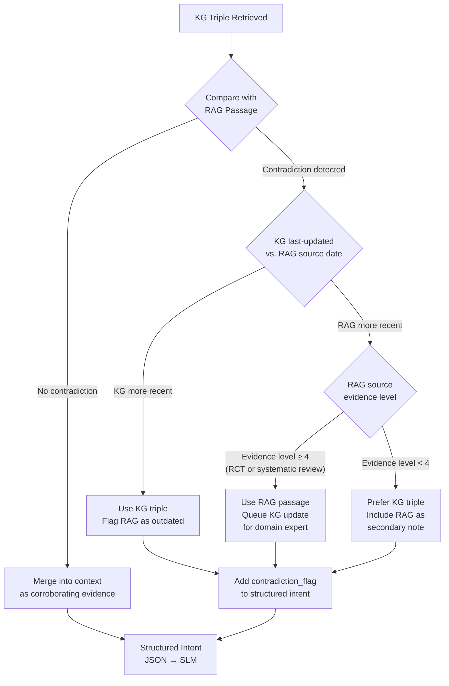

&nbsp;

*Figure 9: KG-RAG contradiction resolution protocol.*

&nbsp;

The `contradiction_flag` in the structured intent JSON triggers a constraint: the SLM is instructed to use hedging language ("recent guidelines suggest...") rather than assertive language when the underlying sources conflict. A contradiction queue is maintained for domain expert review and KG update scheduling.

### 6.6 Edge RAG Viability

Complete RAG pipelines are now viable on edge hardware [40]. Lightweight vector databases have proliferated: **ObjectBox 4.0** (~3 MB binary, sub-millisecond searches on mobile), **SQLite-vec** (17 ms query time for 1M 128-dim vectors, runs on WebAssembly). A complete local RAG pipeline — embedding model, vector database, and 3B LLM at Q4 — fits in 2–4 GB RAM [40].

### 6.7 Anti-Hallucination: Knowledge Graph as Semantic Filter

After the SLM produces a candidate utterance, a validation step checks that:

1. All factual claims correspond to valid KG triples or retrieved RAG passages.
2. No claims fall outside the domain ontology's scope.
3. Constraint violations are enforced at the structured input level.

This eliminates the most dangerous failure mode of pure neural generation: confidently stated fabrications.

---

## 7. Multimodal Synthesis: Neural Auditory Layer

### 7.1 Replacing Concatenative Synthesis

Neural TTS has **objectively surpassed** concatenative synthesis in naturalness, prosodic variation, and Mean Opinion Scores [8][9]. The hybrid architecture replaces concatenative TTS with lightweight neural models while preserving traceability at the text-to-phoneme interface level.

### 7.2 Recommended TTS Models

| Model | Parameters | Size (ONNX) | RTF (Rasp. Pi 4) | MOS | License |
|---|---|---|---|---|---|
| **Kokoro-82M** | 82M | ~350 MB | ~0.3 (GPU), ~2.0 (CPU) | #1 HF Arena | Apache 2.0 |
| **Piper (high)** | ~15M | ~63 MB | ~1.0 | Good | MIT |
| **Piper (low)** | ~5M | ~15 MB | ~0.3 | Acceptable | MIT |
| **MeloTTS** | ~40M | ~150 MB | ~1.5 | Good | MIT |

*Table 20: Lightweight neural TTS models for edge deployment [9][41][42][43].*

**Kokoro-82M** is recommended for desktop/GPU deployments and **Piper (high quality)** for CPU-only edge devices. Both run via **Sherpa-ONNX** [44], which provides cross-platform deployment across Android, iOS, Raspberry Pi, RISC-V, and WebAssembly.

### 7.3 Personality-Driven Prosody Control

The QPM state vector drives prosodic parameters through the Prosody Mapper:

| Personality State | Pitch Contour | Speech Rate | Volume | SSML Mapping |
|---|---|---|---|---|
| High N_vol + High d₁ | Raised, wide range | Increased | High, plosive emphasis | `<prosody rate="fast" pitch="high">` |
| High N_wth + Low E_ent | Lowered, flat | Decreased | Low | `<prosody rate="slow" pitch="low">` |
| High E_ent + High A_com | Raised, dynamic | Slightly increased | Moderate-high | `<prosody pitch="+10%">` |
| High C_ind + Low N_vol | Mid-range, steady | Normal | Moderate | Default prosody |
| High O_exp + High d₄ | Variable, exploratory | Variable | Moderate | Dynamic variation |

*Table 21: Personality-to-prosody mapping for neural TTS control.*

**Prosody Mapper implementation:**

```python
def qpm_to_ssml_prosody(marginals: dict, d: dict) -> dict:
    """Derive SSML prosody parameters from QPM marginals and situative variables."""
    # Pitch: driven by arousal (Extraversion + Neuroticism + Affective Intensity)
    arousal = 0.4 * marginals['E_ent'] + 0.3 * marginals['N_vol'] + 0.3 * d['d1']
    pitch_pct = int((arousal - 0.5) * 40)  # Range: -20% to +20%

    # Rate: driven by urgency (Neuroticism + Temporal Pressure) vs. deliberateness
    urgency = 0.5 * marginals['N_vol'] + 0.5 * d['d5']
    deliberate = 0.6 * marginals['C_ord'] + 0.4 * marginals['O_int']
    rate_factor = 1.0 + 0.3 * urgency - 0.2 * deliberate
    rate_label = "fast" if rate_factor > 1.2 else "slow" if rate_factor < 0.85 else "medium"

    # Volume: driven by Extraversion + Assertiveness
    volume = marginals['E_ass'] * 0.7 + marginals['E_ent'] * 0.3
    vol_pct = int((volume - 0.5) * 20)  # Range: -10% to +10%

    return {
        "pitch":  f"{'+' if pitch_pct >= 0 else ''}{pitch_pct}%",
        "rate":   rate_label,
        "volume": f"{'+' if vol_pct >= 0 else ''}{vol_pct}%",
    }
```

Modern neural TTS models accept SSML tags or style vectors controlling pitch, rate, and emphasis, enabling the personality model to shape vocal delivery without modifying neural weights.

### 7.4 Traceability in the Neural TTS Path

While the internal workings of a neural vocoder are not interpretable at the weight level, traceability is preserved at the **input-output interface**:

1. The text input to TTS is the SLM's output — itself generated from a logged structured intent.
2. Prosody parameters are derived deterministically from the QPM state vector.
3. The phoneme sequence from the grapheme-to-phoneme frontend (eSpeak-NG) is logged and available for audit.

The neural component is a **bounded black box** with fully specified, logged inputs and observable outputs.

---

## 8. Visual Layer: Interpretable Node-Graph Rendering of FACS-Driven Animation

### 8.1 Abstract Node-Graph Rendering Target

The Phase 1 visual surface is **not** a photorealistic 3D character. The Centaurian agent presents itself through an abstract **node-graph rendering of the underlying FACS-driven mesh** — a luminous wireframe in which the same FACS muscle rig described in Sections 8.4 and 8.5 drives the vertices, but the renderer replaces filled triangles and skin shading with thin edges and emissive nodes over a dark background. The agent is identifiable as a face — orientation, expression, viseme — but the surface itself is unmistakably synthetic. The visual UI surrounds this central rendering with live panels exposing the agent's internal state at the moment of speech: the QPM measurement distribution, the structured intent JSON the BDI engine just emitted, the active subgraph of the knowledge graph used for the current response, and a streaming transcript with speaker attribution.

**Why a wireframe surface rather than a photorealistic one.** This is a deliberate interpretability decision, not a compromise dictated by edge-compute constraints. The cognitive core is symbolic, quantum, and fully auditable; presenting it through a photorealistic skin would create a *representational mismatch* — a system whose every internal decision is traceable would project an outward face whose only legible signal is "human-like." A node-graph rendering keeps the visual layer **coherent with the rest of the stack**: the user sees what the agent is, not what the agent is trying to imitate. Every interface — symbolic core, structured intent, surface rendering — speaks the same language of explicit, inspectable structure. This is the interpretability thesis applied one layer further out.

**FACS-region color coding as an explicit interpretability contribution.** Beyond the wireframe aesthetic, the renderer uses **color to expose the FACS Action Unit activations themselves**. The 28 muscle patches (Section 8.4) are grouped into anatomical regions (forehead/brow, eyes, midface, mouth, jaw), each assigned a distinct hue. As the FACS rig fires (smile, surprise, brow furrow, viseme), the vertices and edges in the activated region glow with intensity proportional to AU weight. The result is that *the AI's emotional and articulatory state is directly readable from the surface* — a worried agent literally has visibly active corrugator nodes; an emphatic viseme lights up the orbicularis oris region in real time. This is a novel design contribution: prior interpretable-AI systems expose internal state through side panels or instrumentation; the CA visual layer makes the face itself a continuous interpretability surface, with no hidden affect channel. The color mapping is a fixed lookup table, deterministic, and trivially auditable.

**Stack.** The Phase 1 rendering implementation uses **Odin + Raylib** (CPU-side mesh transform plus a thin GPU pass through Raylib's OpenGL/Metal back end) rather than Unity/C#. The choice is consistent with the rest of the architecture: Odin compiles to a small native binary with no proprietary runtime dependency, Raylib is open-source under a permissive zlib license, and the combined toolchain is auditable end-to-end alongside the QPM, BDI, and SLM components. The renderer consumes the same FACS AU weight stream specified in Section 8.3.2 (VisemeRig) applied through the Section 8.4 muscle rig — the rig does not change, only the surface representation does — so any future Phase 2 swap to a different renderer (textured mesh, holographic display, robot actuator) requires no upstream modification.

**Phase 1 domain framing.** This rendering choice positions Phase 1 explicitly as an **interpretable, edge-deployable, clearly-AI digital presence** optimized for *cognitive-domain* applications — engineering assistance, education, knowledge work, customer service, technical advising — where the user's task is reasoning and information exchange, and the value of the agent is its inspectable, traceable internal process rather than the warmth of its physical presence. Phase 2 (Section 16.3) addresses the orthogonal *affective-domain* problem (therapy, elder care, companionship) where physical embodiment becomes the warmth-carrying medium and a different visual register is appropriate. Each phase has a coherent application domain rather than a universal mandate; the Phase 1 wireframe deliberately leans into "clearly AI" as a feature, not a limitation to be hidden.

The remaining subsections of Section 8 specify the FACS-driven animation pipeline that the node-graph renderer reads from. The pipeline is rendering-agnostic: the same JA/LI viseme engine and the same 28-muscle rig drive whatever surface is bolted on at the output.

### 8.2 Why a Custom Rule-Based Viseme Engine Over Neural Facial Animation

For facial animation, the architecture implements a **custom open-source phoneme-to-viseme engine** rather than adopting neural alternatives (NVIDIA Audio2Face, neural motion retargeting). This engine combines two approaches: (a) a **clean-room reimplementation of the JA/LI two-channel decomposition algorithm** published in Edwards et al. (2016) [45], and (b) **direct consumption of phoneme timing metadata emitted natively by the TTS engine** (Kokoro/Piper via Sherpa-ONNX), eliminating any separate audio analysis step and its associated latency. This design is consistent with the paper's core interpretability thesis — every component of the animation pipeline is fully specified, auditable, and carries no proprietary SDK dependency.

The custom JA/LI implementation provides four engineering advantages:

1. **CPU-only execution.** No GPU required — critical for edge devices where GPU resources are allocated to SLM inference and rendering.
2. **Sub-millisecond latency.** The VisemeSync module processes at 0.5 ms per phoneme, and by consuming TTS-native phoneme timings directly, no separate audio analysis stage is needed [45].
3. **Deterministic output.** Given the same phoneme timing input and parameters, the engine produces identical animation curves, supporting reproducibility and debugging.
4. **Algorithmically grounded with full transparency.** The underlying JA/LI algorithm was validated at production scale in prior work; the custom implementation inherits algorithmic validity while adding full source-level transparency and zero proprietary dependencies.

NVIDIA Audio2Face, while producing high-quality results, requires RTX-class GPU hardware and introduces non-deterministic neural inference into the animation pipeline [46] — an unnecessary resource expenditure when the custom JA/LI implementation achieves equivalent perceptual quality for lip synchronization.

### 8.3 The Custom JA/LI Pipeline

The custom phoneme-to-viseme engine decomposes speech animation into two independent anatomical channels [45]:

- **Jaw Articulation (JA)**: Vertical mouth opening driven by vowel openness.
- **Lip Integration (LI)**: Horizontal and vertical lip shaping driven by consonant manner.

| Speaking Style | JA/LI Coordinates | Cognitive Trigger |
|---|---|---|
| **Mumble** | (0.2, 0.2) | High N_wth or low C_ind |
| **Ventriloquist** | (0.0, 0.8) | High d₃ (social constraint) |
| **Drone** | (0.9, 0.1) | Low engagement, routine speech |
| **Emphasized** | (0.8, 0.8) | High d₁ (affective intensity) |

*Table 22: JA/LI speaking styles linked to QPM cognitive state [45].*

&nbsp;

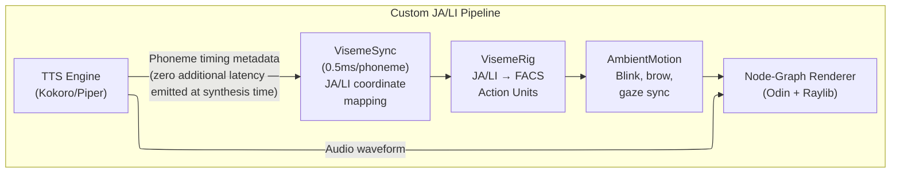

&nbsp;

*Figure 10: Custom JA/LI phoneme-to-viseme pipeline. The TTS engine emits phoneme timing metadata at synthesis time; no separate audio analysis stage exists.*

&nbsp;

### 8.3.1 JA/LI Viseme Field Implementation

This subsection describes a **clean-room reimplementation** of the JA/LI two-channel decomposition algorithm published in Edwards et al. (2016) [45]. The implementation has no proprietary SDK dependency and is publishable as an original open-source contribution.

**Two-Channel Decomposition.** Following the published algorithm, the engine decomposes each phoneme into a (JA, LI) coordinate pair:

- **Jaw Articulation (JA)** is driven by vowel openness — open vowels (/ɑ/, /æ/) produce high JA values, closed vowels (/i/, /u/) produce low JA values.
- **Lip Integration (LI)** is driven by consonant manner — bilabials (/b/, /p/, /m/) produce high LI values, velars (/k/, /ɡ/) produce low LI values.

**Phoneme-to-(JA, LI) Coordinate Mapping:**

| Phoneme Class | Examples | JA | LI |
|---|---|---|---|
| Open vowels | /ɑ/, /æ/, /ʌ/ | 0.8–1.0 | 0.1–0.2 |
| Mid vowels | /ɛ/, /ə/, /ɔ/ | 0.4–0.6 | 0.2–0.3 |
| Close vowels | /i/, /u/, /ɪ/ | 0.1–0.3 | 0.3–0.5 |
| Bilabials | /b/, /p/, /m/ | 0.0–0.1 | 0.9–1.0 |
| Labiodentals | /f/, /v/ | 0.05–0.15 | 0.7–0.85 |
| Alveolars | /t/, /d/, /n/, /s/, /z/ | 0.1–0.2 | 0.3–0.5 |
| Velars | /k/, /ɡ/, /ŋ/ | 0.2–0.3 | 0.1–0.2 |
| Fricatives | /ʃ/, /ʒ/, /θ/, /ð/ | 0.1–0.2 | 0.4–0.6 |
| Affricates | /tʃ/, /dʒ/ | 0.15–0.25 | 0.5–0.7 |
| Approximants | /l/, /r/, /w/, /j/ | 0.15–0.3 | 0.3–0.6 |

**Co-Articulation Blending Rule.** During the final 30% of each phoneme's duration, the engine blends toward the next phoneme's target coordinates using a 60/40 weighted mix (60% current, 40% next). This produces smooth viseme transitions without the mechanical per-phoneme snapping characteristic of naive viseme systems:

$$\text{JA}(t) = 0.6 \cdot \text{JA}_{\text{current}} + 0.4 \cdot \text{JA}_{\text{next}}, \quad t \in [0.7 \cdot d_{\text{phoneme}}, \; d_{\text{phoneme}}]$$

$$\text{LI}(t) = 0.6 \cdot \text{LI}_{\text{current}} + 0.4 \cdot \text{LI}_{\text{next}}, \quad t \in [0.7 \cdot d_{\text{phoneme}}, \; d_{\text{phoneme}}]$$

**Speaking Style Modulation from QPM State.** The QPM cognitive state modulates JA/LI output through four style modes:

| Style Mode | QPM Trigger | JA Scale | LI Scale |
|---|---|---|---|
| **Mumble** | High N_wth or low C_ind | 0.25 | 0.25 |
| **Ventriloquist** | High d₃ (social constraint) | 0.0 | 1.0 |
| **Emphasized** | High d₁ (affective intensity) | 1.0 | 1.0 |
| **Normal** | Default | 0.70 | 0.70 |

**AmbientMotion Module.** The AmbientMotion module drives non-speech facial dynamics from QPM state:

- **Blink rate**: Baseline interval of 4 s with Gaussian jitter; rate increased by factor $1 + 0.4 \times N_{\text{vol}}$.
- **Brow position**: AU1/AU2 raised proportionally to $O_{\text{exp}}$; AU4 lowered proportionally to $N_{\text{wth}}$.
- **Gaze saccades**: Interval $= 2.5 - 1.5 \times E_{\text{ent}}$ seconds; target drawn from zero-centered Gaussian with $\sigma_h = 0.08$, $\sigma_v = 0.04$.

### 8.3.2 VisemeRig: JA/LI to FACS Action Unit Mapping

The VisemeRig module translates JA and LI coordinates produced by VisemeSync into FACS Action Unit weights. All six AU weights are deterministic functions of the (JA, LI) pair produced upstream — the mapping is fully auditable and has no proprietary dependency:

| FACS Action Unit | Formula | Description |
|---|---|---|
| **AU25** (Lips Part) | $\text{AU25} = \text{JA}$ | Direct jaw articulation |
| **AU26** (Jaw Drop) | $\text{AU26} = \text{JA} \times 0.6$ | Scaled jaw opening |
| **AU20** (Lip Stretcher) | $\text{AU20} = \text{LI} \times 0.5$ | Lip spread from consonant integration |
| **AU18** (Lip Pucker) | $\text{AU18} = \max(0, \; 0.7 - \text{LI}) \times \text{JA} \times 0.8$ | Pucker inversely related to LI |
| **AU10** (Upper Lip Raiser) | $\text{AU10} = \text{LI} \times \text{JA} \times 0.4$ | Combined articulation |
| **AU17** (Chin Raiser) | $\text{AU17} = \max(0, \; \text{JA} - 0.5) \times 0.6$ | Active only at high jaw opening |

### 8.4 The Anatomical Muscle Rig

The 3D facial model uses 28 template muscle patches corresponding to the primary muscles of human expression [47]:

| Muscle Patch | Anatomical Equivalent | Expression |
|---|---|---|
| LLSAN/LLS | Levator Labii Superioris | Upper lip raiser / Nose wrinkler |
| Corrugator | Corrugator Supercilii | Brow furrow (worry/anger) |
| Orbicularis Oris | Orbicularis Oris | Lip closure / Pucker |
| Depressor | Depressor Anguli Oris | Mouth corner lowering (sadness) |
| Zygomaticus | Zygomaticus Major | Lip corner raising (happiness) |
| Frontalis | Frontalis | Brow raising (surprise) |
| Mentalis | Mentalis | Chin dimpling (doubt) |
| Buccinator | Buccinator | Cheek compression |

*Table 23: Key muscle rig patches [47].*

Each muscle drives **FACS Action Units** through parallel parameterization, with intensities controlled by the QPM emotional state output [48].

### 8.5 Real-Time Vertex Deformation

- **Radial Basis Function (RBF) warping**: Retargets animations from generic rig to specific character morphology.
- **Free-Form Deformation (FFD)**: Smooth, volume-preserving deformations.
- **Graph-based micro-geometry simulation**: Skin pores as graph nodes with iterative optimization for wrinkles during muscle contraction.

---

## 9. System Integration and Synchronization

### 9.1 Audio-Visual Synchronization

Humans detect audio-visual desynchronization within **+45 to −125 ms** [50]. Synchronization is achieved through the custom JA/LI pipeline with TTS-native phoneme timing:

1. TTS engine synthesizes audio waveform and emits phoneme timing metadata simultaneously.
2. VisemeSync receives phoneme timings at synthesis time and generates animation keyframes immediately — zero additional latency.
3. The render engine receives synchronized audio and animation data.

Total audio-to-visual alignment budget: the synchronization latency from text to first animation keyframe is bounded only by TTS synthesis latency (~30–100 ms), with no separate audio analysis stage. This places the system comfortably within the perceptual synchronization window — well below the detection threshold rather than merely within tolerance.

### 9.2 Co-articulation Rules

Co-articulation prevents the "mechanical" look of isolated phoneme pronunciation [45]. The system blends visemes into co-articulated action units — lips begin rounding for /w/ while the previous phoneme is still being articulated.

| Synchronization Component | Role | Technique |
|---|---|---|
| Grapheme-to-Phoneme | Text normalization | eSpeak-NG frontend |
| Neural TTS Engine | Audio synthesis + phoneme timing metadata | Audio synthesis + phoneme timing metadata (Kokoro/Piper + ONNX) |
| VisemeSync | Animation curve generation | JA/LI viseme field mapping from TTS-native phoneme timings + 30% co-articulation blend |
| AmbientMotion | Non-speech facial motion | QPM-driven procedural blink/brow/gaze rules (N_vol, O_exp, N_wth, E_ent) |

*Table 24: Synchronization pipeline components.*

### 9.3 Biofeedback and Laughter Cycles

The system includes biofeedback responses — a laughter cycle where the AI joins the user's laughter by selecting laughter timing and intensity parameters from personality-appropriate ranges [51]. In the hybrid architecture, laughter audio is generated via the neural TTS model with appropriate prosodic markers rather than retrieved from a database.

---

## 10. Integrated Hybrid System Architecture

### 10.1 The Centaurian Quadripartite Model

The hybrid architecture extends a prior Tripartite Model to a **Quadripartite Model** by inserting a dedicated Generation Layer between Computation and Surface:

&nbsp;

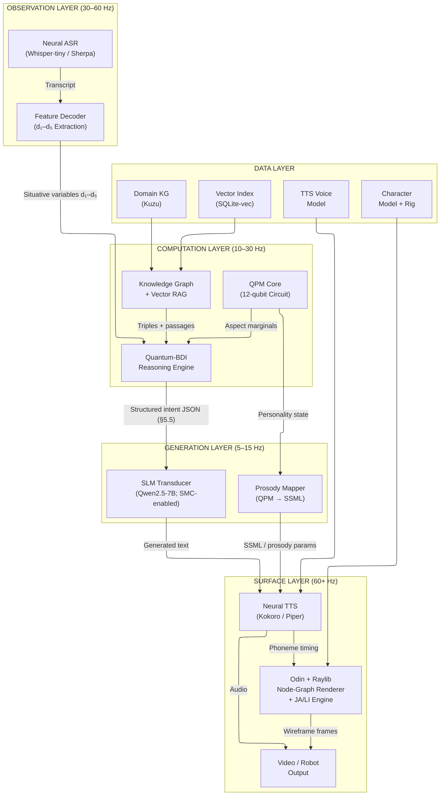

&nbsp;

*Figure 11: Complete Centaurian Quadripartite System Architecture.*

&nbsp;

### 10.2 Layer Specifications

| Layer | Component | Update Rate | Implementation | Latency | Memory |
|---|---|---|---|---|---|
| **Observation** | Neural ASR | 30–60 Hz | Whisper-tiny (39M) / Sherpa-ONNX | 50–100 ms | ~80 MB |
| **Observation** | Feature Decoder (d₁–d₅) | 30–60 Hz | Rule-based + sentiment classifier | 1–2 ms | ~10 MB |
| **Computation** | QPM Core | 10–30 Hz | Qiskit Aer GPU sim, 12 qubits, 1024 shots | 2–4 ms | ~200 MB |
| **Computation** | Quantum-BDI | 10–30 Hz | Symbolic reasoning + belief revision | 1–2 ms | ~10 MB |
| **Computation** | Knowledge Graph | On-demand | Kuzu embedded + SQLite-vec | 1–17 ms | 50–500 MB |
| **Generation** | SLM Transducer | 5–15 Hz | Qwen2.5-7B Q4_K_M (SMC-enabled) / Phi-4-mini† (base CA) + LoRA via llama.cpp | 50–200 ms (GPU); ~2,500–5,000 ms (CPU, 7B) | ~2.3–4.5 GB |
| **Generation** | Prosody Mapper | Per-utterance | QPM state → SSML parameters | <1 ms | ~1 MB |
| **Surface** | Neural TTS | Streaming | Kokoro-82M / Piper via Sherpa-ONNX | 30–100 ms | 63–350 MB |
| **Surface** | Node-Graph Renderer + JA/LI Engine | 60+ Hz | Odin + Raylib node-graph renderer over FACS rig + custom JA/LI CPU pipeline | 8–11 ms | ~40 MB |
| **Surface** | A/V Sync | 60+ Hz | Custom JA/LI pipeline alignment | <1 ms | — |
| | **Inter-component IPC** | | gRPC + ZeroMQ + shared memory | 1–2 ms | — |

*Table 25: Detailed component specifications and resource estimates.*

### 10.3 Detailed Data Flow

&nbsp;

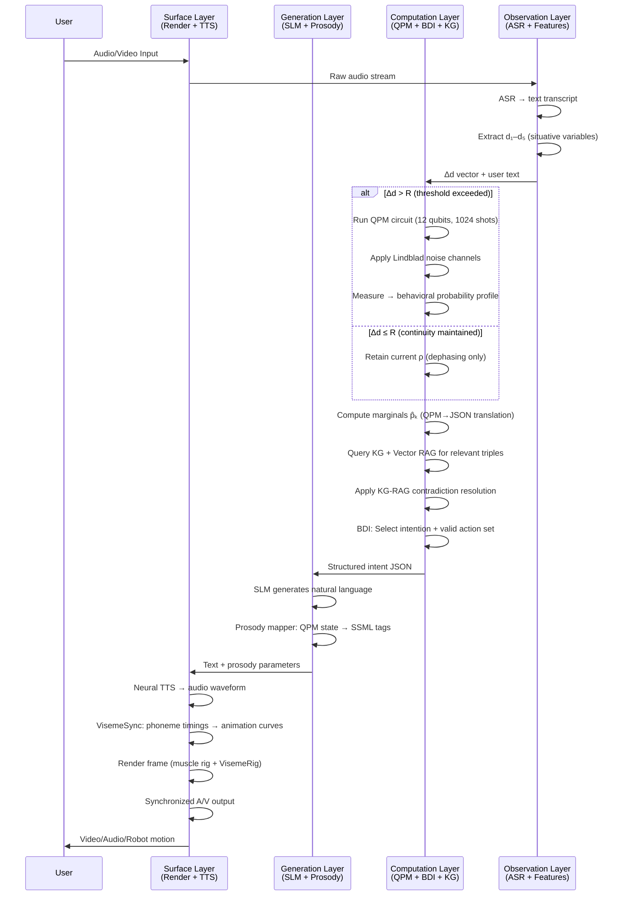

&nbsp;

*Figure 12: Complete data flow sequence diagram for one interaction cycle.*

&nbsp;

### 10.4 Total Memory Budget

| Component | Base CA (no SMC) | SMC-enabled |
|---|---|---|
| SLM | ~2,200 MB (Phi-4-mini Q4_K_M†) | ~4,300 MB (Qwen2.5-7B Q4_K_M) |
| Neural TTS (Kokoro-82M ONNX) | ~350 MB | ~350 MB |
| QPM Simulator (Qiskit Aer) | ~200 MB | ~200 MB |
| ASR (Whisper-tiny) | ~80 MB | ~80 MB |
| Embedding Model (MiniLM) | ~80 MB | ~80 MB |
| Knowledge Graph (Kuzu) | ~200 MB | ~200 MB |
| Vector Index (SQLite-vec) | ~50 MB | ~50 MB |
| LoRA Adapter | ~60 MB | ~60 MB |
| 3D Character Model + Rig | ~100 MB | ~100 MB |
| Runtime Overhead | ~200 MB | ~200 MB |
| **Total** | **~3.5–4.0 GB** | **~5.6–6.1 GB** |

*Table 26: Total memory budget by deployment tier. †Phi-4-mini figures are estimates pending empirical validation on the base structured intent task (Section 5.3).*

> **Note:** SMC-enabled deployments require a minimum 8 GB device with tight headroom; 16 GB recommended for development. Base CA deployments retain the original 4 GB envelope pending Phi-4-mini validation on the base structured intent task.

### 10.5 Pipeline Parallelism and Double-Buffering

The most latency-sensitive path is the Generation Layer (SLM inference at 50–200 ms). Double-buffering ensures this never blocks the render loop. Concretely, the architecture maintains two concurrent rates with independent timing:

- **Generation pipeline (async, per utterance):** QPM compute → BDI reasoning → KG/RAG retrieval → SLM inference → TTS synthesis. The total cost is dominated by SLM inference — typically ~150 ms for Qwen2.5-7B Q4_K_M on edge GPU/NPU (Snapdragon 8 Elite, Apple Silicon, Jetson Orin), with the surrounding symbolic stages contributing ~11 ms combined. The pipeline runs once per utterance and writes its output (animation parameters + audio samples) into a back buffer.
- **Render loop (sync, 60+ Hz, ~16.67 ms per frame):** Reads animation parameters and audio samples from the current front buffer and emits to the display and audio device. The render loop never blocks on the generation pipeline; if a new utterance buffer is not yet ready, it continues consuming the previous one.

When generation of utterance N completes, the back buffer is atomically promoted to the front buffer and the render loop picks up the new content on its next frame boundary. The user perceives a continuous render at 60 Hz with utterance transitions occurring on frame boundaries — utterances of variable SLM-inference latency never cause frame drops.

```mermaid
%%{init: {'gantt': {'leftPadding': 200, 'rightPadding': 30, 'barHeight': 24, 'barGap': 6, 'fontSize': 12, 'sectionFontSize': 13, 'topPadding': 50}}}%%
gantt
    title Pipeline Parallelism (v3 Quadripartite Architecture)
    dateFormat X
    axisFormat %L ms

    section Utterance N (~191 ms async)
    QPM compute               :a1, 0, 4
    BDI reasoning             :a2, after a1, 2
    KG / RAG retrieval        :a3, after a2, 5
    SLM inference (50-200 ms) :crit, a4, after a3, 150
    TTS synthesis             :a5, after a4, 30

    section Utterance N+1 (async)
    QPM compute               :b1, after a5, 4
    BDI reasoning             :b2, after b1, 2
    KG / RAG retrieval        :b3, after b2, 5
    SLM inference             :crit, b4, after b3, 150
    TTS synthesis             :b5, after b4, 30

    section Render Loop (60 Hz sync)
    Render frames consuming buffer for utterance N-1   :r1, 0, 191
    Atomic swap to buffer N                            :milestone, m1, 191, 0
    Render frames consuming buffer for utterance N     :r2, 191, 191
    Atomic swap to buffer N+1                          :milestone, m2, 382, 0
    Render frames consuming buffer for utterance N+1   :r3, 382, 100
```

*Figure 12.5: Pipeline parallelism in the v3 quadripartite architecture. The generation pipeline (top two sections) runs asynchronously per-utterance with SLM inference dominating its ~191 ms total cost. The render loop (bottom section) runs continuously at 60 Hz, consuming whichever buffer is currently front and swapping atomically when generation completes. The two rates are decoupled: long SLM inferences never stall the render loop, and short SLM inferences do not accelerate frame production. This is the core mechanism that lets a 50–200 ms generation pipeline coexist with a perceptually-required 16.67 ms render budget on the same edge device.*

The double-buffering implementation is simple: two pre-allocated buffers (front and back), an atomic pointer swap on generation completion, and a "buffer ready" event that the render loop checks on each frame. The render loop never reads from a buffer being actively written, and the generation pipeline never writes to the buffer being actively read, so no locking is required on the hot path.

### 10.6 Middleware and IPC

| Boundary | Protocol | Serialization | Latency |
|---|---|---|---|
| ASR ↔ Feature Decoder | In-process | Shared memory | <0.1 ms |
| Observation → Computation | ZeroMQ IPC | MessagePack | <0.5 ms |
| QPM ↔ Knowledge Graph | In-process SPARQL | RDF triples | <0.3 ms |
| Computation → Generation | gRPC | Protocol Buffers | ~1 ms |
| Generation → Surface | ZeroMQ (pub/sub) | MessagePack | <0.5 ms |
| Surface components | Shared memory | Raw buffers | <0.1 ms |

*Table 27: Middleware stack for inter-component communication.*

Event bus topics: `quantum.state.updated` → triggers BDI belief revision; `bdi.intent.structured` → triggers SLM generation; `slm.utterance.ready` → triggers TTS + animation pipeline; `tts.audio.streaming` → consumed by VisemeSync + render loop; `user.input.processed` → triggers QPM context injection.

### 10.7 Traceability Audit Path

For every utterance the system produces, the following audit chain is available and logged:

```
User Input: "I've been feeling anxious about my job interview tomorrow."
  ↓
Observation Layer:
  ASR transcript: "I've been feeling anxious about my job interview tomorrow"
  d₁ (Affective Intensity): 0.72  [Vader score: 0.68, RMS energy: 0.74]
  d₂ (Task Orientation): 0.45    [Cosine sim to goal vector: 0.45]
  d₃ (Social Constraint): 0.30   [Formality F-score: 0.30]
  d₄ (Ambiguity): 0.20           [Avg WordNet polysemy: 1.8 → normalized: 0.20]
  d₅ (Temporal Pressure): 0.65   [Turn gap: 1.2s, speech rate: 4.2 syl/s]
  ↓
Computation Layer:
  Δd = 0.33 > R = 0.15 → state transition triggered
  QPM marginals: {A_com: 0.85, N_wth: 0.12, E_ent: 0.78, ...}
  Coherence: C̄_approx = 0.18 → definite state (no hedging required)
  KG triples retrieved (SPARQL): [anxiety→is→emotion, ...]
  RAG passages retrieved: ["CBT reframing involves...", ...]
  Contradiction resolution: No conflicts detected
  BDI intention: empathic_reflection + normalization
  ↓
Generation Layer:
  Structured intent JSON: {speech_act: "empathic_reflection", triples: [...], ...}
  personality_state: {agreeableness_compassion: 0.85, neuroticism_withdrawal: 0.12, ...}
  register: "professional_empathic"
  SLM output: "It makes complete sense to feel anxious before something important..."
  Prosody: {pitch: "+8%", rate: "medium", volume: "+3%"}
  ↓
Surface Layer:
  TTS: Kokoro-82M, SSML applied
  VisemeSync: speaking_style=(0.6, 0.6), zygomaticus_weight=0.4 (slight warmth)
  ↓
Output: Synchronized audio-visual response
```

Every level is logged and inspectable. If the agent produces an inappropriate response, the failure point can be precisely identified — QPM state, KG retrieval, contradiction resolution, BDI intention selection, or SLM generation.

---

## 11. From Software to Hardware: Embodied Deployment

### 11.1 The Embodiment Opportunity

The Centaurian architecture's natural trajectory extends beyond virtual avatars to **physically embodied humanoid robots** for home assistance, elder care, education, and companionship. The cognitive architecture — personality modeling, BDI reasoning, knowledge-grounded generation, facial animation — is deployment-substrate-agnostic. The primary engineering challenge is adding motor control without compromising the cognitive stack's resource budget.

### 11.2 The Dual-System Architecture for Embodiment

The humanoid robotics field has converged on a **dual-system architecture** separating slow cognitive planning from fast motor control [52][53]:

&nbsp;

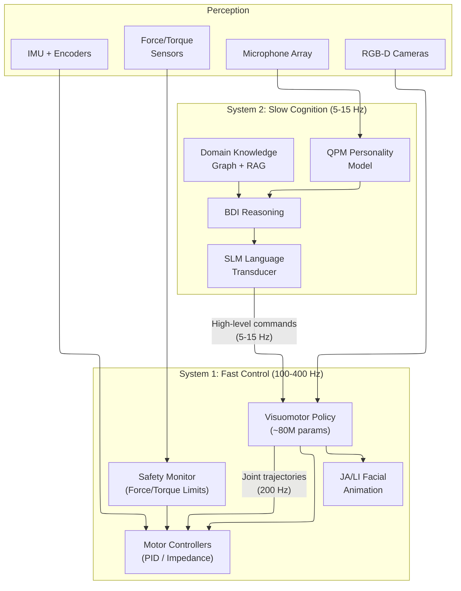

&nbsp;

*Figure 13: Dual-system architecture for embodied deployment.*

&nbsp;

### 11.3 System 2 → System 1 Interface Specification

The previously underspecified interface between the Centaurian cognitive stack (System 2) and the visuomotor policy (System 1) is formalized here. System 2 issues **high-level behavioral commands** at 5–15 Hz; System 1 translates these into joint trajectories at 100–400 Hz.

**Command schema:**

```json
{
  "command_type": "locomotion | manipulation | gesture | posture | speech_act",
  "target_state": {
    "position_goal": [x, y, z],
    "orientation_goal": [qw, qx, qy, qz],
    "object_target": "cup_on_table_01",
    "gripper_state": "open | closed | force_controlled"
  },
  "behavioral_modifiers": {
    "approach_velocity": 0.3,
    "force_limit_N": 15.0,
    "hesitancy": 0.2,
    "expressiveness": 0.7
  },
  "personality_overlay": {
    "C_ind": 0.78,
    "N_vol": 0.15,
    "A_com": 0.82
  },
  "timeout_ms": 3000,
  "abort_on_contact": true
}
```

**Behavioral modifiers derived from QPM state:**

| QPM Aspect | System 1 Modifier | Effect on Motion |
|---|---|---|
| High C_ind (Industriousness) | approach_velocity ↑ | Faster, more decisive movements |
| High N_vol (Volatility) | force_limit_N ↓ | More cautious force application |
| High A_com (Compassion) | hesitancy ↑ near person | Slower approach, gentler contact |
| High E_ass (Assertiveness) | approach_velocity ↑, hesitancy ↓ | Confident, direct motion |
| Low O_exp + high d₂ | motion_style = "efficient" | Straight-line trajectories |
| High O_exp + low d₂ | motion_style = "exploratory" | Curved, investigative paths |

*Table 28: QPM-to-motion behavioral modifier mapping.*

**Safety protocol:** The System 1 Safety Monitor operates independently of the cognitive stack with a watchdog timer. If System 2 fails to issue commands within `timeout_ms`, System 1 enters a safe hold posture automatically. Force/torque sensor readings above `force_limit_N` abort the current action and notify System 2 via a `contact_event` message.

### 11.4 Latency Hierarchy for Embodied AI

| Function | Required Latency | Update Rate | System |
|---|---|---|---|
| Motor control (joints) | 2.5–10 ms | 100–400 Hz | System 1 |
| Manipulation (grasping) | ~5 ms | 200 Hz | System 1 |
| Facial animation (JA/LI engine) | <1 ms/phoneme | 60 Hz | System 1 |
| Visual perception | 110–140 ms | 7–9 Hz | System 1/2 |
| Language generation | 50–200 ms | 5–15 Hz | System 2 |
| Personality modeling (QPM) | 2–4 ms | 10–30 Hz | System 2 |
| Knowledge retrieval | 1–17 ms | On-demand | System 2 |
| Conversation turn latency | 300–1,000 ms | ~1 Hz | End-to-end |

*Table 29: Latency hierarchy for embodied AI deployment.*

### 11.5 Target Hardware Platforms

| Platform | Compute | Memory | Power | Deployment Fit |
|---|---|---|---|---|
| **NVIDIA Jetson Orin NX** | 100 TOPS | 8–16 GB | 10–25 W | Ideal: proven in robotics |
| **NVIDIA Jetson Thor** | 2,070 TFLOPS (FP4) | 128 GB | 40–130 W | Premium: next-gen robots |
| **Qualcomm RB5/RB6** | 15–30 TOPS | 8 GB | 5–15 W | Compact: drones, small robots |
| **Tesla FSD Chip (custom)** | ~144 TOPS | — | ~36 W | Proprietary: Tesla Optimus |

*Table 30: Target embedded compute platforms for embodied deployment [52][54].*

### 11.6 Facial Expression on Physical Robots

For physically embodied robots with mechanical faces, the custom JA/LI engine's FACS Action Unit output maps directly to actuator commands:

| JA/LI Engine Output (FACS AU) | Robot Actuator | Degrees of Freedom |
|---|---|---|
| AU1/AU2 (Brow raise) | Brow servos | 2 (inner/outer) per side |
| AU4 (Brow lower) | Corrugator servo | 1 per side |
| AU6/AU12 (Smile) | Zygomaticus actuator | 1 per side |
| AU15/AU17 (Lip depress/chin) | Lip corner + mentalis | 2 per side |
| AU25/AU26 (Jaw open) | Jaw servo | 1 (vertical) |
| AU18/AU22 (Lip pucker/funnel) | Orbicularis actuator | 2 |

*Table 31: JA/LI-engine-to-robot actuator mapping for physical facial expression.*

Recent work at Columbia Engineering demonstrated self-supervised lip-sync learning for humanoid faces using 26 actuators [55], validating the feasibility of high-quality facial animation on mechanical platforms.


---

## 12. Domain Specialization: Agentic System Templates

### 12.1 The Specialization Framework

A core outcome of the hybrid architecture is the ability to deploy **highly specialized agentic systems** across arbitrary professional domains. Each domain instance shares the same QPM personality core, custom JA/LI animation pipeline, and system architecture but is differentiated by five elements:

1. **Domain Knowledge Graph**: A curated RDF/OWL ontology (following the schema specified in Section 6.3) covering the domain's concepts, relationships, and constraints.
2. **Domain LoRA Adapter**: A fine-tuned LoRA adapter (~60 MB) following the protocol specified in Section 5.8.
3. **Domain Vector Corpus**: Embedded domain documents for RAG retrieval (Section 6.4 pipeline).
4. **Domain Constraint Set**: Rules enforced at the structured intent level.
5. **Personality Profile**: QPM initial state vector (Ry rotation angles θ_k) calibrated for the domain role.

&nbsp;

```mermaid
%%{init: {"flowchart": {"defaultRenderer": "elk"}} }%%
graph TD
    subgraph "Shared Core (Fixed)"
        QPM_CORE["QPM Engine<br/>(12 qubits)"]
        BDI_CORE["BDI Reasoning"]
        JALI_CORE["JA/LI Pipeline"]
        TTS_CORE["Neural TTS"]
        SLM_BASE["Base SLM<br/>(see §5.3 for<br/>tier specification)"]
    end
    subgraph "Domain: Psychotherapy"
        KG_PSY["Psychology KG<br/>(CBT, DBT, ACT<br/>ontology)"]
        LORA_PSY["Therapy LoRA<br/>(empathic register)"]
        VEC_PSY["Clinical<br/>Guidelines<br/>Corpus"]
        CONST_PSY["Constraints:<br/>No diagnosis<br/>No medication"]
        PERS_PSY["Personality:<br/>High A_com, A_pol<br/>Low N_vol"]
    end
    subgraph "Domain: Software Engineering"
        KG_SWE["Software KG<br/>(APIs, patterns,<br/>best practices)"]
        LORA_SWE["Technical LoRA<br/>(code register)"]
        VEC_SWE["Documentation<br/>Corpus"]
        CONST_SWE["Constraints:<br/>Cite docs<br/>Test-driven"]
        PERS_SWE["Personality:<br/>High C_ind, O_int<br/>High E_ass"]
    end
    subgraph "Domain: Education (K-12)"
        KG_EDU["Education KG<br/>(Curriculum, Bloom's taxonomy,<br/>learning objectives)"]
        LORA_EDU["Educator LoRA<br/>(Socratic, scaffolded)"]
        VEC_EDU["Curriculum<br/>Corpus"]
        CONST_EDU["Constraints:<br/>Age-appropriate language<br/>Track learning objectives"]
        PERS_EDU["Personality:<br/>High E_ent, A_com<br/>Moderate C_ord"]
    end
    SLM_BASE --> LORA_PSY
    SLM_BASE --> LORA_SWE
    SLM_BASE --> LORA_EDU
    QPM_CORE --> PERS_PSY
    QPM_CORE --> PERS_SWE
    QPM_CORE --> PERS_EDU
```

&nbsp;

*Figure 14: Domain specialization framework showing shared core components and per-domain customization. Phase 1 domains shown; Elder Care and Psychotherapy are Phase 2 (embodied) deployments.*

&nbsp;

### 12.2 Domain Templates

| Deployment Phase | Domain | KG Scope | LoRA Training Data | Personality Profile | Key Constraints |
|---|---|---|---|---|---|
| **Phase 2 (embodied)** | **Psychotherapy** | CBT/DBT/ACT techniques, emotional vocabulary, therapeutic frameworks | Anonymized therapy transcripts, empathic dialog corpora | High A_com, High A_pol, Low N_vol, Moderate O_exp | No diagnosis, no medication advice, escalation to human therapist for crisis |
| **Phase 1** | **Software Engineering** | APIs, design patterns, testing frameworks, language specs | Code review comments, technical documentation, Stack Overflow Q&A | High C_ind, High O_int, High E_ass | Cite documentation, suggest tests, flag security concerns |
| **Phase 1** | **Education (K-12)** | Curriculum ontology, learning objectives, Bloom's taxonomy | Teacher-student dialog, Socratic questioning, scaffolded explanations | High E_ent, High A_com, Moderate C_ord | Age-appropriate language, encourage rather than solve, track learning objectives |
| **Phase 2 (embodied)** | **Elder Care** | Medication schedules, health monitoring, daily routines, emergency protocols | Caregiver communication, patient-friendly medical explanations | High E_ent, High C_ord, Low N_vol, High A_com | Medication reminders, fall detection escalation, family notification triggers |
| **Phase 1** | **Customer Service** | Product catalog, FAQ, policy ontology, escalation paths | Customer interaction logs, resolution scripts | Moderate E_ent, High A_pol, High C_ind | Stay within policy, escalate to human for complex complaints |

*Table 32: Domain specialization templates.*

> Phase 1 domains target cognitive-domain workloads suited to the clearly-AI digital presence and wireframe visual register of Phase 1 (Section 8.1, Section 16.2). Phase 2 domains require physical co-location, embodied warmth, and higher episodic reliability than Phase 1 delivers — they are activated by the humanoid embodiment transition described in Section 16.3. The domain specialization framework (KG, LoRA, personality profile, constraint set) is identical across phases; what changes is the surface representation and the deployment hardware.

### 12.3 Personality Initialization by Domain

The QPM initial state for each domain is specified as a set of Ry rotation angles θ_k (Section 3.4):

| Domain | O_exp | O_int | C_ind | C_ord | E_ent | E_ass | A_com | A_pol | N_vol | N_wth |
|---|---|---|---|---|---|---|---|---|---|---|
| **Psychotherapy** | 0.72 | 0.60 | 0.65 | 0.70 | 0.68 | 0.50 | 0.88 | 0.82 | 0.15 | 0.18 |
| **Software Eng.** | 0.55 | 0.90 | 0.85 | 0.75 | 0.60 | 0.80 | 0.60 | 0.65 | 0.20 | 0.15 |
| **Education** | 0.78 | 0.75 | 0.65 | 0.70 | 0.85 | 0.65 | 0.82 | 0.75 | 0.20 | 0.22 |
| **Elder Care** | 0.60 | 0.50 | 0.70 | 0.85 | 0.80 | 0.45 | 0.90 | 0.85 | 0.12 | 0.15 |
| **Customer Svc.** | 0.55 | 0.60 | 0.75 | 0.80 | 0.70 | 0.65 | 0.70 | 0.82 | 0.18 | 0.20 |

*Table 33: Domain personality initialization parameters (s_k values, θ_k = 2·arcsin(√s_k)).*

### 12.4 Specialization Cost

| Component | One-Time Cost | Size | Time |
|---|---|---|---|
| Domain KG construction | Domain expert curation | 50–500 MB | 2–8 weeks |
| LoRA fine-tuning | ~$10–15 GPU compute | ~60 MB adapter | 3–5 hours |
| Vector corpus embedding | Automated pipeline | ~50–200 MB index | 1–4 hours |
| Personality calibration | QPM parameter tuning | <1 KB (parameter file) | 1–2 days |
| Constraint definition | Domain expert rules | <10 KB (JSON) | 1–2 days |
| **Total per domain** | **~$100–500** | **~200–800 MB** | **~2–4 weeks** |

*Table 34: Domain specialization cost estimates.*

This is **orders of magnitude cheaper** than training a domain-specific LLM from scratch (typically $100K–$10M+) or even full fine-tuning of a foundation model ($1K–$50K).

---

## 13. Engineering Constraints and Performance

### 13.1 Comparative Assessment

| Metric | CA (This Paper) | Pure Neural (LLM Agent) | Prior Non-Neural |
|---|---|---|---|
| **Cognitive Traceability** | Full (QPM → BDI → structured intent) | None (black box) | Full |
| **Linguistic Naturalness** | High (SLM generation) | High | Low (template-based) |
| **Speech Naturalness** | High (Kokoro/Piper) | High | Moderate (concatenative artifacts) |
| **Hallucination Control** | KG-grounded + constrained SLM | Unconstrained | KG-constrained (no hallucination) |
| **Behavioral Consistency** | QPM + Relational Resolution R | Prompt-dependent | QPM + R |
| **Total Latency (turn)** | ~300–500 ms (GPU/NPU); ~2,500–5,000 ms (CPU, Qwen2.5-7B) †† | 500–2,000 ms | ~18–24 ms* |
| **Minimum SLM Scale for SCI** | 7B (empirically established [65]) | N/A (full model) | N/A (no SLM) |
| **Memory Footprint** | ~4 GB (base); ~6 GB (SMC-enabled) | 8–80+ GB | ~2 GB |
| **Edge Deployable** | Yes (8 GB devices) | Difficult (GPU-bound) | Yes (CPU only) |
| **Content Flexibility** | High (SLM + KG + RAG) | Unbounded | Bounded by KG coverage |
| **Domain Adaptation Cost** | ~$100–500 (LoRA + KG) | $1K–$50K (fine-tuning) | High (manual KG expansion) |
| **Embodiment Ready** | Yes (dual-system + System 2→1 interface) | Requires separate motor stack | Limited |

*Table 35: Three-way comparative assessment. \*Prior architecture latency excludes content generation (template-based and instantaneous). ††With Qwen2.5-7B on CPU (MacBook Pro class hardware), generation runs at ~4–6 tok/s, producing ~2,500–5,000 ms total turn latency — outside the conversational turn gap. GPU deployment (Jetson Orin or cloud) restores the 300–500 ms figure.*

### 13.2 Latency Analysis

| Stage | Component | Latency | Notes |
|---|---|---|---|
| 1 | ASR (speech-to-text) | 50–100 ms | Whisper-tiny streaming |
| 2 | Feature extraction (d₁–d₅) | 1–2 ms | Rule-based |
| 3 | QPM circuit execution | 2–4 ms | 12 qubits, 1024 shots |
| 4 | QPM→JSON translation | <1 ms | Marginal computation + valence mapping |
| 5 | BDI reasoning + KG query | 2–17 ms | Cached plans + SPARQL |
| 6 | SLM generation | 50–200 ms | 25–100 tokens at 40 tok/s |
| 7 | Neural TTS (streaming) | 30–100 ms | Time-to-first-audio |
| 8 | JA/LI animation | <2 ms | From TTS-native phoneme timings |
| | **Total (first audio)** | **~150–400 ms** | Within conversational turn gap |

*Table 36: End-to-end latency breakdown.*

The 150–400 ms total falls within the **natural conversational turn gap** of 200–500 ms [56], meaning the agent responds without perceptible delay.

---

## 14. Multi-Agent Scalability

### 14.1 Resource Scaling

| Component | Per-Agent Resource | Scaling Property |
|---|---|---|
| QPM Circuit (12 qubits) | ~200 MB GPU memory | **Linear** — each agent requires independent simulator instance |
| SLM Base Model (Qwen2.5-7B Q4_K_M) | Shared ~4.4 GB | **Sub-linear** — shared model, per-agent LoRA adapters only |
| SCI Grounding Adapter (Tier 2 only) | ~60 MB per agent | **Linear** — required for SMC-enabled agents |
| Domain LoRA Adapter | ~60 MB per agent | **Linear** — per-domain adapter per agent (composes with SCI adapter) |
| Knowledge Graph | ~200 MB per domain | **Shared** — agents in same domain share KG |
| BDI Reasoning Engine | ~10 MB per agent | **Linear** — independent belief states |
| Node-Graph Renderer (Odin + Raylib) | ~20 MB per character + ~1 ms GPU | **Sub-linear** — wireframe rendering is light; instanced edge batching amortizes overhead |

*Table 37: Per-agent resource scaling. SLM base model is shared across all agents (one copy in GPU/NPU memory); each agent layers its own SCI grounding adapter (Tier 2 only) and optional domain adapter on top via PEFT adapter stacking.*

For a **50-agent virtual meeting** scenario (all agents Tier 2, SMC-enabled with both SCI and domain adapters):

| Resource | Single Agent | 50 Agents | Mitigation |
|---|---|---|---|
| SLM memory | 4.4 GB | 4.4 GB (shared) + 6 GB (50 × SCI + 50 × domain adapters) | Model sharing; only ~120 MB of adapters is per-agent |
| QPM GPU memory | 200 MB | 10 GB | Single A100 (80 GB) handles 50+ agents |
| QPM latency | 2–4 ms | 2–4 ms (parallelized) | Batch 50 circuits in single GPU kernel |
| Render overhead | 11 ms | ~30 ms (batched) | LOD reduction for non-focal agents |
| Total memory | ~5–6 GB | ~22 GB | Within dual-A100 server envelope (or single H100) |

*Table 38: 50-agent scaling estimates with the standardized Qwen2.5-7B Q4_K_M base SLM. The total memory figure assumes Tier 2 SMC-enabled deployment for every agent (SCI grounding adapter + one domain adapter per agent). For mixed-tier deployments, subtract ~60 MB per Tier 1 agent.*

### 14.2 Multi-Agent Interaction Dynamics

When multiple Centaurian agents interact, each agent's situative variables are influenced by other agents' behavioral outputs:

$$d_i^{(\text{agent } k)}(t+1) = f\left(d_i^{(\text{agent } k)}(t), \; \bigcup_{j \neq k} \text{output}^{(\text{agent } j)}(t)\right)$$

The Relational Resolution threshold R operates independently per agent, ensuring personality-appropriate behavioral inertia. A high-Neuroticism agent responds to group dynamics more reactively than a high-Conscientiousness agent.

&nbsp;

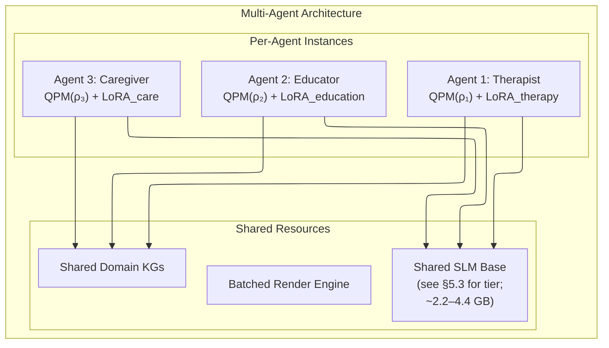

&nbsp;

*Figure 15: Multi-agent architecture with shared base model and per-agent LoRA specialization.*

&nbsp;

---

## 15. Empirical Validation Framework

This section specifies the evaluation methodology for the Centaurian Architecture. **Experiments 1 and 2 (Behavioral Consistency — SCI/SMC component)** are complete. Experiment 1 established the 7B baseline and tested six prompt-time architectural strategies; Experiment 2 added LoRA fine-tuning under a 4-condition design with H5 data-scaling sub-runs, achieving Outcome A under the pre-registered decision rule and validating the full Phase 1 SMC architecture (Section 17.5). See Section 15.2 for high-level findings and Sections 15.4.1, 15.4.2 for detailed protocols. The remaining evaluation dimensions (Speech Naturalness, Persona Coherence Over Time, Uncanny Valley) are deferred to future work. The validation framework is designed to be executable with Phase 1 components (Section 16.2).

### 15.1 Evaluation Dimensions

Four orthogonal evaluation dimensions are proposed:

| Dimension | What is Measured | Primary Audience | Status |
|---|---|---|---|
| **Speech Naturalness (MOS)** | Perceptual quality of the auditory output | Acoustic engineers, product evaluators | Proposed |
| **Behavioral Consistency** | Stability of personality across interactions | AI researchers, domain deployers | Completed (Experiments 1 and 2, including the H4 base-capability test: +1.71% mean degradation, paired t = −1.07, p = 0.287 — see Section 15.4.2) |
| **Persona Coherence Over Time** | Whether the agent presents as a consistent, recognizable persona across long and multi-session interactions (rather than whether it can be mistaken for human) | Human-computer interaction researchers | Proposed |
| **Uncanny Valley Measurement** | Perceptual discomfort from visual avatar | Animation, robotics researchers | Proposed |

*Table 39: Evaluation dimensions, primary audiences, and completion status.*

### 15.2 Completed: SCI Context Window Experiments (1 and 2)

#### 15.2.1 Objective

Establish the minimum viable SLM scale and SCI degradation profile for the SMC self-modeling extension (Section 17), and resolve the architectural-vs-capability fork that remained open after Experiment 1.

#### 15.2.2 Key Findings

**Experiment 1 (baseline + six prompt-time strategies):**

1. **3.8B (Phi-4-mini) is below the minimum viable threshold** — the model produces incoherent output on JSON-based SCI in 93% of scripts (28/30), with a mean PersonaScore of 1.08/5.0 across all probe assessments [65].
2. **7B (Qwen2.5-7B) achieves mean PersonaScore 3.20/5.0**, below the 3.5 pre-registered threshold but practically functional; T\* = 5 across all conditions tested [65].
3. **Degradation follows a piecewise profile** with inflection at T0=15 turns under baseline conditions — stable performance until turn 15, then linear decline at β=0.008/turn.
4. **Both Combined (Episodic RAG + SCI refresh every 15 turns) and Multi-Refresh (turns 13 and 28) achieve β≈0 degradation rate and mean PersonaScore 3.20** — the strongest results of the six conditions tested.
5. **Episodic fabrication is not addressable through SCI-level intervention alone** — the best episodic dimension score across all six Experiment 1 conditions was 2.83/5.0 (Hybrid-RAG condition), well below the 3.5 threshold. Whether this gap was architectural (model-scale limitation) or capability-shaped (base distribution insufficient) was the question handed to Experiment 2.
6. **Salient past events in the system prompt serve dual purpose** — explicit episodic recall (unreliable at 7B without LoRA) and implicit dispositional anchoring (robust). Removing them for RAG-only delivery destabilizes trait scores (Trait T\* dropped from >40 to 10 in the Episodic RAG condition).

**Experiment 2 (LoRA fine-tuning resolves the gap):**

7. **The 7B episodic gap is capability-shaped, not architectural** — Experiment 2's H2 test gave ΔE = +0.579, well above the +0.30 threshold for "fine-tuning meaningfully addresses fabrication" and far above the <+0.15 prediction of the architectural-ceiling hypothesis. The 7B model has the parameters; the base distribution simply lacked Aria-shaped data [67].
8. **The full Condition C architecture (LoRA-10K + Combined SCI) achieves mean PersonaScore 4.42/5.0** — clearing the 3.5 threshold by +0.92 points, with Cohen's d = 7.51 and p ≈ 1.4 × 10⁻²³ on n = 30 paired scripts versus the no-LoRA control. **H1 PASSED, Decision Rule Outcome A triggered**, retiring the previously planned 14B model test from the critical path [67].
9. **Style was a parallel hidden bottleneck** under Sonnet 4.5 grading — joint-bottom with Episodic at the no-LoRA baseline (S = 3.06, E = 2.77). Fine-tuning crushes both: Style improves +1.88 points (the largest single-dimension lift in the program), Episodic +0.58. Failure-mode count (probes scoring ≤ 2) collapses from 436 in the no-LoRA control to 106 in Condition C — a 75% reduction.
10. **Persona consistency scales logarithmically with LoRA training data size** (H5) — E(n) = 0.291·log(n) + 0.633, predicted threshold-clearing on the Episodic dimension at n ≈ 20K examples. Diminishing returns argue that further E gains are more cost-effective via improved RAG retrieval than via continued LoRA scaling beyond 10K.

#### 15.2.3 Recommended Deployment Architecture

The Phase 1 SMC deployment policy is now specified by workload profile in **Section 17.6** (three profiles: Cost-sensitive, Standard, E-critical). The pre-Experiment-2 SCI-only recommendations are preserved below for reference and for deployments that elect not to load the LoRA grounding adapter:

| Deployment Profile (SCI-only) | Recommended Strategy |
|--------------------|----------------------|
| Full infrastructure available | **Combined**: Episodic content via RAG + SCI refresh every 15 turns |
| Minimal infrastructure (no RAG) | **Multi-Refresh**: SCI refresh at turns 13 and 28 |
| Maximum simplicity (no refresh logic) | **Baseline**: Accept piecewise degradation; plan for short conversations (<15 turns) |

Avoid: Hybrid compressed-summary RAG. Trait destabilization outweighs the episodic improvement.

#### 15.2.4 Remaining Open Questions

1. ~~**Does 14B+ resolve episodic fabrication?**~~ **Resolved by Experiment 2** — the 7B gap is capability-shaped, not architectural. The 14B test is retired from the Phase 1 critical path.
2. ~~**Does LoRA fine-tuning on persona-consistent dialogue close the gap to the 3.5 threshold?**~~ **Resolved by Experiment 2** — yes, mean PersonaScore reaches 4.42/5.0 under Condition C (LoRA-10K + Combined SCI).
3. **Does the Combined intervention's late-conversation score improvement generalize across domains beyond psychotherapy?** The unique pattern of scores being higher at turns 25–40 than turns 5–10 requires replication on a non-therapy persona to confirm robustness. Open.
4. ~~**Does the SCI grounding adapter cause regression on out-of-domain capability** (coding, math, general knowledge)?~~ **Resolved (H4 PASSED).** A post-hoc 100-probe battery (general knowledge, code reasoning, math, instruction following, structured intent JSON) found +1.71% mean degradation versus the base Qwen2.5-7B-Instruct, well below the 5% threshold; the paired t-test was not significant (t = −1.07, p = 0.287, Cohen's d = −0.107). Four of five categories pass cleanly; Instruction Following misses by 0.1 points on n = 20 with p = 0.0961, a small-sample artifact concentrated on tight format constraints. The single-adapter deployment is viable [67].
5. **Does Outcome A generalize beyond Qwen2.5-7B?** Cross-model replication on Llama 3.1 8B and Gemma 2 9B is pending. Open.
6. **Can E-stratified follow-up training clear the Episodic dimension above 3.5 with less data than the H5 overall-scaling curve predicts?** Open; this is the planned route for the E-critical deployment profile (Section 17.6).

### 15.3 Mean Opinion Score (MOS) Evaluation

MOS evaluation (perceptual quality of QPM-modulated neural TTS output) remains a proposed experiment. Full protocol is deferred to Phase 2 following stabilization of the SCI architecture. Target: MOS ≥ 3.8 for QPM-modulated TTS versus ≥ 3.5 for unmodulated baseline, evaluated via ITU-T P.800 ACR protocol with 30 participants across 4 personality conditions.

### 15.4 Behavioral Consistency Evaluation

**Motivation:** The QPM-Relational Resolution system claims to produce more stable personality expression than prompt-engineered LLM baselines. This must be empirically demonstrated.

**Protocol:**

```
1. Configure 5 personality profiles (one per domain template in Table 33)
2. For each profile, generate 100 conversational turns across 10 simulated scenarios
3. Extract behavioral features from each turn:
   - Lexical register (formality score via Pavlick F-classifier)
   - Emotional valence (Vader compound score)
   - Response latency profile (simulated d₁–d₅ variation)
   - Hedge rate (frequency of epistemic hedges: "perhaps", "it seems", etc.)
4. Compute Personality Consistency Score (PCS) across turns:
   PCS = 1 - σ(feature_vector) / mean(feature_vector)
   where σ is the standard deviation across turns
5. Compare CA vs. GPT-4 system-prompted to same personality vs.
   Llama 3.2 3B system-prompted to same personality
```

**Hypothesis:** CA achieves PCS ≥ 0.82 (high consistency) while LLM baselines achieve PCS ≤ 0.65 due to prompt-sensitivity.

**Adversarial perturbation test:** Apply deliberate perturbations to 20% of inputs (off-topic questions, sudden register shifts, emotionally charged inputs) and measure PCS degradation. The Relational Resolution threshold R predicts CA will maintain consistent behavior when Δd ≤ R.

#### 15.4.1 Experiment 1 Results: SCI Persona Degradation Baseline

Experiment 1 evaluated how long a small language model maintains a consistent persona when given a Structured Cognitive Identity (SCI) — a JSON self-model defining personality traits, episodic memories, capabilities, and communication style. The full experimental protocol and detailed results are in `EXPERIMENT_REPORT.md`.

**Design:** 30 scripted dialogues (22 naturalistic + 8 adversarial), each 40 turns, with side-channel probe questions at turns 5, 10, 15, …, 40 across 4 dimensions (Trait, Episodic, Capability, Style). PersonaScore 1–5 per dimension, scored by Claude Sonnet 4.5 (primary and secondary). Inter-rater reliability verified via Cohen's kappa.

**Models tested:**

| Model | Params | T\* | Mean PersonaScore | Degradation Profile | Outcome |
|---|---|---|---|---|---|
| Phi-4-mini | 3.8B | 5 (immediate) | 1.08 / 5.0 | N/A (floor) | Capability failure — gibberish in 93% of scripts |
| Qwen2.5-7B | 7B | 5 | 3.16 → 2.96 | Piecewise (stable to T=15, then declining) | Coherent but below 3.5 threshold throughout |

**Key findings:**

1. **Minimum model size:** 3.8B parameters is insufficient for JSON-based SCI. 7B achieves coherence but not full persona maintenance. The minimum viable SLM for the transducer role is 7B+.
2. **Degradation profile:** Best-fit model is piecewise (AIC=-67.1), with a stable phase until turn 15 followed by linear decline (β=0.008/turn). This implies SCI refresh must occur before turn 15.
3. **Dimension ordering:** Episodic recall (E) degrades first (T\*=5), followed by Capability (C, T\*=5) and Style (S, T\*=5). Trait self-description (T) is most robust (T\*>40). This ordering directly informs SCI token budget allocation: episodic content should be moved to dedicated retrieval, while traits can remain in the static SCI.
4. **Adversarial resilience:** No significant difference between naturalistic and adversarial scripts (both T\*=5), indicating that adversarial probing does not accelerate degradation beyond the baseline rate.
5. **H4 hypothesis (context fill):** Not supported — turn count is equally predictive as context fill %, suggesting cognitive drift rather than token displacement as the primary degradation mechanism.
6. **Self-modeling validated:** The SCI framework successfully encodes personality, episodic memory, capabilities, and communication style in a machine-readable JSON format that a 7B model can parse and follow. This moves the self-modeling capability from theoretical to empirically validated, though refresh mechanisms are required for sustained coherence.

**Failure mode taxonomy (Qwen2.5-7B):**

| Failure Mode | Count (of 461 failures) | SCI Design Implication |
|---|---|---|
| Episodic fabrication | 194 | Move episodic content to RAG retrieval |
| Register shift | 113 | Add style anchoring phrases |
| Capability overstatement | 111 | Add explicit constraint reinforcement |
| Trait drift | 43 | Trait section is most robust — increase token budget |

**Phase 2b intervention experiments** (SCI Refresh, Episodic RAG, Combined, Hybrid-RAG, Multi-Refresh) have been completed across five additional conditions. Full Phase 2b results and the recommended SCI deployment strategy are in Section 15.2.

#### 15.4.2 Experiment 2 Results: LoRA Fine-Tuning for SCI Persona Consistency

Experiment 2 tested whether LoRA fine-tuning on persona-consistent dialogue closes the gap that survived all six prompt-time strategies in Experiment 1, with the decisive H2 hypothesis distinguishing architectural-ceiling versus capability-shaped explanations of the residual gap. The full experimental protocol and detailed results are in `CA_Experiment_2/EXPERIMENT_REPORT.md`.

**Design:** 4-condition between-subjects on the same 30 scripts as Experiment 1, plus H5 data-scaling sub-runs:

| ID | Subject Model | SCI Strategy | Role |
|----|---------------|--------------|------|
| A | Qwen2.5-7B + LoRA-10K | None (raw role instruction) | Ablation: FT alone, no SCI |
| B | Qwen2.5-7B + LoRA-10K | Baseline SCI | FT + naive SCI |
| **C** | **Qwen2.5-7B + LoRA-10K** | **Combined SCI (refresh + RAG)** | **Headline: best of both worlds** |
| D | Qwen2.5-7B (no LoRA) | Combined SCI | Replication control: equals Exp 1's best |

H5 sub-runs hold Condition C constant and swap the LoRA adapter (LoRA-2K, LoRA-5K) to characterize the data-scaling curve. Three adapters trained per Section 5.8.6 on a synthetic 10,000-example dataset; QLoRA (4-bit NF4 base + BF16 adapters, rank 16, alpha 32, target Q-K-V-O + gate/up) on A100 80GB. Judge: Claude Sonnet 4.5 (matches Experiment 1 — judge stability verified by the Condition D replication check below).

**Headline result:**

| Condition | Description | n_probes | Mean | 95% CI |
|-----------|-------------|---------:|-----:|--------|
| A | FT, no SCI | 960 | 4.020 | [3.94, 4.10] |
| B | FT, baseline SCI | 960 | 4.293 | [4.22, 4.37] |
| **C** | **FT + Combined SCI** | **960** | **4.415** | **[4.35, 4.48]** |
| D | Base + Combined SCI (replication) | 960 | 3.224 | [3.15, 3.30] |

**Key results:**

- **H1 PASSED ✓** — Condition C exceeds the 3.5 threshold by +0.92 points
- **H2 PASSED ✓** — ΔE = +0.579 (vs the +0.30 threshold for "fine-tuning meaningfully addresses fabrication"), refuting the architectural-ceiling hypothesis (predicted ΔE < +0.15)
- **Paired t-test (C vs D, n = 30 scripts):** Δ = +1.191, t = 30.5, p ≈ 1.4 × 10⁻²³, **Cohen's d = 7.51**
- **Replication check:** Condition D mean = 3.224 vs Experiment 1's best (3.20) — |Δ| = 0.024, well within ±0.10 tolerance, judge stability confirmed
- **H5 data scaling:** Episodic dimension follows E(n) = 0.291·log(n) + 0.633 across LoRA-2K (E=2.85), LoRA-5K (E=3.10), and LoRA-10K (E=3.35); predicted threshold-clearing on the E dimension at n ≈ 20K
- **Failure-mode reduction:** probes scoring ≤ 2 drop from 436 (Condition D) to 106 (Condition C) — a 75% reduction

**Cross-experiment comparison (Appendix A of `EXPERIMENT_REPORT.md`):**

| Metric | Phi-4-mini (3.8B) | Qwen2.5-7B baseline | Qwen + Combined SCI (best Exp 1) | Qwen + LoRA-10K + Combined SCI |
|--------|------------------:|---------------------:|---------------------------------:|-------------------------------:|
| Mean PersonaScore | 1.08 | 3.06 | 3.20 | **4.42** |
| Trait dimension | 1.00–1.20 | 3.67 | 3.69 | **4.90** |
| Episodic dimension | 1.00–1.17 | 2.37 | 2.76 | **3.35** |
| Capability dimension | 1.00–1.23 | 3.28 | 3.27 | **4.47** |
| Style dimension | 1.00–1.07 | 3.00 | 3.09 | **4.94** |
| H1 (≥ 3.5)? | ✗ | ✗ | ✗ | **✓** |
| Coherent scripts | 2/30 | 30/30 | 30/30 | 30/30 |
| Total failures (probes ≤ 2) | ~960 | 461 | 431 | **106** |

*Table 41: Cross-experiment comparison across the program's three phases. Each column builds on the last: capability gates the experiment, then architecture provides the framework, then fine-tuning closes the gap.*

**Decision Rule Outcome A** triggered (H1 PASSED ✓, H2 PASSED ✓): the Phase 1 SMC architecture is complete at 7B; the previously planned 14B model test is retired from the critical path. Recommended deployment by workload: Section 17.6.

**H4 base-capability test (post-hoc result):** A 100-probe out-of-domain battery (20 each on general knowledge, code reasoning, math, instruction following, and structured intent JSON; Sonnet 4.5 judge with per-category rubrics) compared base Qwen2.5-7B-Instruct against the same model + LoRA-10K adapter under identical decoding settings. **Result: PASS.** Overall mean dropped from 4.670 to 4.590 — a degradation of +1.71%, well below the 5% pre-registered threshold. The paired t-test does not reject equality (t = −1.07, p = 0.287; Cohen's d_z = −0.107). Four of five categories pass: General Knowledge +2.00%, Code Reasoning +3.00%, Math −2.30% (LoRA trivially better), Structured Intent JSON +0.00% (identical). Instruction Following misses by 0.1 points at +5.10% (p = 0.0961 on n = 20) — concentrated on tight format-strict probes ("exactly two sentences", formal-tone rewrite) where the LoRA's persona-shaped register pulls in a direction orthogonal to the rubric's strict-format criterion; a wider re-test is on the residual follow-up list. The single-adapter deployment specified in Section 17.5 / 17.6 is viable as-is [67].

**Remaining deferred follow-ups (not blocking Phase 1 deployment, listed in priority order in Section 17.5):** cross-model replication on Llama 3.1 8B and Gemma 2 9B, Episodic-stratified follow-up training to clear the E threshold with smaller data than overall scaling would require, multi-session persistence testing (200+ turns / multi-day), an Instruction-Following H4 re-test (n ≈ 100, format-strict probes only), and the optional 14B + LoRA scientific question (now off critical path).

### 15.5 Persona Coherence Protocol

Phase 1's design choice to present the agent through an abstract node-graph rendering (Section 8.1) makes the Turing question — "can the AI be mistaken for human" — the wrong question to ask of this system. The architecture does not optimize for human imitation; it optimizes for *coherent, inspectable persona presentation* over long horizons. This subsection therefore replaces the previously proposed deception-rate protocol with a persona-coherence protocol that measures what the architecture is actually built to deliver, and what the Experiment 1 / Experiment 2 validation data already supports.

**Design:**
- 24 judges (12 expert: HCI researchers, AI practitioners; 12 naive: general public recruited via Prolific)
- Three CA-mediated interaction sessions per judge with the same agent, spaced 24–72 hours apart (multi-session — beyond the 40-turn single-session ceiling of Experiments 1 and 2)
- Domains: technical advising (3 scenarios), educational tutoring (3 scenarios), customer-service knowledge work (3 scenarios) — all cognitive-domain workloads matched to the Phase 1 application profile
- After the third session, judges complete a structured questionnaire rating the agent across coherence facets (Section 15.4 dimensions extended to multi-session): trait consistency, episodic continuity, capability/limitation stability, register and style stability, and the *recognizability* of the agent ("if you spoke to this agent again in a week, would you recognize it as the same persona?")

**Primary metric:** **Composite Persona Coherence Score (CPCS)** — a 1-5 scale derived from the questionnaire, averaged across all judges and sessions. The construct is parallel to the Experiment 1/2 PersonaScore but extended across sessions rather than within a single conversation. A CPCS-coherence threshold of ≥ 3.5 indicates "judges recognize a stable persona"; ≥ 4.0 indicates "judges report the agent feels distinctively itself, not generically helpful."

**Predicted outcomes by component maturity:**

| Architecture Variant | Predicted CPCS | Limiting Factor |
|---|---|---|
| Phase 1 (no LoRA, no domain KG) | 3.0–3.4 | Within-session degradation propagates across sessions (Exp 1 ceiling at 3.20) |
| Phase 1 + LoRA-10K SCI grounding + Combined SCI | 4.0–4.5 | Episodic recall across sessions is the remaining bottleneck (Exp 2 within-session result: 4.42) |
| Phase 1 + LoRA-10K + domain KG | 4.2–4.6 | KG grounding stabilizes capability/style across sessions; episodic remains the open dimension |

*Table 40: Predicted CPCS values by variant. The Phase 1 + LoRA range is anchored to the Experiment 2 Condition C single-session result (mean PersonaScore 4.42), with a modest downward correction for the multi-session generalization gap pending the multi-session persistence test (Section 17.5 deferred follow-ups).*

**Why this is the right question.** The CPCS protocol tests the property the CA architecture is actually built to deliver — *the same recognizable agent, every time you talk to it, however long the conversation has been* — rather than the property an architecture with a wireframe visual layer was never going to deliver (passing as human). The Experiment 1 and Experiment 2 within-session data already supplies the empirical ground for the CPCS predictions; the multi-session extension is the natural follow-up rather than a stand-alone risky bet.

### 15.6 Uncanny Valley Measurement

**Motivation:** The architecture relies on procedural facial animation (custom JA/LI engine) whose uncanny valley profile is currently unquantified. Note that Phase 1's node-graph rendering target (Section 8.1) is *deliberately positioned below the uncanny valley zone* — wireframe rendering does not aspire to human-likeness and therefore should not trigger the eeriness response that filled-skin photorealistic avatars do. This protocol is therefore primarily a **Phase 2 evaluation** for the embodied humanoid form, where physical presence reintroduces the uncanny-valley question; for Phase 1 it serves as a confirmatory baseline that the wireframe representation is perceived as "stylized AI" rather than "almost-human and wrong."

**Protocol:** Following Mathur & Reichling (2016) Godspeed Questionnaire Series:

- 40 participants rate 5-second video clips of the CA avatar across 4 expression conditions:
  (a) Neutral face + speech, (b) Emotional expression + speech, (c) Micro-expression variation + speech, (d) Human reference video
- Measures: Anthropomorphism (5 items), Animacy (6 items), Likeability (5 items), Perceived Intelligence (5 items), Safety (3 items)
- Secondary measure: Eeriness scale (Ho & MacDorman, 2010) — 14-item scale capturing uncanny valley discomfort specifically

**Analysis:** CA avatar should score significantly higher than "industrial robot" references on Anthropomorphism and Likeability, and the key threshold is whether Eeriness scores fall below the human-likeness zone where the uncanny valley effect is strongest (typically 0.65–0.85 on the human-likeness scale).

**Ablation:** Compare JA/LI-only animation vs. JA/LI + ambient motion (blink/gaze from AmbientMotion) vs. JA/LI + ambient + QPM-driven micro-expressions to isolate the contribution of each animation layer to perceived naturalness.

### 15.7 Ablation Studies

Beyond perceptual evaluations, the following ablation studies quantify the contribution of each architectural component:

| Ablation | Component Removed | Expected Effect on PCS | Expected Effect on CPCS (Section 15.5) |
|---|---|---|---|
| No QPM (random personality) | QPM core | PCS ↓ ~40% | CPCS ↓ ~1.0–1.5 points (trait facet collapses) |
| No Relational Resolution | R threshold | PCS ↓ ~25% | CPCS ↓ ~0.5 points (within-session jitter accumulates across sessions) |
| No KG grounding | Knowledge graph | Hallucination rate ↑ | CPCS ↓ ~0.4 points (capability facet destabilizes domain claims) |
| No LoRA (base model) | LoRA-10K SCI grounding adapter | Register adherence ↓ ~30%; Episodic facet near floor | CPCS ↓ ~1.2 points (Exp 2 C vs D delta: 1.19 points within-session) |
| No JA/LI engine (static face) | Facial animation | — | Minimal — Phase 1 is cognitive-domain; static face is consistent with the abstract rendering target |
| No prosody modulation | Prosody Mapper | MOS ↓ ~0.3 | CPCS ↓ ~0.2 points (style facet softens; trait facet stable) |

*Table 41: Proposed ablation study design. CPCS = Composite Persona Coherence Score (Section 15.5). The previous Turing-rate column was replaced with CPCS because Phase 1's clearly-AI visual register makes deception rate the wrong dependent variable; coherence is what the architecture optimizes for.*

### 15.8 Evaluation Infrastructure

All evaluation experiments are designed to be executable with Phase 1 components on a single workstation (8 GB GPU, 16 GB RAM). Total estimated evaluation cost: ~$500–800 (Prolific participant payments) + ~$50 GPU compute. Timeline: 3–4 months for complete evaluation battery.

---

## 16. Implementation Roadmap

### 16.1 Three-Phase Architecture

&nbsp;

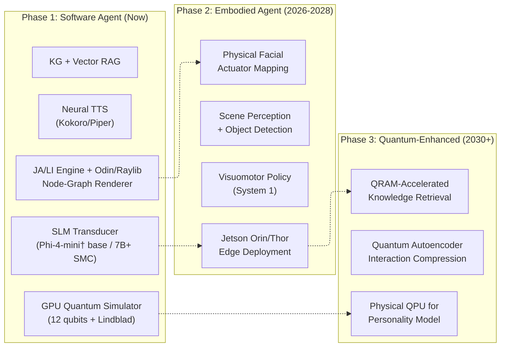

&nbsp;

*Figure 16: Three-phase implementation roadmap.*

&nbsp;

### 16.2 Phase 1: Software Agent (Current Technology — Implementable Now)

**Target domain.** Phase 1 is an **interpretable, edge-deployable, clearly-AI digital presence** for *cognitive-domain* applications: engineering assistance, education and tutoring, knowledge work, technical advising, software-engineering pair work, and customer-service deployments where the user's task is reasoning, exchange of information, and structured problem-solving. The deliberately abstract visual surface (Section 8.1) is selected to match this domain — the value proposition is the agent's *inspectable, traceable internal process*, not the warmth of its physical presence. Phase 2 (below) addresses the orthogonal affective domain where embodiment becomes the dominant signal.

| Component | Technology | Status |
|---|---|---|
| QPM Core | Qiskit Aer GPU simulator, 12 qubits, 1024 shots + noise channels | **Ready** |
| Lindblad Dynamics | Qiskit noise model (AmplDamp + PhaseDamp + Depolarizing) | **Ready** |
| QPM→JSON Translation | Marginal computation + valence/register mapping (Section 5.7) | **Specified** |
| BDI Engine | Python symbolic reasoning + KG (RDFLib/Kuzu) | **Ready** |
| SLM Transducer | Qwen2.5-7B Q4_K_M (SMC-enabled) / Phi-4-mini† (base CA, pending validation) via llama.cpp + LoRA | **Ready** |
| LoRA Fine-Tuning | QLoRA protocol (Section 5.8), PEFT + HuggingFace | **Specified** |
| Neural TTS | Kokoro-82M / Piper via Sherpa-ONNX | **Ready** |
| ASR | Whisper-tiny / Sherpa-ONNX ASR | **Ready** |
| Vector RAG | SQLite-vec + all-MiniLM-L6-v2 (Section 6.4 pipeline) | **Ready** |
| KG Ontology | OWL schema (Section 6.3) + Kuzu embedded graph | **Specified** |
| Contradiction Resolution | KG-RAG resolution protocol (Section 6.5) | **Specified** |
| Node-Graph Renderer | Odin + Raylib wireframe/FACS-color rendering over the muscle rig (Section 8.1) + custom JA/LI engine | **Ready** |
| Entanglement Calibration | Meta-analytic ρ matrix [14] | **Integrated** |
| Evaluation Framework | MOS, PCS, Persona Coherence Over Time (CPCS, Section 15.5), Uncanny valley (Section 15) | **Specified** |

*Table 42: Phase 1 component readiness — all components available today, all interfaces fully specified.*

### 16.3 Phase 2: Embodied Agent (2026–2028)

**Target domain.** Phase 2 extends the architecture into *affective-domain* applications — therapeutic support, elder care, companionship, and the long-running presence work that depends on physical co-location and embodied warmth as the load-bearing perceptual channel. The Phase 1 cognitive stack (QPM, BDI, KG/Vector RAG, SLM, JA/LI) ports forward unchanged; what changes is the surface representation. The same FACS rig that drives the Phase 1 node-graph renderer drives physical facial actuators on a humanoid platform (Table 31), so the Phase 1 → Phase 2 transition is a renderer swap, not a re-architecture. Each phase has a coherent application domain rather than a universal mandate: Phase 1's "clearly-AI digital presence" is a feature for cognitive-domain users; Phase 2's embodied warmth-carrying form is a feature for affective-domain users; neither is required to do the other's job.

| Milestone | Technology | Estimated Timeline |
|---|---|---|
| Edge deployment on Jetson Orin | TensorRT + llama.cpp optimization | 2026 |
| Visuomotor policy training | Sim-to-real transfer (Isaac Sim) | 2026–2027 |
| System 2 → System 1 interface integration | Command schema (Section 11.3) | 2026–2027 |
| Physical facial actuator integration | JA/LI engine → servo mapping (Table 31) | 2026–2027 |
| Scene perception pipeline | Object detection + pose estimation | 2027 |
| Multi-modal sensor fusion | Camera + force/torque + IMU | 2027–2028 |
| Field trials (elder care pilot) | Controlled environment deployment | 2028 |

*Table 43: Phase 2 embodiment milestones.*

### 16.4 Phase 3: Quantum-Enhanced (2030+)

| Milestone | Required Capability | Estimated Timeline |
|---|---|---|
| QPM on physical QPU | ~20 logical qubits, low noise | 2028–2030 |
| QRAM proof-of-concept | ~100 logical qubits, bucket-brigade | 2028–2030 |
| QRAM-accelerated KG retrieval | ~1,000 logical qubits | 2030–2035 |
| Full quantum-enhanced system | ~10⁶ logical qubits | 2035–2040 |

*Table 44: Phase 3 quantum hardware milestones.*

---

## 17. Self-Model Component: Architecture and Empirical Grounding

### 17.1 Overview

The Self-Model Component (SMC) extends the base CA architecture with a dedicated layer for self-referential cognition — the agent's capacity to maintain, update, and express beliefs about its own personality, history, capabilities, and limitations. Unlike the base architecture's knowledge graph (which models domain facts) and QPM (which models personality state), the SMC models the agent's representation of itself as a persistent cognitive object across interactions.

The SMC is a fourth Computation Layer component alongside the QPM, BDI engine, and Knowledge Graph.

### 17.2 Four-Component Architecture

The SMC comprises four interoperating components:

&nbsp;

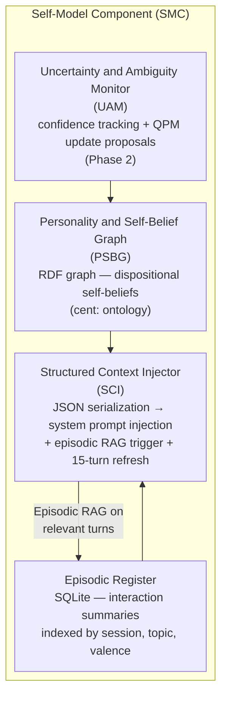

&nbsp;

*Figure 17: Self-Model Component architecture — four interoperating components. UAM is Phase 2 only.*

&nbsp;

1. **Personality and Self-Belief Graph (PSBG)**: An RDF graph storing dispositional self-beliefs (who the agent is) using the `cent:` ontology schema from Section 6.3. The PSBG maintains a strict architectural separation between two belief types:
   - **Phenomenological beliefs** (current QPM state) — immune to revision by definition, per Shoemaker's Immunity from Error through Misidentification (IEM). The agent's present-moment felt state is not a matter for inference or correction.
   - **Dispositional beliefs** (trait characterizations) — evidence-revisable via the AGM belief revision framework. Long-run behavioral patterns may update the agent's self-characterization under specified conditions (see UAM below).

2. **Episodic Register**: A structured database of compressed interaction summaries, indexed by session, topic, and emotional valence. The Episodic Register is architecturally distinct from the PSBG because episodic content requires retrieval-based injection on contextually relevant turns rather than persistent system-prompt presence. This distinction is empirically motivated: Experiment 1 [65] established that full episodic narratives in the system prompt serve dual purpose (explicit recall and implicit dispositional anchoring), while RAG injection on relevant turns improves episodic accuracy.

3. **Uncertainty and Ambiguity Monitor (UAM)**: Tracks confidence in self-beliefs and proposes QPM Hamiltonian parameter updates when 50 or more consistent behavioral indicators accumulate across sessions. All proposed updates require human oversight review before application. The magnitude of any parameter update is bounded by ε derived from personality psychology trait change rates — Roberts and Mroczek (2008) [66] establish that Big Five traits change by at most 0.1–0.3 SD per year of consistent role-anchored experience. The UAM is a **Phase 2 component** (Section 17.5).

4. **Structured Context Injector (SCI)**: Serializes PSBG dispositional content and a compressed episodic narrative summary into a JSON document for system prompt injection. The SCI additionally triggers episodic RAG injection on contextually relevant turns, and refreshes the full SCI at every 15th conversational turn. The refresh interval is empirically grounded: Experiment 1 [65] established T0=15 turns as the piecewise inflection point in persona degradation under the Qwen2.5-7B baseline condition.

### 17.3 Critical Architectural Constraint: Episodic Content Partitioning

Experiment 1 [65] established a counterintuitive but empirically robust finding: salient past events in the system prompt serve dual purpose — explicit episodic recall (unreliable at 7B scale) and implicit dispositional anchoring (robust). Removing episodic narratives from the system prompt for RAG-only delivery caused trait scores to drop below threshold for the first time (Episodic RAG condition: Trait T\* = 10 versus baseline T\* > 40).

Investigation of the Hybrid-RAG condition confirmed that compressed summaries (reduced to topic markers only) do not preserve this implicit anchoring effect: T\* = 5 on the Trait dimension, while achieving the best episodic dimension score across all conditions (E mean = 2.83). The full narrative content — including emotional valence descriptors and behavioral descriptions — provides implicit personality reinforcement that topic markers alone cannot replicate.

**Required partition:** Full episodic narratives must remain in the system prompt for implicit dispositional anchoring. Full episodic details are additionally injected via RAG on contextually relevant turns for improved episodic accuracy. The compressed-summary-only approach was empirically tested and produced trait destabilization — T\* dropped from >40 to 10 on the Trait dimension. **This approach must not be used.**

### 17.4 Relationship to QPM

QPM initialization parameters (Ry rotation angles θ_k, Section 3.4) are session-fixed in Phase 1. The QPM state evolves within a session through context-dependent rotations and Lindblad noise channels, but the initialization angles — encoding the agent's stable personality profile — do not change within a session.

The UAM may propose parameter updates **between sessions only**, never within a session, and only after the 50-indicator threshold is reached. The personality psychology rationale: Roberts and Mroczek (2008) [66] establish that Big Five traits change by at most 0.1–0.3 SD per year of consistent experience. Any within-session QPM update would be psychologically incoherent — faster than any human personality change ever empirically observed.

### 17.5 Phase 1 Implementation Scope

The full Condition C architecture is validated end-to-end by Experiment 2 [67]: **SCI + LoRA-10K SCI grounding adapter (Section 5.8.6) + Combined SCI strategy (refresh at turns 15 and 30, plus episodic RAG on E-dimension probes) constitutes the Phase 1 SMC implementation.** The pre-registered Decision Rule (Section 15.4.2) triggered Outcome A on the strength of Experiment 2's headline result (mean PersonaScore 4.42, ΔE = +0.579 versus the base Qwen2.5-7B + Combined SCI control), retiring the previously planned 14B model test from the critical path.

| Component | Phase 1 Status |
|-----------|----------------|
| **SCI** | Fully specified and implementable now. **Empirically validated at 7B with the LoRA-10K SCI grounding adapter** (Section 5.8.6): mean PersonaScore 4.42/5.0 under Condition C (FT + Combined SCI), Cohen's d = 7.51 versus the no-LoRA control, p ≈ 1.4 × 10⁻²³ on n = 30 paired scripts [67]. |
| **Episodic Register** | Implementable now using SQLite with session, topic, and emotional valence indexing. RAG injection on E-dimension probes is part of the validated Combined SCI strategy. |
| **PSBG** | Implementable now using existing Kuzu KG infrastructure (Section 6.3) with `cent:` ontology schema. |
| **UAM** | **Phase 2 only** — deferred not for capability reasons (the LoRA-10K adapter resolves the 7B episodic recall gap that previously gated the 50-indicator threshold), but pending multi-session production data. The UAM consumes long-horizon behavioral indicators that require multi-day, multi-session usage logs that Phase 1 deployment is intended to collect. |

*Table 46: SMC component implementation scope by phase.*

**H4 base-capability test (resolved post-hoc, PASSED).** The 100-probe out-of-domain battery confirmed that the LoRA-10K adapter does not cause catastrophic forgetting on coding, math, general knowledge, instruction following, or the base structured-intent JSON task — overall +1.71% mean degradation, paired t = −1.07, p = 0.287, Cohen's d_z = −0.107 (full result and per-category breakdown in Section 15.4.2). The single-adapter deployment in Section 17.6 is therefore viable: no dual-mode loading (persona vs general-purpose) is required.

**Remaining deferred follow-ups (not blocking Phase 1 deployment):** cross-model replication on Llama 3.1 8B and Gemma 2 9B (to promote Outcome A from "Qwen-specific" to "7B-class generalization"); Episodic-stratified follow-up training (predicted to clear the Episodic threshold of 3.5 with ~15K examples instead of the ~20K predicted by the H5 overall-scaling curve); a wider H4 re-test focused on Instruction Following (the one category that landed at the threshold with p = 0.0961 on n = 20); and multi-session persistence testing (200+ turns / multi-day).

### 17.6 Deployment Policy by Workload

The validated Phase 1 SMC architecture supports three deployment profiles, each with different infrastructure and persona-consistency tradeoffs. Workload selection is based on persona-consistency requirements rather than model size — the underlying base SLM is the same (Qwen2.5-7B-Instruct) across all three.

| Workload | Architecture | Mean PersonaScore | Infrastructure |
|----------|--------------|------------------:|----------------|
| **Cost-sensitive** | 7B + LoRA-10K, no SCI | 4.02 | Minimal — model only |
| **Standard** | 7B + LoRA-10K + Combined SCI | 4.42 | SCI + RAG pipeline |
| **E-critical (therapy, multi-session)** | 7B + LoRA-10K + Combined SCI + E-stratified LoRA | TBD | Full stack |

*Table 47: Phase 1 SMC deployment policy by workload profile.*

The **Cost-sensitive** profile (Condition A in Experiment 2) achieves a PersonaScore well above the 3.5 threshold using the SCI grounding adapter alone, with no SCI/RAG infrastructure required. Appropriate for workloads where multi-session episodic continuity is not a hard requirement and the operational overhead of refresh injection and retrieval is unwarranted (single-turn API endpoints, stateless customer-support flows). The **Standard** profile (Condition C) adds the SCI + RAG infrastructure for full Aria-grade persona maintenance and is the recommended default for any new SMC-enabled deployment. The **E-critical** profile composes the SCI grounding adapter with an Episodic-stratified follow-up adapter for workloads where session continuity is the critical user-facing requirement (therapy, ongoing tutoring, multi-day support). This profile is a planned follow-up; the expected score is TBD pending the H5 stratified-training experiment (see deferred follow-ups in Section 17.5).

The recommendation is to default to the Standard profile for any new SMC-enabled deployment, downgrade to Cost-sensitive for stateless or single-turn workloads where SCI/RAG infrastructure is not warranted, and reserve E-critical for domains where episodic fabrication has user-safety consequences.

---

## 18. Conclusions

The Centaurian Architecture demonstrates that interpretable, traceable AI and neural network quality are not mutually exclusive — they can be composed in a disciplined hybrid that applies each technology where it excels.

The architecture integrates **four core subsystems**:

1. **The Cognitive Core** employs the Five-Factor Model mapped to an 11-qubit register (12 with ancilla) in a 2,048-dimensional Hilbert space, with personality dynamics governed by operationalized Lindblad noise channels and entanglement calibrated against meta-analytic data (van der Linden et al., 2010; N = 144,117) [14]. This is an instance of Quantum-Like AI running on classical GPU hardware — no quantum computer is required. The Relational Resolution threshold R = min(d_{i-1} − d_i) prevents behavioral jitter. The Quantum-BDI engine maps beliefs, desires, and intentions to quantum operations. Every cognitive decision is fully traceable.

2. **The Neural Periphery** confines neural components to bounded I/O transduction: Qwen2.5-7B-Instruct (Q4_K_M quantized to ~4.3 GB), optionally augmented with the LoRA-10K SCI grounding adapter (~60 MB) for SMC-enabled deployments, converts structured cognitive outputs to natural language, and a lightweight neural TTS model (Kokoro-82M at 350 MB or Piper at 63 MB) synthesizes speech. Neither neural component performs reasoning or knowledge retrieval — the symbolic core handles all cognitive processing. The formal QPM-measurement-to-JSON translation protocol (Section 5.7) specifies exactly how the quantum measurement distribution maps to the structured intent that the SLM consumes, closing the most critical interface gap in prior formulations. Empirical validation across Experiments 1 and 2 confirmed that 3.8B models are below the minimum viable threshold for JSON-based SCI maintenance and that 7B + LoRA-10K + Combined SCI achieves mean PersonaScore 4.42/5.0 (Cohen's d = 7.51 versus the no-LoRA control).

3. **The Domain Knowledge Architecture** combines RDF/OWL ontologies (Section 6.3) with a formally specified vector retrieval pipeline (Section 6.4) and a KG-RAG contradiction resolution protocol (Section 6.5). Domain-specific LoRA adaptation (Section 5.8) requires ~$10–15 GPU compute per domain — orders of magnitude cheaper than training domain-specific LLMs.

4. **The Visual Layer** implements a custom open-source phoneme-to-viseme engine based on the JA/LI two-channel decomposition from Edwards et al. (2016) [45]. The engine consumes TTS-native phoneme timing metadata at zero additional latency and produces deterministic FACS AU weights through a fully auditable pipeline with no proprietary dependencies (0.5 ms/phoneme, CPU-only). For Phase 1, the FACS rig is rendered as an **abstract node-graph wireframe** (Section 8.1) using Odin + Raylib — a clearly-AI digital presence chosen for *interpretability coherence with the symbolic cognitive core*, with FACS-region color coding that makes the agent's affective and articulatory state directly readable from the surface itself. The same FACS rig has a formally specified extension path to physical robot actuators through FACS Action Unit mapping and a System 2 → System 1 command interface (Section 11.3); the Phase 1 → Phase 2 transition is a renderer swap, not a re-architecture.

The base CA system fits within a **~5 GB memory envelope** (Tier 1: Qwen2.5-7B-Instruct Q4_K_M, no LoRA, no SCI infrastructure); SMC-enabled deployments require **~6 GB** (Tier 2: same base SLM plus the ~60 MB LoRA-10K SCI grounding adapter and Combined SCI infrastructure). Both configurations are deployable on current edge hardware from NVIDIA Jetson Orin to flagship smartphones. The three-phase roadmap is organized by **application domain**, not by capability accumulation: Phase 1 (now) is a clearly-AI digital presence optimized for *cognitive-domain* applications — engineering, education, knowledge work, customer service — where inspectability and traceability are the differentiating values; Phase 2 (2026–2028) extends the same cognitive stack into a physically embodied humanoid form for *affective-domain* applications — therapy, elder care, companionship — where physical co-location is the warmth-carrying medium; Phase 3 (2030+) introduces quantum-hardware-enhanced systems. Each phase has a coherent application domain rather than a universal mandate.

The architecture's foundational principle — **apply neural networks exactly where they shine, exclude them where interpretability matters** — offers a practical alternative to the all-neural paradigm. The skeleton is auditable. The skin is natural. And the combination is deployable on the hardware that actually exists at the edge of the network, where embodied AI must ultimately live.

Empirical validation of the self-modeling extension (Section 17) is now complete across Experiments 1 and 2. Experiment 1 [65] established that 7B is the minimum viable SLM scale (3.8B incoherent on JSON-based SCI prompts) and that prompt-time architectural strategies cap mean PersonaScore at 3.20/5.0 — below the 3.5 pre-registered threshold, with the Combined SCI strategy producing a near-flat degradation profile (β≈0). Experiment 2 [67] resolved the residual gap with LoRA fine-tuning: the full Condition C architecture (Qwen2.5-7B + LoRA-10K SCI grounding adapter + Combined SCI) reaches mean PersonaScore 4.42/5.0, ΔE = +0.579 on the Episodic dimension, Cohen's d = 7.51 versus the no-LoRA control. The pre-registered Decision Rule (Section 15.4.2) triggered Outcome A, validating the full Phase 1 SMC architecture at 7B and retiring the previously planned 14B model test from the critical path.

The post-hoc **H4 base-capability test** has now been completed and PASSED (+1.71% mean degradation on a 100-probe out-of-domain battery across 5 categories; paired t = −1.07, p = 0.287; Cohen's d_z = −0.107 — Section 15.4.2 and [67]). With H4 resolved, future work should prioritize: (a) **cross-model replication** on Llama 3.1 8B and Gemma 2 9B to promote Outcome A from a Qwen2.5-7B-specific finding to a 7B-class generalization; (b) **Episodic-stratified follow-up training** (~15K examples, ~50% E-dimension) to clear the Episodic threshold cheaper than the H5 curve's predicted ~20K under overall scaling; (c) a **wider H4 re-test focused on Instruction Following** (the one category that landed at the threshold with p = 0.0961 on n = 20) to confirm the result is a small-sample artifact rather than a real format-strict regression; (d) **multi-session persistence testing** (200+ turn / multi-day scripts) to validate persona consistency beyond the 40-turn experimental ceiling; (e) ablation studies comparing QPM-driven personality consistency against prompt-engineered LLM baselines; (f) field trials of domain-specialized agents in controlled therapeutic and educational settings; (g) physical prototype integration with an open humanoid platform; and (h) investigation of QPM parameter optimization via behavioral consistency feedback. A 14B + LoRA scale test remains scientifically informative as off-critical-path follow-up but is not required for the Phase 1 SMC deployment claim.

---

## 19. Works Cited

1. Zhao, W. X., et al. (2023). A survey of large language models. *arXiv:2303.18223*.
2. Ji, Z., et al. (2023). Survey of hallucination in natural language generation. *ACM Computing Surveys, 55*(12), 1–38.
3. Huang, L., et al. (2023). A survey on hallucination in large language models. *arXiv:2311.05232*.
4. Luccioni, A. S., Viguier, S., & Ligozat, A. L. (2023). Estimating the carbon footprint of BLOOM. *arXiv:2211.02001*.
5. Serapio-García, G., et al. (2023). Personality traits in large language models. *arXiv:2307.00184*.
6. Hu, E. J., et al. (2022). LoRA: Low-Rank Adaptation of Large Language Models. *ICLR 2022*. https://arxiv.org/abs/2106.09685
7. Mathur, M. B., & Reichling, D. B. (2016). Navigating a social world with robot partners. *Cognition, 146*, 22–32.
8. Cohn, M., et al. (2020). Perception of concatenative vs. neural TTS. *Proc. Interspeech 2020*, ISCA. https://www.isca-archive.org/interspeech_2020/cohn20_interspeech.pdf
9. Kokoro-82M: Compact text-to-speech model. Hugging Face, 2024. https://huggingface.co/hexgrad/Kokoro-82M
10. The Five Factor Model of personality structure: an update — PMC. https://pmc.ncbi.nlm.nih.gov/articles/PMC6732674/
11. Costa, P. T., & McCrae, R. R. (1992). *Revised NEO Personality Inventory (NEO-PI-R) professional manual.* Odessa, FL: Psychological Assessment Resources.
12. DeYoung, C. G., Quilty, L. C., & Peterson, J. B. (2007). Between facets and domains: 10 aspects of the Big Five. *Journal of Personality and Social Psychology, 93*(5), 880–896.
13. Digman, J. M. (1997). Higher-order factors of the Big Five. *Journal of Personality and Social Psychology, 73*(6), 1246–1256.
14. van der Linden, D., te Nijenhuis, J., & Bakker, A. B. (2010). The General Factor of Personality: A meta-analysis. *Journal of Research in Personality, 44*(3), 315–327.
15. Theories Of Personality — Jack Westin. https://jackwestin.com/resources/mcat-content/personality/theories-of-personality
16. Affect, Behavior, Cognition, and Desire in the Big Five — PMC. https://pmc.ncbi.nlm.nih.gov/articles/PMC4532350/
17. Understanding persons: From Stern's personalistics to Five-Factor Theory — ResearchGate. https://www.researchgate.net/publication/338537882
18. Busemeyer, J. R., & Bruza, P. D. (2012). *Quantum Models of Cognition and Decision.* Cambridge University Press.
19. Ecologically Relevant Decisions and Personality Configurations — PMC. https://pmc.ncbi.nlm.nih.gov/articles/PMC12731013/
20. Quantum Cognition and the Limits of Classical Probability Models — Computational Culture. http://computationalculture.net/quantum-cognition/
21. Khrennikov, A. (2026). Quantum-like cognition and AI toward the convergence of natural and artificial intelligence. *Discover Artificial Intelligence*, Springer. https://link.springer.com/article/10.1007/s44163-026-00909-w
22. Estimating a Time Series of Interpretation Indeterminacy — eScholarship. https://escholarship.org/content/qt1sh152qk/qt1sh152qk.pdf
23. Royal Society (2025). Theme issue: Quantum theory and topology in models of decision making. *Philosophical Transactions of the Royal Society A*.
24. Busemeyer, J. R., & Bruza, P. D. (2025). *Quantum Models of Cognition and Decision*, 2nd ed. Cambridge University Press.
25. Alodjants, A., et al. (2025). Quantum-inspired modeling of social impact in complex networks with artificial intelligent agents. *Scientific Reports*. https://www.nature.com/articles/s41598-025-22508-y
26. Humr, S., & Canan, S. (2025). A quantum probability approach to improving human–AI decision making. *Entropy / PMC*. https://pmc.ncbi.nlm.nih.gov/articles/PMC11854726/
27. A Quantum-BDI Model for Information Processing and Decision Making — Springer. https://link.springer.com/article/10.1007/s10773-014-2263-x
28. The Effects of Spatial and Temporal Dispersion on Virtual Teams' Performance — AIS. https://aisel.aisnet.org/cgi/viewcontent.cgi?article=1156&context=ecis2016_rp
29. Developing and Evaluating Gamifying Learning System by Using Flow-Based Model. https://www.ejmste.com/download/developing-and-evaluating-gamifying-learning-system-by-using-flow-based-model-4439.pdf
30. Small Language Models 2026: Complete Guide — Local AI Master. https://localaimaster.com/blog/small-language-models-guide-2026
31. Phi-4-Mini Technical Report — arXiv. https://arxiv.org/html/2503.01743v1
32. Llama 3.2 — Ollama. https://ollama.com/library/llama3.2
33. SmolLM3 3B — Hugging Face, 2025.
34. Quantize Llama models with GGUF and llama.cpp — Medium. https://medium.com/data-science/quantize-llama-models-with-ggml-and-llama-cpp-3612dfbcc172
35. NPU Comparison 2026 — Local AI Master. https://localaimaster.com/blog/npu-comparison-2026
36. On-Device LLMs: State of the Union, 2026. https://v-chandra.github.io/on-device-llms/
37. Function Calling with Small Language Models — Microsoft Community Hub. https://techcommunity.microsoft.com/blog/educatordeveloperblog/function-calling-with-small-language-models/4472720
38. Building AI Agents on edge devices using Ollama + Phi-4-mini — Microsoft. https://techcommunity.microsoft.com/blog/educatordeveloperblog/building-ai-agents-on-edge-devices-using-ollama--phi-4-mini-function-calling/4391029
39. TinyAgent: Function Calling at the Edge — arXiv. https://arxiv.org/html/2409.00608v1
40. EdgeRAG: Online-Indexed RAG for Edge Devices — arXiv, 2024. https://arxiv.org/pdf/2409.11055
41. Piper TTS — Rhasspy project. https://github.com/rhasspy/piper
42. Sherpa-ONNX: Speech-to-text, text-to-speech — GitHub. https://github.com/k2-fsa/sherpa-onnx
43. MeloTTS — MyShell AI, 2024.
44. Sherpa-ONNX TTS documentation — DeepWiki. https://deepwiki.com/k2-fsa/sherpa-onnx/3.2-text-to-speech-(tts)
45. Edwards, P., Landreth, C., Fiume, E., & Singh, K. (2016). JALI: An animator-centric viseme model for expressive lip synchronization. *ACM Trans. on Graphics (SIGGRAPH), 35*(4). https://dgp.toronto.edu/~elf/JALISIG16.pdf
46. NVIDIA Open Sources Audio2Face Animation Model — NVIDIA Blog. https://developer.nvidia.com/blog/nvidia-open-sources-audio2face-animation-model
47. A Facial Motion Retargeting Pipeline for Appearance Agnostic 3D Characters — PMC. https://pmc.ncbi.nlm.nih.gov/articles/PMC11653099/
48. Micro and macro facial expressions by driven animations — arXiv. https://arxiv.org/html/2408.16110v1
49. Transferring the Rig and Animations — ResearchGate. https://www.researchgate.net/publication/220507502
50. UniSync: A Unified Framework for Audio-Visual Synchronization — arXiv. https://arxiv.org/html/2503.16357v1
51. AVLaughterCycle — Niewiadomski et al. https://radoslawniewiadomski.github.io/papers/JMUI10_urbainetaldraft.pdf
52. Figure AI Helix VLA — Figure AI, 2025. Dual-system architecture for embodied intelligence.
53. NVIDIA GR00T N1 — NVIDIA, March 2025. Generalist Robot foundation model.
54. Humanoid Robot Cost Guide 2026 — Robozaps. https://blog.robozaps.com/b/humanoid-robot-cost
55. Learning realistic lip motions for humanoid face robots — *Science Robotics*, January 2026. https://pubmed.ncbi.nlm.nih.gov/41533805/
56. Stivers, T., et al. (2009). Universals and cultural variation in turn-taking in conversation. *PNAS, 106*(26), 10587–10592.
57. Park, H. S., & Wiernik, B. M. (2020). Meta-analytic five-factor model personality intercorrelations. *Journal of Applied Psychology, 105*(12), 1490–1529.
58. Pavlick, E., & Tetreault, J. (2016). An empirical analysis of formality in online communication. *Transactions of the ACL, 4*, 61–74.
59. Ho, C.-C., & MacDorman, K. F. (2010). Revisiting the uncanny valley theory: Developing and validating an alternative to the Godspeed indices. *Computers in Human Behavior, 26*(6), 1508–1518.
60. Bagley, J. A., & Petritsch, W. (2025). Cognition in Superposition: Quantum Models in AI, Finance, Defence, Gaming and Collective Behaviour — arXiv. https://arxiv.org/html/2508.20098v1
61. Toward Edge General Intelligence with Agentic AI — arXiv. https://arxiv.org/html/2508.18725v1
62. Hilbert Space Multidimensional Theory — Busemeyer. https://jbusemey.pages.iu.edu/quantum/HilbertPsyRev.pdf
63. Open Systems, Quantum Probability, and Logic for Quantum-like Modeling — PMC. https://pmc.ncbi.nlm.nih.gov/articles/PMC10296982/
64. Knowledge-Enhanced Large Language Models — Fraunhofer FIT. https://www.fit.fraunhofer.de/en/business-areas/data-science-and-artificial-intelligence/knowledge-enhanced-large-language-models.html
65. Drozd, O. (2026). CA Experiment 1: SCI Context Window Degradation Study — Six-Condition Empirical Report. Unpublished manuscript.
66. Roberts, B. W., & Mroczek, D. (2008). Personality trait change in adulthood. *Current Directions in Psychological Science, 17*(1), 31–35.
67. Drozd, O. (2026). CA Experiment 2: LoRA Fine-Tuning for SCI Persona Consistency — Final Report. Unpublished manuscript.
