# Interpretable Architectures for Human-Like Synthetic Intelligence: An Interpretable-Core, Thin-Periphery Approach to Behavioral Realism

---

## Abstract

The pursuit of human-like artificial intelligence has been dominated by stochastic neural-network models that, while powerful at pattern recognition, lack the interpretability and auditability required for trustworthy interpersonal interaction. This paper presents a unified, multi-layered architecture for a human-like AI system designed to operate with the behavioral fidelity of a standard video-communication interface. Rather than eliminating neural networks entirely, the architecture confines them to a **thin perceptual periphery** — input transduction only (speech recognition, vision, OCR) — while keeping all **cognition and all output generation symbolic and fully traceable**. We term this the *interpretable-core, thin-periphery* design.

The cognitive core integrates the Five-Factor Model of personality into a Hilbert-space formalism using empirically calibrated multi-qubit trait encodings (the Quantum Personality Model, QPM), with open-system dynamics realized through Lindblad noise channels and a Relational Resolution gate governing behavioral continuity. The agent's behavior — both natural language and program code — is produced by a **symbolic generation layer**: classical natural-language generation parameterized by the QPM state, and program synthesis over a purpose-designed stack-based language. We argue this layer is not a weaker substitute for a learned generator but a *necessary* one: the QPM's distinctive content — the off-diagonal coherences and mixed-state purity of its density matrix — cannot survive transmission across any interface to a black-box generator, which can consume only the diagonal marginals. A symbolic generator that reads the full density matrix directly is therefore the only output channel capable of expressing what the QPM computes. For code, this property strengthens from *traceability* to *verifiability*.

We provide the quantum circuit design (gate sequences, empirically grounded entanglement derived from meta-analytic personality data, measurement protocols), the refined Relational Resolution formula, an interpretable **wireframe** visual surface that renders the agent's affective and articulatory state directly from a node-graph of its FACS rig, a hybrid system architecture, multi-agent scalability analysis, and a concrete embodiment — ADA, an Advanced Discovery Assistant — as a clearly-AI, fully-local personal agent. We distinguish the system's core property of *traceability* (every output is auditable) from strict *determinism* (which probabilistic quantum measurement does not provide at the single-shot level), and identify this interpretability as the architecture's primary value proposition over neural approaches.

---

## Table of Contents

1. [Theoretical Foundations of Synthetic Personality](#1-theoretical-foundations-of-synthetic-personality)
2. [Quantum Personality Model: Algorithmic Design](#2-quantum-personality-model-algorithmic-design)
3. [Decision Space and Relational Resolution](#3-decision-space-and-relational-resolution)
4. [Addressing the Memory Bottleneck: QRAM (Long-Horizon)](#4-addressing-the-memory-bottleneck-qram-long-horizon)
5. [Multimodal Synthesis: Auditory Layer](#5-multimodal-synthesis-auditory-layer)
6. [Multimodal Synthesis: Visual Layer — Interpretable Wireframe Surface](#6-multimodal-synthesis-visual-layer--interpretable-wireframe-surface)
7. [System Integration and Synchronization](#7-system-integration-and-synchronization)
8. [Integrated Hybrid System Architecture](#8-integrated-hybrid-system-architecture)
9. [Engineering Constraints and Performance](#9-engineering-constraints-and-performance)
10. [Multi-Agent Scalability](#10-multi-agent-scalability)
11. [Implementation Roadmap](#11-implementation-roadmap)
12. [Symbolic Generation: Language and Code](#12-symbolic-generation-language-and-code)
13. [Embodiment: ADA — Advanced Discovery Assistant](#13-embodiment-ada--advanced-discovery-assistant)
14. [Conclusions](#14-conclusions)
15. [Works Cited](#15-works-cited)

---

## 1. Theoretical Foundations of Synthetic Personality

### 1.1 The Five-Factor Model as Cognitive Substrate

The foundation of human-like behavior in an artificial agent is the establishment of a stable yet dynamic personality structure. The Five-Factor Model (FFM), often referred to as the "Big Five," provides the most empirically validated framework for this purpose [1]. The FFM identifies five broad domains that characterize the human experience: **Openness to Experience (O)**, **Conscientiousness (C)**, **Extraversion (E)**, **Agreeableness (A)**, and **Neuroticism (N)** [1]. These domains are rooted in the lexical paradigm, which posits that the most significant personality gradations are encoded within human language through centuries of social evolution [1].

Empirical support for the FFM is substantial, encompassing multivariate behavior genetics, cognitive neuroscience, and cross-cultural replication across dozens of languages [1]. For an artificial system to act realistically, it must adopt this multi-faceted structure. Each domain is further divided into specific facets that provide the granularity required for complex social interaction [1].

| FFM Domain | Description of Poles | Facets (NEO-PI-R) | DeYoung Aspects |
|---|---|---|---|
| **Openness** | Unconventionality vs. Convention | O1 Fantasy, O2 Aesthetics, O3 Feelings, O4 Actions, O5 Ideas, O6 Values | Openness (O1,O2,O3) / Intellect (O4,O5,O6) |
| **Conscientiousness** | Constraint vs. Disinhibition | C1 Competence, C2 Order, C3 Dutifulness, C4 Achievement Striving, C5 Self-Discipline, C6 Deliberation | Industriousness (C1,C4,C5) / Orderliness (C2,C3,C6) |
| **Extraversion** | Sociability vs. Introversion | E1 Warmth, E2 Gregariousness, E3 Assertiveness, E4 Activity, E5 Excitement-Seeking, E6 Positive Emotions | Enthusiasm (E1,E2,E6) / Assertiveness (E3,E4,E5) |
| **Agreeableness** | Altruism vs. Antagonism | A1 Trust, A2 Straightforwardness, A3 Altruism, A4 Compliance, A5 Modesty, A6 Tender-Mindedness | Compassion (A3,A6,A1) / Politeness (A2,A4,A5) |
| **Neuroticism** | Instability vs. Stability | N1 Anxiety, N2 Angry Hostility, N3 Depression, N4 Self-Consciousness, N5 Impulsiveness, N6 Vulnerability | Volatility (N2,N5) / Withdrawal (N1,N3,N4,N6) |

*Table 1: The Five-Factor Model domain and facet structure used as the personality substrate [1][54][55].*

Critically, the five domains are **not orthogonal**. Large-scale meta-analyses reveal systematic inter-domain correlations that cluster into two higher-order factors: **Stability** (also called Alpha: high C, high A, low N) and **Plasticity** (also called Beta: high O, high E) [56][57]. These empirical correlations — detailed in Section 2.5 — directly inform the entanglement structure of the quantum circuit.

### 1.2 From Traits to Behavior: The ABCD Mediation Model

In this architecture, these traits are not "learned" from data but are defined as inherent parameters of the symbolic cognitive core [3]. The relationship between personality and behavior is mediated by the individual's enduring patterns of **Affect, Behavior, Cognition, and Desire (ABCD)** [4]. Personality traits serve as distal causes, leading to the development of contextualized adaptations that interact with the opportunities and demands of the environment [5].

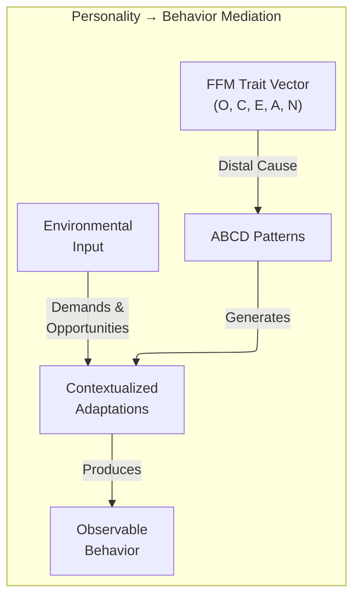

*Figure 1: The ABCD mediation pathway from trait structure to observable behavior.*

---

## 2. Quantum Personality Model: Algorithmic Design

### 2.1 Why Quantum Formalism?

While classical probability theory assumes that mental states are stable and can be derived from a single joint probability distribution, actual human judgment frequently violates these principles [6]. Human decision-making is characterized by ambivalence, overlapping intentions, and sudden changes in perspective — phenomena that classical symbolic logic struggles to capture [7]. Quantum Cognition (QC) does not theorize a quantum physical structure for the brain; instead, it utilizes the mathematical apparatus of quantum mechanics — specifically complex Hilbert spaces and state vectors — as a formal strategy for representing the mind as a dynamic, probabilistic, and context-sensitive system [7][8].

QC naturally reproduces empirically observed violations of classical probability, including:

- **Order effects**: The endorsement probability of a question depends on the sequence of preceding questions (non-commutative observables) [9].
- **Conjunction fallacy**: Probability of A∧B judged higher than P(A) alone (interference terms) [8].
- **Disjunction effect**: Violations of the sure-thing principle under uncertainty (superposition) [8].

### 2.2 State Vectors and Multi-Qubit Trait Encoding

#### 2.2.1 Design Rationale: From Single-Qubit to Aspect-Level Encoding

The original QPM design encoded each FFM domain as a single qubit, yielding a 5-qubit system (plus ancilla) spanning a 32-dimensional Hilbert space. While computationally economical, this collapses the rich multi-facet structure of each domain into a crude high/low dichotomy — a single qubit for Openness cannot distinguish "high Openness via Aesthetics but low Openness via Ideas."

The revised architecture adopts a **2-qubit-per-domain encoding** based on DeYoung et al.'s empirically validated aspect structure [55], which identifies two intermediate-level factors within each FFM domain. This raises the register to **10 trait qubits + 1 ancilla = 11 qubits**, spanning a **1,024-dimensional Hilbert space** (2¹⁰ trait basis states) — still easily simulable on GPU but rich enough to capture within-domain heterogeneity.

For Openness specifically — the domain with the **lowest internal facet cohesion** [55] — we allocate a **third qubit** to capture the particularly weak coupling between its aesthetic-experiential and intellectual-exploratory facets. This yields a final register of **12 qubits** (11 trait + 1 ancilla), spanning a **2,048-dimensional Hilbert space**.

#### 2.2.2 Qubit Register Layout

| Qubit | Label | Role | Encoding |
|---|---|---|---|
| q₀ | O_exp | Openness: Experiential aspect | \|0⟩ = Low Fantasy/Aesthetics/Feelings, \|1⟩ = High |
| q₁ | O_int | Openness: Intellectual aspect | \|0⟩ = Low Actions/Ideas, \|1⟩ = High |
| q₂ | O_val | Openness: Values peripheral | \|0⟩ = Conventional values, \|1⟩ = Re-examining values |
| q₃ | C_ind | Conscientiousness: Industriousness | \|0⟩ = Low Competence/Striving/Discipline, \|1⟩ = High |
| q₄ | C_ord | Conscientiousness: Orderliness | \|0⟩ = Low Order/Dutifulness/Deliberation, \|1⟩ = High |
| q₅ | E_ent | Extraversion: Enthusiasm | \|0⟩ = Low Warmth/Gregariousness/Positive Emotions, \|1⟩ = High |
| q₆ | E_ass | Extraversion: Assertiveness | \|0⟩ = Low Assertiveness/Activity/Excitement-Seeking, \|1⟩ = High |
| q₇ | A_com | Agreeableness: Compassion | \|0⟩ = Low Altruism/Tender-Mindedness/Trust, \|1⟩ = High |
| q₈ | A_pol | Agreeableness: Politeness | \|0⟩ = Low Straightforwardness/Compliance/Modesty, \|1⟩ = High |
| q₉ | N_vol | Neuroticism: Volatility | \|0⟩ = Low Angry Hostility/Impulsiveness, \|1⟩ = High |
| q₁₀ | N_wth | Neuroticism: Withdrawal | \|0⟩ = Low Anxiety/Depression/Self-Consciousness/Vulnerability, \|1⟩ = High |
| q₁₁ | ANC | Ancilla | Entanglement mediator for inter-domain coupling |

*Table 2: Revised QPM qubit register allocation (12 qubits).*

The full composite personality state exists in the tensor product space:

$$|\Psi\rangle = |O_{\text{exp}}\rangle \otimes |O_{\text{int}}\rangle \otimes |O_{\text{val}}\rangle \otimes |C_{\text{ind}}\rangle \otimes |C_{\text{ord}}\rangle \otimes |E_{\text{ent}}\rangle \otimes |E_{\text{ass}}\rangle \otimes |A_{\text{com}}\rangle \otimes |A_{\text{pol}}\rangle \otimes |N_{\text{vol}}\rangle \otimes |N_{\text{wth}}\rangle \in \mathcal{H}^{\otimes 11}$$

This 11-qubit trait system spans a **2,048-dimensional Hilbert space**, enabling representation of personality configurations such as "high experiential Openness with low intellectual Openness" or "high Volatility with low Withdrawal" as distinct basis states — distinctions impossible in a single-qubit-per-domain scheme.

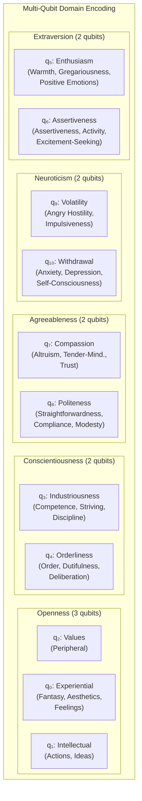

*Figure 2: Multi-qubit aspect-level encoding of the Five-Factor Model.*

### 2.3 The Density Matrix and Open-System Dynamics

For realistic cognitive modeling, the pure state |ψ⟩⟨ψ| is insufficient — the agent must also represent genuine uncertainty about its own configuration. The **density matrix formalism** captures this:

$$\rho = \sum_i p_i |\psi_i\rangle\langle\psi_i|$$

- **Pure state** (ρ² = ρ): Fully coherent cognitive configuration — the agent "knows its mind."
- **Mixed state** (Tr(ρ²) < 1): Genuine internal uncertainty — the agent is ambivalent.
- **Off-diagonal elements** (coherences): Quantify the degree of superposition between behavioral states.

#### 2.3.1 Lindblad Master Equation: Theoretical Framework

Cognitive dynamics follow the **Lindblad master equation**, which governs the evolution of the density matrix:

$$\frac{d\rho}{dt} = -i[H, \rho] + \sum_k \left( L_k \rho L_k^\dagger - \frac{1}{2}\{L_k^\dagger L_k, \rho\} \right)$$

Where:
- **H** is the Hamiltonian governing coherent personality evolution (internal drives, goals).
- **L_k** are Lindblad operators modeling decoherence through environmental interaction — the transition from deliberation to decision.

This naturally models:
- **Procrastination**: Prolonged superposition (slow decoherence).
- **Impulsivity**: Premature collapse (fast decoherence).
- **Ambivalence**: Near-equal amplitudes with high coherence.

#### 2.3.2 Operationalized Implementation via Noise Channels

To bridge the gap between the Lindblad theoretical framework and the circuit-level implementation, we operationalize the decoherence dynamics using **Qiskit's quantum error channels** applied to the density matrix simulation. Rather than solving the continuous-time Lindblad equation analytically, we implement its discrete-time effects through parameterized noise channels that act on the density matrix between circuit execution steps.

**Lindblad Operator Definitions:**

We define three classes of Lindblad operators corresponding to distinct cognitive processes:

| Lindblad Operator | Form | Cognitive Interpretation | Parameter |
|---|---|---|---|
| **L_relax(k)** | √γ_k \|0⟩⟨1\| on qubit k | Trait relaxation toward baseline (amplitude damping) | γ_k = decoherence rate per trait |
| **L_dephase(k)** | √λ_k \|1⟩⟨1\| on qubit k | Environmental noise destroying inter-trait coherence (phase damping) | λ_k = dephasing rate |
| **L_pressure** | √μ σ_z on ancilla | Temporal pressure forcing decisional collapse | μ = pressure coupling |

**Implementation via Qiskit Noise Model:**

```
For each simulation timestep Δt:
  1. Execute QPM circuit (Ry gates + entangling layer + context layer)
  2. Apply AmplitudeDamping(γ_k · Δt) to each trait qubit k
     → Models L_relax: trait drift toward resting state
  3. Apply PhaseDamping(λ_k · Δt) to each trait qubit k
     → Models L_dephase: environmental disruption of superposition
  4. Apply Depolarizing(μ · d₅ · Δt) to ancilla
     → Models L_pressure: temporal pressure (d₅) forcing commitment
  5. Compute ρ(t+Δt) via DensityMatrix simulator
  6. Evaluate Tr(ρ²): if < threshold, agent is in ambivalent state
```

The decoherence rates γ_k and λ_k are calibrated per domain:

| Domain Aspect | γ (Relaxation Rate) | λ (Dephasing Rate) | Rationale |
|---|---|---|---|
| N_vol (Volatility) | 0.15 | 0.20 | Fast relaxation — volatile states are transient |
| N_wth (Withdrawal) | 0.05 | 0.08 | Slow relaxation — withdrawal is persistent |
| E_ent (Enthusiasm) | 0.10 | 0.12 | Moderate — social energy decays at medium rate |
| E_ass (Assertiveness) | 0.08 | 0.10 | Moderate — assertive states have moderate inertia |
| C_ind (Industriousness) | 0.03 | 0.05 | Very slow — conscientious patterns are stable |
| C_ord (Orderliness) | 0.04 | 0.06 | Very slow — orderly habits persist |
| O_exp (Experiential) | 0.12 | 0.15 | Moderate-fast — aesthetic states are context-sensitive |
| O_int (Intellectual) | 0.06 | 0.08 | Moderate — intellectual engagement has inertia |
| O_val (Values) | 0.02 | 0.03 | Slowest — value orientations are highly stable |
| A_com (Compassion) | 0.07 | 0.09 | Moderate — empathic states respond to context |
| A_pol (Politeness) | 0.04 | 0.06 | Slow — social courtesy patterns are habitual |

*Table 3: Per-aspect decoherence parameters for Lindblad noise channel implementation.*

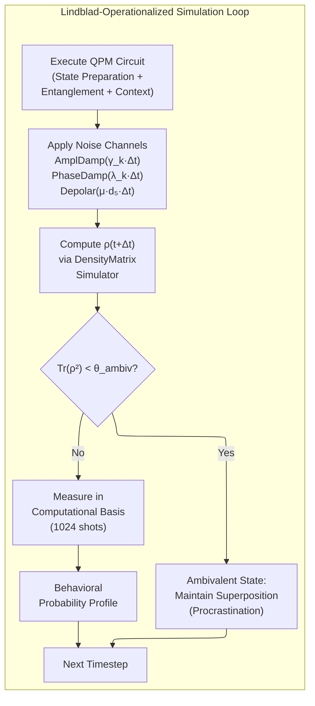

*Figure 3: Operationalized Lindblad simulation loop showing the integration of noise channels with the QPM circuit.*

This implementation ensures that the Lindblad framework is not merely theoretical decoration but is concretely realized in the simulation pipeline. The decoherence rates are tunable parameters that can be calibrated against empirical personality dynamics data — for instance, the observation that neurotic states decay faster than conscientious habits maps directly to γ_N > γ_C.

### 2.4 Complete Quantum Circuit Design

#### 2.4.1 Gate Sequence: State Preparation

Each trait aspect score is derived from the relevant facet subscales of a standard FFM assessment (e.g., NEO-PI-R), normalized to [0, 1], and mapped to a rotation angle θ = π × score. The state preparation circuit applies **Ry rotation gates** to each aspect qubit:

**Step 1 — Aspect-level trait initialization (Ry gates):**

```
q₀:  ─── Ry(θ_O_exp) ───
q₁:  ─── Ry(θ_O_int) ───
q₂:  ─── Ry(θ_O_val) ───
q₃:  ─── Ry(θ_C_ind) ───
q₄:  ─── Ry(θ_C_ord) ───
q₅:  ─── Ry(θ_E_ent) ───
q₆:  ─── Ry(θ_E_ass) ───
q₇:  ─── Ry(θ_A_com) ───
q₈:  ─── Ry(θ_A_pol) ───
q₉:  ─── Ry(θ_N_vol) ───
q₁₀: ─── Ry(θ_N_wth) ───
q₁₁: ─── |0⟩ ───────────  (Ancilla)
```

The Ry gate is defined as:

$$R_y(\theta) = \begin{pmatrix} \cos(\theta/2) & -\sin(\theta/2) \\ \sin(\theta/2) & \cos(\theta/2) \end{pmatrix}$$

For example, an individual scoring 0.7 on the Enthusiasm aspect (high E1 Warmth, E2 Gregariousness, E6 Positive Emotions): θ_E_ent = 0.7π, producing P(enthusiastic) = sin²(0.35π) ≈ 0.794.

### 2.5 Empirically Grounded Entanglement Structure

#### 2.5.1 Meta-Analytic Calibration Data

The entanglement structure of the QPM is calibrated against the **reliability-corrected meta-analytic correlation matrix** from van der Linden, te Nijenhuis, and Bakker (2010) [57], the largest available meta-analysis of Big Five intercorrelations (K = 212 independent samples, total N = 144,117). Corrected (true-score) correlations ρ represent latent trait-level associations free of measurement error:

| | O | C | E | A | N |
|---|---|---|---|---|---|
| **O** | 1.00 | .20 | .43 | .21 | −.17 |
| **C** | | 1.00 | .29 | .43 | −.43 |
| **E** | | | 1.00 | .26 | −.36 |
| **A** | | | | 1.00 | −.36 |
| **N** | | | | | 1.00 |

*Table 4: Meta-analytic corrected inter-domain correlation matrix [57]. Bold pairs indicate the four strongest correlations used for primary entangling gates.*

These correlations reflect the two-factor higher-order structure:
- **Stability cluster** (C, A, −N): C–A = .43, C–N = −.43, A–N = −.36
- **Plasticity cluster** (O, E): O–E = .43

Within-cluster correlations are systematically stronger than between-cluster correlations, informing the hierarchical entanglement architecture.

#### 2.5.2 Mapping Correlations to Entangling Gates

The empirical correlation coefficient ρ between two FFM domains is mapped to a controlled rotation angle using the transformation:

$$\phi_{ij} = \arcsin(\rho_{ij}) \cdot \pi$$

This mapping ensures that:
- ρ = 0 → φ = 0 (no entanglement)
- ρ = ±0.43 → φ ≈ ±0.444π (strong entanglement)
- ρ = ±1.0 → φ = ±π/2 · π (maximum entanglement)

The sign of ρ determines whether the entanglement is **correlating** (positive: CRz with positive phase) or **anticorrelating** (negative: CRz with negative phase, preceded by X gate on target to flip the correlation direction).

#### 2.5.3 Inter-Domain Entangling Layer

**Step 2 — Empirically calibrated inter-domain entanglement:**

The entangling gates are organized by the higher-order factor structure, with gate strengths directly proportional to the meta-analytic ρ values. Only the eight strongest correlations (|ρ| ≥ .26) receive dedicated entangling gates; weaker pairs (O–C = .20, O–A = .21) are captured through indirect paths via the ancilla.

| Gate | Qubits | Empirical Basis | ρ | φ (radians) | Higher-Order Factor |
|---|---|---|---|---|---|
| CRz(q₃, q₉, φ_CN_vol) | C_ind → N_vol | C–N anticorrelation | −.43 | −1.395 | Stability |
| CRz(q₄, q₁₀, φ_CN_wth) | C_ord → N_wth | C–N anticorrelation | −.43 | −1.395 | Stability |
| CRz(q₇, q₉, φ_AN_vol) | A_com → N_vol | A–N anticorrelation | −.36 | −1.157 | Stability |
| CRz(q₈, q₁₀, φ_AN_wth) | A_pol → N_wth | A–N anticorrelation | −.36 | −1.157 | Stability |
| CRz(q₃, q₇, φ_CA) | C_ind → A_com | C–A positive correlation | .43 | +1.395 | Stability |
| CRz(q₀, q₅, φ_OE) | O_exp → E_ent | O–E positive correlation | .43 | +1.395 | Plasticity |
| CRz(q₅, q₉, φ_EN_vol) | E_ent → N_vol | E–N anticorrelation | −.36 | −1.157 | Cross-factor |
| CRz(q₆, q₁₀, φ_EN_wth) | E_ass → N_wth | E–N anticorrelation | −.36 | −1.157 | Cross-factor |
| CNOT(q₀, q₁) | O_exp → O_int | Within-domain O coherence | ~.35 | — | Within-domain |
| CNOT(q₃, q₄) | C_ind → C_ord | Within-domain C coherence | ~.45 | — | Within-domain |
| CNOT(q₅, q₆) | E_ent → E_ass | Within-domain E coherence | ~.40 | — | Within-domain |
| CNOT(q₇, q₈) | A_com → A_pol | Within-domain A coherence | ~.38 | — | Within-domain |
| CNOT(q₉, q₁₀) | N_vol → N_wth | Within-domain N coherence | ~.45 | — | Within-domain |

*Table 5: Empirically calibrated entangling gate inventory. CRz phases derived from van der Linden et al. (2010) corrected ρ values [57]. Within-domain CNOT correlations estimated from NEO-PI-R facet intercorrelation ranges [1][55].*

The controlled-Rz gate introduces a relative phase between entangled states:

$$CR_z(\phi) = |0\rangle\langle 0| \otimes I + |1\rangle\langle 1| \otimes R_z(\phi)$$

$$R_z(\phi) = \begin{pmatrix} e^{-i\phi/2} & 0 \\ 0 & e^{i\phi/2} \end{pmatrix}$$

**Step 3 — Context-dependent rotation (situative variable injection):**

The five situative variables d₁–d₅ (see Section 3) are injected as additional Ry rotations conditioned on the current interaction context. With the multi-qubit encoding, context variables modulate the relevant aspect qubits:

```
q₀:  ── ... ── Ry(δ₁·d₄) ──   (Ambiguity modulates Experiential Openness)
q₁:  ── ... ── Ry(δ₂·d₄) ──   (Ambiguity modulates Intellectual Openness)
q₃:  ── ... ── Ry(δ₃·d₂) ──   (Task Orientation modulates Industriousness)
q₄:  ── ... ── Ry(δ₄·d₂) ──   (Task Orientation modulates Orderliness)
q₅:  ── ... ── Ry(δ₅·d₁) ──   (Affective Intensity modulates Enthusiasm)
q₆:  ── ... ── Ry(δ₆·d₁) ──   (Affective Intensity modulates Assertiveness)
q₇:  ── ... ── Ry(δ₇·d₃) ──   (Social Constraint modulates Compassion)
q₈:  ── ... ── Ry(δ₈·d₃) ──   (Social Constraint modulates Politeness)
q₉:  ── ... ── Ry(δ₉·d₅) ──   (Temporal Pressure modulates Volatility)
q₁₀: ── ... ── Ry(δ₁₀·d₅) ──  (Temporal Pressure modulates Withdrawal)
```

Where δᵢ are coupling constants calibrated to empirical personality–context interaction data.

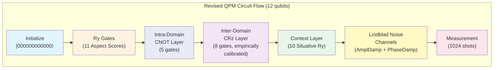

*Figure 4: Revised QPM circuit flow showing the six sequential stages including empirically calibrated entanglement and operationalized Lindblad noise channels.*

#### 2.5.4 Gate Inventory Summary

| Gate | Count | Parameters | Purpose |
|---|---|---|---|
| **Ry** | 21 | 11 static (aspect scores) + 10 context rotations | Trait initialization + context modulation |
| **CNOT** | 5 | — | Within-domain aspect correlation |
| **CRz** | 8 | φ values from meta-analytic ρ matrix | Inter-domain empirically calibrated entanglement |
| **Barrier** | 5 | — | Circuit stage separation |
| **Measure** | 11 | — | State collapse to behavioral output |
| **Total gates** | **50** | 29 parametric | Full circuit depth: ~28 layers |

*Table 6: Complete gate inventory for the revised 12-qubit QPM circuit.*

#### 2.5.5 Measurement and State Collapse

Measurement is performed in the computational basis {|0⟩, |1⟩} on all eleven trait qubits. Each measurement produces an **11-bit string** (e.g., `01101001011`) representing the "collapsed" behavioral configuration at the aspect level:

- Bits 0–2: Openness aspects (Experiential, Intellectual, Values)
- Bits 3–4: Conscientiousness aspects (Industriousness, Orderliness)
- Bits 5–6: Extraversion aspects (Enthusiasm, Assertiveness)
- Bits 7–8: Agreeableness aspects (Compassion, Politeness)
- Bits 9–10: Neuroticism aspects (Volatility, Withdrawal)

To obtain quasi-probabilities (rather than single-shot outcomes), the circuit is executed for **N_shots = 1024 repetitions** using Qiskit's SamplerV2 primitive. The resulting bit-string frequency distribution forms the **behavioral probability profile**:

$$P(\text{bitstring } b) = \frac{\text{count}(b)}{N_{\text{shots}}}$$

**A note on determinism and traceability:** This system is *not deterministic* in the strict sense — individual measurement shots are inherently probabilistic, and the 1024-shot frequency distribution provides statistical convergence rather than exact repeatability. However, the system is fully **traceable and interpretable**: every behavioral output can be audited from input (d₁–d₅ situative variables) through quantum state evolution (Ry rotations, entangling gates, noise channels) to the probability distribution over behavioral configurations. This traceability — not determinism — is the architecture's primary value proposition over neural approaches.

This distribution drives the downstream BDI reasoning engine, which selects the most contextually appropriate behavior from the probability-weighted options.

### 2.6 Scalable State Preparation: GASP and DsiHT

As the number of qubits increases (e.g., adding further sub-facet resolution beyond the current 12-qubit design), standard state preparation becomes expensive. Two algorithms address this:

- **Genetic Algorithm for State Preparation (GASP)**: Uses evolutionary optimization to discover low-depth circuits that transform |00...0⟩ into the target personality vector, minimizing total gate count while respecting hardware connectivity constraints.
- **Signal-Induced Heap Transform (DsiHT)**: Exploits the hierarchical structure of the personality model to build the state vector through a tree-structured sequence of controlled rotations, achieving O(n) depth for n qubits.

### 2.7 Quantum-BDI Integration

The Quantum-BDI model [11] maps the classical Belief-Desire-Intention (BDI) agent architecture onto quantum formalism:

| BDI Component | Classical | Quantum Mapping |
|---|---|---|
| **Beliefs** | Propositional logic | Quantum states allowing superposition of uncertain beliefs |
| **Desires** | Utility functions | Hermitian operators whose expectation values quantify goal achievement |
| **Intentions** | Committed plans | Projective measurements — commitment as wavefunction collapse |

*Table 7: Quantum-BDI mapping [11].*

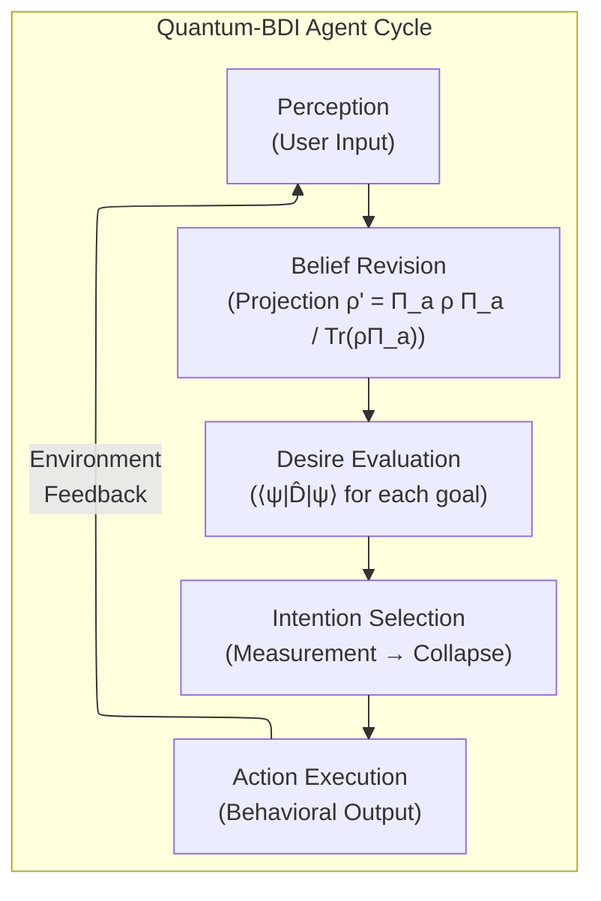

*Figure 5: The Quantum-BDI perception–action cycle.*

---

## 3. Decision Space and Relational Resolution

### 3.1 The Structured Decision Space

The cognitive Hilbert space is coupled with a structured "Decision Space," denoted as 𝔻, which represents the variety of choices an agent can select during an interaction [12]. The system state at any time t is influenced by a subvector of **situative variables** d₁, d₂, d₃, d₄, d₅ [12].

### 3.2 Situative Variables

In a behavioral AI context designed for human interaction, these variables correspond to specific elements of the conversational environment:

| Variable | Name | Definition | Computational Role |
|---|---|---|---|
| d₁ | Affective Intensity | Emotional magnitude of the user's input | Scalar Magnitude — increases state vector length/arousal |
| d₂ | Task Orientation | Proximity to the communicative goal | Positional Marker — drives toward task-oriented state collapse |
| d₃ | Social Normative Constraint | Degree of formality or situational pressure | Boundary Constraint — limits the axes available for projection |
| d₄ | Ambiguity Level | Uncertainty or polysemy in received information | Interference Coefficient — controls the degree of superposition |
| d₅ | Temporal Pressure | Latency or time-limitations of the exchange | Trigger Scalar — forces state collapse under time constraints |

*Table 8: Situative variables defining the fitness landscape of interaction [13].*

These variables define a "fitness landscape" where the agent's behavioral rules guide its movement [12]. In the symbolic core, these rules are implemented as a **hierarchy of decision trees** merged into a single interpretable structure [14]. Unlike black-box neural networks, this structure identifies the key variables influencing every classification outcome [14].

### 3.3 The Relational Resolution Formula

The stability of the system's behavior is governed by the **Relational Resolution** mechanism, which gates whether the cognitive state is allowed to transition on a given turn. The original formulation collapsed the *change being measured* and the *threshold it is compared against* into a single expression and did not specify how the five situative dimensions combine; the formulation below separates the two.

At each conversational turn t, the system computes the **maximum absolute change** across all five situative dimensions:

$$\Delta d(t) = \max_{i \in \{1,2,3,4,5\}} \left| d_i(t) - d_i(t-1) \right|$$

where t is the conversational turn index (advancing once per user utterance) and i indexes the situative variables d₁–d₅.

**R** is a calibrated scalar threshold (default **R = 0.15**) representing the minimum change magnitude required to trigger a cognitive state transition [7]. The gate condition is:

$$\Delta d(t) < R \;\Rightarrow\; \text{maintain behavioral continuity (retain current } \rho, \text{ dephasing only)}$$

$$\Delta d(t) \geq R \;\Rightarrow\; \text{trigger state collapse (run QPM circuit, project } |\psi\rangle)$$

At t = 1 no prior state exists, so Δd is undefined and a transition fires by default — the QPM circuit runs fresh from the personality initialization angles θ_k. The use of **max** (rather than min or mean) is deliberate: the agent should respond to a significant shift in *any single* situative dimension — for example a sudden spike in d₁ (Affective Intensity) during an emotionally charged utterance — regardless of whether the other four remain stable. Gating on Δd prevents unnecessary circuit executions on turns where context has not changed meaningfully, and suppresses the "hyper-consistent" or "jittery" responses characteristic of purely reactive data-driven models, mimicking the emotional inertia of biological humans [7]. When the threshold is exceeded, affective pressure — modeled as the length of the state vector — makes a "collapse" into a specific behavioral pole more mathematically likely.

R is a per-deployment parameter trading behavioral responsiveness against continuity — a lower R yields a more reactive agent, a higher R a more inertially stable one. It may further be made **personality-consistent**: agents initialized with high Neuroticism (N_vol, N_wth) take a lower R (higher reactivity), while agents high in Conscientiousness (C_ind, C_ord) take a higher R (greater stability), coupling the stability mechanism back to the trait substrate rather than treating R as a free constant.

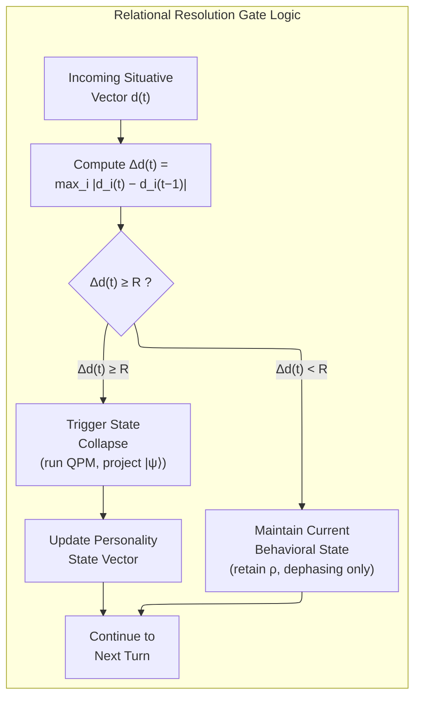

*Figure 6: The refined Relational Resolution gating mechanism.*

### 3.4 Interference and Contextuality

The primary advantage of the Hilbert space multidimensional (HSM) model is its ability to account for **interference effects** [6]. In human cognition, different mental options interact like waves, reinforcing or canceling each other out [9]. The system captures this through the quantum probability rule:

$$P(A \text{ then } B) = |\langle B | A \rangle|^2 \neq |\langle A | B \rangle|^2 = P(B \text{ then } A)$$

This non-commutativity ensures that the AI's behavior is not a static response to a prompt but a temporally evolving interaction where each turn of the conversation influences the AI's internal state in a **non-commutative manner** [9] — the Question Order Effect (QOE).

| Quantum Concept | Psychological Definition | Computational Application |
|---|---|---|
| Hilbert Space | Potential mental space | Multidimensional representation of trait configurations |
| Superposition | Coexistence of mental states | Modeling ambivalence and indecision |
| Interference | Mutual influence between options | Modifying preference based on relational context |
| State Collapse | Decision/Verbalization point | Transition from potential to realized behavior |
| Projection | Mathematical outcome | Mapping internal state to observable output |
| Entanglement | Correlated trait dimensions | Inter-trait dependencies (empirically calibrated) |
| Decoherence | Loss of deliberative state | Environmental pressure forcing commitment (operationalized via noise channels) |

*Table 9: Extended quantum-to-psychological mapping.*

---

## 4. Addressing the Memory Bottleneck: QRAM (Long-Horizon)

> **Scope note.** This section is retained as a **long-horizon research direction**, not a near-term dependency. Classical approximate-nearest-neighbour and tree/LSH indexing already solve concatenative unit-selection search in milliseconds today (see Section 11.2), so QRAM is not required for any implementable-now deployment; and full-database QRAM requires on the order of 10⁷ physical qubits, roughly four orders of magnitude beyond current hardware. The only quantum-*like* component on the critical path is the GPU-simulated QPM (Section 2). The material below documents the future scaling pathway for the speech-unit memory.

### 4.1 The Storage Problem

A concatenative synthesis system requires a massive database of pre-recorded human speech and interaction segments. A typical concatenative TTS database stores ~10⁶ diphone or polyphone units, each comprising approximately 50 ms of audio at 16 kHz (800 samples × 16 bits = **12,800 bits per unit**), totaling ~12.8 gigabits of raw classical data [15]. When this is extended to include laughter segments, emotional variants, prosodic variations, and multi-speaker databases, the storage requirement grows to the **exabyte scale** — an "astronomical memory" cost that classical storage can handle in capacity but not in search latency for real-time unit selection.

### 4.2 QRAM: Coherent Retrieval in Superposition

**Quantum Random Access Memory (QRAM)** implements the core unitary transformation [16]:

$$\sum_i \alpha_i |i\rangle|0\rangle \rightarrow \sum_i \alpha_i |i\rangle|D_i\rangle$$

Where |i⟩ is an n-qubit address register indexing N = 2ⁿ memory cells and D_i is the classical data stored at address i. The critical capability is **superposition access**: given an address superposition, the QRAM coherently produces all corresponding data entries in a single query, enabling quantum search algorithms to evaluate exponentially many candidates simultaneously.

### 4.3 Bucket-Brigade Architecture

The bucket-brigade design, introduced by Giovannetti, Lloyd, and Maccone [16], arranges **N − 1 quantum routers** in a binary tree with n levels. Each router is a three-state system (qutrit) with states |0⟩ (route left), |1⟩ (route right), and |W⟩ (wait/idle).

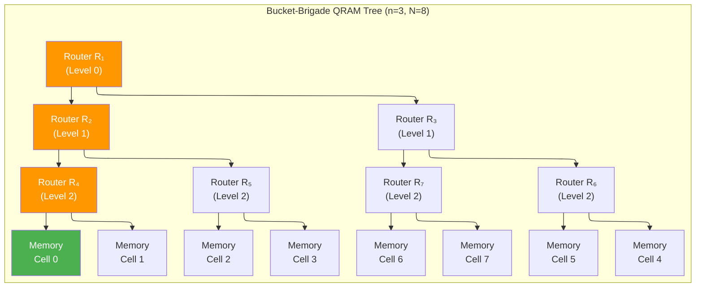

*Figure 7: Bucket-brigade QRAM binary tree for N=8. Orange nodes show the active path for address |000⟩; only O(log N) = 3 routers are activated per query.*

**Retrieval operates in three phases:**

**Phase 1 — Address Loading:** Address qubits are sequentially routed into the tree. The first address qubit a₀ sets the root router's state, the second a₁ follows the path determined by a₀, and so on.

**Phase 2 — Data Retrieval:** Once all n address qubits have been routed, a unique root-to-leaf path is established. A bus qubit follows this path and retrieves stored data via CNOT or phase operations at the target memory cell.

**Phase 3 — Uncomputation:** The address loading is reversed to disentangle the router qubits, leaving only the address-data correlation.

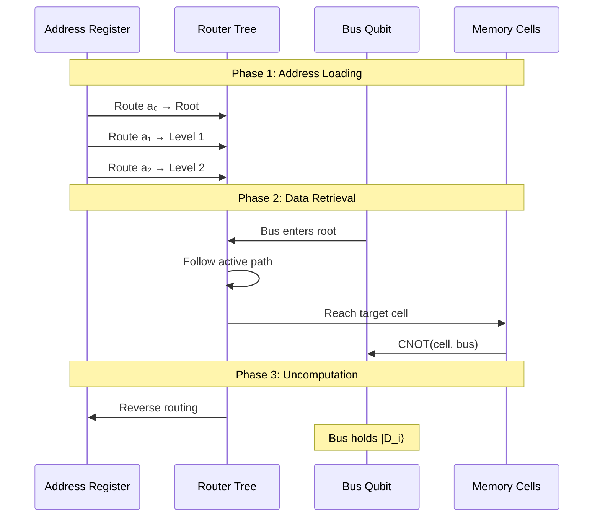

*Figure 8: QRAM query protocol showing the three-phase retrieval sequence.*

### 4.4 Noise Resilience: The Key Advantage

The bucket-brigade's decisive advantage is that only **O(log N) routers** are active per query — the remaining ~N routers stay in the idle |W⟩ state [17]. This creates a W-state-like entanglement structure (rather than noise-vulnerable GHZ-like entanglement of fanout designs), yielding query infidelity that scales as:

$$\epsilon_{\text{query}} = O(\epsilon_{\text{gate}} \cdot \text{polylog}(N))$$

This was proven by Hann, Lee, Girvin, and Jiang (2021) [17] to hold for depolarizing noise, coherent errors, initialization errors, and spatially correlated noise.

### 4.5 Comparative QRAM Architecture Landscape

| Architecture | Qubits | T-depth | Noise Model | Best Use Case |
|---|---|---|---|---|
| **Bucket-Brigade** [16] | O(N) routers | O(log N) | Polylog resilience | General-purpose, proven noise properties |
| **FF-QRAM** [18] | O(n) | O(2ⁿ · m) | Standard | Small NISQ demonstrations |
| **QRAM_poly** [19] | O(√N) | **O(log log N)** | Fault-tolerant | Long-term fault-tolerant deployment |
| **Virtual QRAM** [20] | O(M), M ≪ N | O(N/M · log M) | Standard | Reduced hardware with virtual memory |
| **Fat-Tree QRAM** [21] | O(N) | O(log N) | Parallel queries | Shared-memory quantum computing |
| **Stab-QRAM** [22] | O(N) | **0 T-gates** | All-Clifford | Structured data with affine Boolean symmetry |
| **Gate-Teleportation** [23] | O(N) resource | O(1) query | Built-in fault suppression | Neutral-atom arrays |

*Table 10: Comparative QRAM architecture landscape (2024–2025 state of the art).*

### 4.6 Resource Estimates for a Million-Unit Speech Database

| Parameter | Value | Notes |
|---|---|---|
| Database entries | 10⁶ units | Diphones + polyphones + variants |
| Bits per entry | 12,800 | 50ms × 16kHz × 16-bit |
| Address qubits | 20 | ⌈log₂(10⁶)⌉ |
| Data bus qubits | 12,800 | Full audio unit |
| Routing tree qubits | ~10⁶ | One router per internal node |
| Total logical qubits | ~1,012,820 | Address + bus + routing |
| Physical qubits (surface code, d=7) | **~10⁸** | Uniform error correction |
| Physical qubits (heterogeneous EC) | **~2 × 10⁷** | 5× reduction [24] |
| Current hardware (2025) | ~1,200 qubits | IBM Condor / Heron |
| **Gap factor** | **~10⁴** | Four orders of magnitude |

*Table 11: QRAM resource estimates for a concatenative TTS database.*

### 4.7 Experimental QRAM Status (2025)

Recent experimental milestones demonstrate the trajectory:

- **Shen et al. (June 2025)** [25]: First bucket-brigade QRAM on superconducting hardware — 2-layer fidelity of 0.800 ± 0.026, 3-layer fidelity of 0.604 ± 0.005.
- **Zhang et al. (May 2025)** [26]: Coherent quantum routers on "Wukong" 72-qubit processor — single-layer transmission efficiency of 98%, two-layer efficiency of 93%.
- **Weiss, Puri, Girvin (2024)** [27]: 3D superconducting cavity architectures with millisecond coherence and built-in photon-loss detection.

### 4.8 Quantum Autoencoder Compression

**Quantum autoencoders** [28] can compress high-dimensional classical interaction data into lower-dimensional latent spaces within the Hilbert space:

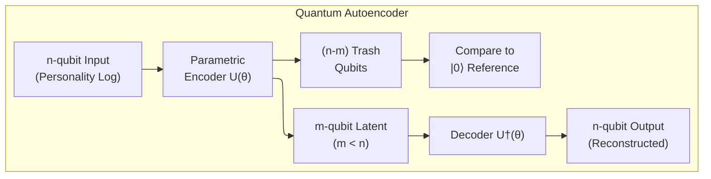

*Figure 9: Quantum autoencoder architecture for interaction data compression.*

Experimental demonstrations have achieved compression ratios of 2:1 with fidelities of ~0.99 for structured quantum data [28]. For this system, quantum autoencoders are best positioned for compressing **personality interaction logs** (which exhibit exploitable symmetry structures) rather than raw audio waveforms, where amplitude encoding overhead negates compression benefits.

### 4.9 QRAM-Enhanced Unit Selection: Grover Search Integration

The three-tier architecture for QRAM-accelerated unit selection integrates quantum search with the classical TTS pipeline:

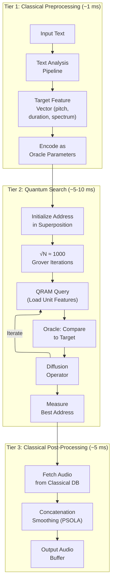

*Figure 10: Three-tier QRAM-enhanced unit selection pipeline.*

Each QRAM query requires O(log N) = 20 gate layers at ~100 ns per gate ≈ **2 μs per query**, fitting within superconducting qubit coherence windows of 50–300 μs. With ~1,000 Grover iterations, quantum processing takes approximately 2–5 ms.

---

## 5. Multimodal Synthesis: Auditory Layer

### 5.1 High-Intelligibility Auditory Synthesis

For a synthetic agent to be indistinguishable from a human in a Zoom call, its voice must be clear, emotionally congruent, and highly intelligible. Without neural vocoders or autoregressive models, the system relies on two complementary techniques [29]:

1. **Concatenative Unit Selection Synthesis**
2. **Linear Predictive Coding (LPC)**

### 5.2 Concatenative Unit Selection

Concatenative synthesis produces speech by stitching together pre-recorded segments of human speech from a single speaker database [30]. The system uses "Unit Selection," where units (phonemes, diphones, or triphones) are selected based on a state transition network [31].

The selection minimizes two costs [31]:

1. **Target Cost C_t(t_i, u_i)**: The distance between a database unit u_i and the target specification t_i, considering prosodic context, phonetic identity, pitch, and duration.
2. **Concatenation Cost C_c(u_{i-1}, u_i)**: An estimate of the quality of the join between two consecutive units, based on spectral discontinuity and pitch mismatch at boundaries.

The optimal unit sequence U* is found via:

$$U^* = \arg\min_{u_1,...,u_n} \sum_{i=1}^n \left[ w_t \cdot C_t(t_i, u_i) + w_c \cdot C_c(u_{i-1}, u_i) \right]$$

Research indicates that concatenative TTS often provides **higher intelligibility in noisy environments** compared to neural models, as each segment is hyper-articulated and clear [29].

### 5.3 Linear Predictive Coding (LPC) and Vocal Tract Modeling

LPC models the human vocal tract as a simplified all-pole filter [32]. The speech signal is represented as a time-varying waveform where an excitation source (modeled as an impulse train for voiced speech) is passed through a filter defined by coefficients representing the physical properties of the vocal organs [32].

LPC represents a compact parametric form of speech, providing **28 voice quality variables** for modifying pitch, speech rate, and intonation in real time based on the agent's emotional state [32].

### 5.4 Rule-Based Emotion and Prosody

The AI injects affective content into speech through a rule-based emotion synthesis engine that modifies parameters based on the current state vector |ψ⟩ [33]:

| Emotional State | Pitch Contour | Speech Rate | Intensity | Articulation |
|---|---|---|---|---|
| **Arousal/Fear** | Significantly raised + vibrato | Increased | High | Hyper-articulated |
| **Dominance/Anger** | Raised, wider range | Slightly increased | High, plosive emphasis | Hyper-articulated |
| **Sadness** | Lowered + laryngealisation | Decreased | Low | Under-articulated |
| **Joy/Excitement** | Raised, dynamic | Increased | Moderate-high | Clear, open |
| **Calm/Neutral** | Mid-range, steady | Normal | Moderate | Standard |

*Table 12: Rule-based prosodic modifications by emotional state [33].*

### 5.5 Limitations and Boundary Effects

It should be acknowledged that even the highest-quality concatenative systems produce audible artifacts at segment boundaries. Modern neural TTS systems (e.g., VITS, XTTS) have objectively surpassed concatenative synthesis in naturalness, prosodic variation, and Mean Opinion Scores (MOS) for general-purpose speech generation. The choice of concatenative synthesis in this architecture is motivated by three specific engineering properties: (1) full traceability of the synthesis process — every output segment can be traced to a specific database entry; (2) CPU-bound operation eliminating GPU dependency at the synthesis stage; and (3) guaranteed absence of hallucinated phonemes or prosodic patterns. Whether these traceability benefits outweigh the naturalness gap depends on the deployment context and tolerance for minor boundary artifacts. In a Zoom-call context with typical compression artifacts and variable audio quality, the gap is partially masked, but it remains a genuine limitation. Under the interpretable-core, thin-periphery framing established in Section 8.1, a lightweight neural vocoder is an admissible *output-side* periphery component where naturalness is paramount — the symbolic core and the *content* of speech are unaffected by that choice.

---

## 6. Multimodal Synthesis: Visual Layer — Interpretable Wireframe Surface

### 6.1 An Interpretable Wireframe Surface

The visual surface is **not** a photorealistic 3D character. The agent presents itself through an abstract **node-graph rendering** of the underlying FACS-driven mesh — a luminous wireframe of the agent's **face and shoulders** in which the same muscle rig described below drives the vertices, but the renderer replaces filled triangles and skin shading with thin emissive edges and nodes over a dark background. The agent is unmistakably identifiable as a face — orientation, expression, viseme — and unmistakably synthetic.

**Why a wireframe rather than a photorealistic surface.** This is a deliberate interpretability decision, not a compute compromise. The cognitive core is symbolic, quantum-like, and fully auditable; presenting it through a photorealistic skin would create a *representational mismatch* — a system whose every internal decision is traceable would project an outward face whose only legible signal is "human-like." A node-graph rendering keeps the visual layer coherent with the rest of the stack: the user sees *what the agent is*, not what it is trying to imitate. Every interface — symbolic core, structured intent, surface rendering — speaks the same language of explicit, inspectable structure. The choice also positions the agent deliberately *below* the uncanny-valley zone: a wireframe does not aspire to human-likeness and so does not trigger the eeriness response that almost-human filled-skin avatars do.

**FACS-region colour coding as a continuous interpretability surface.** Beyond the wireframe aesthetic, the renderer uses **colour to expose the FACS Action-Unit activations themselves**. The 28 muscle patches (Section 6.2) are grouped into anatomical regions (forehead/brow, eyes, midface, mouth, jaw), each assigned a distinct hue; as the rig fires, the vertices and edges in the activated region glow with intensity proportional to AU weight. A worried agent literally has visibly active corrugator nodes; an emphatic viseme lights up the orbicularis-oris region in real time. The agent's emotional and articulatory state is thus *directly readable from the surface itself*, with no hidden affect channel. The colour map is a fixed, deterministic, trivially auditable lookup table. Where prior interpretable systems expose internal state only through side panels, the surface here is itself a live interpretability display.

**Surrounding instrumentation.** The central rendering is framed by live panels exposing the agent's internal state at the moment of speech: the QPM measurement distribution, the structured intent the BDI engine just emitted, the active subgraph of the knowledge graph used for the current response, and a streaming transcript with speaker attribution.

**Stack.** The wireframe surface is rendered with **Odin + Raylib** — CPU-side mesh transform plus a thin GPU pass through Raylib's OpenGL/Metal back end — rather than a general game engine such as Unity/C#. This is consistent with the architecture's interpretability thesis: Odin compiles to a small native binary with no proprietary runtime dependency, Raylib is open-source under the permissive zlib license, and the combined toolchain is auditable end-to-end alongside the symbolic core. The renderer consumes the same FACS Action-Unit weight stream that drives the muscle rig (Section 6.2); only the surface representation is a wireframe, so a future swap to a different surface (textured mesh, robot actuator) requires no upstream change.

### 6.2 The Anatomical Muscle Rig

Beneath the wireframe renderer, expression is parameterized by a "Muscle Rig" — an anatomy-inspired module consisting of **28 template muscle patches** corresponding to the primary muscles involved in human expression [34].

| Muscle Patch | Anatomical Equivalent | Visual Expression |
|---|---|---|
| LLSAN/LLS | Levator Labii Superioris | Upper lip raiser / Nose wrinkler |
| Corrugator | Corrugator Supercilii | Brow furrow (worry/anger) |
| Orbicularis Oris | Orbicularis Oris | Lip closure / Pucker |
| Depressor | Depressor Anguli Oris | Mouth corner lowering (sadness) |
| Zygomaticus | Zygomaticus Major | Lip corner raising (happiness) |
| Frontalis | Frontalis | Brow raising (surprise) |
| Mentalis | Mentalis | Chin dimpling (doubt) |
| Buccinator | Buccinator | Cheek compression |

*Table 13: Key muscle rig patches and their expressions [34].*

Each muscle abstraction has its own local deformation space, covering both active contraction and passive movement. The rig uses local blendshapes describing a muscle's independent status, enabling "parallel parameterization" where captured or procedurally generated intensities drive the **Action Units (AUs) of the Facial Action Coding System (FACS)** [35].

### 6.3 The JALI Viseme Field

Speech-driven facial animation is governed by the **JALI (Jaw and Lip) model** [36], based on the psycholinguistic observation that visual speech variation is primarily controlled by two independent anatomical actions: jaw motion and lower-face muscle (lip) action [36].

Instead of a one-to-one mapping from phoneme to viseme, JALI defines a **2D "viseme field"**. Each phoneme corresponds to a point along Jaw (JA) and Lip (LI) axes:

| Speaking Style | JA/LI Coordinates | Description | Cognitive Trigger |
|---|---|---|---|
| **Mumble** | (0.2, 0.2) | Low-energy, minimal facial action | High Withdrawal (N_wth) or low Industriousness (C_ind) |
| **Ventriloquist** | (0.0, 0.8) | Locked jaw, high muscle tension | High Social Constraint (d₃) |
| **Drone** | (0.9, 0.1) | Wide opening, relaxed muscles | Low engagement, routine speech |
| **Emphasized** | (0.8, 0.8) | Dynamic, forceful articulation | High Affective Intensity (d₁), formal context |

*Table 14: JALI speaking styles linked to cognitive state [36].*

### 6.4 Real-Time Vertex Deformation

The 3D model is updated in real time using hardware-accelerated vertex movement [37]. Techniques include:

- **Radial Basis Function (RBF) warping**: Retargets animations from a generic rig to specific character morphology.
- **Free-Form Deformation (FFD)**: Provides smooth, volume-preserving deformations.
- **Graph-based micro-geometry simulation**: Skin pores treated as graph nodes with iterative optimization to "carve out" wrinkles during muscle contraction, avoiding the Uncanny Valley [35].

---

## 7. System Integration and Synchronization

### 7.1 Audio-Visual Synchronization Requirements

Humans can detect audio-visual desynchronization within a range of **+45 to −125 milliseconds** [38]. The system achieves synchronization using **Forced Alignment** via Hidden Markov Models (HMMs) to align the phonetic sequence with the generated audio waveform [36].

### 7.2 Co-articulation Rules

Co-articulation rules prevent the "mechanical" look of isolated phoneme pronunciation [36]. Because humans anticipate the next sound, the system blends visemes into co-articulated action units — for example, lips begin rounding for /w/ while the previous phoneme is still being articulated [36].

| Synchronization Component | Role | Technique |
|---|---|---|
| Front-end Tokenizer | Text normalization | Linguistic rules |
| HMM Aligner | Temporal mapping | Viterbi forced alignment |
| JALI Modulator | Expressive shaping | Acoustic feature mapping |
| FIR Filter | Signal smoothing | Hanning/Blackman windows |

*Table 15: Synchronization pipeline components [39].*

### 7.3 Biofeedback and Laughter Cycles

The system includes biofeedback responses, such as a "laughter cycle" where the AI joins the user's laughter by selecting acoustically similar laughter components from an unmodified human database [40]. This reinforces engagement and immersion without the artifacts of real-time synthesis [40].

---

## 8. Integrated Hybrid System Architecture

### 8.1 The Centaurian Tripartite Model

The unified architecture follows a **Centaurian Tripartite Model** where classical and quantum components coexist in a unified computational graph. The three layers operate at different timescales using appropriate hardware:

**The interpretable-core, thin-periphery principle.** Before the runtime layering, it is worth stating the principle that fixes *where* neural and symbolic components are allowed to live — a boundary dictated by where each paradigm is irreducible rather than chosen by preference. The agent's capabilities partition into three tiers:

- **Tier A — Perception (input transduction): neural, by necessity.** Recognizing a spoken utterance (ASR), a face's expression for the d₁ arousal estimate, an object in a photograph, or text on a scanned document (OCR) are learned-features problems with no symbolic route. These components form a **thin neural periphery** and are *input-only* — they transduce the world into structured signals; they never generate the agent's behavior.
- **Tier B — Cognition: symbolic, traceable.** The QPM (Section 2), the knowledge graph, the Quantum-BDI engine, and the Relational Resolution gate (Section 3.3).
- **Tier C — Generation: symbolic, traceable → verifiable.** Language and code (Section 12), realized symbolically so the QPM's full state can drive output and every utterance or program remains auditable.

The one genuinely hard seam is between A and B *for language*: natural-language **understanding** — turning an arbitrary utterance into a structured intent the core can act on. Bounded or templated phrasings yield to grammar-based semantic parsing and stay symbolic; fully open phrasing is where a periphery component earns its place. The depth of the neural periphery at this seam is therefore a deployment decision, stated explicitly rather than hidden.

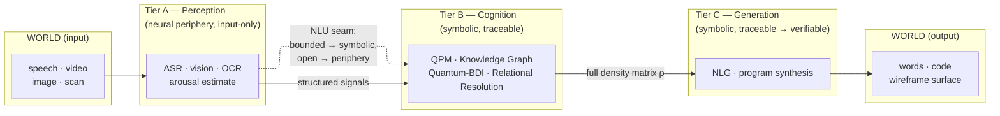

*Figure 11: The interpretable-core, thin-periphery partition. Only Tier A is neural and it is input-only; cognition and generation are symbolic and auditable. The hard seam is natural-language understanding between A and B.*

The runtime realization of these tiers across hardware timescales follows the layered model below:

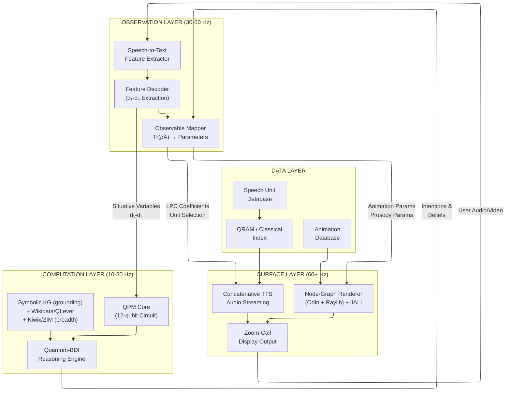

*Figure 12: Complete Centaurian Tripartite System Architecture.*

### 8.2 Layer Specifications

| Layer | Component | Update Rate | Implementation | Latency Budget |
|---|---|---|---|---|
| **Computation** | QPM Core | 10–30 Hz | GPU quantum simulator (Qiskit Aer), 12 qubits, 1024 shots | 2–4 ms |
| **Computation** | Quantum-BDI Reasoning | 10–30 Hz | Cached plan lookup + belief revision | 1–2 ms |
| **Computation** | Domain ontology (grounding) | On-demand | RDF/OWL ontology (Apache Jena) | < 1 ms |
| **Computation** | Breadth KG (encyclopedic) | On-demand | Wikidata via QLever | ~ms–sub-s (off frame path) |
| **Computation** | Text store (explanations) | On-demand | Offline Wikipedia (Kiwix/ZIM) | ~ms (off frame path) |
| **Observation** | Speech-to-Text | 30–60 Hz | Classical ASR pipeline | 2–3 ms |
| **Observation** | Feature Decoder (d₁–d₅) | 30–60 Hz | Rule-based extraction on GPU | 1–2 ms |
| **Observation** | Observable Mapper | 30–60 Hz | Tr(ρÂ) → parameter mapping | 1 ms |
| **Surface** | Node-Graph Renderer (Odin + Raylib) | 60+ Hz | Wireframe over muscle rig + JALI (CPU transform + thin GPU pass) | 8–11 ms |
| **Surface** | Concatenative TTS | Real-time | CPU-bound LPC + unit selection | 2–3 ms |
| **Surface** | A/V Sync | 60+ Hz | HMM forced alignment | < 1 ms |
| | **Inter-component IPC** | | ZeroMQ IPC / shared memory | 1–2 ms |
| | **TOTAL** | | | **~18–24 ms** |

*Table 16: Detailed latency budget for the full pipeline. Note: the 12-qubit QPM adds ~2 ms over the original 6-qubit design but remains well within the perceptual synchronization window.*

### 8.3 Detailed Data Flow

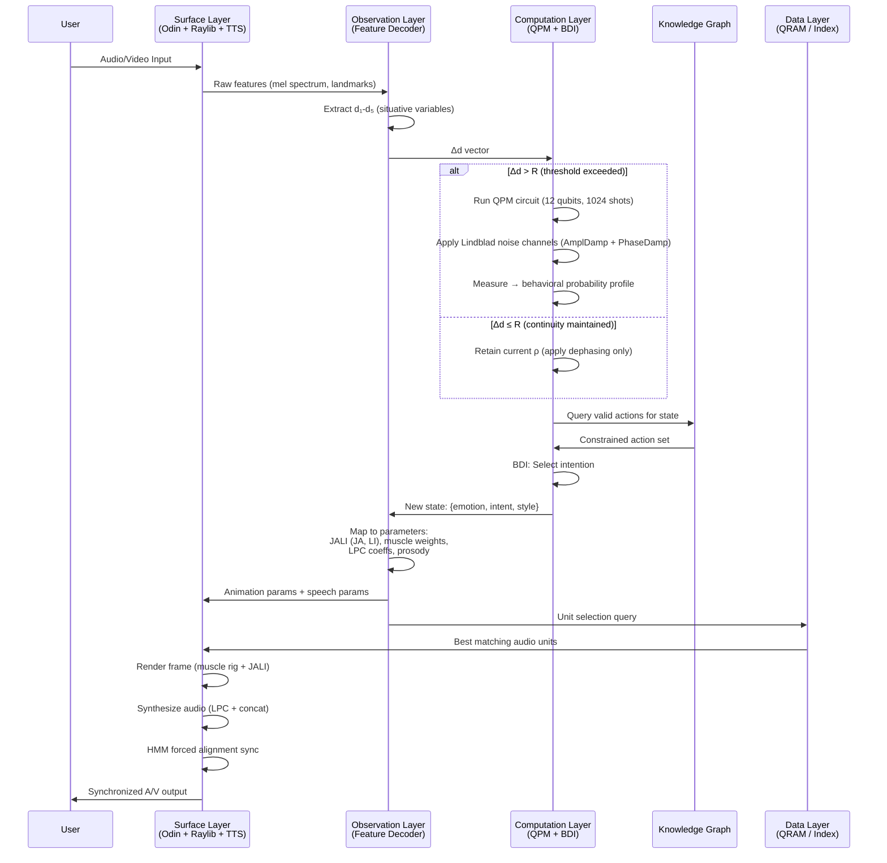

*Figure 13: Complete data flow sequence diagram for one interaction frame.*

### 8.4 Knowledge Graph Grounding (Anti-Hallucination)

The Symbolic Knowledge Graph constrains all quantum cognitive outputs to semantically valid subgraphs, preventing the generation of semantically invalid outputs:

1. **RDF/OWL ontologies** provide the structured semantic context space — entities and relations form the agent's "vocabulary."
2. The agent's density matrix determines which knowledge graph regions are activated, with superposition enabling simultaneous exploration of multiple reasoning paths.
3. **Measurement** (behavioral commitment) corresponds to selecting a specific traversal path through the graph.
4. Quantum cognitive outputs — probability distributions over actions — are **constrained to valid nodes and edges**, preventing semantically invalid outputs.
5. Non-commutative question operators implement context-dependent graph traversal.

**A note on "hallucination" vs. "semantic invalidity":** The knowledge graph grounding eliminates one class of error — generating outputs that fall outside the system's ontology. However, the system can still produce *contextually inappropriate* outputs — selecting a valid action that does not match human expectations for the given situation. The correct characterization is that the system's outputs are **semantically grounded** (constrained to valid subgraphs) and **fully traceable** (every selection is auditable), not that they are infallible. Traceability enables rapid diagnosis and correction of inappropriate outputs, which is a genuine advantage over opaque neural systems — but it should not be conflated with correctness.

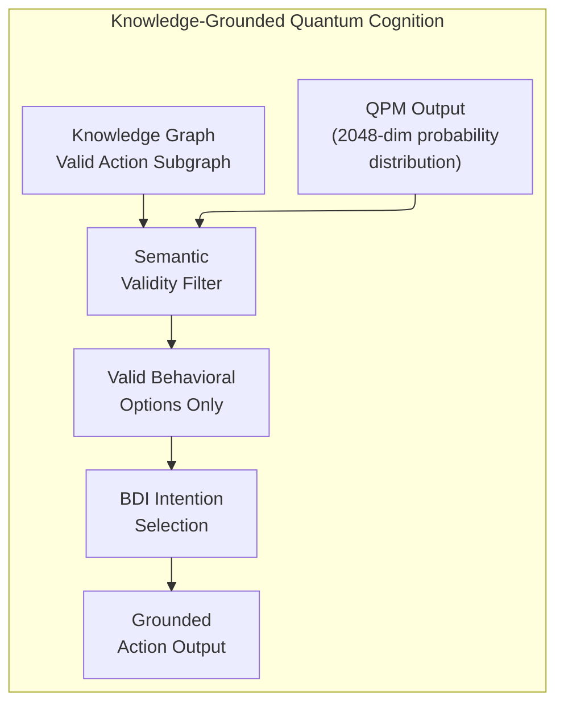

*Figure 14: Knowledge graph filtering constrains outputs to valid behavioral options.*

**Two knowledge tiers: grounding ontology + encyclopedic breadth.** The grounding filter above operates over the bespoke domain ontology — a small, hand-curated RDF/OWL graph whose value is its auditable constraint and safety semantics; it is the authority for *semantic validity*, not a store of world facts. ADA's factoid capability (Section 13 — "what is Planck's constant?") needs breadth the bespoke ontology will never carry, so the knowledge layer is two-tiered:

- **Breadth graph — Wikidata, served via QLever.** Embedded triplestores do not hold Wikidata's ~19 billion triples at usable query latency; QLever is purpose-built for it, building a compact compressed index that answers SPARQL (and combined full-text) queries over full Wikidata on a single machine. This supplies entity/attribute facts for encyclopedic QA while remaining fully local and traceable — every answer still resolves to specific triples.
- **Explanatory text — offline Wikipedia (Kiwix/ZIM).** Triples answer *what*; prose answers *explain*. A local ZIM store provides explanatory passages for questions whose answer is a description rather than a value.

The tiers do not overlap in role: the bespoke ontology supplies grounding and constraint (the anti-hallucination authority of this section), the breadth graph supplies coverage, and the text store supplies explanation. All three run with no network — consistent with ADA's fully-local design (Section 13) — and scale by target: a desktop hosts the full QLever-Wikidata index plus the ZIM store; a phone hosts a curated Wikidata subset and a domain-scoped ZIM.

### 8.5 Pipeline Parallelism and Double-Buffering

While Frame N renders using the previous frame's personality output, the quantum model simultaneously computes state evolution for Frame N+1. This **double-buffering** strategy ensures quantum computation latency never causes frame drops:

```mermaid
gantt
    title Pipeline Parallelism (3 Consecutive Frames)
    dateFormat X
    axisFormat %L ms

    section Frame N
    QPM Compute     :a1, 0, 4
    BDI Reason      :a2, after a1, 2
    Observation Map :a3, after a2, 2
    Render + TTS    :a4, after a3, 11

    section Frame N+1
    QPM Compute     :b1, 6, 4
    BDI Reason      :b2, after b1, 2
    Observation Map :b3, after b2, 2
    Render + TTS    :b4, after b3, 11

    section Frame N+2
    QPM Compute     :c1, 12, 4
    BDI Reason      :c2, after c1, 2
    Observation Map :c3, after c2, 2
    Render + TTS    :c4, after c3, 11
```

*Figure 15: Pipeline parallelism showing overlapped computation across frames.*

### 8.6 Middleware and Inter-Process Communication

| Boundary | Protocol | Serialization | Latency |
|---|---|---|---|
| Python QPM ↔ Odin/Raylib renderer | gRPC | Protocol Buffers | ~1 ms |
| Co-located processes | ZeroMQ IPC (pub/sub) | MessagePack | < 0.5 ms |
| QPM ↔ Knowledge Graph | In-process SPARQL | RDF triples | < 0.3 ms |
| Offline training (cloud QPU) | Qiskit Runtime | JSON + binary | 3–13 s (acceptable) |

*Table 17: Middleware stack for inter-component communication.*

Event bus topics:
- `quantum.state.updated` → triggers BDI belief revision
- `bdi.intention.changed` → triggers Observation Layer parameter update
- `render.params.ready` → consumed by the Odin/Raylib render loop
- `user.input.processed` → triggers QPM context injection

---

## 9. Engineering Constraints and Performance

### 9.1 Interpretable vs. Neural Performance Comparison

| Performance Metric | Interpretable / Rule-Based | Neural / Deep Learning |
|---|---|---|
| **Latency** | ~20 ms (12-qubit QPM) | 100–500 ms (LLM inference) |
| **Compute Overhead** | Low (CPU + lightweight GPU sim) | High (GPU-bound, multi-billion params) |
| **Interpretability** | Full audit trail (d₁–d₅ → ρ → action) | Low (black box) |
| **Data Requirements** | Specific (curated speech DB, KG) | General (massive training corpora) |
| **Edge Deployment** | Ideal (CPU-bound core) | Difficult (GPU memory constraints) |
| **Semantic Grounding** | KG-constrained (no out-of-ontology outputs) | Unconstrained (stochastic generation) |
| **Output Traceability** | Complete — every decision auditable | Limited — attention weights offer partial insight |
| **Speech Naturalness** | Moderate — boundary artifacts possible | High — neural vocoders excel at naturalness |
| **Content Flexibility** | Bounded by knowledge graph coverage | Unbounded — can generate novel content |
| **Behavioral Consistency** | High — Relational Resolution prevents jitter | Variable — depends on prompt engineering |

*Table 18: Honest comparative assessment of interpretable vs. neural approaches. Neither approach dominates across all metrics; the choice depends on deployment requirements. The latency comparison reflects the 12-qubit QPM simulation against LLM-scale inference — a fair comparison would match model complexity levels [41].*

### 9.2 Computational Efficiency

- **Rule-based lip-syncing**: 50× faster than real-time on standard hardware, ideal for 60 FPS interactive applications [39].
- **Concatenative unit selection**: Eliminates GPU-driven vocoding; requires larger storage but is CPU-bound [30].
- **QPM simulation (12 qubits, GPU)**: ~2–4 ms via Qiskit Aer with GPU backend. The increase from 6 to 12 qubits roughly doubles the simulation time but remains well within the latency budget.

### 9.3 Strategic Decision Making

Complex situations (e.g., strategic interactions during a call) are modeled using **production rules** rather than reinforcement learning [42]. This allows the designer to define state variables and decision matrices that govern strategy while ensuring the system always acts within its defined personality profile, adhering to the Relational Resolution stability criterion (Δd(t) < R; Section 3.3) [7].

---

## 10. Multi-Agent Scalability

### 10.1 The Multi-Agent Challenge

The preceding sections describe a single Centaurian entity. Real-world deployment scenarios — virtual meetings with multiple AI participants, classroom simulations with distinct student personas, or multi-character narrative experiences — require **concurrent operation of multiple agents**, each maintaining a distinct personality profile, independent cognitive state, and separate behavioral trajectory.

### 10.2 Resource Scaling Analysis

The per-agent resource footprint is dominated by three components:

| Component | Per-Agent Resource | Scaling Property |
|---|---|---|
| QPM Circuit (12 qubits) | ~200 MB GPU memory (Qiskit Aer density matrix sim) | **Linear** — each agent requires independent simulator instance |
| Speech Unit Database | ~1.6 GB per speaker voice | **Multiplicative** — distinct voices require distinct databases |
| Knowledge Graph | ~50–500 MB per domain ontology | **Shared** — agents in the same domain can share the KG with personality-specific traversal weights |
| BDI Reasoning Engine | ~10 MB per agent (belief state + plan cache) | **Linear** — independent belief states |
| Node-Graph Renderer (Odin + Raylib) | ~20 MB per character model + ~1 ms GPU per agent | **Sub-linear** — wireframe rendering is light; instanced edge batching amortizes overhead |

*Table 19: Per-agent resource scaling for multi-agent deployment.*

For a **50-agent virtual meeting** scenario:

| Resource | Single Agent | 50 Agents | Mitigation |
|---|---|---|---|
| GPU Memory (QPM) | 200 MB | 10 GB | Fits on single A100 (80 GB) |
| Speech Databases | 1.6 GB | 80 GB | SSD streaming; shared phoneme inventory with speaker-specific prosody layers |
| QPM Latency | 2–4 ms | 2–4 ms (parallelized) | Batch 50 circuits in single GPU kernel |
| Render Overhead | 11 ms | ~30 ms (batched) | LOD reduction for non-focal agents; only render active speaker at full fidelity |
| Total Memory | ~2 GB | ~95 GB | Within single-workstation envelope |

*Table 20: 50-agent scaling estimates.*

### 10.3 Architectural Strategies for Multi-Agent Efficiency

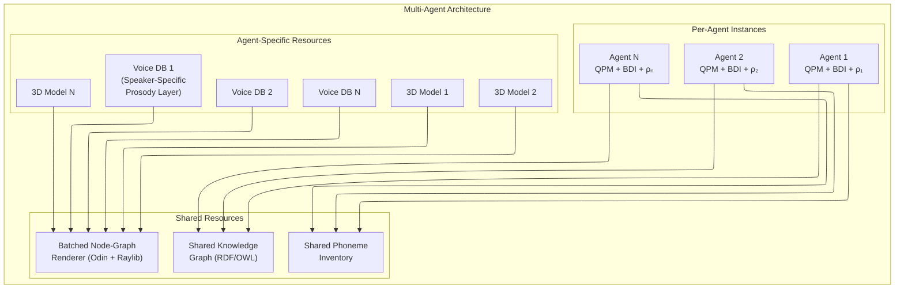

*Figure 16: Multi-agent architecture showing shared vs. per-agent resources.*

Key efficiency strategies:

1. **Batched QPM Execution**: All agent circuits are submitted to the GPU simulator in a single batch, exploiting GPU parallelism. Qiskit Aer's batch mode processes multiple circuits with minimal overhead compared to sequential execution.

2. **Shared Knowledge Graph with Personality-Weighted Traversal**: All agents query the same ontology, but each agent's density matrix determines different activation weights over the graph — the same knowledge, accessed through different cognitive "lenses."

3. **Level-of-Detail (LOD) Rendering**: In a multi-agent video call, only the active speaker is rendered at full 60 Hz with complete muscle rig and JALI animation. Non-speaking agents are rendered at reduced fidelity (15–30 Hz, simplified blendshapes), saving ~60% of per-agent rendering cost.

4. **Speaker-Specific Prosody Layers**: Rather than maintaining N completely independent speech databases, agents share a common phoneme inventory with per-speaker prosody overlay tables (pitch range, speaking rate, characteristic patterns). This reduces the 1.6 GB per-agent storage to ~200 MB for the prosody layer plus the shared inventory.

### 10.4 Inter-Agent Interaction Dynamics

When multiple Centaurian agents interact with each other (not just with a human user), the situative variables d₁–d₅ of each agent are influenced by the behavioral outputs of other agents. This creates a **coupled dynamical system** where personality states co-evolve:

$$d_i^{(\text{agent } k)}(t+1) = f\left(d_i^{(\text{agent } k)}(t), \; \bigcup_{j \neq k} \text{output}^{(\text{agent } j)}(t)\right)$$

The Relational Resolution threshold R operates independently per agent, ensuring that each agent's behavioral inertia is personality-appropriate — a high-Neuroticism agent responds to group dynamics more reactively than a high-Conscientiousness agent.

---

## 11. Implementation Roadmap

### 11.1 Two-Phase Architecture

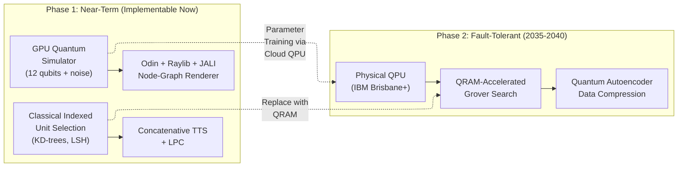

*Figure 17: Two-phase implementation roadmap.*

### 11.2 Phase 1 Specifications (Current Technology)

| Component | Technology | Status |
|---|---|---|
| QPM Core | Qiskit Aer GPU simulator, 12 qubits, 1024 shots + noise channels | **Ready** |
| Lindblad Dynamics | Qiskit noise model (AmplitudeDamping + PhaseDamping channels) | **Ready** |
| BDI Engine | Python symbolic reasoning + KG (RDFLib) | **Ready** |
| Observation Layer | Classical NLP + prosodic analysis | **Ready** |
| Node-Graph Renderer | Odin + Raylib wireframe over muscle rig + JALI | **Ready** |
| TTS | Concatenative unit selection + LPC | **Ready** |
| Unit Selection Search | Classical KD-tree / VP-tree indexing | **Ready** |
| Offline QPM Training | Qiskit Runtime on IBM Heron (156 qubits) | **Available** |
| Entanglement Calibration | Meta-analytic ρ matrix (van der Linden et al., 2010) | **Integrated** |

*Table 21: Phase 1 component readiness.*

### 11.3 Phase 2 Dependencies (Future Hardware)

| Milestone | Required Capability | Estimated Timeline |
|---|---|---|
| QRAM proof-of-concept | ~100 logical qubits, bucket-brigade | 2028–2030 |
| Small-scale Grover+QRAM | ~1,000 logical qubits | 2030–2033 |
| Full TTS database QRAM | ~10⁶ logical / ~10⁷ physical qubits | 2035–2040 |
| Quantum autoencoder integration | Practical compression for audio data | 2030–2035 |

*Table 22: Phase 2 hardware milestones.*

---

## 12. Symbolic Generation: Language and Code

Sections 1–3 specify the agent's personality dynamics; Sections 5–8 specify how speech is rendered, animated, and synchronized. This section specifies the layer that produces the agent's actual *content* — the words it says and the code it writes. This is the output organ of the cognitive core: the QPM and knowledge graph decide *what* to express and *in what manner*; the symbolic generation layer realizes that decision as surface text.

### 12.1 Generating Language

Language is produced by the classical **natural-language generation (NLG) pipeline** [60]: **content planning** (selecting and ordering knowledge-graph material for the communicative goal), **microplanning** (lexical choice, aggregation of propositions into fluent sentences, referring-expression generation), and **surface realization** (an abstract syntactic specification → a grammatical string, handling agreement, morphology, ordering, and function words). Surface realization is the solved stage; a realizer such as SimpleNLG [61] produces grammatically correct, varied output from a feature structure. The domain-bound effort lives upstream, in content and microplanning. This pipeline is excellent in narrow, well-specified domains and does not generalize to open conversation — the same property that makes it auditable makes its coverage bounded. The symbolic generator is therefore the agent's *primary, trustworthy* voice within its domains, with the neural periphery (Section 8.1) handling open-ended understanding at the input boundary.

**Personality-parameterized generation.** The QPM does not merely supply facts to express; it supplies the *manner* of expression. This follows a direct line of prior work — Mairesse & Walker's PERSONAGE [62], a generator whose decisions are driven by Big-Five trait values and whose output human raters reliably perceive as having the intended personality. The trait → generation mapping is concrete:

| QPM aspect (high) | Generation decisions |
|---|---|
| Extraversion (E_ent, E_ass) | verbosity, content volume, positive-valence lexicon, emphatics ("really", "very") |
| Neuroticism (N_vol, N_wth) / low confidence | hedges and softeners ("sort of", "I think"), self-repairs, qualification |
| Agreeableness (A_com, A_pol) | politeness strategies, concessions, softened directives |
| Openness/Intellect (O_exp, O_int) | lexical sophistication, syntactic complexity, aggregation depth |
| Conscientiousness (C_ind, C_ord) | explicit structure, justifications, hedge-free assertion |

*Table 23: Mapping QPM aspect marginals to symbolic generation decisions (after PERSONAGE [62]).*

### 12.2 Why the Generator Must Be Symbolic

PERSONAGE took *static* Big-Five scores. The QPM provides something strictly richer: **aspect-level** marginals (eleven, not five), **context-evolved** values that move turn to turn under the Relational Resolution gate, and — uniquely — **purity and off-diagonal coherence** (Section 2.3). This last component is the crux.

Consider what any interface to a black-box learned generator can carry. A density matrix ρ is, in a chosen basis, a set of diagonal entries (the marginal probabilities) and off-diagonal entries (the coherences). Any serialization of the QPM state into a learned model's input — a JSON field, a numeric vector, an injected activation — transmits at best the **diagonal marginals**. The off-diagonal coherences and the purity are either discarded by the serialization or, even if numerically appended, are uninterpretable to a model never trained to associate them with behavior. A learned generator therefore necessarily consumes a **diagonal projection** of the QPM — precisely the part a *classical* multivariate model could also have produced. The quantum-distinctive content does not cross the boundary.

A symbolic generator that you author has no such boundary. It can read the **entire** density matrix — diagonal and off-diagonal — and map specific structural features to specific generation decisions, deterministically and traceably:

- **Low purity (high ambivalence)** → explicit ambivalence constructions in the content plan ("on the one hand … on the other …"), increased hedging in microplanning.
- **Near-equal amplitudes between opposing aspects** → concession/qualification structures rather than flat assertion.
- **Strong off-diagonal coherence between two aspects** → co-expression of their associated stylistic features in the same utterance.

This yields the central architectural claim of the design: **the symbolic generation layer is not the interpretable-but-weaker alternative to a neural generator — it is the only generator that can express what the QPM computes.** A learned generator, however capable, structurally discards the coherence and purity that make the QPM non-classical. Quantum-like cognition and symbolic generation are not bolted together; each is the other's necessary condition.

### 12.3 Generating Code

The same architecture — a planner over a grammar plus a realizer — generates code, and code *inverts* the difficulty profile of language in the agent's favour:

- **Realization is exact.** A programming language has a formal grammar; a grammar-based generator emits syntactically perfect code by construction. The fluency tail that dogs NLG vanishes.
- **There is a correctness oracle.** Code can be executed, type-checked, and tested. The planner no longer has to be right by construction — it can **search and verify**.

The bottleneck thus moves upstream into the planner, where it is the well-studied problem of **program synthesis**: syntax-guided synthesis (SyGuS) and counterexample-guided inductive synthesis (CEGIS) [63], type-directed synthesis [64], and programming-by-example. A grammar bounds the search space and a checkable specification closes the loop — the same skeleton as the NLG pipeline, with an executor replacing the human reader.

**A stack-based target designed for synthesis.** The architecture specifies a purpose-built target: a **typed concatenative (stack-based) language with stack-to-register mapping and a JIT**. The design maximizes the value of the correctness oracle:

- *Concatenation is composition.* `f g h` denotes `h ∘ g ∘ f`; programs are linear token sequences, not trees — simpler to enumerate and search.
- *Stack effects are types, and every prefix is a valid program.* A stack signature `( a b -- c )` is a lightweight type; at each search step only words whose input type matches the stack top are applicable, so type-directed pruning is local and free.
- *No naming, no scoping.* Point-free code eliminates the variable-naming (referring-expression) problem, removing a whole class of synthesis decisions.
- *The JIT accelerates the inner loop.* Synthesis evaluates enormous numbers of candidates; stack-to-register JIT compilation makes each run near-native, and because a stack VM's entire state *is* the stack, intermediate states are cheap to snapshot — enabling observational-equivalence pruning almost for free.

**The QPM's role in code is search control, not correctness.** Personality must never decide whether a program is correct, but it has a principled role in search strategy and style: Conscientiousness/Orderliness → explicit, defensive, well-structured solutions with more checks; Openness/Intellect → general combinators over inlined special cases; Temporal Pressure (d₅) → depth-bounded search, first-found over optimal. And the structurally sound analog of hedging: **ambivalence/superposition → a maintained portfolio of candidate programs**, held until a disambiguating test collapses them — again an output decision a learned synthesizer could not take from a diagonal projection.

**Traceability becomes verifiability.** In language, interpretability yields *traceability* — every word traces to a rule, a knowledge-graph node, and the QPM parameter that set its control feature. In code, with a correctness oracle in the loop, traceability **upgrades to verifiability**: every emitted program traces to a specification and a verified search path, and can be *proven* to meet that specification. Code is therefore the domain where the architecture's central claim is strengthened — where "every behavioral output is auditable" becomes "every behavioral output is certified." Generated programs are delivered in reviewable batches, each carrying its specification and verification status for human accept/reject.

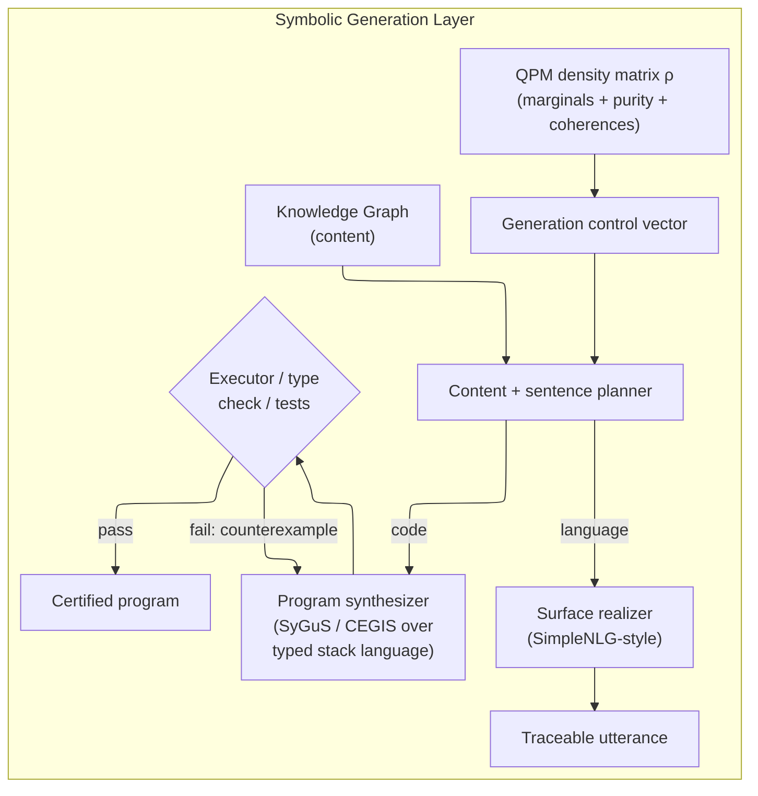

*Figure 18: The symbolic generation layer. Language is realized by traceable surface realization; code is synthesized against a correctness oracle, upgrading traceability to verifiability.*

---

## 13. Embodiment: ADA — Advanced Discovery Assistant

ADA is the concrete agent that ties the layers together: a clearly-AI, fully-local personal assistant, optionally decomposed into named specialist sub-agents. Its capabilities exercise all three tiers (Section 8.1) and demonstrate where each paradigm carries the load.

**Orchestration.** A dialogue manager — built on the Decision Space and the Relational Resolution gate (Section 3) — routes each structured intent to a specialist and arbitrates turn-taking with personality-appropriate inertia. The QPM gives the specialists a shared, or deliberately differentiated, personality.

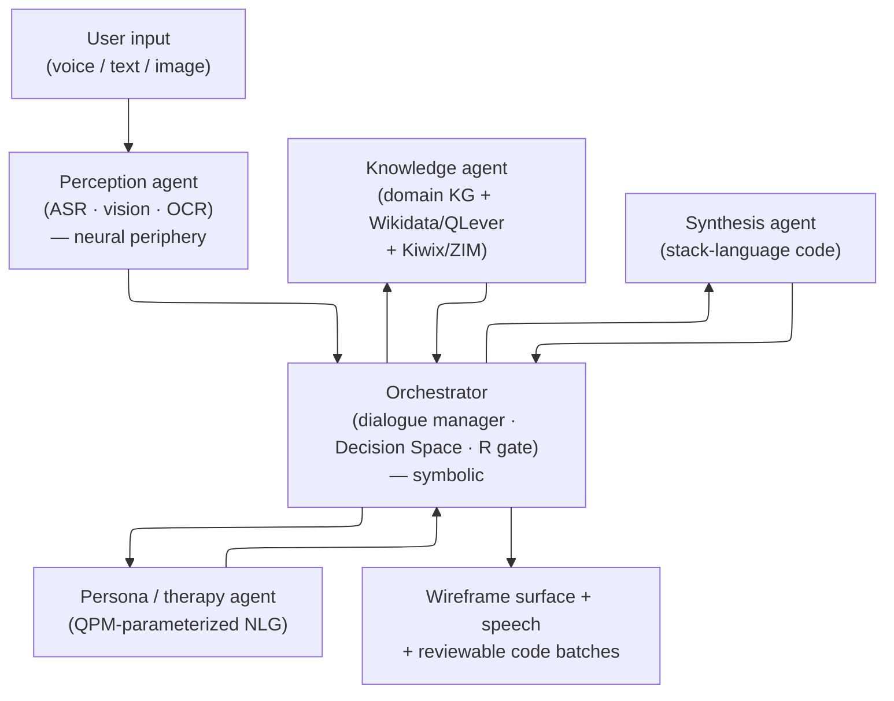

*Figure 19: ADA as a three-tier multi-agent system. Only the perception agent is neural; the orchestrator and all generation specialists are symbolic and traceable.*

**Representative interactions, mapped to tiers:**

- *Activation greeting* ("Good morning, Alex — it's 08:14, light rain today; your afternoon is clear."): pure symbolic — clock, a weather API (cached when offline), a rule/KG recommendation, realized through QPM-parameterized NLG (Section 12.1). The easiest capability and a showcase for the persona layer.
- *Factual question* ("What is Planck's constant?"): **retrieval**, not generation — an exact, citable, hallucination-free answer when the fact is in the knowledge base. Coverage is extended by shipping a large structured knowledge base on-device — **Wikidata served via QLever**, with **offline Wikipedia (Kiwix/ZIM)** for explanatory text (Section 8.4) — turning factoid QA into a real, fully-local capability. Understanding the question is the NLU seam of Section 8.1.
- *Code request* ("Build an app to scan invoices into a local SQLite database"): the program-synthesis pillar (Section 12.3), delivered in reviewable batches. The vague intent is decomposed into small, formally specifiable components — either through a clarifying dialogue ADA conducts or by a periphery component proposing the task graph — each of which then lands in the symbolic synthesis sweet spot. (The app's *own* invoice scanning needs OCR — a Tier-A neural component — independent of how its code is generated.)
- *Visual identification* ("What plant is this?" + photo): recognition is irreducibly neural (Tier A). The *epistemic honesty* around it is the architectural contribution: a classifier with a calibrated confidence threshold against a closed-world knowledge base lets ADA answer "I don't have data related to this" rather than confabulate a species — the anti-hallucination property (Section 8.4) applied to perception.
- *Therapy / supportive conversation*: bounded-domain personality-parameterized NLG (Section 12.1). Coherent, in-character, and safe — and here the auditable generator is a feature: it can be guaranteed never to depart from protocol.

**Epistemic honesty as a cross-cutting property.** Across both facts and perception, knowledge-base grounding plus calibrated confidence gives ADA a principled "I don't know." Most assistants confabulate at the edge of their competence; ADA's edge is explicit and auditable.

**Offline means all-local, not non-neural.** The "in the woods, no signal" scenario is solved by *local* models — an on-device vision classifier, on-device ASR, a local knowledge base — running alongside the local symbolic core, not by abandoning neural networks. This is the honest statement of the edge-deployment story: a trustworthy assistant that runs entirely on the device, with a thin neural periphery for its senses and a symbolic core for its mind.

---

## 14. Conclusions

The engineering of a trustworthy, human-like AI system is viable through an **interpretable-core, thin-periphery** architecture: neural networks are admitted exactly where they are irreducible — perception, at the input boundary — and nowhere else, while all cognition and all output generation remain symbolic and fully traceable. The system integrates:

1. **The Cognitive Layer** — the Five-Factor Model mapped to an 11-trait-qubit (12 with ancilla) Hilbert-space circuit with operationalized Lindblad dynamics and entanglement grounded in the meta-analytic correlation matrix of van der Linden et al. (2010; N = 144,117), reproducing the Stability/Plasticity higher-order structure.

2. **The Situational Layer** — the decision-space variables d₁–d₅ and the refined Relational Resolution gate (Δd(t) = maxᵢ|dᵢ(t) − dᵢ(t−1)| compared against a calibrated threshold R, default 0.15), maintaining behavioral continuity and preventing stochastic jitter.

3. **The Generation Layer** — symbolic natural-language generation and program synthesis, parameterized by the QPM. This layer carries the architecture's central argument: the QPM's quantum-distinctive output — its purity and off-diagonal coherence — cannot survive any interface to a black-box generator, which consumes only a diagonal projection of the personality state. A symbolic generator that reads the full density matrix directly is therefore the *only* output channel capable of expressing what the QPM computes. For code, the property strengthens from traceability to verifiability.

4. **The Auditory Layer** — concatenative unit selection and Linear Predictive Coding for traceable, intelligible speech, with a lightweight neural vocoder admissible as an output-side periphery component where naturalness is paramount.

5. **The Visual Layer** — an interpretable **wireframe** surface that renders the agent's affective and articulatory state directly from a node-graph of its FACS rig, extending the interpretability thesis to the agent's own face and positioning it deliberately below the uncanny valley.

These layers are unified through the Centaurian Tripartite runtime and embodied in **ADA**, a clearly-AI, fully-local personal agent whose defining properties — persona coherence, calibrated epistemic honesty, and certified code — are precisely the properties a black-box assistant cannot offer.

The system's core property is **interpretive transparency**: every behavioral decision is traceable from situative input through quantum state evolution to observable output. This is distinct from strict determinism — probabilistic measurement means single-shot outcomes vary, though the 1024-shot distribution is statistically convergent. Traceability enables rapid diagnosis and correction of inappropriate behavior, a genuine advantage over opaque systems, without overclaiming infallibility.

Future work should prioritize empirical validation of behavioral consistency and of the wireframe surface's sub-uncanny-valley perception; characterization of the NLU periphery depth as a deployment study; the stack-language synthesis engine as a standalone system; and QRAM (Section 4) as long-horizon memory scaling.

---

## 15. Works Cited

1. The Five Factor Model of personality structure: an update — PMC, https://pmc.ncbi.nlm.nih.gov/articles/PMC6732674/
2. Big Five personality traits | Research Starters — EBSCO, https://www.ebsco.com/research-starters/social-sciences-and-humanities/big-five-personality-traits
3. Theories Of Personality — Jack Westin, https://jackwestin.com/resources/mcat-content/personality/theories-of-personality
4. Affect, Behavior, Cognition, and Desire in the Big Five — PMC, https://pmc.ncbi.nlm.nih.gov/articles/PMC4532350/
5. Understanding persons: From Stern's personalistics to Five-Factor Theory — ResearchGate, https://www.researchgate.net/publication/338537882
6. Hilbert Space Multidimensional Theory — Busemeyer, https://jbusemey.pages.iu.edu/quantum/HilbertPsyRev.pdf
7. Ecologically Relevant Decisions and Personality Configurations — PMC, https://pmc.ncbi.nlm.nih.gov/articles/PMC12731013/
8. Quantum Cognition and the Limits of Classical Probability Models — Computational Culture, http://computationalculture.net/quantum-cognition/
9. Ecologically Relevant Decisions and Personality Configurations — Preprints.org, https://www.preprints.org/manuscript/202510.2063
10. Estimating a Time Series of Interpretation Indeterminacy — eScholarship, https://escholarship.org/content/qt1sh152qk/qt1sh152qk.pdf
11. A Quantum-BDI Model for Information Processing and Decision Making — Springer, https://link.springer.com/article/10.1007/s10773-014-2263-x
12. The Effects of Spatial and Temporal Dispersion on Virtual Teams' Performance — AIS, https://aisel.aisnet.org/cgi/viewcontent.cgi?article=1156&context=ecis2016_rp
13. Developing and Evaluating Gamifying Learning System by Using Flow-Based Model, https://www.ejmste.com/download/developing-and-evaluating-gamifying-learning-system-by-using-flow-based-model-4439.pdf
14. Interpretable models from distributed data via merging of decision trees — ResearchGate, https://www.researchgate.net/publication/261351746
15. Speech synthesis — Wikipedia, https://en.wikipedia.org/wiki/Speech_synthesis
16. Quantum random access memory — Giovannetti, Lloyd, Maccone, https://arxiv.org/abs/0708.1879
17. Resilience of quantum random access memory to generic noise — PRX Quantum, https://arxiv.org/abs/2012.05340
18. Circuit-Based Quantum Random Access Memory for Classical Data — PMC, https://pmc.ncbi.nlm.nih.gov/articles/PMC6408577/
19. A quantum random access memory using polynomial encoding — Nature Scientific Reports, https://www.nature.com/articles/s41598-025-95283-5
20. Systems Architecture for Quantum Random Access Memory — ACM, https://dl.acm.org/doi/fullHtml/10.1145/3613424.3614270
21. Fat-Tree QRAM: A High-Bandwidth Shared QRAM — arXiv, https://arxiv.org/abs/2502.06767
22. Stab-QRAM: An All-Clifford QRAM for Special Data — arXiv, https://arxiv.org/abs/2509.26494
23. Fast and Error-Correctable Quantum RAM — arXiv, https://arxiv.org/html/2503.19172
24. Heterogeneously error-corrected QRAMs — arXiv, https://arxiv.org/abs/2504.21687
25. Experimental realization of the bucket-brigade QRAM — arXiv, https://arxiv.org/abs/2506.16682
26. Demonstrating Coherent Quantum Routers for BB-QRAM on a Superconducting Processor — arXiv, https://arxiv.org/abs/2505.13958
27. Quantum Random Access Memory Architectures Using 3D Superconducting Cavities — PRX Quantum, https://journals.aps.org/prxquantum/abstract/10.1103/PRXQuantum.5.020312
28. Quantum autoencoders for efficient compression of quantum data — arXiv, https://arxiv.org/abs/1612.02806
29. Perception of Concatenative vs. Neural TTS — ISCA, https://www.isca-archive.org/interspeech_2020/cohn20_interspeech.pdf
30. Neural TTS vs. Concatenative vs. Parametric TTS — Speechify, https://speechify.com/blog/neural-tts-vs-concatenative-vs-parametric-tts/
31. Unit Selection in a Concatenative Speech Synthesis System — Columbia, https://www.ee.columbia.edu/~dpwe/e6820/papers/HuntB96-speechsynth.pdf
32. Sparsity in Linear Predictive Coding of Speech — AAU, https://vbn.aau.dk/ws/files/549550820/PhD_Thesis_Daniele_Giacobello.pdf
33. Rule-Based Emotion Synthesis Using Concatenated Speech — ISCA, https://www.isca-archive.org/speechemotion_2000/murray00_speechemotion.pdf
34. A Facial Motion Retargeting Pipeline for Appearance Agnostic 3D Characters — PMC, https://pmc.ncbi.nlm.nih.gov/articles/PMC11653099/
35. Micro and macro facial expressions by driven animations — arXiv, https://arxiv.org/html/2408.16110v1
36. JALI: An Animator-Centric Viseme Model — DGP Toronto, https://dgp.toronto.edu/~elf/JALISIG16.pdf
37. Transferring the Rig and Animations — ResearchGate, https://www.researchgate.net/publication/220507502
38. UniSync: A Unified Framework for Audio-Visual Synchronization — arXiv, https://arxiv.org/html/2503.16357v1
39. Rule-based lip-syncing algorithm for virtual character — TELKOMNIKA, https://www.telkomnika.uad.ac.id/index.php/TELKOMNIKA/article/download/19824/10810
40. AVLaughterCycle — Niewiadomski et al., https://radoslawniewiadomski.github.io/papers/JMUI10_urbainetaldraft.pdf
41. Toward Edge General Intelligence with Agentic AI — arXiv, https://arxiv.org/html/2508.18725v1
42. I I I I — DTIC, https://apps.dtic.mil/sti/tr/pdf/AD0681027.pdf
43. Human-Artificial Interaction in the Age of Agentic AI — arXiv, https://arxiv.org/html/2502.14000v1
44. Virtual Life in Virtual Environments — Edinburgh Informatics, https://informatics.ed.ac.uk/sites/default/files/2025-06/ECS-CSG-44-98.pdf
45. Open Systems, Quantum Probability, and Logic for Quantum-like Modeling — PMC, https://pmc.ncbi.nlm.nih.gov/articles/PMC10296982/
46. Artificial Intelligence Patent Portfolio — Openstream.ai, https://openstream.ai/recognitions/ai-patents
47. QRAM: A Survey and Critique — Quantum Journal, https://quantum-journal.org/papers/q-2025-12-02-1922/
48. Fault-Tolerant Resource Estimation of Quantum Random-Access Memories — IEEE, https://ieeexplore.ieee.org/document/8962352/
49. A Generative Neuro-Cognitive Architecture Using Quantum Algorithms — ScienceDirect, https://www.sciencedirect.com/org/science/article/pii/S1546221825007325
50. Quantum Models of Cognition and Decision — Busemeyer & Bruza, Cambridge University Press, 2012.
51. Can quantum probability provide a new direction for cognitive modeling? — Pothos & Busemeyer, Behavioral and Brain Sciences 36, 2013. https://pubmed.ncbi.nlm.nih.gov/23673021/
52. Quantum semantics of text perception — PMC, https://pmc.ncbi.nlm.nih.gov/articles/PMC7893056/
53. Information compression via hidden subgroup quantum autoencoders — npj Quantum Information, https://www.nature.com/articles/s41534-024-00865-2
54. Costa, P. T., & McCrae, R. R. (1992). *Revised NEO Personality Inventory (NEO-PI-R) and NEO Five-Factor Inventory (NEO-FFI) professional manual.* Odessa, FL: Psychological Assessment Resources.
55. DeYoung, C. G., Quilty, L. C., & Peterson, J. B. (2007). Between facets and domains: 10 aspects of the Big Five. *Journal of Personality and Social Psychology, 93*(5), 880–896.
56. Digman, J. M. (1997). Higher-order factors of the Big Five. *Journal of Personality and Social Psychology, 73*(6), 1246–1256.
57. van der Linden, D., te Nijenhuis, J., & Bakker, A. B. (2010). The General Factor of Personality: A meta-analysis of Big Five intercorrelations and a criterion-related validity study. *Journal of Research in Personality, 44*(3), 315–327.
58. Park, H. S., & Wiernik, B. M. (2020). Meta-analytic five-factor model personality intercorrelations: Eeny, meeny, miney, moe, how, which, why, and where to go. *Journal of Applied Psychology, 105*(12), 1490–1529.
59. Newgent, R. A., Parr, P. E., Newman, I., & Higgins, K. K. (2004). The Agreeableness dimension of the NEO PI-R: A construct validity study. *Measurement and Evaluation in Counseling and Development, 36*(4), 231–245.
60. Reiter, E., & Dale, R. (2000). *Building Natural Language Generation Systems.* Cambridge University Press.
61. Gatt, A., & Reiter, E. (2009). SimpleNLG: A realisation engine for practical applications. *Proceedings of the 12th European Workshop on Natural Language Generation (ENLG 2009).*
62. Mairesse, F., & Walker, M. A. (2011). Controlling user perceptions of linguistic style: Trainable generation of personality traits. *Computational Linguistics, 37*(3), 455–488.
63. Solar-Lezama, A. (2008). *Program Synthesis by Sketching.* Ph.D. dissertation, University of California, Berkeley; Alur, R., et al. (2013). Syntax-guided synthesis. *Formal Methods in Computer-Aided Design (FMCAD 2013).*
64. Polikarpova, N., Kuraj, I., & Solar-Lezama, A. (2016). Program synthesis from polymorphic refinement types. *Proceedings of PLDI 2016.*
